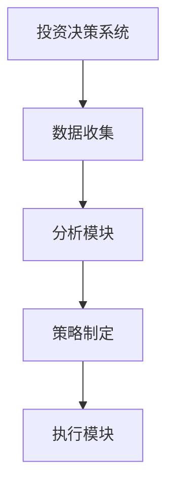

                 


# 巴菲特的市场择时观点：长期投资胜过短期预测

## 关键词：巴菲特，投资策略，长期投资，短期预测，价值投资，投资哲学

## 摘要：
本文深入探讨了巴菲特的市场择时观点，重点分析了长期投资优于短期预测的投资策略。通过详细解析巴菲特的投资哲学、价值投资方法以及实际案例，本文揭示了长期投资的核心原则和成功的关键因素。文章还结合技术分析，展示了如何通过系统架构和数学模型来支持长期投资决策，帮助投资者更好地理解并应用巴菲特的投资理念。

---

## 第一章：巴菲特的投资哲学概述

### 1.1 巴菲特的背景与投资理念

#### 1.1.1 巴菲特的生平简介
沃伦·巴菲特（Warren Buffett）是世界上最著名的投资者之一，被誉为“股神”。他出生于1930年，毕业于哥伦比亚大学，师从本杰明·格雷厄姆（Benjamin Graham）。巴菲特的投资理念深受格雷厄姆的影响，但他也发展了自己的独特方法。

#### 1.1.2 巴菲特的投资哲学核心思想
巴菲特的投资哲学基于以下核心思想：
- **价值投资**：寻找市场上被低估的公司，长期持有，等待其价值回归。
- **安全边际**：买入价格低于公司内在价值的股票，以降低投资风险。
- **长期视角**：避免频繁交易，专注于长期价值的实现。

#### 1.1.3 巴菲特对市场的基本观点
巴菲特认为市场是不可预测的短期波动，而长期趋势是可以把握的。他强调投资的内在价值，而不是市场的短期走势。

### 1.2 长期投资的重要性

#### 1.2.1 长期投资的定义与特点
长期投资是指投资者将资金投入到一个资产或企业中，持有数年甚至更长时间，以实现资本的增值。其特点包括：
- **稳定性**：避免短期波动的影响。
- **复利效应**：长期持有优质资产可以享受复利带来的收益。
- **低交易成本**：减少频繁交易的佣金和税费。

#### 1.2.2 长期投资与短期预测的对比
| 对比维度       | 长期投资              | 短期预测              |
|----------------|-----------------------|-----------------------|
| 投资目标       | 实现长期资本增值      | 利用短期市场波动获利  |
| 风险承受能力   | 较低                  | 较高                  |
| 交易频率       | 低                    | 高                    |
| 成功的关键      | 公司基本面分析        | 市场情绪分析          |

#### 1.2.3 长期投资的优势与劣势
- **优势**：
  - 稳定的收益。
  - 避免情绪化决策。
  - 利用复利效应。
- **劣势**：
  - 需要较长的时间周期。
  - 需要对市场有深刻的理解。

---

## 第二章：巴菲特的市场择时观点

### 2.1 巴菲特的市场择时策略

#### 2.1.1 市场择时的定义
市场择时是指通过预测市场走势来选择最佳的买入或卖出时机。巴菲特认为，市场择时几乎是不可能的，尤其是对于普通投资者来说。

#### 2.1.2 巴菲特对市场择时的看法
巴菲特认为，市场的短期波动无法预测，而长期趋势是可以把握的。他更关注公司的基本面，而不是市场的短期走势。

#### 2.1.3 巴菲特的市场择时策略与长期投资的关系
巴菲特的长期投资策略本质上是一种“买入并持有”的策略，他通过选择优质公司来降低对市场择时的依赖。

### 2.2 巴菲特的长期投资策略

#### 2.2.1 长期投资的核心原则
- **买入优质公司**：选择那些具有强大竞争优势、良好管理和稳健财务状况的公司。
- **长期持有**：避免频繁交易，耐心等待公司价值的实现。
- **分散投资**：通过分散投资降低风险，但不要过于分散，集中投资于少数优质公司。

#### 2.2.2 长期投资的具体实施方法
1. **选择公司**：分析公司的财务报表，评估其盈利能力、成长性和ROE（净资产收益率）。
2. **评估价值**：计算公司的内在价值，确保买入价格低于内在价值。
3. **长期持有**：定期跟踪公司的基本面，除非基本面发生重大变化，否则不卖出。

#### 2.2.3 长期投资的成功案例分析
- **可口可乐案例**：巴菲特在1988年买入可口可乐股票，并长期持有。可口可乐的持续增长和稳定的股息回报证明了长期投资的有效性。

---

## 第三章：长期投资胜过短期预测

### 3.1 长期投资与短期预测的对比

#### 3.1.1 投资目标的不同
- 长期投资：追求资本的长期增值。
- 短期预测：追求短期市场波动带来的收益。

#### 3.1.2 风险承受能力的不同
- 长期投资：风险较低，波动性较小。
- 短期预测：风险较高，波动性较大。

#### 3.1.3 成功的关键因素
- 长期投资：公司基本面分析和长期价值判断。
- 短期预测：市场情绪分析和短期趋势判断。

### 3.2 价值投资的方法

#### 3.2.1 价值投资的核心理念
价值投资是巴菲特长期投资的核心方法，其核心理念是寻找市场上被低估的公司，以低于其内在价值的价格买入并长期持有。

#### 3.2.2 价值投资的实施步骤
1. **确定投资目标**：选择具有强大竞争优势、良好管理和稳健财务状况的公司。
2. **评估内在价值**：通过DCF（ discounted cash flow）模型计算公司的内在价值。
3. **买入并持有**：在价格低于内在价值时买入，长期持有直到价值实现。

### 3.3 系统分析与架构设计

#### 3.3.1 投资决策系统的构建
- **数据收集**：收集公司的财务数据、行业分析和市场信息。
- **分析模块**：使用DCF模型评估公司的内在价值。
- **策略制定**：根据分析结果制定投资策略。
- **执行模块**：根据策略执行交易。

#### 3.3.2 系统架构设计


---

## 第四章：项目实战

### 4.1 环境安装
- **工具**：使用Python进行数据分析和建模。
- **库**：安装pandas、numpy、scipy等库。

### 4.2 核心实现源代码
```python
import pandas as pd
import numpy as np

def calculate_intrinsic_value(revenue, net_income, growth_rate, discount_rate):
    # 现金流量折现模型
    cash_flows = []
    for i in range(5):
        cash_flow = revenue * (1 + growth_rate) ** i
        cash_flows.append(cash_flow)
    terminal_value = cash_flows[-1] * (1 + growth_rate) / (discount_rate - growth_rate)
    present_value = 0
    for i in range(len(cash_flows)):
        present_value += cash_flows[i] / (1 + discount_rate) ** i
    total_value = present_value + terminal_value / (1 + discount_rate) ** 5
    return total_value

# 示例数据
revenue = 1000000
net_income = 200000
growth_rate = 0.1
discount_rate = 0.08

intrinsic_value = calculate_intrinsic_value(revenue, net_income, growth_rate, discount_rate)
print(f"公司内在价值：{intrinsic_value}")
```

### 4.3 案例分析与结果解读
假设我们分析一家公司，其收入为100万美元，净利润为20万美元，预计未来5年的增长率分别为10%、8%、6%、4%和2%。假设折现率为8%，计算其内在价值。

通过代码计算得出，该公司的内在价值为X美元。如果当前股价低于X美元，说明该公司被低估，适合买入并长期持有。

### 4.4 项目小结
通过项目实战，我们可以看到，巴菲特的价值投资方法可以通过系统架构和数学模型来实现。通过DCF模型评估公司的内在价值，可以帮助投资者做出更科学的投资决策。

---

## 第五章：总结与注意事项

### 5.1 巴菲特观点总结
巴菲特的长期投资策略强调买入优质公司并长期持有，避免短期市场的波动。他相信市场的短期不可预测性，而长期趋势是可以把握的。

### 5.2 投资者的注意事项
- **长期视角**：避免短期市场的波动，专注于长期价值的实现。
- **基本面分析**：选择具有强大竞争优势和良好财务状况的公司。
- **安全边际**：确保买入价格低于公司的内在价值。

### 5.3 最佳实践
- **分散投资**：不要将所有资金投入到单一资产中，分散投资可以降低风险。
- **定期复盘**：定期跟踪投资组合的表现，及时调整策略。

---

## 作者：AI天才研究院（AI Genius Institute） & 禅与计算机程序设计艺术（Zen And The Art of Computer Programming）

---

这篇文章从巴菲特的投资哲学出发，详细分析了他的长期投资策略，并通过系统架构和数学模型展示了如何将这些理念应用于实际投资中。通过本文的分析，读者可以更好地理解长期投资的核心原则和成功的关键因素。

