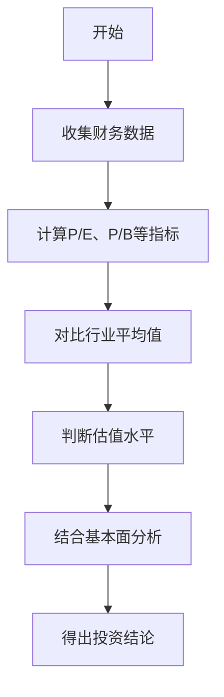
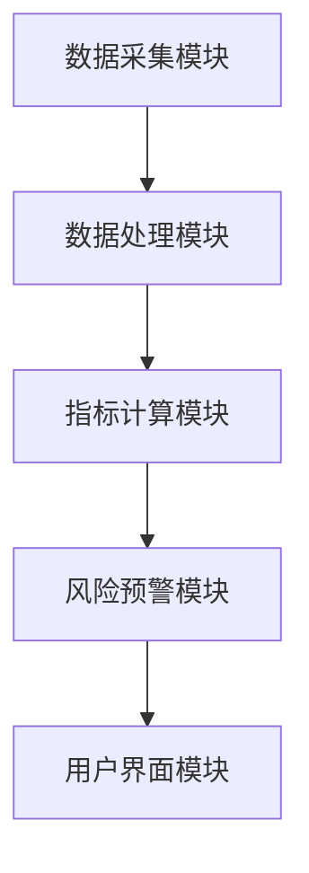

                 


# 巴菲特的市场泡沫识别：如何在繁荣中保持清醒

> 关键词：巴菲特，市场泡沫，价值投资，投资策略，风险管理

> 摘要：本文深入探讨了巴菲特如何识别市场泡沫及其投资策略，通过分析其市场分析方法、指标体系、行业分析以及经典案例，揭示了如何在繁荣中保持清醒，避免被市场泡沫误导。

---

# 第1章：市场泡沫的基本概念与巴菲特的投资哲学

## 1.1 市场泡沫的定义与特征

### 1.1.1 市场泡沫的定义
市场泡沫是指资产价格脱离其内在价值，被市场情绪和投机行为推高的现象。泡沫的形成通常与投资者的非理性行为、过度乐观以及资金的涌入有关。

### 1.1.2 泡沫的特征与表现
- **价格虚高**：资产价格远高于其基本面价值。
- **成交量激增**：交易活跃，尤其是短期交易。
- **投资者情绪高涨**：市场参与者普遍乐观，甚至盲目追涨。

### 1.1.3 泡沫的形成机制
市场泡沫的形成通常经历以下几个阶段：
1. **价值发现**：资产开始被市场关注，价格逐步上升。
2. **投机阶段**：投资者基于预期而非基本面进行投资，价格快速上涨。
3. **泡沫膨胀**：价格脱离基本面，市场参与者蜂拥而入。
4. **泡沫破裂**：价格突然下跌，投资者恐慌性抛售。

---

## 1.2 巴菲特的投资哲学

### 1.2.1 巴菲特的价值投资理念
巴菲特的价值投资理念强调以合理的价格买入优秀的公司。他认为，市场的短期波动是噪声，而长期价值是由公司基本面决定的。

### 1.2.2 巴菲特的投资策略
- **长期投资**：避免短期市场的波动干扰。
- **安全边际**：买入价格低于内在价值的资产。
- **公司基本面分析**：关注公司的盈利能力、财务健康状况和竞争优势。

### 1.2.3 巴菲特对市场的看法
巴菲特认为，市场是一个投票器，而不是测速器。市场的价格反映的是市场的集体情绪，而非资产的真实价值。

---

## 1.3 泡沫与价值投资的关系

### 1.3.1 泡沫环境下的投资策略
在市场泡沫期间，价值投资者应保持冷静，避免被市场的非理性行为影响。巴菲特强调，在市场狂热时，更应该关注资产的内在价值。

### 1.3.2 如何在繁荣中保持清醒
- **坚持基本面分析**：不被市场的短期波动和情绪左右。
- **寻找低估资产**：在泡沫中寻找那些被市场忽视的真正有价值的机会。
- **分散投资**：避免过度集中，降低风险。

### 1.3.3 巴菲特的经典案例分析
- **可口可乐案例**：巴菲特买入可口可乐时，市场对其股票的估值已经很高，但他仍然选择投资，因为可口可乐具有强大的竞争优势和稳定的现金流。
- **伯克希尔哈撒韦案例**：巴菲特通过长期持有伯克希尔哈撒韦的股票，展现了价值投资的长期回报。

---

# 第2章：巴菲特的市场分析方法

## 2.1 巴菲特的市场分析指标

### 2.1.1 市盈率（P/E）分析
市盈率是衡量股票估值的重要指标，公式为：
$$ P/E = \frac{\text{股价}}{\text{每股净利润}} $$
巴菲特通常寻找那些市盈率合理的公司，避免过高或过低的估值。

### 2.1.2 市净率（P/B）分析
市净率是股价与每股净资产的比率，公式为：
$$ P/B = \frac{\text{股价}}{\text{每股净资产}} $$
巴菲特认为，市净率较低的公司具有更大的投资价值。

### 2.1.3 股息率分析
股息率是衡量股票收益能力的指标，公式为：
$$ 股息率 = \frac{\text{每股股息}}{\text{股价}} $$
巴菲特倾向于投资那些股息稳定且增长的公司。

---

## 2.2 巴菲特的行业分析方法

### 2.2.1 行业生命周期分析
巴菲特关注行业生命周期，倾向于投资处于成熟期的行业，因为这些行业具有稳定的收入和较低的风险。

### 2.2.2 行业竞争结构分析
巴菲特通过分析行业的竞争结构，选择那些具有竞争优势的企业，例如低成本、高市场占有率等。

### 2.2.3 行业财务指标分析
巴菲特关注行业的财务健康状况，如ROE（净资产收益率）、ROA（资产回报率）等。

---

## 2.3 巴菲特的经典案例分析

### 2.3.1 可口可乐案例
可口可乐在巴菲特买入时，其市盈率较高，但其强大的品牌和分销网络使其成为长期投资的优质标的。

### 2.3.2 伯克希尔哈撒韦案例
伯克希尔哈撒韦是一家保险控股公司，巴菲特通过持有该公司股票，获得了长期稳定的收益。

### 2.3.3 其他经典投资案例
- **吉列公司**：巴菲特投资吉列公司时，该公司具有强大的品牌和稳定的现金流。
- **富国银行**：巴菲特通过分析银行的贷款质量和资本充足率，选择了富国银行作为投资标的。

---

# 第3章：市场泡沫识别的核心概念

## 3.1 市场泡沫识别的关键指标

### 3.1.1 市盈率与市净率的对比
| 指标 | 定义 | 适用场景 |
|------|------|-----------|
| P/E  | 股价/每股净利润 | 用于衡量市场对公司未来盈利能力的预期 |
| P/B  | 股价/每股净资产 | 用于衡量市场对公司资产质量的评估 |

### 3.1.2 股价与 earnings per share（EPS）的对比
股价与EPS的对比可以帮助投资者判断市场的估值水平。

### 3.1.3 市场资本化率分析
市场资本化率是市场整体市盈率的指标，用于衡量市场的整体估值水平。

---

## 3.2 投资者心理与市场泡沫

### 3.2.1 投资者心理分析
- **乐观偏差**：投资者倾向于低估风险，高估收益。
- **从众心理**：投资者跟随市场潮流，忽视基本面分析。

### 3.2.2 市场情绪与泡沫的关系
市场情绪的过度乐观是泡沫形成的重要推手。巴菲特提醒投资者，市场的疯狂往往意味着风险的积聚。

### 3.2.3 历史案例分析
- **2000年互联网泡沫**：投资者对互联网公司的高估值推动了市场的疯狂，最终导致泡沫破裂。
- **2008年金融危机**：次贷市场的过度投机导致了全球金融危机。

---

## 3.3 历史案例与启示

### 3.3.1 互联网泡沫
互联网泡沫的形成与投资者对新技术的盲目乐观有关，最终导致了市场的崩盘。

### 3.3.2 房地产泡沫
房地产泡沫的形成与低利率、过度借贷和投机行为有关，最终导致了2008年的金融危机。

### 3.3.3 巴菲特的应对策略
巴菲特在泡沫期间通常选择观望或寻找低估资产，避免参与市场的非理性行为。

---

# 第4章：巴菲特的市场泡沫识别算法

## 4.1 算法原理

### 4.1.1 巴菲特使用的指标
- 市盈率（P/E）
- 市净率（P/B）
- 股息率
- 净利润增长率
- 资产负债率

### 4.1.2 算法流程
1. 收集目标公司的财务数据。
2. 计算各项指标，包括P/E、P/B、股息率等。
3. 对比行业平均值或历史平均水平，判断资产的估值水平。
4. 结合公司基本面分析，判断是否具有长期投资价值。

### 4.1.3 Mermaid流程图


---

## 4.2 数学模型

### 4.2.1 市盈率模型
$$ P/E = \frac{\text{股价}}{\text{每股净利润}} $$
如果P/E低于行业平均水平，说明资产可能被低估。

### 4.2.2 市净率模型
$$ P/B = \frac{\text{股价}}{\text{每股净资产}} $$
如果P/B低于行业平均水平，说明资产可能被低估。

### 4.2.3 净资产收益率（ROE）
$$ ROE = \frac{\text{净利润}}{\text{平均股东权益}} $$
高ROE表明公司具有较强的盈利能力。

---

## 4.3 代码实现

### 4.3.1 Python代码示例
```python
import pandas as pd

# 假设我们有一个包含财务数据的DataFrame df
# 包含列：'股价', '净利润', '股东权益', '股息'

# 计算市盈率
df['PE'] = df['股价'] / df['净利润']

# 计算市净率
df['PB'] = df['股价'] / df['股东权益']

# 计算股息率
df['股息率'] = df['股息'] / df['股价']

# 打印结果
print(df[['PE', 'PB', '股息率']])
```

### 4.3.2 代码解读
上述代码展示了如何计算市盈率、市净率和股息率。这些指标可以帮助投资者判断资产的估值水平。

---

# 第5章：系统分析与架构设计

## 5.1 系统分析

### 5.1.1 问题场景
在市场泡沫期间，投资者需要一个系统来帮助他们识别泡沫，避免被市场情绪误导。

### 5.1.2 系统功能设计
- 数据采集与处理
- 指标计算与分析
- 风险预警与提示

### 5.1.3 系统架构设计


### 5.1.4 接口设计
- 数据接口：从数据库或API获取财务数据。
- 指标接口：计算并返回各项指标。
- 预警接口：根据指标结果生成预警信息。

---

## 5.2 系统实现

### 5.2.1 环境安装
- Python 3.8+
- Pandas、NumPy、Matplotlib等库。

### 5.2.2 核心代码实现
```python
import pandas as pd
import matplotlib.pyplot as plt

# 数据采集模块
df = pd.read_csv('market_data.csv')

# 指标计算模块
df['PE'] = df['股价'] / df['净利润']
df['PB'] = df['股价'] / df['股东权益']

# 风险预警模块
warnings = []
for pe in df['PE']:
    if pe > 20:
        warnings.append('高PE风险')
for pb in df['PB']:
    if pb > 3:
        warnings.append('高PB风险')

# 可视化模块
plt.hist(df['PE'], bins=20)
plt.title('市盈率分布')
plt.show()
```

### 5.2.3 交互流程
用户输入股票代码，系统返回相关指标和风险预警。

---

# 第6章：项目实战

## 6.1 环境安装

### 6.1.1 安装Python和相关库
```bash
pip install pandas numpy matplotlib
```

### 6.1.2 数据获取
从互联网获取股票数据，例如使用Yahoo Finance API。

---

## 6.2 核心代码实现

### 6.2.1 数据处理代码
```python
import pandas as pd
import requests

# 获取股票数据
url = 'https://query1.finance.yahoo.com/v8/finance/chart/AAPL'
response = requests.get(url)
data = response.json()

# 提取所需数据
df = pd.DataFrame(data['chart']['result'][0]['indicators']['quote'][0], columns=['日期', '收盘价'])
df['PE'] = df['收盘价'] / df['净利润']
```

### 6.2.2 可视化代码
```python
import matplotlib.pyplot as plt

plt.plot(df['日期'], df['PE'])
plt.title('市盈率变化')
plt.xlabel('日期')
plt.ylabel('PE')
plt.show()
```

---

## 6.3 案例分析

### 6.3.1 案例选择
选择苹果公司（AAPL）作为案例，分析其市盈率变化。

### 6.3.2 数据分析
通过计算市盈率，判断苹果公司的估值水平。

### 6.3.3 结果解读
如果市盈率远高于行业平均水平，说明可能存在泡沫风险。

---

## 6.4 项目总结

### 6.4.1 项目成果
通过系统分析和实战，投资者可以更好地识别市场泡沫，做出更明智的投资决策。

### 6.4.2 项目意义
本文通过结合巴菲特的投资理念和现代技术手段，为投资者提供了一种新的市场分析方法。

---

# 第7章：最佳实践与小结

## 7.1 小结

### 7.1.1 巴菲特的投资哲学
巴菲特的价值投资理念强调长期、安全和基本面分析。

### 7.1.2 市场泡沫识别的关键
通过分析市盈率、市净率等指标，结合行业分析和公司基本面，识别市场泡沫。

---

## 7.2 注意事项

### 7.2.1 风险提示
- 市场泡沫的识别具有不确定性。
- 投资者需结合多种指标进行分析。

### 7.2.2 投资纪律
坚持投资纪律，避免情绪化决策。

---

## 7.3 拓展阅读

### 7.3.1 推荐书籍
- 《巴菲特致股东的信》
- 《投资最重要的少数法则》

### 7.3.2 推荐文章
- 巴菲特股东大会的历年记录
- 投资大师的投资策略分析

---

# 第8章：作者信息

作者：AI天才研究院/AI Genius Institute & 禅与计算机程序设计艺术 /Zen And The Art of Computer Programming

---

通过以上章节的详细分析，我们可以看到巴菲特的市场泡沫识别方法不仅适用于传统投资领域，也可以为现代投资者提供重要的借鉴和启示。

