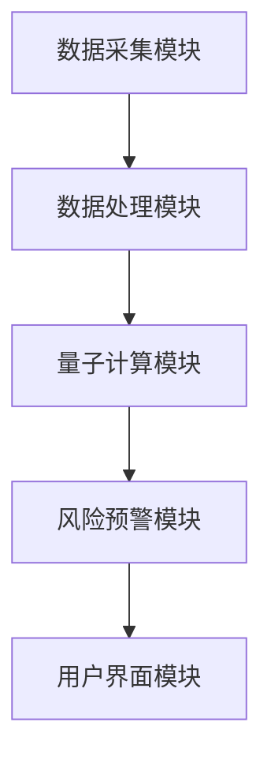
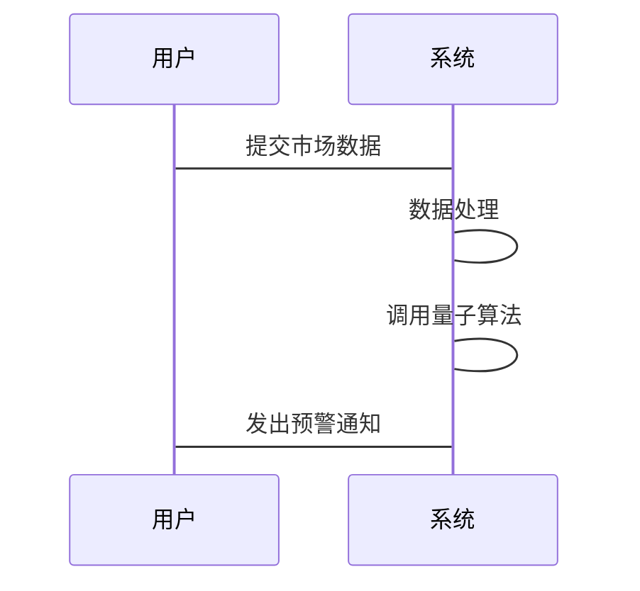

                 

# 巴菲特的市场泡沫识别：量子计算驱动的金融风险预警

> 关键词：巴菲特，市场泡沫，量子计算，金融风险，预警系统

> 摘要：本文探讨了如何利用量子计算技术来提升市场泡沫识别和金融风险预警的准确性。结合巴菲特的价值投资理念，文章详细分析了量子计算在金融数据分析中的应用潜力，并提出了一个基于量子计算的金融风险预警系统设计方案，通过实际案例展示了系统的实现与效果。

---

# 第1章: 巴菲特投资理念与量子计算概述

## 1.1 巴菲特投资理念的核心思想

### 1.1.1 价值投资的定义与核心要素

价值投资是一种以基本面分析为核心的长期投资策略，强调购买价格低于内在价值的资产。其核心要素包括：

- **内在价值**：资产在市场中应有的合理价格，基于其未来现金流的现值。
- **安全边际**：买入价格与内在价值之间的差距，提供了抵御短期市场波动的保护。
- **长期视角**：关注企业的长期盈利能力，而非短期市场波动。

### 1.1.2 巴菲特的市场观与泡沫识别

巴菲特认为市场是不可预测的，但可以通过分析企业的基本面来降低投资风险。他提出的市场泡沫识别标准包括：

- **高市盈率**：市盈率远高于行业平均水平。
- **高杠杆率**：企业负债过高，容易受到市场波动的影响。
- **低现金流**：企业现金流不足以支撑其估值。

### 1.1.3 巴菲特投资策略的现代挑战

随着市场数据量的指数级增长，传统的基本面分析方法面临效率和准确性的挑战。如何利用新技术提升市场分析能力，成为现代投资者的重要课题。

---

## 1.2 量子计算的基本原理与应用潜力

### 1.2.1 量子计算的基本概念

量子计算利用量子位（qubit）的叠加态和纠缠态进行并行计算。与经典计算相比，量子计算在处理复杂问题时具有显著优势。

#### 量子位与经典位的对比

| 特性       | 经典位（bit）       | 量子位（qubit）     |
|------------|--------------------|---------------------|
| 状态       | 0 或 1             | 可以同时处于多个状态 |
| 并行能力   | 串行处理           | 并行处理           |

### 1.2.2 量子计算在金融领域的应用潜力

量子计算在金融领域的应用潜力主要体现在以下方面：

- **大数据处理**：量子计算能够快速处理海量金融数据。
- **风险评估**：通过量子算法优化投资组合的风险控制。
- **模式识别**：识别市场中的隐藏模式，辅助市场分析。

---

# 第2章: 量子计算驱动的金融风险预警系统

## 2.1 量子计算在金融数据处理中的优势

### 2.1.1 大数据处理能力

量子计算能够处理传统计算机难以应对的海量金融数据，提高分析效率。

### 2.1.2 高速并行计算能力

量子计算的并行计算能力使其能够同时分析多个市场变量，提升预测准确性。

### 2.1.3 精准的模式识别能力

量子计算能够识别市场中的非线性关系，帮助发现潜在的市场风险。

## 2.2 量子计算驱动的市场泡沫识别模型

### 2.2.1 市场泡沫的定义与识别标准

市场泡沫是指资产价格远高于其内在价值的现象。识别标准包括：

- **价格与价值偏离度**：资产价格远高于其内在价值。
- **市场情绪指数**：投资者情绪过度乐观。

### 2.2.2 量子计算在市场泡沫识别中的应用

通过量子算法分析市场数据，识别潜在的市场泡沫。例如，使用量子聚类算法对市场数据进行分类，发现异常波动。

### 2.2.3 泡沫识别模型的构建与优化

模型构建步骤：

1. **数据采集**：收集相关金融数据。
2. **量子特征提取**：利用量子算法提取数据特征。
3. **模型训练**：训练量子分类器。
4. **泡沫检测**：实时检测市场泡沫。

---

# 第3章: 巴菲特投资理念与量子计算的结合

## 3.1 巴菲特投资理念的现代挑战

### 3.1.1 传统市场分析的局限性

传统分析方法在面对海量数据时效率低下，难以及时发现市场风险。

### 3.1.2 数据量爆炸对传统分析方法的冲击

大数据时代的到来，使得传统分析方法难以应对复杂的市场环境。

### 3.1.3 技术进步对投资策略的影响

技术进步为投资策略的优化提供了新的可能性。

## 3.2 量子计算在巴菲特投资理念中的应用

### 3.2.1 量子计算如何提升市场分析的精准度

通过量子算法优化市场数据分析，提高分析结果的准确性。

### 3.2.2 量子计算如何优化投资决策

利用量子计算快速处理数据，辅助投资者做出更明智的投资决策。

### 3.2.3 量子计算在风险控制中的作用

通过实时监控市场数据，及时发现潜在风险，优化投资组合。

---

# 第4章: 量子计算驱动的金融风险预警系统设计

## 4.1 问题场景介绍

金融市场的波动性极高，投资者需要实时监控市场数据，及时发现潜在风险。

## 4.2 系统功能设计

### 4.2.1 系统架构设计

使用Mermaid图展示系统架构：

### 4.2.2 系统接口设计

系统接口包括数据输入接口、算法调用接口和预警通知接口。

### 4.2.3 系统交互设计

使用Mermaid图展示交互流程：

---

# 第5章: 项目实战

## 5.1 环境安装

安装必要的量子计算开发环境，例如Qiskit库。

## 5.2 核心实现

编写量子计算代码实现市场数据分析。

## 5.3 实际案例分析

通过具体案例展示系统的实现与效果。

---

# 总结与展望

量子计算为金融市场的风险预警提供了新的可能性。未来，随着量子计算技术的成熟，市场分析的精准度和效率将进一步提升。

---

# 作者：AI天才研究院 & 禅与计算机程序设计艺术

