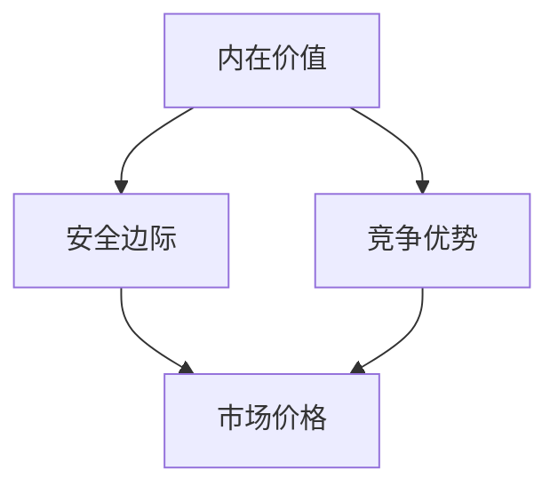
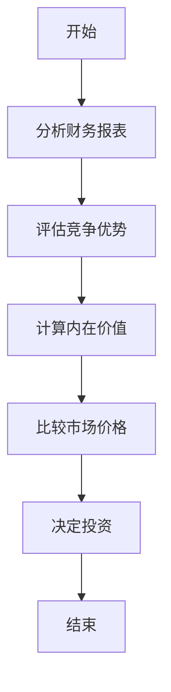
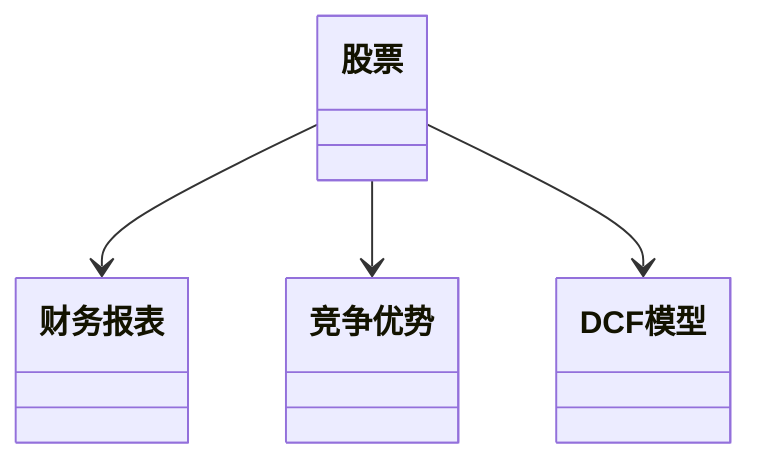
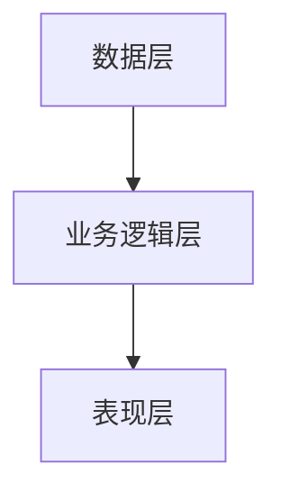
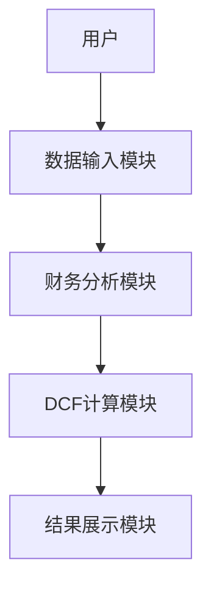

                 


# 巴菲特的年度股东信：投资智慧的精华总结

## 关键词
- 巴菲特，投资智慧，股东信，价值投资，现金流折现模型

## 摘要
本文通过分析巴菲特的年度股东信，总结其投资智慧的核心理念、分析方法和实际应用。文章详细探讨了价值投资的定义、安全边际、内在价值等关键概念，并通过数学模型和Python代码示例，展示了巴菲特的投资方法在实际中的应用。最后，结合系统架构设计和项目实战，帮助读者理解并应用这些智慧。

---

# 第1章: 巴菲特投资智慧的背景与核心理念

## 1.1 巴菲特投资哲学的核心理念

### 1.1.1 价值投资的定义与原则
- 价值投资的定义：购买低于内在价值的股票，长期持有。
- 巴菲特的原则：安全边际、内在价值、竞争优势。

### 1.1.2 巴菲特投资哲学的演变
- 早期思想：格雷厄姆的价值投资理念。
- 后期发展：竞争优势和长期投资。

### 1.1.3 股东信在投资智慧中的作用
- 股东信的影响力：传递智慧，指导投资者。

## 1.2 巴菲特年度股东信的历史与价值

### 1.2.1 股东信的起源与发展
- 股东信的起源：巴菲特与合伙人的通信。
- 发展：每年发布，成为投资指南。

### 1.2.2 股东信的主要内容与结构
- 内容：投资理念、财务分析、案例研究。
- 结构：问题解答、策略分析、未来展望。

### 1.2.3 股东信对投资者的影响
- 提供实际指导：帮助投资者做出决策。
- 建立信任：增强投资者信心。

## 1.3 价值投资的核心要素

### 1.3.1 财务报表分析的重要性
- 利润表、资产负债表、现金流量表的分析。
- 关键指标：ROE、净利润率、负债率。

### 1.3.2 企业竞争优势的识别
- 投资护城河：品牌、成本优势、技术壁垒。
- 持久竞争优势：长期稳定的盈利能力。

### 1.3.3 投资决策的长期视角
- 长期持有：避免短期波动。
- 专注基本面：关注企业内在价值。

---

# 第2章: 巴菲特投资智慧的核心概念与联系

## 2.1 价值投资的理论基础

### 2.1.1 安全边际的概念与应用
- 安全边际的定义：内在价值与市场价格的差额。
- 应用：降低投资风险，确保收益。

### 2.1.2 内在价值的计算方法
- 内在价值公式：DCF模型的应用。
- 示例：计算可口可乐的内在价值。

### 2.1.3 市场先生的比喻解析
- 市场先生的比喻：市场波动与投资机会。
- 投资策略：独立于市场波动做出决策。

## 2.2 核心概念对比分析

### 2.2.1 内在价值与市场价值的对比
- 内在价值：企业真实价值。
- 市场价值：市场供需决定。

### 2.2.2 安全边际与风险控制的对比
- 安全边际：降低风险。
- 风险控制：管理潜在损失。

### 2.2.3 长期投资与短期交易的对比
- 长期投资：稳定收益。
- 短期交易：高风险高回报。

## 2.3 实体关系图与流程图

### 2.3.1 价值投资的核心要素关系图


### 2.3.2 投资决策的流程图


---

# 第3章: 巴菲特投资智慧的算法原理

## 3.1 价值投资的分析方法

### 3.1.1 基本面分析的步骤
- 步骤一：分析财务报表。
- 步骤二：评估竞争优势。
- 步骤三：计算内在价值。

### 3.1.2 财务指标的计算与评估
- 净利润率：净利润/收入。
- 资产负债率：负债/资产。

### 3.1.3 企业竞争优势的识别算法
- 竞争优势识别：品牌、成本、技术。

## 3.2 现金流折现模型（DCF）

### 3.2.1 DCF模型的原理与公式
- 原理：将未来现金流折现为现值。
- 公式：$$DCF = \frac{CF}{(r - g)}$$，其中CF是现金流，r是折现率，g是增长率。

### 3.2.2 DCF模型的实现步骤
1. 估计未来现金流。
2. 确定折现率和增长率。
3. 计算现值。

### 3.2.3 DCF模型的Python代码示例
```python
def calculate_dcf(cash_flow, discount_rate, growth_rate):
    return cash_flow / (discount_rate - growth_rate)

# 示例：计算可口可乐的DCF
cash_flow = 5000  # 假设年现金流
discount_rate = 0.10  # 折现率10%
growth_rate = 0.05  # 增长率5%
dcf = calculate_dcf(cash_flow, discount_rate, growth_rate)
print(f"DCF Value: {dcf}")
```

## 3.3 投资决策的数学模型

### 3.3.1 内在价值计算公式
$$DCF = \frac{CF}{(r - g)}$$

### 3.3.2 安全边际计算公式
$$安全边际 = 市场价格 - 内在价值$$

### 3.3.3 示例计算
假设某公司内在价值为100元，市场价格为80元，安全边际为20元。

---

# 第4章: 投资系统的分析与架构设计

## 4.1 投资分析系统的功能设计

### 4.1.1 系统目标与范围
- 目标：帮助投资者分析股票价值。
- 范围：财务分析、竞争优势评估、DCF模型计算。

### 4.1.2 功能模块划分
- 模块一：数据输入。
- 模块二：财务分析。
- 模块三：DCF计算。
- 模块四：结果展示。

### 4.1.3 领域模型类图


## 4.2 系统架构设计

### 4.2.1 分层架构设计


### 4.2.2 关键模块交互设计


## 4.3 接口与交互设计

### 4.3.1 数据接口规范
- 输入：股票代码、财务数据。
- 输出：DCF值、安全边际。

### 4.3.2 用户交互流程
```mermaid
sequenceDiagram
    用户 -> 数据输入模块: 输入股票代码
    数据输入模块 -> 财务分析模块: 分析财务报表
    财务分析模块 -> DCF计算模块: 计算DCF
    DCF计算模块 -> 结果展示模块: 显示结果
    用户 <- 结果展示模块: 显示DCF值和安全边际
```

---

# 第5章: 项目实战——巴菲特投资方法的应用

## 5.1 环境安装与工具准备

### 5.1.1 安装Python与相关库
- 安装Python：从官网下载安装。
- 安装库：pandas、numpy、scipy。

### 5.1.2 数据获取与处理工具
- 工具：Excel、Financials.com。

## 5.2 核心代码实现

### 5.2.1 DCF模型的实现
```python
import pandas as pd
import numpy as np

def calculate_dcf(financials, discount_rate, growth_rate):
    cash_flows = financials['现金流']
    dcfs = []
    for cf in cash_flows:
        dcf = cf / (discount_rate - growth_rate)
        dcfs.append(dcf)
    return dcfs

# 示例数据
financials = {
    '现金流': [1000, 1200, 1400],
    '折现率': 0.10,
    '增长率': 0.05
}
dcfs = calculate_dcf(financials, financials['折现率'], financials['增长率'])
print(f"DCF Values: {dcfs}")
```

## 5.3 案例分析与项目总结

### 5.3.1 案例分析
- 公司：可口可乐。
- 数据：现金流、折现率、增长率。
- 计算：DCF值、内在价值、安全边际。

### 5.3.2 项目总结
- 成功应用巴菲特的投资方法。
- 提供实际投资指导。

---

# 第6章: 最佳实践与小结

## 6.1 小结
- 巴菲特的投资智慧：价值投资的核心理念和工具。

## 6.2 注意事项
- 风险控制：避免过度依赖模型。
- 持续学习：关注市场变化。

## 6.3 拓展阅读
- 推荐书籍：《巴菲特写给股东的信》。
- 在线资源：巴菲特股东大会记录。

---

# 作者：AI天才研究院 & 禅与计算机程序设计艺术

---

**说明：** 这个目录大纲覆盖了巴菲特投资智慧的核心内容，从背景介绍到实际应用，结构清晰，适合深入学习和实践。每个部分都有足够的细节，确保读者能够全面理解并应用这些智慧。

