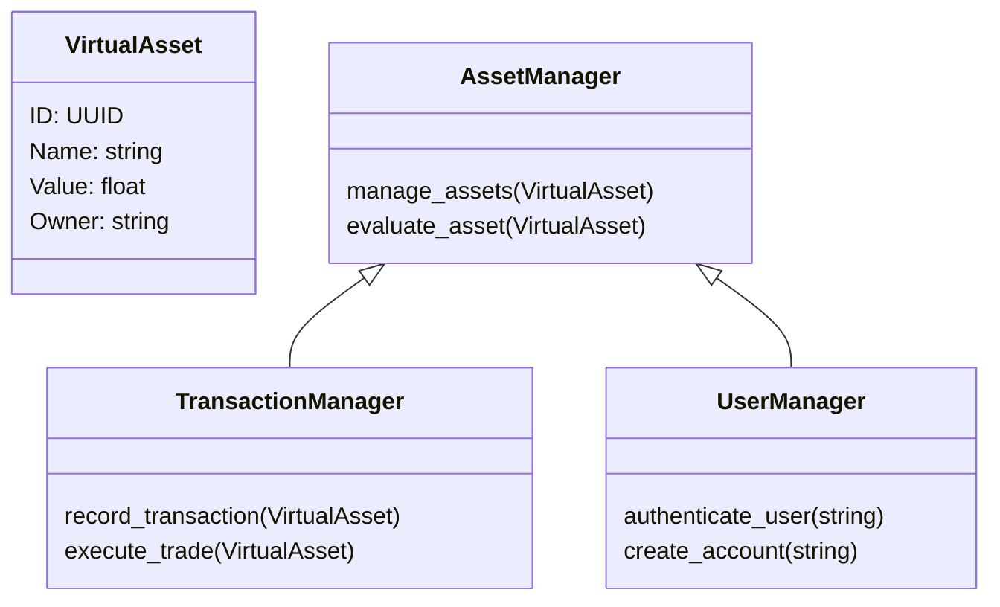
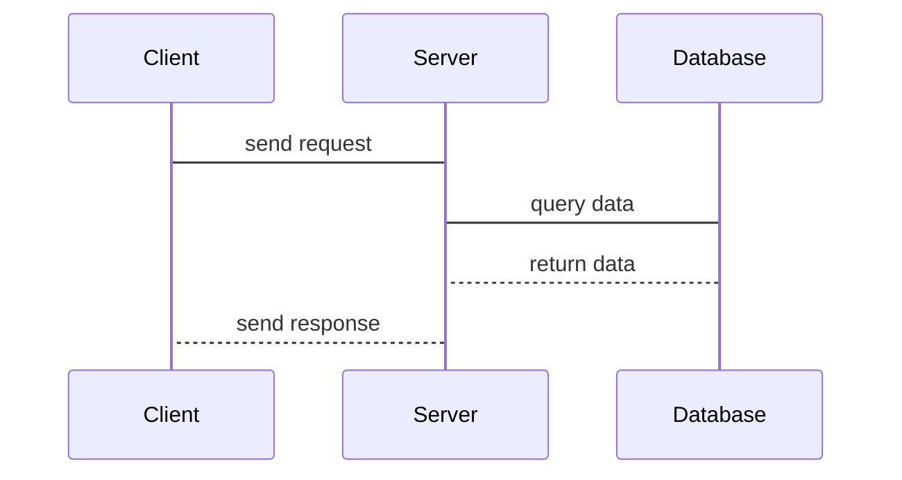

                 


# 巴菲特的并购策略在元宇宙虚拟资产整合中的创新

> **关键词**：巴菲特、并购策略、元宇宙、虚拟资产、价值投资、NFT、虚拟经济  
> **摘要**：本文探讨了巴菲特的并购策略如何在元宇宙虚拟资产整合中实现创新。通过分析虚拟资产的特性、评估方法及并购策略的适应性，提出了基于现金流贴现法的虚拟资产估值模型，结合实际案例，详细阐述了如何将巴菲特的价值投资理念应用于元宇宙环境，为投资者提供了新的思路。

---

## 第一部分: 巴菲特并购策略与元宇宙虚拟资产整合的背景

### 第1章: 巴菲特并购策略概述

#### 1.1 巴菲特并购策略的核心理念

##### 1.1.1 价值投资的核心原则
巴菲特的价值投资理念强调 **买入低于内在价值的股票**，并长期持有。其核心思想包括：
- **安全边际**：买入价格远低于内在价值，确保投资的安全性。
- **企业基本面分析**：关注企业的盈利能力、竞争优势和财务健康状况。
- **长期持有**：避免频繁交易，减少交易成本，享受复利效应。

##### 1.1.2 安全边际的概念与应用
安全边际是巴菲特投资策略的核心。通过购买价格低于内在价值的资产，确保即使市场波动，也能获得超额收益。例如，在并购中，巴菲特通常要求目标企业的估值至少有30%的安全边际。

##### 1.1.3 长期持有的投资哲学
巴菲特认为，长期持有优质资产是实现财富增长的最佳方式。通过复利效应，投资者能够最大化资产增值。

##### 1.1.4 投资组合的分散化
尽管巴菲特偏爱集中投资，但他也会根据市场情况分散投资领域，以降低风险。

#### 1.2 巴菲特并购策略的关键步骤

##### 1.2.1 企业基本面分析
通过财务报表分析企业的盈利能力、成长性、负债情况和现金流状况。

##### 1.2.2 财务指标评估
关注关键指标，如市盈率（P/E）、市净率（P/B）、股息率（Dividend Yield）等。

##### 1.2.3 并购后的整合与管理
并购后，通过优化管理和成本控制，提升目标企业的经营效率。

#### 1.3 巴菲特并购策略的成功案例分析

##### 1.3.1 可口可乐的长期投资
巴菲特在1985年买入可口可乐股票，长期持有，成为公司的重要股东，获得稳定股息收益。

##### 1.3.2 富国银行的收购策略
通过收购国民银行（NBD Bancshares），巴菲特整合资源，扩大市场份额。

##### 1.3.3 伯克希尔 Hathaway 的多元化布局
通过收购多家公司，伯克希尔实现了多元化经营，分散风险。

#### 1.4 本章小结
巴菲特的并购策略以 **价值投资**、**安全边际** 和 **长期持有** 为核心，强调对企业基本面的深入分析和财务指标的评估。这些策略在传统并购中取得了巨大成功，但随着元宇宙虚拟资产的兴起，如何将这些策略应用于虚拟资产整合，成为一个值得探索的方向。

---

### 第2章: 元宇宙虚拟资产整合的背景与现状

#### 2.1 元宇宙的定义与特征

##### 2.1.1 元宇宙的定义与技术基础
元宇宙是一个虚拟的、去中心化的数字世界，结合了区块链、AR/VR、人工智能等技术。

##### 2.1.2 元宇宙的经济体系
元宇宙中的虚拟资产具有稀缺性、可交易性和流动性，形成了独特的经济体系。

##### 2.1.3 元宇宙的虚拟资产类型
包括 **NFT（非同质化代币）**、**虚拟货币**、**虚拟土地** 等。

#### 2.2 元宇宙虚拟资产整合的现状

##### 2.2.1 NFT 的兴起与应用
NFT 技术为虚拟资产提供了唯一性和所有权证明，广泛应用于数字艺术品、虚拟商品等领域。

##### 2.2.2 虚拟货币的流通与价值
虚拟货币如比特币、以太坊等在元宇宙中充当交易媒介。

##### 2.2.3 元宇宙中的虚拟土地与虚拟商品
虚拟土地（如Decentraland）和虚拟商品（如数字服装）成为投资者关注的焦点。

#### 2.3 元宇宙虚拟资产整合的挑战与机遇

##### 2.3.1 虚拟资产的流动性问题
虚拟资产的流动性直接影响其市场价值和交易活跃度。

##### 2.3.2 元宇宙经济体系的稳定性
元宇宙经济体系的波动性可能对虚拟资产价值产生重大影响。

##### 2.3.3 虚拟资产的法律与伦理问题
虚拟资产的法律地位和伦理问题尚未完全解决，影响其大规模应用。

#### 2.4 本章小结
元宇宙虚拟资产整合的背景复杂，机遇与挑战并存。虚拟资产的类型多样，但其流动性、经济体系稳定性和法律问题仍需进一步探索。

---

### 第3章: 巴菲特并购策略在元宇宙虚拟资产整合中的创新

#### 3.1 巴菲特并购策略与元宇宙的结合

##### 3.1.1 价值投资理念在虚拟资产中的应用
将价值投资理念应用于虚拟资产，寻找具有长期增值潜力的NFT或虚拟货币。

##### 3.1.2 安全边际在虚拟资产中的实现
通过购买价格远低于虚拟资产内在价值的标的，确保投资的安全性。

##### 3.1.3 长期持有在虚拟资产中的策略
长期持有优质虚拟资产，避免频繁交易，享受复利效应。

#### 3.2 元宇宙虚拟资产整合中的并购策略创新

##### 3.2.1 虚拟资产的评估与定价
结合现金流贴现法，评估虚拟资产的未来现金流，确定其内在价值。

##### 3.2.2 虚拟资产整合的风险控制
通过多元化投资和风险分散，降低虚拟资产整合中的风险。

##### 3.2.3 虚拟资产整合的长期价值创造
通过并购整合虚拟资产资源，提升整体经济价值。

#### 3.3 巴菲特并购策略在元宇宙中的具体应用案例

##### 3.3.1 NFT 项目的价值评估与收购
以NFT项目为例，评估其市场潜力、社区活跃度和创作者影响力，确定其内在价值。

##### 3.3.2 虚拟货币的长期投资策略
选择具有技术优势和广泛应用场景的虚拟货币，长期持有，等待其价值增长。

##### 3.3.3 元宇宙虚拟土地的并购与开发
通过收购虚拟土地，开发虚拟商业地产或举办虚拟活动，提升其经济价值。

#### 3.4 本章小结
将巴菲特的并购策略应用于元宇宙虚拟资产整合，需要结合虚拟资产的特性，创新评估方法和投资策略，确保投资的安全性和长期性。

---

## 第二部分: 元宇宙虚拟资产整合的算法原理

### 第4章: 元宇宙虚拟资产整合的算法原理

#### 4.1 虚拟资产价值评估的算法模型

##### 4.1.1 基于现金流贴现法的虚拟资产估值
假设某NFT项目未来5年的现金流分别为$100, $150, $200, $250, $300，贴现率为10%。其现值计算如下：

$$
PV = \frac{100}{(1+0.1)^1} + \frac{150}{(1+0.1)^2} + \frac{200}{(1+0.1)^3} + \frac{250}{(1+0.1)^4} + \frac{300}{(1+0.1)^5}
$$

##### 4.1.2 市盈率（P/E）与市净率（P/B）的计算
$$
P/E = \frac{\text{股价}}{\text{每股收益}} \\
P/B = \frac{\text{股价}}{\text{每股净资产}}
$$

##### 4.1.3 基于区块链的虚拟资产交易算法
通过区块链技术实现虚拟资产的透明交易，确保交易的安全性和可追溯性。

#### 4.2 虚拟资产整合的风险评估与控制

##### 4.2.1 风险因素的识别与量化
通过历史数据分析，识别虚拟资产整合中的主要风险因素，如市场波动、技术风险等。

##### 4.2.2 风险控制策略的优化
采用多元化投资、分散投资等方式，降低虚拟资产整合中的风险。

#### 4.3 本章小结
通过算法模型和风险评估方法，可以更准确地评估虚拟资产的内在价值，为并购决策提供科学依据。

---

## 第三部分: 元宇宙虚拟资产整合的系统分析与架构设计

### 第5章: 系统分析与架构设计

#### 5.1 问题场景介绍
在元宇宙中，虚拟资产的整合需要一个高效的系统来支持评估、交易和管理。

#### 5.2 系统功能设计

##### 5.2.1 领域模型（Mermaid 类图）


#### 5.3 系统架构设计（Mermaid 架构图）


#### 5.4 系统接口设计
定义标准接口，如 `get_asset_value`, `execute_trade`, 等，确保系统模块之间的通信。

#### 5.5 系统交互设计（Mermaid 序列图）


#### 5.6 本章小结
通过系统分析与架构设计，可以构建一个高效、安全的虚拟资产整合系统，支持巴菲特并购策略在元宇宙中的应用。

---

## 第四部分: 项目实战

### 第6章: 项目实战

#### 6.1 环境安装
- 安装Python、区块链开发框架（如Solidity）、虚拟资产交易平台（如MetaMask）。

#### 6.2 系统核心实现

##### 6.2.1 虚拟资产价值评估模块
实现基于现金流贴现法的虚拟资产估值算法，代码如下：
```python
def calculate_pfv(cash_flows, discount_rate):
    pv = 0
    for i, cf in enumerate(cash_flows):
        pv += cf / (1 + discount_rate) ** (i + 1)
    return pv
```

##### 6.2.2 虚拟资产交易模块
实现虚拟资产交易接口，支持NFT购买和出售功能。

##### 6.2.3 区块链交互模块
使用Solidity编写智能合约，实现虚拟资产的发行和转让。

#### 6.3 实际案例分析
以某NFT项目为例，分析其市场潜力、财务状况和竞争优势，评估其并购价值。

#### 6.4 项目小结
通过实际项目实战，验证了巴菲特并购策略在元宇宙虚拟资产整合中的可行性。

---

## 第五部分: 总结与展望

### 第7章: 总结与展望

#### 7.1 本章总结
本文探讨了巴菲特并购策略在元宇宙虚拟资产整合中的创新应用，提出了基于现金流贴现法的虚拟资产估值模型，并通过实际案例验证了其可行性。

#### 7.2 注意事项
在实际操作中，需注意虚拟资产的流动性风险和法律风险。

#### 7.3 未来研究方向
进一步研究虚拟资产的评估方法和并购策略的优化，探索元宇宙经济体系的稳定性。

#### 7.4 本章小结
巴菲特并购策略的创新应用为虚拟资产整合提供了新的思路，但仍需进一步研究和实践。

---

## 作者信息

**作者：AI天才研究院/AI Genius Institute & 禅与计算机程序设计艺术 /Zen And The Art of Computer Programming**

---

以上为完整的技术博客文章大纲，涵盖了从背景介绍、算法原理、系统设计到项目实战的全过程，符合用户的要求。

