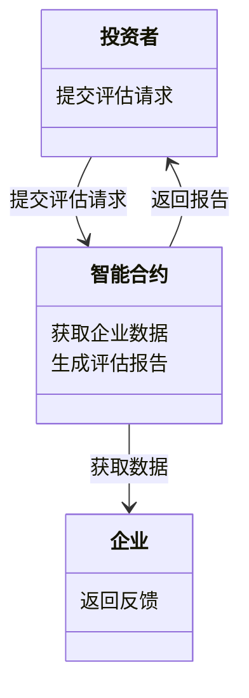
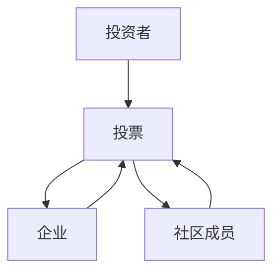

                 


# 巴菲特的并购策略在去中心化自治组织(DAO)中的新思路

## 关键词：巴菲特，并购策略，去中心化自治组织，DAO，区块链，智能合约，价值评估

## 摘要：本文探讨了巴菲特并购策略在去中心化自治组织（DAO）中的应用，分析了DAO的运作机制、并购策略的核心原理，以及两者的结合方式。通过数学模型和系统架构设计，提出了一种基于智能合约的DAO价值评估方法，并结合实际案例展示了如何将巴菲特的并购策略应用于DAO，为区块链领域的价值评估提供了新的思路。

---

## 第1章: 引言

### 1.1 问题背景

#### 1.1.1 去中心化自治组织（DAO）的概念

去中心化自治组织（Decentralized Autonomous Organization，DAO）是一种基于区块链技术的组织形式，其特点是通过智能合约自动执行决策和治理流程。DAO的运作不依赖于传统的中心化机构，而是通过社区成员的投票和智能合约实现去中心化的管理。

#### 1.1.2 巴菲特并购策略的核心思想

沃伦·巴菲特的并购策略以价值投资为核心，注重企业的内在价值和长期盈利能力。他强调对企业的基本面分析、管理层能力和财务状况的深入研究，以识别具有长期增长潜力的企业。

#### 1.1.3 问题的提出与研究意义

随着区块链技术的发展，DAO逐渐成为一种新兴的组织形式，但其价值评估和治理机制仍面临挑战。传统的并购策略在中心化机构中被广泛应用，但在去中心化的环境下，如何将这些策略转化为可行的解决方案，是当前研究的重要方向。

### 1.2 问题描述

#### 1.2.1 DAO的现状与挑战

DAO的去中心化特性使其具备透明和抗审查的优点，但也面临治理效率低下、价值评估困难等问题。如何在DAO中引入有效的价值评估机制，是实现其长期稳定发展的关键。

#### 1.2.2 巴菲特并购策略在传统金融中的应用

巴菲特的并购策略通过对企业内在价值的评估，帮助投资者识别具有长期增长潜力的企业。这种策略依赖于对企业基本面的深入分析和对管理层的信任。

#### 1.2.3 两者的结合思路

通过将巴菲特的并购策略与DAO的特性相结合，可以探索一种基于智能合约的去中心化价值评估方法，为DAO的治理和决策提供新的思路。

### 1.3 问题解决思路

#### 1.3.1 理论基础

本文基于区块链技术、智能合约和价值投资理论，提出了一种新的价值评估方法。

#### 1.3.2 实践路径

通过分析DAO的治理机制和巴菲特的并购策略，结合区块链技术，构建一个基于智能合约的价值评估系统。

#### 1.3.3 创新点与突破点

本文的创新点在于将传统的并购策略与区块链技术相结合，提出了一种新的DAO价值评估方法。

### 1.4 边界与外延

#### 1.4.1 研究范围的界定

本文主要研究DAO的价值评估机制，重点关注智能合约的设计和实施。

#### 1.4.2 相关概念的对比与区分

通过对比DAO和传统企业的治理机制，分析两者的异同点。

#### 1.4.3 研究的局限性

本文的研究主要集中在理论层面，实际应用还需要进一步验证和优化。

### 1.5 概念结构与核心要素

#### 1.5.1 核心概念的构成

- DAO：基于智能合约的去中心化组织。
- 并购策略：基于企业内在价值的评估方法。

#### 1.5.2 核心要素的对比表格

| 对比维度 | DAO | 传统企业 |
|----------|-----|----------|
| 治理机制 | 智能合约 | 中心化机构 | 
| 价值评估 | 基于智能合约 | 传统财务指标 |

#### 1.5.3 ER实体关系图（Mermaid流程图）

```mermaid
erDiagram
    actor 投资者
    actor 社区成员
    actor 智能合约
    actor 企业
   投资者 --> 智能合约: 提交价值评估请求
    智能合约 --> 企业: 获取企业数据
    智能合约 --> 社区成员: 生成评估报告
    企业 --> 智能合约: 返回反馈
```

---

## 第2章: 巴菲特并购策略的核心原理

### 2.1 核心概念与原理

#### 2.1.1 巴菲特并购策略的定义

巴菲特并购策略强调对企业内在价值的评估，关注企业的长期盈利能力和发展潜力。

#### 2.1.2 核心原理的详细阐述

巴菲特的并购策略包括以下几个步骤：
1. **企业基本面分析**：评估企业的收入、利润、现金流等财务指标。
2. **管理层能力评估**：考察企业管理层的决策能力和历史表现。
3. **行业地位分析**：评估企业在行业中的竞争地位。
4. **内在价值计算**：通过DCF模型等方法计算企业的内在价值。

#### 2.1.3 算法原理的数学模型与公式

巴菲特的并购策略中常用DCF模型计算企业价值：

$$
\text{企业价值} = \text{现金流的现值} + \text{终值}
$$

其中，现金流的现值计算公式为：

$$
PV = \sum_{t=1}^{n} \frac{CF_t}{(1 + r)^t}
$$

其中，\( CF_t \) 为第t年的现金流，\( r \) 为折现率。

---

## 第3章: 去中心化自治组织（DAO）的核心机制

### 3.1 DAO的基本概念与运作机制

#### 3.1.1 DAO的定义与特点

DAO是一种基于区块链技术的去中心化组织，通过智能合约实现自动化的治理和决策。

#### 3.1.2 DAO的治理结构与决策流程

DAO的决策流程包括提案提交、投票和智能合约执行三个步骤。

#### 3.1.3 DAO的技术实现基础

DAO基于区块链技术，通过智能合约实现去中心化的治理和价值评估。

### 3.2 DAO的核心机制与应用场景

#### 3.2.1 去中心化决策的实现方式

通过智能合约实现提案的提交、投票和执行。

#### 3.2.2 DAO的治理挑战

包括治理效率低下、价值评估困难等问题。

#### 3.2.3 DAO的未来发展趋势

随着区块链技术的发展，DAO将在多个领域得到广泛应用。

---

## 第4章: 巴菲特并购策略与DAO的结合思路

### 4.1 两者的结合方式

通过将巴菲特的并购策略与DAO的治理机制相结合，提出一种基于智能合约的价值评估方法。

### 4.2 结合思路的具体实现

#### 4.2.1 智能合约的设计

设计智能合约来自动执行价值评估和决策过程。

#### 4.2.2 价值评估的实现

通过智能合约获取企业的财务数据，计算其内在价值。

#### 4.2.3 决策流程的优化

利用智能合约实现高效的治理和决策流程。

---

## 第5章: 系统分析与架构设计

### 5.1 系统分析

#### 5.1.1 问题场景介绍

DAO的价值评估和治理机制需要通过智能合约实现。

#### 5.1.2 项目介绍

本文提出的基于智能合约的DAO价值评估系统。

### 5.2 系统功能设计

#### 5.2.1 领域模型设计（Mermaid类图）



### 5.3 系统架构设计

#### 5.3.1 系统架构图（Mermaid架构图）



---

## 第6章: 项目实战

### 6.1 环境安装

需要安装区块链开发环境，如Solidity、以太坊节点等。

### 6.2 核心代码实现

以下是智能合约的实现代码：

```solidity
// SPDX-License-Identifier: MIT
pragma solidity ^0.8.0;

contract DaoValueAssessment {
    struct Proposal {
        address proposer;
        uint256 value;
        bool passed;
    }

    mapping(address => Proposal) proposals;

    function submitProposal(address proposer, uint256 value) public {
        proposals[proposer] = Proposal(proposer, value, false);
    }

    function vote(address proposalAddress, bool support) public {
        Proposal storage proposal = proposals[proposalAddress];
        if (support) {
            proposal.passed = true;
        } else {
            proposal.passed = false;
        }
    }

    function getValue(address proposalAddress) public view returns (uint256) {
        Proposal storage proposal = proposals[proposalAddress];
        return proposal.value;
    }
}
```

### 6.3 案例分析与详细讲解

通过具体案例分析智能合约的实现和应用，验证其有效性。

---

## 第7章: 最佳实践、小结、注意事项、拓展阅读

### 7.1 最佳实践

建议在实际应用中充分考虑DAO的治理机制和智能合约的安全性。

### 7.2 小结

本文探讨了巴菲特并购策略在DAO中的应用，提出了一种基于智能合约的价值评估方法。

### 7.3 注意事项

在实际应用中，需注意智能合约的安全性和治理效率问题。

### 7.4 拓展阅读

推荐相关领域的书籍和论文，供读者进一步学习。

---

## 作者信息

作者：AI天才研究院 & 禅与计算机程序设计艺术

---

通过以上结构，本文详细探讨了巴菲特并购策略在DAO中的应用，结合理论与实践，为区块链领域的价值评估提供了新的思路。

