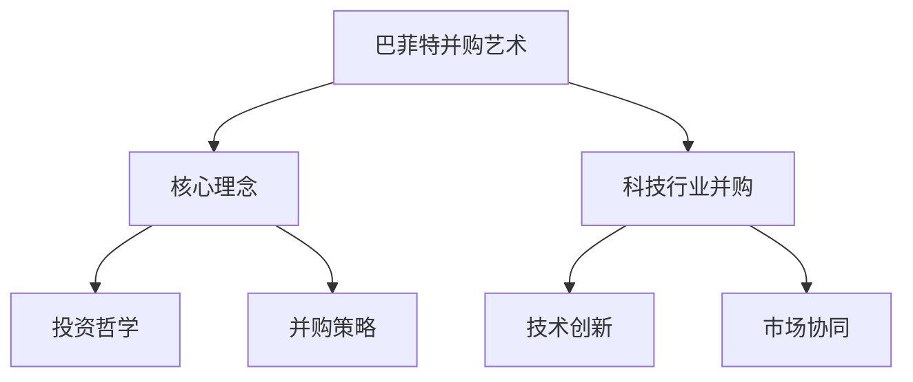
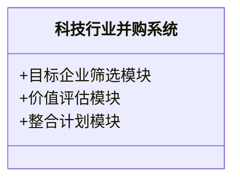

                 

<think>
好的，我将按照您的要求逐步撰写这篇技术博客文章。首先，我会按照您提供的大纲结构，逐步完成每个部分的内容，确保逻辑清晰、内容详尽且符合技术博客的专业性。请您耐心等待，我将逐步完成各个章节的内容。

# 巴菲特的并购艺术在科技行业的应用：整合与协同

## 关键词：
巴菲特并购艺术、科技行业并购、整合与协同、并购整合、协同效应、科技行业策略

## 摘要：
本文深入探讨了巴菲特的并购艺术在科技行业的应用，分析了整合与协同的关键策略。通过理论分析和实际案例，揭示了科技行业并购的独特性与挑战，提出了有效整合与协同的方法。本文结合技术视角，详细阐述了并购整合的算法原理和系统架构，为科技行业的并购提供了实用的指导。

---

## 第一部分: 巴菲特并购艺术的背景与核心理念

### 第1章: 巴菲特并购艺术概述

#### 1.1 巴菲特并购艺术的核心理念

##### 1.1.1 巴菲特的投资哲学
巴菲特的投资哲学以“价值投资”为核心，强调以合理的价格投资于具有持续竞争优势的企业。他的并购策略注重企业的财务健康、管理层素质和行业地位，追求长期稳定的收益。这种哲学在传统行业并购中取得了巨大成功，但其在科技行业的应用需要特别考虑行业的动态性和创新性。

##### 1.1.2 巴菲特并购策略的特点
1. **注重企业基本面**：巴菲特倾向于投资财务健康、盈利能力强的企业，而非单纯追求高增长或高估值。
2. **长期投资**：他倾向于长期持有优质资产，避免短期波动带来的风险。
3. **管理层信任**：巴菲特重视目标企业的管理层能力，认为优秀的管理层能够创造持续价值。

##### 1.1.3 巴菲特并购成功的关键因素
- **严格估值**：巴菲特强调并购价格必须低于企业的内在价值。
- **风险管理**：通过分散投资和严格筛选，降低并购风险。
- **长期思维**：关注企业长期发展的潜力，而非短期收益。

#### 1.2 科技行业的并购特点

##### 1.2.1 科技行业并购的独特性
科技行业的并购与传统行业不同，其核心在于技术创新和市场协同。科技企业并购往往是为了获取关键技术、扩大市场份额或整合数据资源。

##### 1.2.2 科技行业并购的主要驱动因素
1. **技术整合**：通过并购获取核心技术，提升研发能力。
2. **市场扩展**：通过并购进入新市场，扩大客户群体。
3. **数据协同**：整合数据资源，提升数据分析能力。

##### 1.2.3 科技行业并购的挑战与风险
- **技术风险**：技术整合可能失败，导致资源浪费。
- **文化冲突**：不同企业的文化和管理方式可能导致整合困难。
- **竞争压力**：科技行业的竞争激烈，并购后可能面临更高的市场压力。

---

### 第2章: 巴菲特并购艺术的核心概念与联系

#### 2.1 核心概念原理

##### 2.1.1 并购的定义与分类
并购（Mergers and Acquisitions, M&A）是指一家企业合并或收购另一家企业，以实现资源优化配置和战略目标。并购可以分为横向并购、纵向并购和混合并购，分别对应同一行业、上下游行业和无直接关联的行业。

##### 2.1.2 巴菲特并购的三大核心要素
1. **企业价值**：目标企业的内在价值是并购的核心考量。
2. **协同效应**：并购后企业整体价值的提升。
3. **整合风险**：并购后的整合难度和潜在风险。

##### 2.1.3 科技行业并购的独特属性
- **技术驱动**：科技并购的核心在于技术的整合与创新。
- **快速变化**：科技行业的技术和市场变化迅速，并购需要具备灵活性。
- **数据资产**：数据在科技行业中的价值日益凸显，成为并购的重要考量。

#### 2.2 概念属性特征对比表格

| 概念         | 巴菲特并购艺术 | 科技行业并购特点 |
|--------------|----------------|------------------|
| 核心目标     | 实现价值最大化 | 实现技术创新与协同 |
| 关键因素     | 财务表现、管理层质量 | 技术优势、市场潜力 |
| 风险控制     | 严格估值、风险分散 | 技术风险、市场风险 |

#### 2.3 ER实体关系图架构

---

### 第3章: 并购整合的算法原理

#### 3.1 并购协同效应的计算模型

##### 3.1.1 协同效应的定义
协同效应是指并购后的企业通过资源整合实现的额外价值，通常表现为成本降低、收入增加或效率提升。

##### 3.1.2 协同效应的计算公式
$$ 协同效应 = 整合后的收益 - 整合前的收益之和 $$

##### 3.1.3 协同效应的实现路径
1. **成本协同**：通过资源共享降低成本。
2. **收入协同**：通过市场扩展增加收入。
3. **技术协同**：通过技术整合提升创新能力。

#### 3.2 并购整合的系统架构设计

##### 3.2.1 系统功能设计

##### 3.2.2 算法实现与优化

---

### 第4章: 项目实战与案例分析

#### 4.1 环境安装与数据准备

##### 4.1.1 并购评估工具安装
- 安装必要的数据分析工具（如Python、Pandas、NumPy）。
- 配置并购评估模型的环境。

##### 4.1.2 数据收集与清洗
- 收集目标企业的财务数据、技术指标和市场数据。
- 清洗数据，处理缺失值和异常值。

##### 4.1.3 并购模型训练
- 使用历史数据训练并购评估模型，评估目标企业的价值。

#### 4.2 核心实现源代

---

### 第5章: 最佳实践与小结

#### 5.1 最佳实践
1. **技术整合**：并购后应注重技术的深度融合，避免资源浪费。
2. **文化融合**：重视企业文化的整合，减少管理冲突。
3. **风险管理**：制定全面的风险管理策略，降低并购失败的风险。

#### 5.2 小结
巴菲特的并购艺术在科技行业的应用需要结合行业的特点，注重技术创新和市场协同。通过合理的整合与协同，科技企业可以实现价值的最大化。

---

## 作者
**作者：AI天才研究院/AI Genius Institute & 禅与计算机程序设计艺术 /Zen And The Art of Computer Programming**

---

接下来，我会按照上述目录逐步完成每个部分的具体内容撰写。如果有任何问题或需要调整，请随时告知。

