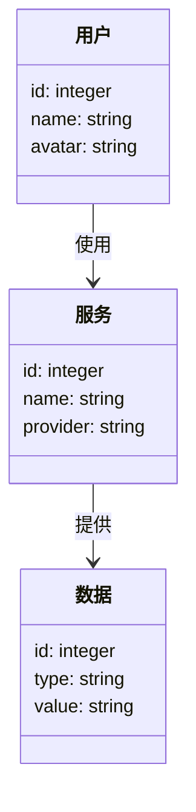
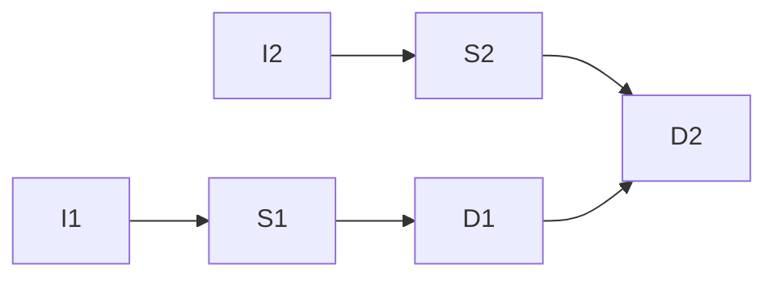
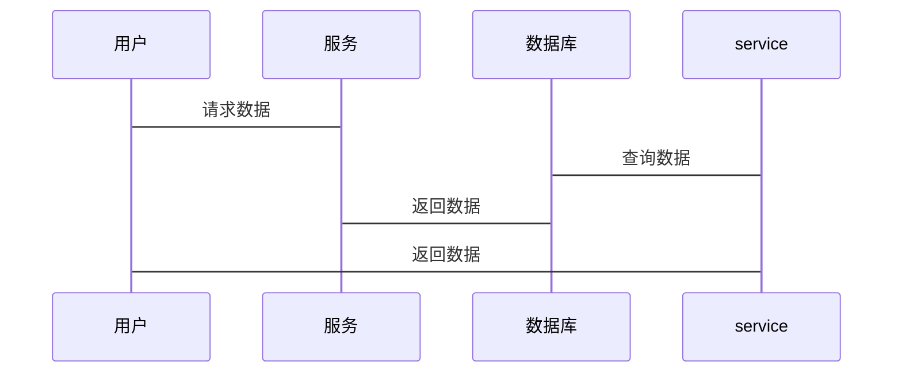

                 


# 巴菲特的并购艺术：元宇宙生态系统整合的新策略

> 关键词：巴菲特并购艺术、元宇宙生态系统、并购策略、整合新策略、系统架构

> 摘要：本文深入分析巴菲特的并购艺术，并将其理念应用于元宇宙生态系统的整合策略中。通过详细的技术分析和案例研究，探讨如何结合长期价值投资、风险管理等并购原则，构建可持续发展的元宇宙生态体系。

---

## 第1章 巴菲特的并购艺术概述

### 1.1 巴菲特并购理念的核心思想

#### 1.1.1 巴菲特的"三圈理论"

巴菲特的"三圈理论"是他并购理念的核心，包括三个同心圆：

1. **个人能力圈**：投资者必须专注于自己熟悉的企业和行业。
2. **企业能力圈**：企业必须具备持续竞争优势的核心能力。
3. **市场能力圈**：市场必须处于可预测和可控制的环境中。

这个理论强调专注、熟悉和可持续性，确保并购的长期价值。

#### 1.1.2 巴菲特并购中的"安全边际"原则

"安全边际"是巴菲特在并购中强调的关键原则，通过低估企业的内在价值，确保并购后的投资回报。公式如下：

$$ \text{安全边际} = \text{内在价值} - \text{市场价格} $$

#### 1.1.3 巴菲特的长期价值投资理念

巴菲特认为，投资的最终目标是创造长期价值，而非短期收益。他偏好那些具备稳定收益和持续增长潜力的企业。

### 1.2 巴菲特并购策略的关键特征

#### 1.2.1 企业基本面分析

巴菲特注重企业的财务健康状况，包括：

- 净利润
- 营业收入
- 净资产收益率（ROE）

#### 1.2.2 财务指标评估

通过分析财务指标，如市盈率（P/E）和市净率（P/B），评估企业的投资价值。

#### 1.2.3 并购后的整合策略

并购后，巴菲特注重企业文化的整合和管理团队的稳定性。

### 1.3 巴菲特并购案例分析

#### 1.3.1 可口可乐案例

巴菲特投资可口可乐，看重其强大的品牌和稳定的现金流。

#### 1.3.2 左右手公司案例

通过并购左手公司，增强协同效应，降低运营成本。

#### 1.3.3 伯克希尔 Hathaway 的多元化并购

伯克希尔通过多元化并购，构建了强大的投资组合。

### 1.4 巴菲特并购艺术的现代启示

#### 1.4.1 并购中的风险管理

通过安全边际原则，降低并购风险。

#### 1.4.2 并购中的文化整合

强调企业文化的融合，确保并购后的稳定运行。

#### 1.4.3 并购中的长期价值创造

注重长期价值，而非短期收益。

---

## 第2章 元宇宙生态系统整合的背景与概念

### 2.1 元宇宙的定义与特征

元宇宙是一个虚拟的三维空间，具备沉浸式体验、实时互动和去中心化等特点。

### 2.2 元宇宙生态系统整合的必要性

元宇宙的生态体系复杂，需要通过整合优化资源，提升用户体验。

### 2.3 元宇宙生态系统整合的关键要素

包括技术整合、业务整合和用户体验整合。

### 2.4 元宇宙生态系统整合的现状与趋势

当前主要以技术驱动型整合为主，未来将向平台整合型发展。

---

## 第3章 巴菲特并购艺术与元宇宙生态系统整合的结合

### 3.1 巴菲特并购理念在元宇宙整合中的应用

#### 3.1.1 长期价值投资理念的适用性

在元宇宙整合中，长期价值创造同样重要。

#### 3.1.2 安全边际原则的延伸

通过评估元宇宙企业的内在价值，确保并购的安全性。

#### 3.1.3 三圈理论在元宇宙整合中的体现

专注熟悉的领域，确保整合的可预测性和可持续性。

### 3.2 元宇宙生态系统整合中的并购策略

#### 3.2.1 技术驱动型并购

并购具备核心技术优势的企业，提升整体竞争力。

#### 3.2.2 服务互补型并购

整合互补性服务，优化用户体验。

#### 3.2.3 平台整合型并购

构建统一的平台，实现资源的高效整合。

### 3.3 巴菲特并购艺术对元宇宙整合的启示

#### 3.3.1 价值评估的重要性

在元宇宙整合中，准确评估企业价值至关重要。

#### 3.3.2 风险控制的必要性

通过风险管理，降低整合过程中的潜在风险。

#### 3.3.3 长期战略规划的必要性

制定长期战略，确保整合的可持续发展。

---

## 第4章 元宇宙生态系统整合的系统架构与设计

### 4.1 元宇宙生态系统整合的系统架构

#### 4.1.1 分层架构

将元宇宙系统分为用户层、服务层和数据层。

#### 4.1.2 模块化设计

通过模块化设计，提升系统的可扩展性和灵活性。

#### 4.1.3 面向服务架构（SOA）

采用SOA架构，便于不同服务之间的交互与协作。

### 4.2 元宇宙生态系统整合的领域模型

使用Mermaid类图，展示领域模型的关键组成部分。



### 4.3 元宇宙生态系统整合的系统架构

使用Mermaid架构图，展示系统的整体架构。



### 4.4 元宇宙生态系统整合的接口设计

通过RESTful API，实现服务之间的交互。

### 4.5 元宇宙生态系统整合的交互流程

使用Mermaid序列图，展示用户与系统之间的交互流程。



---

## 第5章 项目实战：元宇宙生态系统整合的实现

### 5.1 环境安装

安装必要的工具和依赖项，如Python、Django框架等。

### 5.2 核心代码实现

实现用户认证、服务发现和数据交互的核心功能。

#### 5.2.1 用户认证模块

代码示例：

```python
def authenticate(user, password):
    # 认证逻辑
    pass
```

#### 5.2.2 服务发现模块

代码示例：

```python
def discover_services():
    # 发现服务逻辑
    pass
```

#### 5.2.3 数据交互模块

代码示例：

```python
def fetch_data(service_id):
    # 获取数据逻辑
    pass
```

### 5.3 案例分析

通过具体案例，展示如何在实际项目中应用上述策略。

---

## 第6章 结论与展望

### 6.1 本章小结

总结全文内容，强调巴菲特并购艺术与元宇宙整合的结合。

### 6.2 最佳实践 tips

- 突出重点：在并购中，注重长期价值创造。
- 系统性思考：在整合中，注重整体架构设计。
- 风险管理：在实施中，注重风险控制。

### 6.3 注意事项

- 避免盲目并购，确保并购的必要性。
- 注重文化整合，确保并购后的稳定性。
- 关注技术发展，确保整合的先进性。

### 6.4 拓展阅读

建议读者进一步阅读相关书籍和文献，深入了解并购艺术和元宇宙整合的更多细节。

---

## 作者：AI天才研究院/AI Genius Institute & 禅与计算机程序设计艺术 /Zen And The Art of Computer Programming

---

以上就是《巴菲特的并购艺术：元宇宙生态系统整合的新策略》的完整目录和内容框架。通过这一系列的思考与分析，我们可以看到，将巴菲特的并购艺术应用于元宇宙生态系统的整合中，不仅能够为元宇宙的发展提供新的策略，也能为并购领域带来新的视角和方法。

