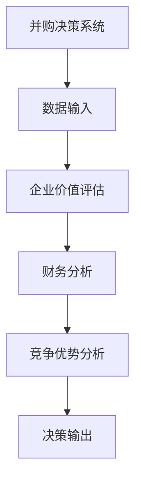

                 

# 巴菲特的并购艺术：在全球化背景下的新策略

> 关键词：巴菲特，并购策略，价值投资，全球化，系统架构，案例分析

> 摘要：本文深入探讨了巴菲特的并购策略及其在全球化背景下的演变。通过分析其核心理念、数学模型、系统架构及实际案例，揭示了巴菲特并购决策的内在逻辑和全球化环境下的新策略。文章旨在为读者提供一个全面的视角，理解巴菲特并购艺术的精髓及其在现代商业环境中的应用。

---

## 第1章：巴菲特的投资理念与并购策略

### 1.1 巴菲特的投资理念

巴菲特的投资理念是价值投资的典型代表，其核心在于寻找具有持续竞争优势的企业，并以低于其内在价值的价格买入。他强调长期投资和股东价值创造，而非短期投机。

#### 1.1.1 价值投资的核心原则
- **内在价值**：企业未来现金流的现值，计算公式为：
  $$ V = \frac{CF}{r - g} $$
  其中，$CF$ 是未来现金流，$r$ 是贴现率，$g$ 是增长率。
- **安全边际**：买入价格低于内在价值，以降低风险。

#### 1.1.2 股价与内在价值的关联
巴菲特认为，股价会围绕内在价值波动，长期来看，股价会回归其内在价值。因此，在并购决策中，他倾向于寻找市场价格低于内在价值的企业。

#### 1.1.3 安全边际的概念与应用
安全边际是巴菲特投资策略的核心，他通过估算企业的内在价值，并确保买入价格低于该价值，从而降低投资风险。

### 1.2 巴菲特并购策略的特点

#### 1.2.1 寻找具有持续竞争优势的企业
巴菲特倾向于投资那些具有强大护城河（如品牌、技术、成本优势等）的企业，以确保其长期盈利能力。

#### 1.2.2 重视企业财务健康状况
他强调企业的财务健康状况，包括低债务、稳定的现金流和健康的利润率。

#### 1.2.3 长期投资与股东价值创造
巴菲特注重长期投资，通过持有优质资产，逐步增加企业价值，实现股东利益的最大化。

---

## 第2章：价值投资与并购策略的数学模型

### 2.1 价值投资的数学模型

#### 2.1.1 内在价值计算公式
内在价值的计算公式：
$$ V = \frac{CF}{r - g} $$
其中，$CF$ 是未来现金流，$r$ 是贴现率，$g$ 是增长率。

#### 2.1.2 股票价值评估的简化模型
股票价值可以简化为：
$$ \text{股价} = \frac{\text{现金流}}{\text{贴现率}} $$

### 2.2 并购决策的数学分析

#### 2.2.1 收购溢价的计算
收购溢价的计算公式：
$$ \text{溢价} = \text{目标股价} - \text{收购价} $$

#### 2.2.2 并购后的协同效应评估
协同效应的评估可以通过以下步骤进行：
1. 确定并购后的整合计划。
2. 评估协同效应的具体数值。
3. 结合协同效应调整整体估值。

---

## 第3章：并购决策的系统架构

### 3.1 系统功能设计

#### 3.1.1 企业价值评估模块
该模块用于计算企业的内在价值，包括现金流预测、贴现率计算和增长率预测。

#### 3.1.2 财务健康分析模块
该模块用于评估企业的财务健康状况，包括债务水平、现金流状况和利润率分析。

#### 3.1.3 竞争优势识别模块
该模块用于识别企业的竞争优势，包括品牌、技术、成本优势等。

### 3.2 系统架构图

---

## 第4章：实际案例分析

### 4.1 巴菲特收购可口可乐案例

#### 4.1.1 案例背景
1985年，巴菲特通过投资可口可乐公司，成功实现了长期的股东价值增长。

#### 4.1.2 并购决策过程
1. 识别可口可乐的持续竞争优势（品牌价值）。
2. 评估其财务健康状况（稳定的现金流）。
3. 计算内在价值，确定合理的收购价格。

#### 4.1.3 并购后的价值创造
通过长期持有可口可乐股票，巴菲特实现了资本增值和股东价值的最大化。

---

## 第5章：全球化背景下的并购策略

### 5.1 跨国并购的复杂性

#### 5.1.1 文化差异与管理挑战
跨国并购需要考虑文化差异和管理风格的兼容性。

#### 5.1.2 法律与税务问题
跨国并购涉及复杂的法律和税务问题，需要专业的团队进行评估。

### 5.2 新兴市场的并购策略

#### 5.2.1 识别高增长潜力企业
新兴市场中可能存在高增长潜力的企业，但需要进行详细的市场分析。

#### 5.2.2 应对汇率风险的策略
通过金融衍生工具和多元化的投资组合来应对汇率风险。

---

## 第6章：总结与展望

### 6.1 总结

#### 6.1.1 巴菲特并购策略的核心要素
1. 价值投资：寻找具有持续竞争优势的企业。
2. 安全边际：确保买入价格低于内在价值。
3. 长期投资：通过长期持有实现股东价值最大化。

#### 6.1.2 全球化背景下的策略调整
1. 跨国并购需要考虑文化差异和法律风险。
2. 新兴市场的并购机会与挑战并存。

### 6.2 展望

#### 6.2.1 未来并购策略的演变
随着全球化的深入，并购策略将更加注重技术创新和市场整合。

#### 6.2.2 技术驱动的并购趋势
技术驱动的并购将成为未来的重要趋势，尤其是在人工智能、大数据等领域。

---

## 第7章：作者信息

作者：AI天才研究院/AI Genius Institute & 禅与计算机程序设计艺术 /Zen And The Art of Computer Programming

---

以上是《巴菲特的并购艺术：在全球化背景下的新策略》的详细目录和文章内容，希望对您有所帮助！

