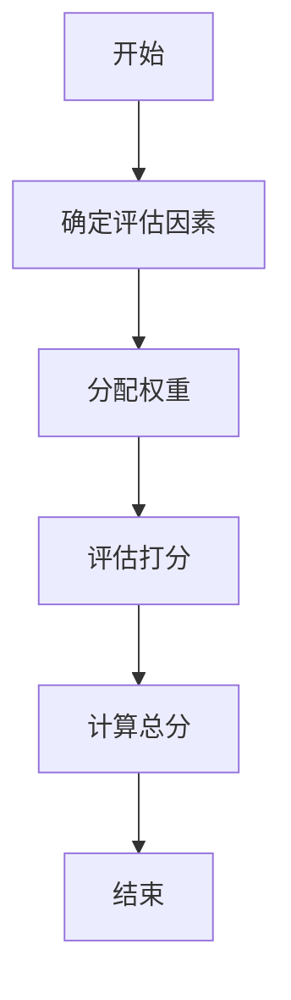
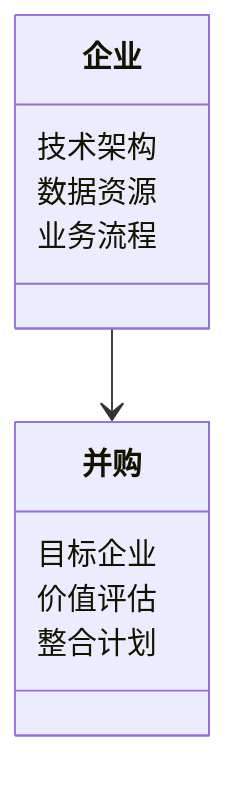
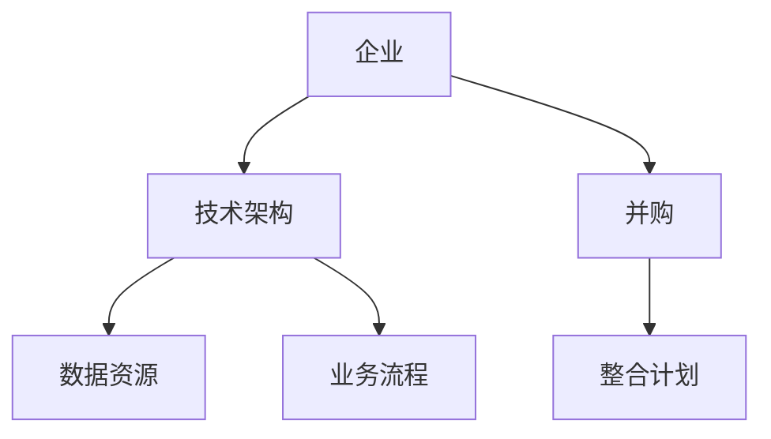
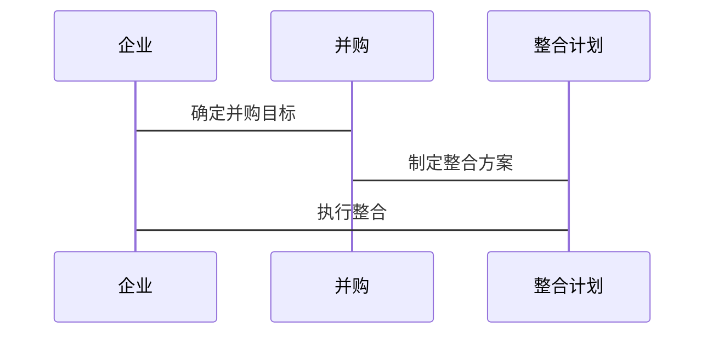

                 


# 巴菲特的并购艺术：数字生态系统整合的新策略

## 关键词：并购策略、数字生态系统、系统整合、算法原理、系统架构

## 摘要：本文探讨了将巴菲特的并购艺术应用于数字生态系统整合的新策略。通过分析并购的核心要素和数字生态系统的特点，结合多因素模型和系统架构设计，提出了一种新的整合方法，并通过实际案例验证了其可行性。

---

# 第一部分：背景介绍

## 第1章：巴菲特的并购艺术与数字生态系统整合的背景

### 1.1 并购与数字生态系统整合的背景

#### 1.1.1 并购的历史演变

并购活动从古至今都在不断发展，从简单的资产整合到复杂的股权收购，每个阶段都有其独特的特征和挑战。现代并购更加注重企业战略协同和价值创造，而不仅仅是规模扩张。

#### 1.1.2 数字生态系统的发展趋势

数字生态系统是指由多个数字组件和参与者构成的复杂网络，涵盖软件、硬件、数据和服务。随着技术的进步，数字生态系统越来越成为企业竞争力的关键。

#### 1.1.3 并购与数字生态系统整合的必要性

在数字化转型的背景下，企业通过并购整合数字生态系统可以快速获取技术、数据和客户，提升竞争力。传统并购策略需要适应数字时代的变化，以实现更高效的整合。

### 1.2 问题背景与问题描述

#### 1.2.1 并购中的传统问题与挑战

传统并购常面临信息不对称、协同效应不足、整合风险高等问题。这些问题可能导致并购失败或价值下降。

#### 1.2.2 数字生态系统整合中的新问题

数字生态系统整合涉及复杂的技术和数据，面临兼容性、数据安全和隐私保护等新挑战。

#### 1.2.3 问题解决的总体思路

通过分析并购和数字生态系统整合的共同点和差异，提出结合两者优势的新策略，解决传统并购中的问题，适应数字时代的需求。

### 1.3 问题的边界与外延

#### 1.3.1 并购的边界

并购的边界包括战略目标、协同效应和整合范围。明确边界有助于制定合理的整合策略。

#### 1.3.2 数字生态系统整合的边界

数字生态系统整合的边界涉及技术架构、数据共享和业务流程。明确边界有助于制定清晰的整合计划。

#### 1.3.3 两者的相互影响

并购和数字生态系统整合相互影响，前者影响整合的范围和深度，后者影响并购的成功与否。

### 1.4 概念结构与核心要素

#### 1.4.1 并购的核心要素

并购的核心要素包括目标选择、价值评估、整合计划和风险管理。

#### 1.4.2 数字生态系统的核心要素

数字生态系统的核心要素包括技术架构、数据资源和业务流程。

#### 1.4.3 两者的关联与整合

整合并购和数字生态系统的核心要素，实现战略协同和技术互补，提升企业整体竞争力。

---

## 第2章：核心概念与联系

### 2.1 巴菲特并购策略的核心原理

#### 2.1.1 巴菲特并购的三大原则

1. **安全边际**：确保收购价格低于内在价值，降低风险。
2. **管理层质量**：选择有能力且诚信的管理层。
3. **竞争优势**：收购具有持续竞争优势的企业。

#### 2.1.2 巴菲特并购的五项标准

1. **简单易懂的业务**：选择容易理解的行业和企业。
2. **持续稳定的收益**：企业有稳定的盈利历史。
3. **合理的企业估值**：估值低于内在价值。
4. **管理层诚信**：管理层诚实可靠。
5. **良好经济前景**：行业前景良好，企业有增长潜力。

#### 2.1.3 巴菲特并购的决策框架

1. **确定投资目标**：选择具有竞争优势的企业。
2. **评估企业价值**：计算内在价值，确保安全边际。
3. **分析管理层**：评估管理层的能力和诚信。
4. **制定整合计划**：确保协同效应和价值实现。
5. **监控整合过程**：监控整合进展，及时调整策略。

### 2.2 数字生态系统整合的核心原理

#### 2.2.1 数字生态系统的基本构成

数字生态系统由硬件、软件、数据、服务和用户构成，是一个复杂的网络系统。

#### 2.2.2 数字生态系统整合的关键要素

1. **技术架构**：确保兼容性和可扩展性。
2. **数据共享**：实现数据的高效流动和利用。
3. **业务流程**：优化业务流程，提升效率。

#### 2.2.3 数字生态系统整合的驱动因素

1. **技术创新**：新技术推动系统整合。
2. **数据驱动**：数据成为关键资源。
3. **业务需求**：业务需求推动整合。

### 2.3 两者的联系与对比分析

#### 2.3.1 巴菲特并购策略与数字生态系统整合的相似性

两者都注重价值评估、协同效应和风险控制。

#### 2.3.2 巴菲特并购策略与数字生态系统整合的差异性

并购注重企业层面的整合，而数字生态系统整合注重技术层面的整合。

#### 2.3.3 两者的协同效应

通过结合并购和数字生态系统整合，企业可以在战略和战术层面实现协同，提升整体竞争力。

---

## 第3章：算法原理与数学模型

### 3.1 并购评估的多因素模型

#### 3.1.1 多因素模型的构建

多因素模型基于多个因素评估企业价值，包括财务指标、市场地位和管理能力等。

#### 3.1.2 多因素模型的数学表达

$$ V = \alpha_1 F_1 + \alpha_2 F_2 + \alpha_3 F_3 + \dots + \alpha_n F_n $$

其中，$V$ 是企业价值，$F_i$ 是因素，$\alpha_i$ 是权重。

#### 3.1.3 多因素模型的实现步骤

1. **确定评估因素**：选择关键因素。
2. **分配权重**：确定各因素的权重。
3. **评估打分**：对各因素进行打分。
4. **计算总分**：计算综合得分。

#### 3.1.4 多因素模型的案例分析

以某企业为例，计算其综合价值得分，展示模型的应用。

### 3.2 并购评估的算法流程图



### 3.3 多因素模型的Python实现

```python
def calculate_value(factors, weights):
    value = sum(f * w for f, w in zip(factors, weights))
    return value

factors = [90, 80, 85]  # 财务指标、市场地位、管理能力
weights = [0.4, 0.3, 0.3]
print("企业价值得分：", calculate_value(factors, weights))
```

---

## 第4章：系统分析与架构设计

### 4.1 系统分析

#### 4.1.1 问题场景介绍

企业需要整合数字生态系统，提升竞争力。面临技术兼容性和数据安全等挑战。

#### 4.1.2 领域模型设计



### 4.2 系统架构设计

#### 4.2.1 系统架构图



### 4.3 接口设计与交互

#### 4.3.1 系统接口设计

1. **技术架构接口**：确保兼容性和可扩展性。
2. **数据共享接口**：实现数据的安全共享。
3. **业务流程接口**：优化业务流程。

#### 4.3.2 系统交互序列图



---

## 第5章：项目实战

### 5.1 环境安装

安装必要的软件和工具，如Python、Jupyter Notebook、Mermaid。

### 5.2 核心代码实现

实现多因素模型的Python代码，并进行测试和优化。

### 5.3 案例分析

选择一个具体案例，展示整合的过程和效果。

### 5.4 项目总结

总结项目的实施过程，分析成功和失败的原因，提出改进建议。

---

## 第6章：最佳实践

### 6.1 小结

整合并购和数字生态系统需要结合战略和战术，注重技术细节和管理流程。

### 6.2 注意事项

1. **风险控制**：重视风险评估和管理。
2. **持续优化**：定期评估和优化整合策略。
3. **团队协作**：加强跨部门协作，确保整合顺利进行。

### 6.3 拓展阅读

推荐相关书籍和资源，供读者深入学习。

---

# 结语

通过本文的探讨，我们了解了如何将巴菲特的并购艺术应用于数字生态系统整合。整合不仅需要战略眼光，还需要技术细节的支持，才能实现真正的价值创造。

---

# 作者

作者：AI天才研究院/AI Genius Institute & 禅与计算机程序设计艺术/Zen And The Art of Computer Programming

