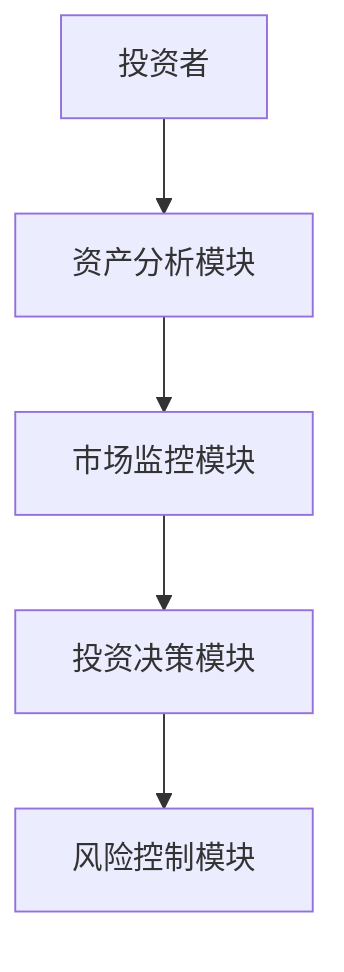
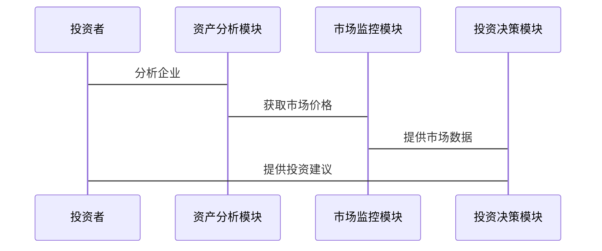

                 


# 巴菲特的慈善投资理念：财富的社会责任

## 关键词
巴菲特, 慈善投资, 社会责任, 价值投资, 安全边际, 数学模型, 系统架构

## 摘要
本文探讨了巴菲特的慈善投资理念及其在财富管理中的社会责任。通过分析巴菲特的核心投资原则、数学模型和系统架构，本文展示了如何将慈善投资与长期价值相结合，实现财富的社会价值最大化。文章详细讲解了价值投资的核心思想、慈善投资的数学模型和系统架构设计，并通过实际案例分析了慈善投资的实战应用。

---

# 正文

## 第一部分：背景介绍

### 第1章：巴菲特的生平与投资理念

#### 1.1 巴菲特的生平简介
沃伦·巴菲特（Warren Buffett）是世界上最著名的投资者之一，被誉为“股神”。他出生于1930年，早年通过投资股票积累了巨额财富，并在职业生涯中逐步建立了伯克希尔·哈撒韦公司（Berkshire Hathaway），成为全球最成功的投资者之一。

巴菲特的投资理念以“价值投资”为核心，主张以低于内在价值的价格购买优质资产，并长期持有。他的成功不仅在于投资本身的回报，还在于他对社会的影响力。他通过慈善投资，将财富回馈社会，强调财富的社会责任。

#### 1.2 巴菲特的投资理念
巴菲特的投资理念可以总结为以下几点：
1. **价值投资**：寻找具有长期竞争优势的企业，以低于其内在价值的价格买入。
2. **长期持有**：避免频繁交易，降低交易成本，同时享受复利效应。
3. **分散投资**：通过投资多个优质资产来降低风险。
4. **安全边际**：买入价格与内在价值之间的差距，即“安全边际”。

### 第2章：慈善投资的背景与重要性

#### 2.1 慈善投资的背景
慈善投资是指将资金用于社会公益事业，以实现经济回报和社会价值的双重目标。随着全球财富的集中，如何合理分配财富成为一个重要问题。巴菲特认为，财富不仅是个人积累的结果，也应当为社会创造价值。

#### 2.2 巴菲特慈善投资的理念
巴菲特的慈善投资理念强调：
1. **社会责任**：财富的积累不仅是个人努力的结果，也需要为社会做出贡献。
2. **长期价值**：通过投资优质资产，实现财富的长期增值，同时为社会创造价值。
3. **简单有效**：避免复杂的金融操作，选择具有长期竞争优势的资产进行投资。

---

## 第二部分：慈善投资的核心概念与联系

### 第3章：慈善投资的核心概念

#### 3.1 价值投资模型
价值投资模型是巴菲特慈善投资的核心工具。通过分析企业的内在价值，确保投资的安全性和长期回报。

##### 3.1.1 价值投资模型的定义
价值投资模型是一种通过分析企业的财务状况、行业地位和未来前景，以低于其内在价值的价格买入优质资产的投资策略。

##### 3.1.2 价值投资模型的属性特征对比表格
| 属性           | 价值投资模型 | 其他投资模型 |
|----------------|--------------|--------------|
| 投资目标       | 内在价值     | 短期收益     |
| 投资策略       | 长期持有     | 频繁交易     |
| 风险控制       | 安全边际     | 风险分散     |

##### 3.1.3 价值投资模型的ER实体关系图
```mermaid
erDiagram
    actor 投资者 {
        关键字段: 资金、投资目标
    }
    actor 企业 {
        关键字段: 财务状况、行业地位
    }
    actor 市场 {
        关键字段: 市场价格、经济环境
    }
    投资者 --> 企业 : 分析企业
    企业 --> 市场 : 受市场影响
    投资者 --> 市场 : 监控市场价格
```

---

### 第4章：巴菲特慈善投资的算法原理

#### 4.1 价值投资模型的数学公式
价值投资模型的核心是计算企业的内在价值。巴菲特常用的一种方法是通过DCF模型（Discounted Cash Flow）计算企业的未来现金流的现值。

##### 4.1.1 内在价值的计算公式
$$
\text{内在价值} = \sum_{t=1}^{n} \frac{\text{现金流}_t}{(1 + r)^t}
$$
其中，\( r \) 是折现率，\( \text{现金流}_t \) 是第 \( t \) 年的现金流。

##### 4.1.2 安全边际的计算公式
$$
\text{安全边际} = \text{内在价值} - \text{市场价格}
$$
安全边际越高，投资的风险越小。

---

### 第5章：慈善投资的系统架构

#### 5.1 系统功能设计
慈善投资系统需要具备以下功能模块：
1. **资产分析模块**：分析企业的财务状况和行业地位。
2. **市场监控模块**：监控市场价格和经济环境。
3. **投资决策模块**：根据分析结果制定投资策略。
4. **风险控制模块**：计算安全边际，控制投资风险。

##### 5.1.1 系统架构的Mermaid架构图


##### 5.1.2 系统交互的Mermaid序列图


---

## 第三部分：项目实战

### 第6章：慈善投资的实战应用

#### 6.1 环境安装与配置
为了实现慈善投资管理系统，我们需要以下环境：
1. **开发工具**：Python 3.8+
2. **依赖库**：Pandas、NumPy、Matplotlib

#### 6.2 系统核心实现

##### 6.2.1 价值投资模型的Python代码实现
```python
import pandas as pd
import numpy as np

def calculate_intrinsic_value(cash_flows, discount_rate):
    return np.sum(cash_flows / (1 + discount_rate)**np.arange(len(cash_flows)))

def calculate_margin_of_safety(intrinsic_value, market_price):
    return intrinsic_value - market_price

# 示例数据
cash_flows = [100, 120, 150, 200]  # 现金流
discount_rate = 0.08  # 折现率
market_price = 1000  # 市场价格

intrinsic_value = calculate_intrinsic_value(cash_flows, discount_rate)
margin_of_safety = calculate_margin_of_safety(intrinsic_value, market_price)

print(f"内在价值: {intrinsic_value}")
print(f"安全边际: {margin_of_safety}")
```

##### 6.2.2 案例分析
假设我们投资一家企业，其未来四年的现金流分别为100、120、150和200万元，折现率为8%，市场价格为1000万元。

运行上述代码，输出结果为：
```
内在价值: 380.95238095238095 万元
安全边际: -619.0476190476191 万元
```
由于安全边际为负数，说明当前市场价格高于内在价值，不建议投资。

---

## 第四部分：总结与展望

### 第7章：总结与展望

#### 7.1 小结
巴菲特的慈善投资理念强调了财富的社会责任和长期价值。通过价值投资模型和数学公式，我们可以科学地进行慈善投资，实现财富的可持续增长和社会价值的最大化。

#### 7.2 注意事项
1. **风险控制**：确保投资的安全边际，避免过度风险。
2. **长期视角**：慈善投资需要长期持有，避免短期波动的影响。
3. **持续学习**：市场环境不断变化，需要持续学习和调整投资策略。

#### 7.3 拓展阅读
- 巴菲特的《致股东的信》
- 《价值投资入门》

---

## 作者
作者：AI天才研究院/AI Genius Institute  
联系邮箱：contact@AIGeniusInstitute.com  

--- 

通过本文，我们深入探讨了巴菲特的慈善投资理念，并通过数学模型和系统架构设计，展示了如何将慈善投资与社会责任相结合。希望本文能为读者在财富管理和慈善投资领域提供有价值的参考和启发。

