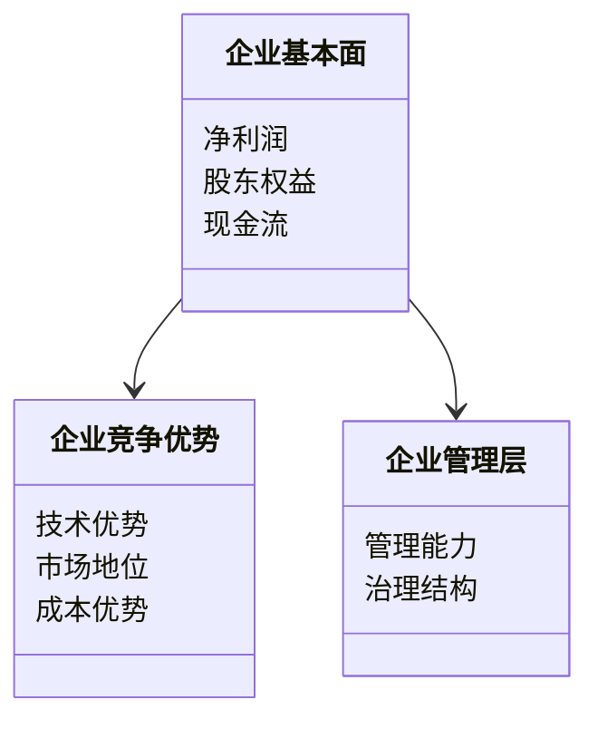
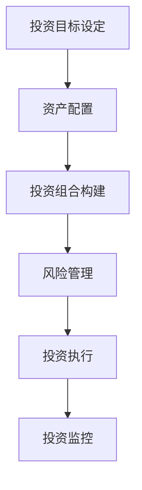
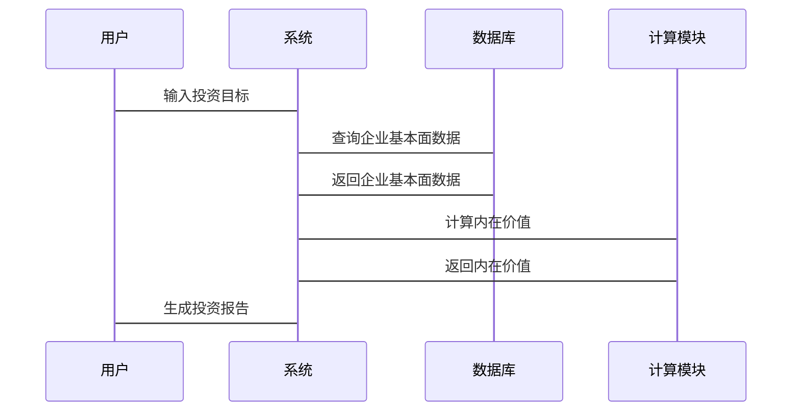

                 


# 巴菲特的成功秘诀：长期持有优质股票

## 关键词：巴菲特，价值投资，长期持有，优质股票，投资策略，风险管理

## 摘要：本文深入分析了巴菲特的投资理念，重点探讨了他成功的核心秘诀——长期持有优质股票。通过结合技术分析的方法，文章详细阐述了价值投资的理论基础、选股策略、投资组合管理以及风险管理，帮助读者理解如何在长期投资中实现稳健收益。

---

## 第一部分：巴菲特的投资理念与成功秘诀

### 第1章：巴菲特的投资哲学

#### 1.1 巴菲特的生平与投资理念

##### 1.1.1 巴菲特的早年经历与投资启蒙
沃伦·巴菲特（Warren Buffett）于1934年8月30日出生在美国堪萨斯州的奥马哈市。他的父亲霍伊·巴菲特是律师和政治家，母亲弗洛伦斯·巴菲特是一位家庭主妇。巴菲特从小就展现出了对数字和金融的浓厚兴趣。他在高中时期就阅读了大量投资相关的书籍，并在19岁时开始了自己的第一笔投资。

巴菲特的投资启蒙来自于他的导师本杰明·格雷厄姆（Benjamin Graham），格雷厄姆是价值投资的鼻祖，他教授巴菲特如何通过分析企业的基本面来评估其内在价值。巴菲特后来回忆说：“我从格雷厄姆那里学到的东西，是我整个投资哲学的基础。”

##### 1.1.2 巴菲特的价值投资理念
巴菲特的价值投资理念的核心在于寻找那些具有持续竞争优势、良好财务状况和优秀管理层的企业，并以合理的价格买入并长期持有。他认为市场的短期波动是不可预测的，但优质企业的内在价值终将反映在股价上。

##### 1.1.3 巴菲特的投资哲学对现代投资的影响
巴菲特的投资哲学颠覆了传统的短期交易思维，强调长期持有和价值发现。他的理念影响了全球无数投资者，并促使许多机构投资者重新审视其投资策略。巴菲特的成功证明了价值投资的长期有效性，尤其是在市场波动剧烈的情况下。

#### 1.2 巴菲特的成功秘诀

##### 1.2.1 长期持有优质股票的核心思想
巴菲特的成功秘诀在于他坚持长期持有优质股票。他认为，短期市场的波动会干扰投资者的判断，而优质企业的长期表现才是决定投资收益的关键。

##### 1.2.2 巴菲特对市场的独特看法
巴菲特认为市场是不可预测的，但企业的真实价值可以通过基本面分析来确定。他强调投资者应关注企业的内在价值，而不是市场的短期情绪。

##### 1.2.3 巴菲特的成功案例与启示
巴菲特的经典投资案例包括可口可乐、苹果和美国运通等。这些企业的共同点是具有强大的竞争优势、稳定的现金流和卓越的管理层。巴菲特的投资案例证明了长期持有优质股票的有效性。

---

### 第2章：价值投资的理论基础

#### 2.1 价值投资的核心概念

##### 2.1.1 价值投资的定义与特征
价值投资是一种基于对企业内在价值评估的投资策略。其核心在于寻找市场价格低于内在价值的股票，并长期持有。价值投资的特征包括基本面分析、长期视角和风险控制。

##### 2.1.2 价值投资与其它投资策略的对比
与成长投资、指数投资等策略相比，价值投资更注重企业的内在价值，强调安全边际和长期稳定性。以下是几种投资策略的对比：

| 投资策略 | 核心思想 | 适合投资者类型 | 风险特征 |
|----------|----------|-----------------|----------|
| 价值投资 | 寻找价格低于内在价值的股票 | 适合长期投资者 | 风险较低 |
| 成长投资 | 投资于具有高增长潜力的企业 | 适合风险承受能力强的投资者 | 风险较高 |
| 指数投资 | 按比例投资市场指数 | 适合保守投资者 | 风险与市场持平 |

##### 2.1.3 价值投资的数学模型与公式
价值投资的核心在于计算企业的内在价值。以下是巴菲特常用的一种简单估值模型：

$$
\text{内在价值} = \frac{\text{未来现金流的现值}}{1 + r}
$$

其中，\( r \) 是折现率，通常基于企业的风险水平确定。

#### 2.2 优质企业的识别标准

##### 2.2.1 企业的财务指标分析
以下是优质企业的关键财务指标：

| 指标名称 | 指标定义 | 重要性 |
|----------|----------|---------|
| 净利润率 | 净利润 / 收入 | 反映企业的盈利能力 |
| 资产负债率 | 负债 / 资产 | 反映企业的财务杠杆 |
| 现金流 | 现金流入 - 现金流出 | 反映企业的流动性 |

##### 2.2.2 企业的竞争优势分析
竞争优势是企业长期盈利能力的关键。以下是竞争优势的几个方面：

| 竞争优势 | 描述 |
|----------|------|
| 技术优势 | 企业拥有独特的技术或专利 |
| 市场地位 | 企业在市场中占据领先地位 |
| 成本优势 | 企业生产成本低于竞争对手 |

##### 2.2.3 企业的管理层与治理结构
优秀的管理层和良好的治理结构是企业长期成功的关键。以下是管理层评估的关键点：

| 评估维度 | 评估内容 |
|----------|----------|
| 管理层能力 | 管理层是否有丰富的行业经验和良好的决策能力 |
| 治理结构 | 是否有有效的董事会监督和内部控制机制 |

---

### 第3章：巴菲特的选股方法

#### 3.1 选股的关键指标

##### 3.1.1 市盈率与市净率的分析
市盈率（P/E）和市净率（P/B）是衡量股票价值的重要指标。以下是它们的计算公式：

$$
\text{市盈率} = \frac{\text{股价}}{\text{每股收益}}
$$

$$
\text{市净率} = \frac{\text{股价}}{\text{每股净资产}}
$$

##### 3.1.2 股息率与股息支付率的分析
股息率（Dividend Yield）和股息支付率（Dividend Payout Ratio）是衡量企业分红能力的重要指标。以下是它们的计算公式：

$$
\text{股息率} = \frac{\text{股息 / 股}}{\text{股价}}
$$

$$
\text{股息支付率} = \frac{\text{股息支付总额}}{\text{净利润}}
$$

##### 3.1.3 资产负债率与ROE的分析
资产负债率（Debt-to-Asset Ratio）和ROE（Return on Equity）是衡量企业财务健康和盈利能力的重要指标。以下是它们的计算公式：

$$
\text{资产负债率} = \frac{\text{总负债}}{\text{总资产}}
$$

$$
\text{ROE} = \frac{\text{净利润}}{\text{股东权益}}
$$

#### 3.2 巴菲特的经典案例分析

##### 3.2.1 可口可乐的长期投资案例
巴菲特于1988年开始投资可口可乐，至今仍未退出。可口可乐的持续竞争优势和稳定的现金流是巴菲特选择它的主要原因。

##### 3.2.2 苹果公司的投资逻辑
巴菲特对苹果的投资基于其强大的技术优势和市场地位。苹果的创新能力和品牌价值使其成为优质投资标的。

##### 3.2.3 其他巴菲特的经典投资案例
包括美国运通、富国银行等。这些企业的共同点是具有强大的竞争优势和稳定的现金流。

---

### 第4章：投资组合的构建与管理

#### 4.1 投资组合的构建策略

##### 4.1.1 股票与债券的配置比例
根据巴菲特的投资理念，投资组合中应以股票为主，辅以少量债券以降低风险。以下是常见的配置比例：

| 资产类别 | 配置比例 |
|----------|----------|
| 股票 | 70% - 80% |
| 债券 | 20% - 30% |

##### 4.1.2 长期持有与短期交易的平衡
巴菲特强调长期持有，但在实际操作中，也需要根据市场变化进行适当的调整。以下是长期持有与短期交易的平衡策略：

| 策略类型 | 描述 |
|----------|------|
| 长期持有 | 买入优质股票，持有至企业价值实现 |
| 短期交易 | 根据市场波动进行适当调整 |

##### 4.1.3 风险分散与收益最大化
通过分散投资降低风险，同时选择具有长期增长潜力的股票以实现收益最大化。

#### 4.2 投资组合的动态调整

##### 4.2.1 定期审视与优化投资组合
定期审视投资组合，根据企业的基本面变化进行调整。以下是定期审视的关键点：

| 审视频率 | 审视内容 |
|----------|----------|
| 每月 | 检查企业的财务报表和市场新闻 |
| 每季度 | 评估企业的竞争优势和管理层变动 |

##### 4.2.2 根据市场变化调整持仓
在市场波动较大时，适当调整持仓以规避风险。以下是调整策略：

| 市场状态 | 调整策略 |
|----------|----------|
| 牛市 | 增加股票持仓 |
| 熊市 | 减少股票持仓，增加债券持仓 |

##### 4.2.3 长期持有的策略与实际操作
长期持有需要耐心和纪律，以下是实际操作中的关键点：

| 操作要点 | 描述 |
|----------|------|
| 买入时机 | 选择价格低于内在价值时买入 |
| 卖出时机 | 选择价格远高于内在价值时卖出 |

---

### 第5章：风险管理与安全边际

#### 5.1 风险管理的核心思想
风险管理是投资成功的关键。巴菲特强调安全边际，即以低于内在价值的价格买入股票，以规避市场波动带来的风险。

#### 5.2 安全边际的计算与应用
以下是安全边际的计算公式：

$$
\text{安全边际} = \text{内在价值} - \text{市场价格}
$$

当安全边际为正时，股票具有投资价值。

#### 5.3 风险分散的策略
通过分散投资降低风险。以下是分散投资的策略：

| 分散策略 | 描述 |
|----------|------|
| 行业分散 | 投资不同行业的股票 |
| 地区分散 | 投资不同地区的股票 |

---

### 第6章：系统分析与架构设计方案

#### 6.1 系统功能设计

##### 6.1.1 领域模型类图
以下是价值投资领域的类图：



##### 6.1.2 系统架构设计
以下是投资系统架构图：



##### 6.1.3 系统接口设计
以下是系统接口设计：

| 接口名称 | 描述 |
|----------|------|
| 获取企业基本面 | 获取企业的财务数据 |
| 计算内在价值 | 根据财务数据计算内在价值 |
| 生成投资报告 | 生成投资组合的分析报告 |

##### 6.1.4 系统交互序列图
以下是系统交互序列图：



---

### 第7章：项目实战

#### 7.1 环境安装
需要安装以下工具：

| 工具名称 | 描述 |
|----------|------|
| Python | 编程语言 |
| Pandas | 数据分析库 |
| Matplotlib | 数据可视化库 |

#### 7.2 系统核心实现源代码

##### 7.2.1 企业基本面分析

```python
import pandas as pd

def calculate_intrinsic_value(financial_data):
    # 简单的内在价值计算模型
    return financial_data['净利润'].sum() / (1 + 0.1)
```

##### 7.2.2 投资组合管理

```python
def portfolio_management(portfolio, market_data):
    # 根据市场数据调整投资组合
    for stock in portfolio:
        if market_data[stock] > portfolio[stock]:
            portfolio[stock] = market_data[stock]
    return portfolio
```

##### 7.2.3 风险管理策略

```python
def risk_management(portfolio, risk_level):
    # 根据风险等级调整投资组合
    if risk_level == 'high':
        return portfolio * 0.6
    elif risk_level == 'medium':
        return portfolio * 0.8
    else:
        return portfolio
```

---

### 第8章：总结与展望

#### 8.1 总结
巴菲特的成功秘诀在于长期持有优质股票。他的投资哲学强调基本面分析、安全边际和长期视角。通过价值投资，投资者可以在市场波动中实现稳健收益。

#### 8.2 展望
未来，价值投资将继续在全球范围内影响投资者。随着技术的进步，投资者可以利用更多的工具和方法来优化投资策略，实现更高效的投资管理。

---

## 作者：AI天才研究院/AI Genius Institute & 禅与计算机程序设计艺术 /Zen And The Art of Computer Programming

