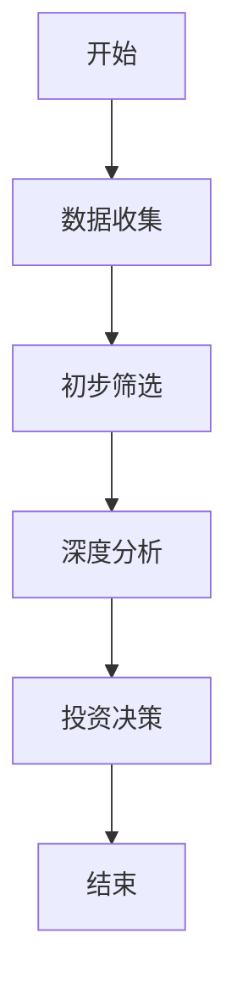

                 

# 巴菲特的投资checklist：系统化的选股流程

## 关键词：巴菲特投资，checklist，选股流程，价值投资，财务分析，竞争优势

## 摘要：本文详细探讨了巴菲特的投资checklist，分析了其系统化的选股流程，从投资的基本概念、财务分析、竞争优势评估到管理层分析，再到选股模型的构建与应用，帮助投资者掌握巴菲特的选股智慧。

---

## 第一部分: 巴菲特投资checklist的背景与基础

### 第1章: 投资的基本概念与巴菲特的投资理念

#### 1.1 投资的基本概念
投资是一种将资金投入特定资产以获取未来收益的行为。它包括股票、债券、房地产等多种形式。投资的核心在于通过分析资产的内在价值，做出明智的决策以实现财富增值。

#### 1.2 巴菲特的投资理念
巴菲特的价值投资理念强调长期持有优质资产，关注企业的内在价值而非市场波动。他主张投资那些具有强大竞争优势、良好财务状况和优秀管理层的企业。

#### 1.3 投资checklist的重要性
投资checklist帮助投资者避免情绪化决策，系统化地评估企业，确保每一步选择都基于事实和逻辑。

---

### 第2章: 投资checklist的必要性与作用

#### 2.1 投资决策中的常见问题
- 非理性决策：投资者常受情绪影响，做出错误决策。
- 信息过载：大量信息导致决策疲劳和混淆。
- 认知偏差：过度自信或厌恶损失影响判断。

#### 2.2 投资checklist的核心作用
- 标准化流程：确保每个企业都经过系统评估。
- 提高效率：减少不必要的分析，集中精力在关键指标。
- 减少干扰：通过 checklist 过滤情绪和偏见。

---

## 第二部分: 巴菲特投资checklist的核心要素

### 第3章: 企业财务状况的评估

#### 3.1 财务报表分析基础
- 资产负债表：评估企业的资产、负债和所有者权益。
- 利润表：分析收入、成本和利润情况。
- 现金流量表：了解企业的现金流入和流出。

#### 3.2 企业财务健康度的评估标准
- 净利润与ROE：衡量企业盈利能力。
- 负债与偿债能力：评估企业的财务风险。
- 现金流：判断企业的资金流动性。

#### 图表1: 净利润与ROE对比分析

---

### 第4章: 企业的竞争优势分析

#### 4.1 企业竞争优势的定义
竞争优势是企业在市场上胜过竞争对手的独特能力，包括技术、成本、品牌和资源等方面。

#### 4.2 企业竞争优势的评估指标
- 投资壁垒：企业的市场进入难度。
- 市场份额：企业在市场中的占比。
- 竞争对手分析：评估竞争对手的优劣势。

---

### 第5章: 管理层的评估与分析

#### 5.1 管理层素质的重要性
- 领导力：影响企业战略和方向。
- 诚信：确保管理层的决策透明和道德。
- 稳定性：管理层的长期稳定对企业持续发展至关重要。

#### 5.2 管理层评估的关键指标
- 历史业绩：管理层过去的表现。
- 战略规划：企业的未来发展方向。
- 激励机制：管理层的激励与企业绩效挂钩。

---

## 第三部分: 巴菲特选股模型的构建与应用

### 第6章: 巴菲特选股模型的构建

#### 6.1 模型构建的基本原则
- 财务指标权重分配：净利润、ROE等关键指标的权重。
- 竞争优势量化：通过市场份额和投资壁垒量化。
- 管理层评估：将管理层素质转化为可量化的指标。

#### 图表2: 财务指标权重分配

---

### 第7章: 投资流程的系统化设计

#### 7.1 系统化投资流程的框架
- 数据收集：收集企业的财务报表和市场信息。
- 初步筛选：通过checklist初步筛选企业。
- 深度分析：对通过初步筛选的企业进行详细分析。
- 投资决策：基于分析结果做出投资决策。

#### 图表3: 投资流程图

---

## 第四部分: 项目实战与总结

### 第8章: 实战案例分析

#### 8.1 案例背景
以苹果公司为例，分析其财务状况、竞争优势和管理层。

#### 8.2 数据分析
- 净利润：过去五年持续增长。
- ROE：稳定在20%以上。
- 竞争优势：强大的品牌和技术壁垒。
- 管理层：乔布斯的领导力和库克的执行力。

---

### 第9章: 总结与最佳实践

#### 9.1 总结
巴菲特的投资checklist为投资者提供了一套系统化的选股流程，帮助识别具有长期价值的企业。

#### 9.2 最佳实践 tips
- 定期更新checklist：市场变化需要及时调整。
- 长期持有：避免频繁交易，降低成本。
- 风险管理：分散投资，避免过度集中。

---

## 作者：AI天才研究院 & 禅与计算机程序设计艺术

---

通过以上结构，文章详细分析了巴菲特的投资checklist，从理论到实践，帮助投资者系统化地进行选股决策，避免常见错误，实现长期稳健的投资回报。

