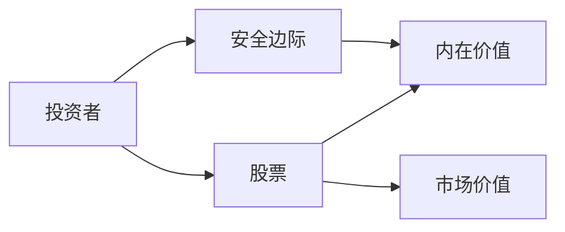
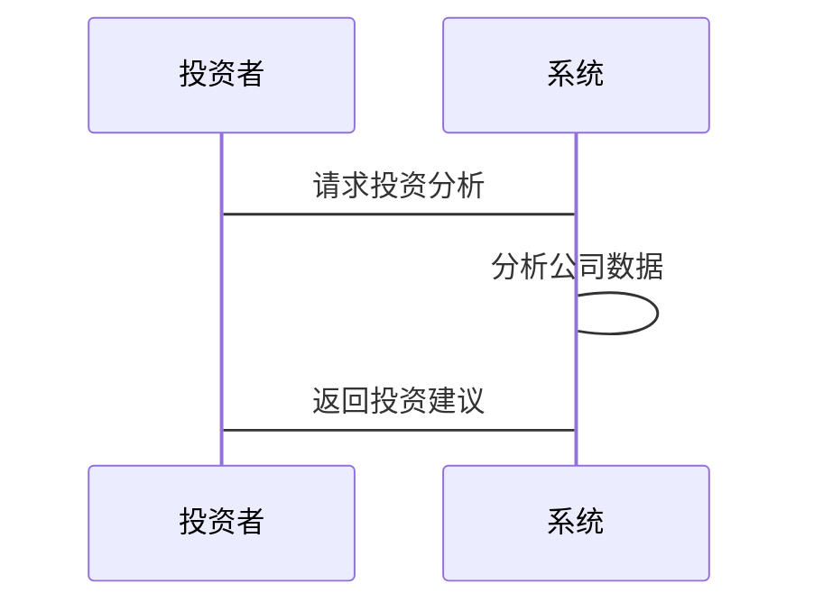

                 


# 巴菲特的投资哲学：在市场恐慌时贪婪

## 关键词：
- 巴菲特投资哲学
- 价值投资
- 安全边际
- 长期投资
- 股市分析

## 摘要：
本文探讨了巴菲特的投资哲学，特别是其在市场恐慌时期的贪婪策略。通过分析其核心概念、算法原理、系统架构和实际案例，本文为投资者提供了深入的见解和实用的指导。

---

## 第1章：巴菲特投资哲学的背景与核心理念

### 1.1 投资哲学的背景与发展
#### 1.1.1 价值投资的起源
价值投资起源于20世纪初，由本杰明·格雷厄姆和戴维·多德提出，强调以低于内在价值的价格购买股票。

#### 1.1.2 巴菲特投资哲学的形成
巴菲特师从格雷厄姆，继承并发展了价值投资理念，强调安全边际和长期持有。

#### 1.1.3 投资哲学在现代金融中的地位
巴菲特的投资哲学在现代金融中具有重要地位，特别是在市场波动时期，其逆向投资策略备受关注。

### 1.2 巴菲特投资理念的核心要素
#### 1.2.1 价值投资的定义与特征
价值投资是一种投资策略，寻找市场价格低于内在价值的股票。其特征包括长期性、逆向性、注重安全边际。

#### 1.2.2 股价与内在价值的关系
股价围绕内在价值波动，长期来看，股价回归内在价值。内在价值是未来现金流的现值。

#### 1.2.3 安全边际的概念与作用
安全边际是内在价值与市场价格之间的差额，提供保护，减少市场波动带来的风险。

### 1.3 巴菲特投资哲学的核心原则
#### 1.3.1 长期投资的重要性
长期投资避免了短期波动的影响，使投资者能够获得企业长期增长的收益。

#### 1.3.2 股市作为投票机而非选票箱
巴菲特定义，股市反映公司管理决策的效果，而非单纯的投票工具。

#### 1.3.3 投资中的逆向思维
在市场恐慌时，巴菲特选择贪婪，寻找被低估的投资机会。

### 1.4 巴菲特投资哲学的实际应用
#### 1.4.1 价值投资的选股标准
寻找具有强大竞争优势、稳定收益和良好管理的公司。

#### 1.4.2 股票估值的方法
使用DCF模型计算内在价值，比较市场价格与内在价值的差异。

#### 1.4.3 投资组合的构建与管理
分散投资，注重资产配置，定期审视投资组合，调整以适应市场变化。

---

## 第2章：巴菲特投资哲学的核心概念与联系

### 2.1 投资哲学的核心概念
#### 2.1.1 价值与价格
价值是内在价值，价格是市场价格。投资机会在于价格低于内在价值时。

#### 2.1.2 内在价值与市场价值
内在价值是未来现金流的现值，市场价值是市场交易价格，两者可能不一致。

#### 2.1.3 安全边际与风险控制
安全边际通过降低购买价格来提高投资的安全性，减少风险。

### 2.2 核心概念的联系与对比
#### 2.2.1 价值与价格的对比分析
| 属性 | 价值 | 价格 |
|------|------|------|
| 定义 | 内在价值，未来现金流现值 | 市场价格 |
| 关系 | 长期趋同，短期波动 | 受市场情绪影响 |

#### 2.2.2 内在价值与市场价值的关系
内在价值是目标，市场价值是路径，两者差异决定投资机会。

#### 2.2.3 安全边际与投资风险的平衡
安全边际降低风险，但过高的安全边际可能错过投资机会。

### 2.3 投资哲学的ER实体关系图


---

## 第3章：巴菲特投资哲学的算法原理

### 3.1 投资哲学中的算法模型
#### 3.1.1 价值评估模型
使用DCF模型计算内在价值，判断是否低于市场价格。

#### 3.1.2 安全边际计算方法
安全边际 = 内在价值 - 市场价格。

#### 3.1.3 投资组合优化算法
分散投资，降低风险，优化资产配置。

### 3.2 价值评估模型的数学公式
#### 3.2.1 内在价值计算公式
$$ V = \frac{CF}{r - g} $$
其中，CF为现金流，r为折现率，g为增长率。

### 3.3 安全边际计算的流程图


### 3.4 投资组合优化算法的代码实现
```python
def calculate_intrinsic_value(cash_flows, discount_rate, growth_rate):
    return cash_flows / (discount_rate - growth_rate)

def calculate_margin_of_safety(intrinsic_value, market_price):
    return intrinsic_value - market_price

# 示例计算
cf = 1000
r = 0.1
g = 0.05
iv = calculate_intrinsic_value(cf, r, g)
mp = 900
mos = calculate_margin_of_safety(iv, mp)
print(f"内在价值: {iv}, 市场价格: {mp}, 安全边际: {mos}")
```

### 3.5 投资组合优化算法的数学模型
$$ \text{收益} = \sum (w_i \times r_i) $$
$$ \text{风险} = \sum (w_i \times \sigma_i^2) $$
目标：在给定风险下最大化收益，或在给定期望收益下最小化风险。

---

## 第4章：巴菲特投资哲学的系统分析与架构设计

### 4.1 投资决策系统的功能设计
#### 4.1.1 数据采集模块
收集市场数据，包括股价、财务数据等。

#### 4.1.2 数据分析模块
计算内在价值、市场价格，评估安全边际。

#### 4.1.3 投资策略模块
根据分析结果，制定投资策略。

### 4.2 投资决策系统的架构设计


### 4.3 系统接口设计
- 数据接口：从数据库获取公司财务数据。
- 策略接口：输出投资建议。

### 4.4 系统交互流程


---

## 第5章：巴菲特投资哲学的项目实战

### 5.1 项目环境配置
- 工具：Python、Pandas、Matplotlib
- 数据源：Yahoo Finance API

### 5.2 核心代码实现
```python
import pandas as pd
import yfinance as yf

def get_stock_data(ticker, start, end):
    data = yf.download(ticker, start, end)
    return data['Close']

def calculate_intrinsic_value(...):
    # 如前所述
```

### 5.3 案例分析
以苹果公司为例，计算其内在价值和安全边际，制定投资策略。

### 5.4 投资策略的优化
根据市场变化，动态调整投资组合。

---

## 第6章：总结与最佳实践

### 6.1 本章小结
巴菲特的投资哲学强调价值投资、安全边际和长期持有。通过系统分析和实战案例，投资者可以在市场恐慌时抓住机会。

### 6.2 最佳实践 tips
- 保持耐心，长期投资。
- 理解公司基本面，计算内在价值。
- 设置安全边际，降低投资风险。

### 6.3 注意事项
- 市场波动可能导致短期亏损，需保持耐心。
- 避免情绪化决策，坚持投资原则。

### 6.4 拓展阅读
推荐书籍：《巴菲特传》、《价值投资实战》。

---

## 作者：AI天才研究院/AI Genius Institute & 禅与计算机程序设计艺术 /Zen And The Art of Computer Programming

---

这篇文章通过详细分析巴菲特的投资哲学，结合理论与实践，为投资者提供了深入的指导。希望读者能够通过本文更好地理解价值投资的核心理念，并在实际投资中灵活运用。

