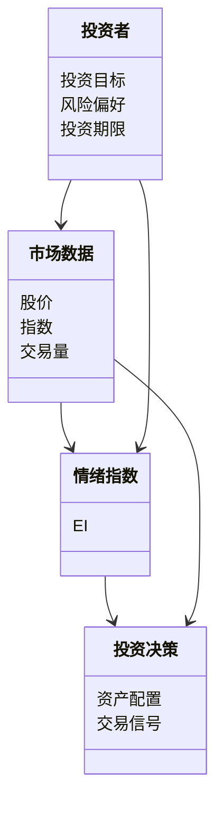
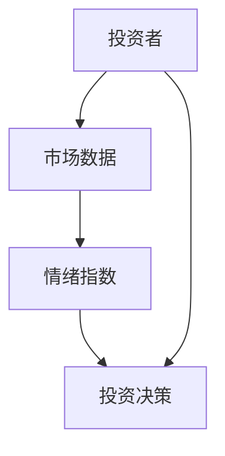
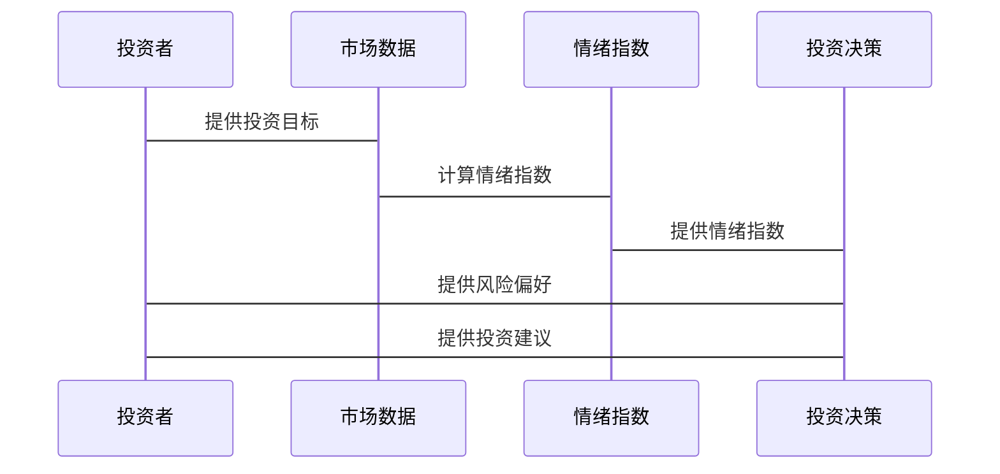

                 


# 巴菲特的投资心理学：控制情绪的艺术

> 关键词：巴菲特，投资心理学，情绪控制，价值投资，投资决策，风险管理

> 摘要：本文探讨巴菲特的投资心理学，特别是情绪控制在投资决策中的重要性。通过分析巴菲特的投资理念、情绪对决策的影响、数学模型构建以及系统架构设计，本文深入剖析如何通过情绪管理优化投资策略，避免情绪化决策带来的风险。

---

# 第一部分: 投资心理学概述

# 第1章: 投资心理学概述

## 1.1 巴菲特的投资理念

### 1.1.1 价值投资的核心思想

- **定义**：价值投资是一种以低于公平价值的价格买入优质股票的投资策略，强调长期持有，关注企业的内在价值而非市场波动。
- **核心思想**：
  - 投资于具有持续竞争优势的企业。
  - 耐心持有，避免频繁交易。
  - 以合理价格买入，长期持有。

### 1.1.2 巴菲特的投资策略

- **选股标准**：
  - 高ROE（净资产收益率）。
  - 强大的竞争优势（护城河）。
  - 可靠的管理层。
- **长期投资**：
  - 避免短期市场波动的影响。
  - 通过长期持有优质资产实现财富增长。

### 1.1.3 投资心理学的基本概念

- **情绪在投资中的作用**：
  - 情绪影响决策，可能导致非理性行为。
  - 理性决策是投资成功的关键。

---

## 1.2 情绪对投资决策的影响

### 1.2.1 情绪对投资决策的影响

- **贪婪与恐惧**：
  - 贪婪：市场上涨时的过度买入。
  - 恐惧：市场下跌时的过度卖出。
- **典型情绪偏差**：
  - 过度自信。
  - 过度厌恶损失。
  - 从众心理。

### 1.2.2 情绪如何影响投资决策

- **情绪如何导致错误决策**：
  - 贪婪导致高位买入。
  - 恐惧导致低位卖出。
  - 从众心理引发盲目跟风。

---

## 1.3 投资中的心理学基础

### 1.3.1 心理账户理论

- **心理账户**：
  - 人们根据不同的资金用途创建心理账户，影响投资决策。
  - 心理账户可能导致过度交易和非理性决策。

### 1.3.2 行为偏差与决策

- **常见行为偏差**：
  - 确认偏差：倾向于寻找支持自己观点的信息。
  - 锚定效应：过度依赖初始信息做出决策。
  - 过度自信：高估自己的投资能力。

---

## 1.4 本章小结

- 巴菲特的投资理念强调长期价值和情绪控制。
- 情绪是投资决策中的主要干扰因素，导致非理性行为。
- 理解心理学基础有助于制定更合理的投资策略。

---

# 第二部分: 情绪与决策

# 第2章: 人性中的贪婪与恐惧

## 2.1 贪婪与恐惧的双重影响

### 2.1.1 贪婪的定义与表现

- **贪婪**：渴望获得更多收益，可能导致高位买入和过度投资。
- **典型案例**：
  - 科技股泡沫：投资者因贪婪高位买入，最终亏损。

### 2.1.2 恐惧的定义与表现

- **恐惧**：害怕损失，可能导致低位卖出和错失良机。
- **典型案例**：
  - 2008年金融危机：投资者因恐惧恐慌性抛售，加剧市场下跌。

### 2.1.3 贪婪与恐惧的相互作用

- **市场周期**：
  - 贪婪推动市场上涨，恐惧引发市场下跌。
  - 市场波动加剧，投资者情绪波动放大。

---

## 2.2 贪婪与恐惧的典型案例分析

### 2.2.1 2008年金融危机中的恐惧

- **市场表现**：
  - 投资者因恐惧大量抛售资产，引发流动性危机。
  - 市场恐慌指数VIX急剧上升。

### 2.2.2 科技股泡沫中的贪婪

- **市场表现**：
  - 投资者因贪婪大量买入高估科技股，泡沫破裂后股价大幅下跌。
  - 2000年互联网泡沫 burst。

### 2.2.3 其他典型市场情绪案例

- **2020年新冠疫情**：
  - 初期市场恐慌性抛售，后期因政策刺激市场反弹。
  - 投资者情绪从恐惧到贪婪的转换。

---

## 2.3 如何应对贪婪与恐惧

### 2.3.1 建立理性思维框架

- **长期视角**：
  - 避免短期市场波动干扰，关注长期价值。
  - 通过分散投资降低风险。

### 2.3.2 通过纪律控制情绪

- **制定投资计划**：
  - 设定明确的投资目标和策略。
  - 遵守纪律，避免情绪化决策。

### 2.3.3 长期视角的重要性

- **长期投资的优势**：
  - 时间复利效应，长期增长显著。
  - 降低短期波动对投资组合的影响。

---

## 2.4 本章小结

- 贪婪和恐惧是人性的弱点，影响投资决策。
- 历史案例表明，情绪化决策可能导致重大损失。
- 通过纪律和长期视角可以有效控制情绪影响。

---

# 第三部分: 情绪与决策的数学模型

# 第3章: 情绪与决策的数学分析

## 3.1 情绪对投资决策的数学建模

### 3.1.1 情绪指数的定义

- **情绪指数（EI）**：
  - 衡量市场情绪的指标，范围在0到1之间。
  - EI = 0表示完全冷静，EI = 1表示极度贪婪或恐惧。

### 3.1.2 情绪与收益的关系模型

- **线性回归模型**：
  - 收益与情绪指数呈负相关关系。
  - 情绪高涨时收益下降，情绪低落时收益上升。

### 3.1.3 情绪对风险偏好的影响

- **风险偏好系数（RP）**：
  - RP = α * EI + β * M + γ
  - α：情绪对风险偏好的影响系数。
  - M：市场因素。
  - γ：常数项。

---

## 3.2 情绪与决策的数学公式

### 3.2.1 情绪指数计算公式

$$ EI = \frac{\sum_{i=1}^{n} w_i \cdot e_i}{n} $$

其中，$w_i$ 是情绪因子的权重，$e_i$ 是情绪因子的强度，$n$ 是情绪因子的数量。

### 3.2.2 情绪与收益的关系公式

$$ R = \alpha \cdot EI + \beta \cdot M + \epsilon $$

其中，$R$ 是收益，$\alpha$ 是情绪对收益的影响系数，$M$ 是市场因子，$\epsilon$ 是误差项。

---

## 3.3 情绪与决策的数学模型应用

### 3.3.1 情绪指数与市场预测

- **应用案例**：
  - 利用情绪指数预测市场拐点。
  - 结合技术分析和情绪分析提高预测准确性。

### 3.3.2 情绪对投资组合的影响

- **投资组合优化**：
  - 根据情绪指数调整资产配置。
  - 在情绪高涨时增加防御性资产，情绪低落时增加风险资产。

### 3.3.3 情绪与风险管理的结合

- **风险管理策略**：
  - 设置止损点，避免情绪化交易。
  - 根据情绪指数动态调整风险敞口。

---

## 3.4 本章小结

- 数学模型可以量化情绪对投资决策的影响。
- 情绪指数和收益关系模型为投资决策提供科学依据。
- 情绪分析应与技术分析和基本面分析结合使用。

---

# 第四部分: 系统分析与架构设计

# 第4章: 情绪驱动的投资系统架构

## 4.1 问题场景介绍

- **目标**：
  - 构建一个基于情绪控制的投资系统。
  - 辅助投资者做出理性决策。

## 4.2 系统功能设计

### 4.2.1 领域模型



---

## 4.3 系统架构设计

### 4.3.1 系统架构



---

## 4.4 系统接口设计

### 4.4.1 情绪指数接口

- **输入**：
  - 市场数据（股价、交易量）。
- **输出**：
  - 情绪指数EI。

### 4.4.2 投资决策接口

- **输入**：
  - 情绪指数EI。
  - 市场数据。
- **输出**：
  - 资产配置建议。
  - 交易信号。

---

## 4.5 系统交互设计

### 4.5.1 情绪驱动的投资系统交互流程



---

## 4.6 本章小结

- 系统架构设计为情绪驱动的投资决策提供了框架。
- 系统各模块协同工作，辅助投资者做出更理性决策。

---

# 第五部分: 项目实战与总结

# 第5章: 情绪驱动的投资系统实战

## 5.1 项目介绍

### 5.1.1 项目目标

- 开发一个基于情绪指数的投资决策系统。
- 辅助投资者优化投资策略。

---

## 5.2 核心实现源代码

### 5.2.1 情绪指数计算代码

```python
def calculate_emotion_index(market_data):
    # 假设market_data包含股价和交易量
    # 计算情绪指数EI
    ei = sum(market_data['股价']) / len(market_data) + sum(market_data['交易量']) / len(market_data)
    return ei
```

---

## 5.3 代码应用解读与分析

### 5.3.1 情绪指数的应用

- **情绪指数EI**：
  - EI < 0.5：市场冷静，适合买入。
  - 0.5 < EI < 0.7：市场正常，维持现有投资。
  - EI > 0.7：市场过热，考虑卖出。

### 5.3.2 投资决策逻辑

- **EI < 0.5**：
  - 增加高风险资产。
- **0.5 < EI < 0.7**：
  - 维持当前资产配置。
- **EI > 0.7**：
  - 减少高风险资产，增加防御性资产。

---

## 5.4 实际案例分析

### 5.4.1 案例1：2008年金融危机

- **情绪指数EI**：
  - 危机前EI > 0.7，市场过热。
  - 危机中EI < 0.5，市场恐慌。
- **投资策略调整**：
  - 危机前减少高风险资产。
  - 危机中增加防御性资产。

### 5.4.2 案例2：2020年新冠疫情

- **情绪指数EI**：
  - 初期EI < 0.5，市场恐慌。
  - 后期EI > 0.7，市场复苏。
- **投资策略调整**：
  - 初期增加防御性资产。
  - 后期增加高风险资产。

---

## 5.5 项目小结

- 情绪驱动的投资系统能够有效优化投资策略。
- 通过情绪指数和系统架构设计，投资者可以做出更理性的决策。

---

# 第六部分: 总结与启示

## 6.1 总结

- 巴菲特的投资心理学强调情绪控制的重要性。
- 情绪是投资决策中的主要干扰因素，需通过理性思维和纪律控制。
- 数学模型和系统架构设计为情绪驱动的投资提供了科学依据。

## 6.2 启示

- 投资者应注重长期价值，避免情绪化决策。
- 结合情绪指数和系统分析，优化投资策略。
- 情绪控制是投资成功的关键因素。

---

# 作者

作者：AI天才研究院/AI Genius Institute & 禅与计算机程序设计艺术 /Zen And The Art of Computer Programming

