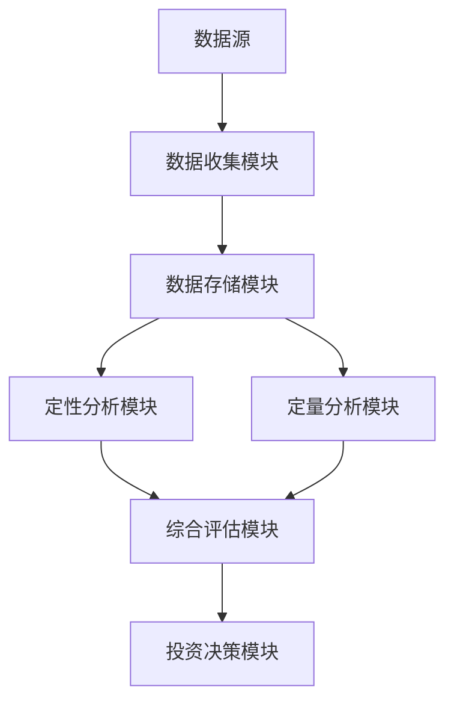

                 


# 巴菲特的投资方法论：定性分析与定量分析的结合

> 关键词：巴菲特，投资方法论，定性分析，定量分析，价值投资，安全边际

> 摘要：本文深入探讨了巴菲特的投资方法论，重点分析了其定性分析与定量分析的结合方式。通过详细讲解定性和定量分析的核心概念、数学模型、系统架构以及实际案例，本文展示了如何将这两种分析方法结合起来，实现更精准的投资决策。文章还总结了投资中的最佳实践和注意事项，为投资者提供了实用的指导。

---

## 第一部分: 巴菲特投资方法论的背景与核心理念

### 第1章: 巴菲特投资方法论的背景与核心理念

#### 1.1 巴菲特投资方法论的背景

在现代投资领域，传统的单一分析方法（如纯粹的定性分析或定量分析）往往难以应对复杂多变的市场环境。20世纪中期，沃伦·巴菲特提出了一种结合定性分析与定量分析的投资方法，这种方法不仅考虑企业的基本面，还注重其长期价值和安全边际。巴菲特的投资方法论一经提出，便迅速成为投资界的经典，被广泛应用于股票、基金和其他资产的投资决策中。

#### 1.2 巴菲特投资方法论的核心理念

巴菲特的投资方法论以价值投资为核心，强调寻找那些具有长期竞争优势、良好治理结构和稳定管理层的企业。其核心理念包括：

- **安全边际**：在投资时，确保买入价格低于企业的内在价值，以降低风险。
- **长期视角**：关注企业的长期价值，而非短期市场波动。
- **竞争优势**：寻找那些在行业内具有明显竞争优势的企业。
- **分散投资**：通过分散投资降低风险，同时集中投资于优质资产。

---

## 第二部分: 定性分析与定量分析的核心概念

### 第2章: 定性分析的核心要素

#### 2.1 企业的竞争优势分析

竞争优势是定性分析的重要组成部分。巴菲特认为，具有持续竞争优势的企业更有可能实现长期增长。竞争优势可以体现在以下几个方面：

- **成本优势**：企业在生产或运营过程中具有更低的成本，从而能够以更低的价格提供产品或服务。
- **品牌优势**：强大的品牌能够吸引更多的客户，并在价格竞争中占据优势。
- **技术优势**：拥有独特的技术或专利，能够保持产品的差异化。

#### 2.2 管理层的稳定性与能力

管理层的素质和稳定性是企业成功的关键因素之一。在定性分析中，需要评估：

- **管理层的稳定性**：管理层是否有频繁变动的历史，以及管理层在面对挑战时的应对能力。
- **管理层的能力**：管理层是否具备战略眼光和执行力，是否能够带领企业实现长期增长。

#### 2.3 公司治理与企业结构

良好的公司治理结构是企业长期稳定发展的基础。在定性分析中，需要关注：

- **股权结构**：是否存在控股股东，股权结构是否合理。
- **董事会结构**：董事会是否独立，是否具备监督和指导能力。
- **公司透明度**：企业是否透明，是否存在财务造假或其他不合规行为。

### 第3章: 定量分析的关键指标

#### 3.1 财务指标分析

财务指标是定量分析的核心内容。通过分析企业的财务报表，可以评估企业的盈利能力、成长能力和财务健康状况。

- **盈利能力**：通过净利润率、毛利率等指标评估企业的盈利能力。
- **成长能力**：通过收入增长率、净利润增长率等指标评估企业的成长能力。
- **财务健康状况**：通过资产负债率、流动比率等指标评估企业的财务健康状况。

#### 3.2 估值指标

估值指标用于评估企业的市场价值是否合理。常见的估值指标包括：

- **市盈率（P/E）**：股价除以每股净利润。
- **市净率（P/B）**：股价除以每股净资产。
- **市销率（P/S）**：股价除以每股营业收入。

#### 3.3 风险管理指标

风险管理指标用于评估企业的风险水平，包括：

- **波动率**：股票价格的波动程度。
- **贝塔系数**：衡量股票相对于市场的波动性。
- **信用评级**：企业债券的信用评级。

---

## 第三部分: 定性分析与定量分析的结合

### 第4章: 结合的必要性与优势

#### 4.1 结合的必要性

单一的定性或定量分析都存在一定的局限性。定性分析可以帮助投资者识别企业的竞争优势和潜在风险，但缺乏量化的依据；定量分析可以帮助投资者量化企业的价值，但可能忽视企业的基本面和长期发展潜力。因此，将定性分析与定量分析相结合，可以充分发挥两者的优势，提高投资决策的准确性和可靠性。

#### 4.2 结合的具体方法与步骤

- **确定分析目标**：明确投资目标和投资策略。
- **数据收集**：收集企业的财务数据、行业数据和市场数据。
- **初步分析**：分别进行定性和定量分析，识别潜在的投资机会。
- **综合评估**：结合定性和定量分析的结果，评估企业的内在价值和投资风险。
- **决策与调整**：根据综合评估结果，制定投资策略，并定期调整投资组合。

---

## 第四部分: 巴菲特投资方法的数学模型与公式

### 第5章: 数学模型与公式

#### 5.1 定量分析中的数学模型

- **多因子模型**：通过多个因子（如收益、市盈率、市净率等）对股票进行评分和排序。
- **价值评估模型**：通过现金流折现法（DCF）评估企业的内在价值。

#### 5.2 价值评估模型的公式

现金流折现法（DCF）的公式为：

$$
\text{企业价值} = \sum_{t=1}^{n} \frac{\text{现金流}}{(1 + r)^t} + \frac{\text{残值}}{(1 + r)^n}
$$

其中，$r$ 是折现率，$n$ 是预测的年数。

---

## 第五部分: 系统分析与架构设计

### 第6章: 系统分析与架构设计方案

#### 6.1 系统功能设计

- **数据收集模块**：收集企业的财务数据、行业数据和市场数据。
- **定性分析模块**：评估企业的竞争优势、管理层能力和公司治理。
- **定量分析模块**：计算企业的财务指标、估值指标和风险管理指标。
- **综合评估模块**：结合定性和定量分析的结果，评估企业的内在价值和投资风险。

#### 6.2 系统架构设计

系统架构图如下：



---

## 第六部分: 项目实战

### 第7章: 项目实战

#### 7.1 环境安装

- **工具安装**：安装Python、Pandas、NumPy等工具。
- **数据获取**：通过API或手动收集目标公司的财务数据。

#### 7.2 核心实现

```python
import pandas as pd
import numpy as np

# 假设df是企业的财务数据
def calculate_liquidity_ratio(df):
    current_assets = df['流动资产'].sum()
    current_liabilities = df['流动负债'].sum()
    return current_assets / current_liabilities

# 示例数据
data = {
    '流动资产': [100, 200, 300],
    '流动负债': [50, 100, 150],
    '净利润': [50, 70, 90],
    '营业收入': [200, 300, 400]
}
df = pd.DataFrame(data)

# 计算流动性比率
liquidity_ratio = calculate_liquidity_ratio(df)
print(f"流动性比率：{liquidity_ratio}")
```

---

## 第七部分: 最佳实践与总结

### 第8章: 最佳实践与总结

#### 8.1 投资中的注意事项

- **分散投资**：避免过度集中，降低风险。
- **长期视角**：关注企业的长期价值，避免短期波动的影响。
- **持续学习**：保持对市场和企业的关注，及时调整投资策略。

#### 8.2 投资中的小结

巴菲特的投资方法论是一种系统性的投资方法，它通过定性分析与定量分析的结合，帮助投资者识别具有长期竞争优势的企业，并以合理的价格进行投资。这种方法不仅能够提高投资的准确性，还能降低投资风险。

---

## 作者

作者：AI天才研究院/AI Genius Institute & 禅与计算机程序设计艺术 /Zen And The Art of Computer Programming

---

通过以上结构，我们可以清晰地看到，巴菲特的投资方法论是一个系统性的过程，它结合了定性和定量分析，帮助投资者做出更明智的投资决策。希望这篇文章能够为投资者提供有价值的指导和启发。

