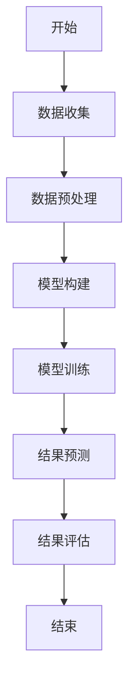
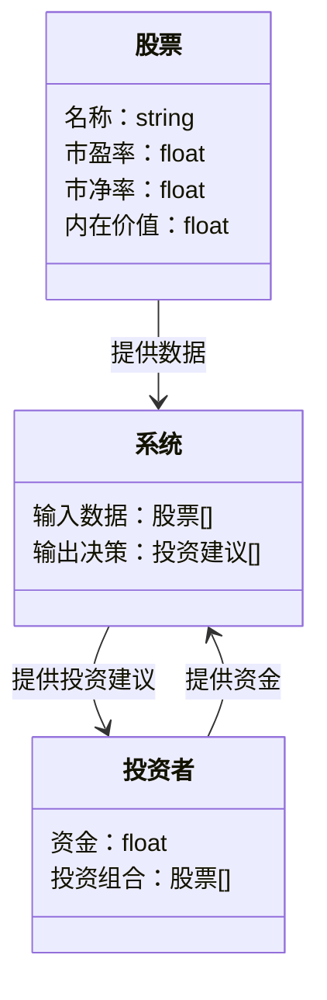
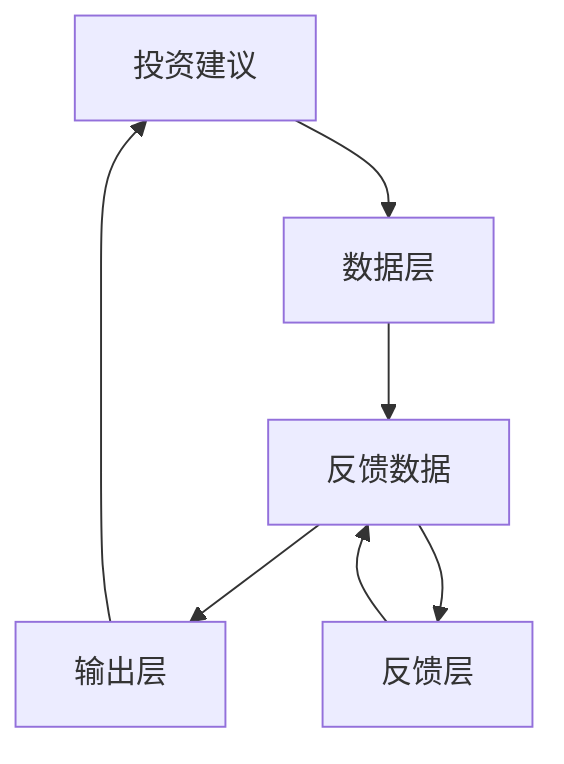

                 


# 巴菲特的投资清单：系统化决策的重要性

## 关键词：
- 系统化决策
- 巴菲特
- 投资策略
- 价值投资
- 内在价值计算

## 摘要：
本文探讨了巴菲特的投资理念及其系统化决策的重要性。通过分析巴菲特的价值投资策略、系统化决策的核心要素，以及数学模型的应用，展示了如何将投资决策转化为系统化的算法。文章从背景介绍、核心概念、算法原理、系统架构到项目实战，详细阐述了系统化决策在投资中的应用，为读者提供了一个全面的理解框架。

---

## 第一部分：投资决策的背景与重要性

### 第1章：投资决策的背景介绍

#### 1.1 投资决策的背景

- **投资的基本概念**：投资是通过购买资产以期获得未来收益的行为。资产可以是股票、债券、房地产等，投资的核心目标是实现财富的保值与增值。

- **投资决策的核心问题**：在投资过程中，决策者需要解决如何选择资产、何时买入卖出、如何分散风险等问题。这些问题的解决依赖于对市场、公司基本面和财务数据的深入分析。

- **投资决策的边界与外延**：投资决策不仅涉及单个资产的选择，还包括投资组合的构建和风险管理。外延则延伸到宏观经济分析、行业趋势研究等领域。

- **投资决策的概念结构与核心要素**：投资决策由目标、信息、模型、工具和反馈机制构成。目标是实现收益最大化，信息包括市场数据和财务报表，模型是决策的核心工具，工具包括数学模型和算法，反馈机制用于优化决策过程。

#### 1.2 系统化决策的重要性

- **传统投资决策的局限性**：传统决策往往依赖个人经验和主观判断，容易受到情绪影响，导致决策失误。非系统化决策难以应对复杂多变的市场环境。

- **系统化决策的优势**：系统化决策通过数学模型和算法，能够量化分析，减少人为情绪干扰，提高决策的准确性和一致性。

- **系统化决策的实现路径**：从数据收集、模型构建到结果预测，系统化决策需要结合技术工具和方法，如机器学习和大数据分析。

### 第2章：巴菲特的投资理念

#### 2.1 巴菲特的投资哲学

- **价值投资的核心思想**：价值投资强调寻找市场价格低于内在价值的资产。巴菲特认为，市场先生的情绪波动为理性投资者提供了低价买入的机会。

- **长期投资的重要性**：巴菲特倡导长期投资，认为短期市场波动不应影响长期投资决策。长期持有优质资产能够带来稳定的收益。

- **安全边际的概念**：安全边际是指资产的市场价格低于其内在价值的部分。通过预留安全边际，投资者能够降低风险，确保投资的稳健性。

#### 2.2 巴菲特的投资策略

- **股票选择的标准**：巴菲特注重企业的财务健康、竞争优势和管理团队。他倾向于投资那些具有持续盈利能力、强大护城河和优秀管理的公司。

- **财务报表分析的关键点**：通过分析资产负债表、利润表和现金流表，巴菲特重点关注企业的盈利能力、偿债能力和发展潜力。例如，他会计算ROE（净资产收益率）和现金流情况，以评估企业的盈利质量和可持续性。

- **行业分析与竞争优势**：巴菲特关注企业的行业地位和竞争优势。他倾向于投资那些在行业内具有领先地位，能够持续创新和适应市场变化的企业。

#### 2.3 巴菲特的投资案例分析

- **可口可乐的长期投资**：巴菲特投资可口可乐多年，因为该公司拥有强大的品牌影响力和稳定的现金流。可口可乐的高ROE和持续增长的现金流证明了其投资价值。

- **麦当劳的投资逻辑**：麦当劳的特许经营模式和全球扩张战略为巴菲特提供了稳定的收益。公司的财务健康和管理能力是其吸引巴菲特的关键因素。

- **苹果公司的投资决策**：巴菲特对苹果的投资基于其强大的创新能力和市场地位。苹果的高利润率和持续增长的现金流符合巴菲特的价值投资标准。

---

## 第二部分：系统化决策的核心概念与联系

### 第3章：系统化决策的原理

#### 3.1 系统化决策的定义与特征

- **系统化决策的定义**：系统化决策是指通过系统化的流程和工具，基于数据和模型进行决策的过程。它强调逻辑性和科学性，减少人为情绪的干扰。

- **系统化决策的特征对比表格**：
| 特征       | 非系统化决策               | 系统化决策               |
|------------|---------------------------|--------------------------|
| 数据来源   | 主观经验与市场直觉         | 结构化数据与数学模型     |
| 决策依据   | 情感与市场情绪             | 理性分析与定量指标       |
| 一致性     | 较低                      | 较高                     |
| 可重复性   | 较差                      | 较好                     |

- **系统化决策与非系统化决策的ER实体关系图**：
```mermaid
erDiagram
    actor 投资者 {
        <<投资者>>
        id : integer
        名称 : string
        资金 : float
    }
    actor 市场 {
        <<市场>>
        时间 : date
        股价 : float
        市盈率 : float
    }
    actor 决策系统 {
        <<决策系统>>
        输入数据 : data
        输出决策 : decision
    }
    投资者 --> 决策系统 : 提供资金
    市场 --> 决策系统 : 提供市场数据
    决策系统 --> 投资者 : 提供投资建议
```

#### 3.2 系统化决策的关键要素

- **数据输入**：包括市场数据、财务报表、行业分析等结构化数据。
- **决策模型**：构建数学模型，如贴现现金流模型，用于评估资产的内在价值。
- **输出结果**：生成投资建议，如买入、卖出或持有。
- **反馈机制**：根据实际结果优化模型，提高决策的准确性。

### 第4章：系统化决策的数学模型与算法

#### 4.1 投资决策的数学模型

- **贴现现金流模型**：
  $$ 内在价值 = \frac{现金流}{(1 + 贴现率)^n} $$
  该模型用于计算资产的内在价值，考虑了未来现金流的现值。

- **市盈率与市净率分析**：
  $$ 市盈率 = \frac{股价}{每股收益} $$
  $$ 市净率 = \frac{股价}{每股净资产} $$
  这些指标用于评估资产的估值是否合理。

#### 4.2 投资决策的算法流程



#### 4.3 算法实现的Python代码示例

```python
def calculate_intrinsic_value(cash_flow, discount_rate):
    """计算内在价值"""
    return sum(cash_flow / (1 + discount_rate) ** i for i in range(len(cash_flow)))

# 示例数据
cash_flow = [100, 120, 150, 200]  # 每年的现金流
discount_rate = 0.08  # 贴现率

intrinsic_value = calculate_intrinsic_value(cash_flow, discount_rate)
print(f"内在价值为：{intrinsic_value:.2f}")
```

### 第5章：系统分析与架构设计

#### 5.1 问题场景介绍

- **问题场景**：投资者需要基于系统化的决策模型选择投资标的，构建投资组合。

#### 5.2 系统功能设计

- **领域模型类图**：


- **系统架构设计**：


#### 5.3 系统接口设计

- **接口定义**：
  - 数据输入接口：接收市场数据和财务报表。
  - 模型调用接口：调用决策模型进行计算。
  - 结果输出接口：输出投资建议和风险提示。

---

## 第三部分：项目实战

### 第6章：项目实战

#### 6.1 环境安装

- **工具安装**：安装Python、Pandas、NumPy等库，用于数据处理和分析。
  ```bash
  pip install pandas numpy
  ```

#### 6.2 核心代码实现

- **内在价值计算**：
  ```python
  import pandas as pd
  import numpy as np

  def calculate_intrinsic_value(cash_flow, discount_rate):
      return np.npv(discount_rate, cash_flow)

  # 示例数据
  cash_flow = np.array([100, 120, 150, 200])
  discount_rate = 0.08

  iv = calculate_intrinsic_value(cash_flow, discount_rate)
  print(f"内在价值：{iv:.2f}")
  ```

- **投资组合优化**：
  ```python
  import pandas as pd
  import numpy as np

  def optimize_portfolio(returns):
      # 均值-方差优化
      mu = returns.mean()
      sigma = returns.cov()
      inv_sigma = np.linalg.inv(sigma)
      weights = inv_sigma @ mu
      weights = weights / weights.sum()
      return weights

  # 示例数据
  returns = pd.DataFrame({
      '股票A': [0.1, 0.2, 0.15, 0.08],
      '股票B': [0.15, 0.1, 0.2, 0.12],
      '股票C': [0.08, 0.12, 0.1, 0.2]
  })

  weights = optimize_portfolio(returns)
  print("最优权重：", weights)
  ```

#### 6.3 案例分析

- **案例分析**：假设我们有三只股票，分别为股票A、股票B和股票C，预期收益率分别为0.1、0.15和0.08。通过优化投资组合，我们可以找到最优的资产配置。

#### 6.4 代码应用解读与分析

- **代码解读**：上述代码通过计算内在价值和优化投资组合，展示了系统化决策在实际投资中的应用。内在价值计算用于评估资产的合理价格，而投资组合优化则帮助投资者在不同资产之间分配资金，以实现收益最大化和风险最小化。

---

## 第四部分：最佳实践

### 第7章：最佳实践

#### 7.1 小结

- **系统化决策的优势**：通过数学模型和算法，系统化决策能够提高投资决策的准确性和一致性，减少人为情绪的干扰。

#### 7.2 注意事项

- **数据质量**：确保数据的准确性和完整性，数据是模型的基础。
- **模型选择**：根据实际情况选择合适的模型，避免过度复杂化。
- **持续优化**：根据市场变化和实际结果，不断优化模型和策略。

#### 7.3 拓展阅读

- **推荐书籍**：《证券分析》（Benjamin Graham）：介绍价值投资的基本理论。
- **推荐文章**：巴菲特的股东信：深入分析其投资理念和策略。

---

## 作者

作者：AI天才研究院/AI Genius Institute & 禅与计算机程序设计艺术/Zen And The Art of Computer Programming

---

这篇博客详细探讨了巴菲特的投资理念，并将其转化为系统化决策的算法和模型。通过理论与实践相结合，展示了如何在投资决策中应用系统化的方法，帮助投资者做出更科学、更理性的决策。

