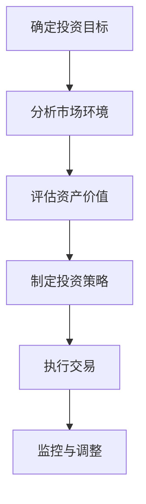
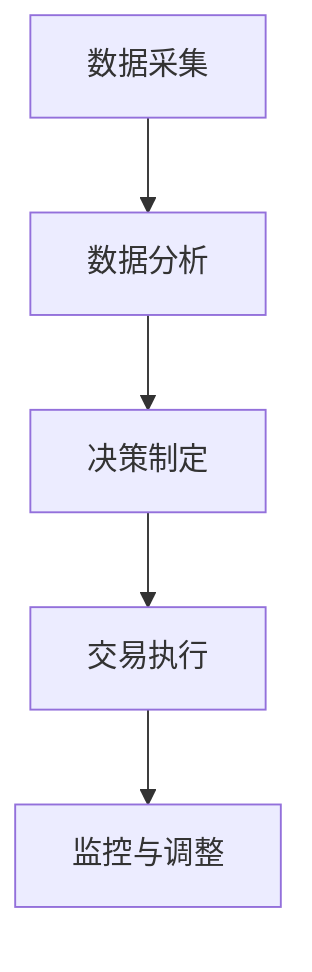
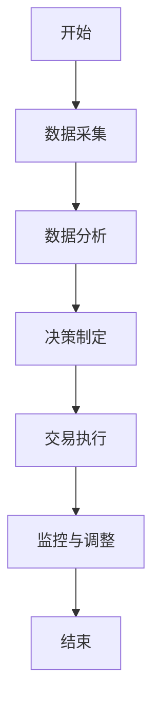

                 

# 巴菲特的投资纪律：耐心和自制的重要性

> 关键词：巴菲特、投资纪律、耐心、自制、长期投资、价值投资、风险管理

> 摘要：本文深入探讨了巴菲特的投资纪律，特别是耐心和自制在投资成功中的重要性。通过分析投资的基本概念、耐心与自制的核心概念、数学模型、系统架构、项目实战以及最佳实践，本文为读者提供了全面的理解和实用的指导。

---

## 第1章: 引言

### 1.1 投资的基本概念

#### 1.1.1 什么是投资
投资是指将资金投入到一个项目或资产中，期望在未来获得超过初始投入的收益。投资的本质是通过时间的推移和价值的创造，实现财富的增值。投资可以分为实物投资（如房地产、制造业）和金融投资（如股票、债券、基金等）。

#### 1.1.2 投资的类型与分类
投资的类型多种多样，主要包括以下几种：
- **股票投资**：购买公司股份，成为股东，分享公司收益。
- **债券投资**：购买政府或企业的债券，定期获得利息。
- **房地产投资**：购买土地或房产，通过租金或升值获利。
- **基金投资**：通过购买基金间接参与股票、债券等资产的投资。
- **外汇投资**：通过买卖不同货币，利用汇率波动获利。

#### 1.1.3 投资的基本原则
投资的基本原则包括：
- **分散投资**：避免将所有资金投入单一资产，降低风险。
- **长期投资**：耐心持有优质资产，避免频繁交易。
- **价值投资**：寻找具有长期竞争优势和良好管理的公司，以合理价格买入并长期持有。

---

### 1.2 巴菲特的投资哲学

#### 1.2.1 巴菲特的生平简介
沃伦·巴菲特（Warren Buffett）是世界上最著名的投资者之一，被誉为“股神”。他出生于1934年，早年通过投资和写作积累了巨大的财富。巴菲特的投资理念和哲学深刻影响了全球的投资领域。

#### 1.2.2 巴菲特的投资理念
巴菲特的投资理念可以总结为以下几点：
- **价值投资**：寻找那些具有持续竞争优势、良好管理和稳定收益的公司。
- **长期投资**：相信市场短期波动不可预测，但长期趋势可以通过基本面分析把握。
- **安全边际**：买入价格低于内在价值的资产，以确保投资的安全性。

#### 1.2.3 巴菲特的成功案例
巴菲特的成功案例包括：
- **购买报纸公司**：通过长期持有报纸公司，获得稳定的现金流。
- **投资可口可乐**：买入可口可乐的股票并长期持有，获得丰厚的回报。
- **伯克希尔哈撒韦公司**：通过控股公司，将多个优质企业整合，实现长期价值增长。

---

## 第2章: 耐心与自制的核心概念

### 2.1 耐心的定义与特征

#### 2.1.1 耐心的定义
耐心是指在面对不确定性和延迟回报时，保持冷静和持续行动的能力。在投资中，耐心意味着不因市场的短期波动而做出冲动决策。

#### 2.1.2 耐心的特征
耐心的特征包括：
- **长期视角**：关注资产的长期价值，而非短期价格波动。
- **坚持纪律**：在市场低迷时保持信心，避免恐慌性抛售。
- **持续学习**：不断优化自己的知识和技能，提升投资决策能力。

#### 2.1.3 耐心在投资中的重要性
耐心在投资中的重要性体现在：
- **避免短期损失**：市场波动可能导致短期亏损，耐心可以避免因恐慌卖出而锁定损失。
- **捕捉长期机会**：优质资产的价值可能在短期内被低估，耐心等待其价值回归。
- **提高决策质量**：耐心有助于投资者冷静分析，避免冲动决策。

---

### 2.2 自制的定义与特征

#### 2.2.1 自制的定义
自制是指在面对诱惑和压力时，能够控制自己的情绪和行为，做出理性的决策。在投资中，自制意味着不因市场的炒作和情绪波动而过度买入或卖出资产。

#### 2.2.2 自制的特征
自制的特征包括：
- **理性决策**：基于基本面分析，而非市场情绪做出投资决策。
- **抵制诱惑**：避免跟随市场潮流，坚持自己的投资策略。
- **严格纪律**：制定并遵守投资计划，避免随意更改。

#### 2.2.3 自制在投资中的重要性
自制在投资中的重要性体现在：
- **避免过度交易**：频繁买卖会增加交易成本，降低净收益。
- **减少亏损风险**：自制可以避免在市场高位追涨，减少潜在亏损。
- **提高投资纪律**：自制有助于坚持长期投资策略，避免短期偏离。

---

### 2.3 耐心与自制的内在联系

#### 2.3.1 耐心与自制的关系
耐心和自制是相辅相成的：
- **耐心是自制的基础**：没有耐心，投资者容易因市场的短期波动而失去自制。
- **自制是耐心的保障**：没有自制，投资者容易因市场的诱惑而失去耐心。

#### 2.3.2 耐心与自制的相互作用
耐心与自制的相互作用体现在：
- **耐心帮助投资者坚持长期策略**，而自制帮助投资者避免短期冲动。
- **两者结合**：使投资者能够在市场波动中保持冷静，做出理性的决策。

#### 2.3.3 耐心与自制的共同目标
耐心与自制的共同目标是：
- **实现长期投资成功**：通过耐心和自制，投资者能够抓住优质资产的长期价值，实现财富增值。
- **降低投资风险**：耐心和自制有助于避免过度交易和盲目跟风，降低投资风险。

---

## 第3章: 投资纪律的数学模型与算法原理

### 3.1 投资决策的逻辑框架

#### 3.1.1 投资决策的基本步骤
投资决策的基本步骤包括：
1. **确定投资目标**：明确投资目的、风险承受能力和收益预期。
2. **分析市场环境**：研究宏观经济、行业趋势和公司基本面。
3. **评估资产价值**：通过估值模型确定资产的内在价值。
4. **制定投资策略**：根据分析结果，制定买入、持有或卖出的策略。
5. **执行交易**：按照策略执行交易，记录投资过程。
6. **监控与调整**：定期评估投资组合的表现，调整策略以适应市场变化。

#### 3.1.2 投资决策的逻辑模型
投资决策的逻辑模型可以用以下步骤表示：

#### 3.1.3 投资决策的数学公式
以下是几个常用的数学公式：

- **内在价值公式**：
  $$ \text{内在价值} = \frac{\text{现金流}}{\text{贴现率}} $$
  其中，现金流是未来预期的现金流，贴现率是基于风险的折现率。

- **资产配置公式**：
  $$ w_i = \frac{A_i}{\sum A_i} $$
  其中，\( w_i \) 是第 \( i \) 种资产的权重，\( A_i \) 是第 \( i \) 种资产的金额。

---

### 3.2 耐心与自制的量化分析

#### 3.2.1 耐心的量化指标
耐心可以通过以下指标量化：
- **持有时间**：资产持有时间越长，耐心越强。
- **波动率容忍度**：投资者对资产价格波动的容忍度越高，耐心越强。

#### 3.2.2 自制的量化指标
自制可以通过以下指标量化：
- **交易频率**：交易次数越少，自制越强。
- **情绪影响指数**：投资者情绪对决策的影响程度越低，自制越强。

#### 3.2.3 耐心与自制的综合评估
耐心与自制的综合评估可以通过以下步骤进行：

1. **收集数据**：记录投资者的交易历史、持仓时间和情绪变化。
2. **分析数据**：计算交易频率、持仓时间和情绪影响指数。
3. **评估结果**：根据数据评估投资者的耐心和自制水平。

---

## 第4章: 投资决策的系统分析与架构设计

### 4.1 投资决策的系统架构

#### 4.1.1 系统架构的组成
投资决策系统的架构包括：
- **数据采集层**：收集市场数据、公司基本面和宏观经济指标。
- **数据分析层**：对数据进行清洗、分析和建模。
- **决策层**：基于分析结果制定投资策略。
- **执行层**：执行交易指令。
- **监控层**：实时监控投资组合的表现并进行调整。

#### 4.1.2 系统架构的模块划分
以下是系统架构的模块划分：

#### 4.1.3 系统架构的流程图
以下是系统架构的流程图：

---

### 4.2 投资决策的流程设计

#### 4.2.1 投资目标的确定
投资目标的确定包括：
1. **明确投资目的**：是追求资本增值还是稳定收益。
2. **评估风险承受能力**：根据自身财务状况和风险偏好确定风险承受能力。
3. **设定收益预期**：基于市场环境和资产特性设定合理的收益目标。

#### 4.2.2 投资策略的制定
投资策略的制定包括：
1. **资产配置**：根据投资目标和风险承受能力，确定资产的分配比例。
2. **选股策略**：选择具有长期竞争优势和良好管理的公司。
3. **风险管理**：制定风险控制措施，如设定止损点和分散投资。

#### 4.2.3 投资组合的优化
投资组合的优化包括：
1. **定期评估**：定期检查投资组合的表现，确保符合投资目标。
2. **调整策略**：根据市场变化和资产表现，调整投资策略。
3. **优化配置**：根据评估结果，优化资产配置和投资组合。

---

## 第5章: 项目实战：耐心与自制在投资中的应用

### 5.1 项目背景与目标

#### 5.1.1 项目背景
本项目旨在通过实际案例分析，展示耐心和自制在投资中的应用。我们选择一家具有长期竞争优势的公司，分析其投资价值，并制定长期投资策略。

#### 5.1.2 项目目标
项目目标包括：
1. **分析公司基本面**：研究公司的财务状况、行业地位和竞争优势。
2. **评估内在价值**：使用DCF模型评估公司的内在价值。
3. **制定投资策略**：基于分析结果，制定买入、持有和卖出的策略。

---

### 5.2 项目实施与分析

#### 5.2.1 项目实施步骤
项目实施步骤包括：
1. **数据收集**：收集公司过去5年的财务数据、行业报告和市场分析。
2. **数据分析**：使用DCF模型评估公司的内在价值。
3. **策略制定**：根据分析结果，制定投资策略。
4. **交易执行**：按照策略执行交易。
5. **监控与调整**：定期评估投资组合的表现，进行必要的调整。

#### 5.2.2 项目数据分析
以下是使用DCF模型进行公司内在价值评估的步骤：

1. **预测未来现金流**：根据公司历史业绩和行业趋势，预测未来5年的现金流。
2. **计算终值**：使用永续增长率计算终值。
3. **计算加权平均资本成本（WACC）**：作为贴现率。
4. **计算内在价值**：使用DCF公式计算公司股票的内在价值。

#### 5.2.3 项目结果分析
以下是DCF模型的计算公式：

$$ \text{内在价值} = \frac{\text{现金流}}{\text{贴现率}} $$

---

## 第6章: 最佳实践与小结

### 6.1 最佳实践

#### 6.1.1 投资纪律的实践
- **制定明确的投资计划**：包括投资目标、策略和时间表。
- **坚持长期投资**：避免因短期波动而改变策略。
- **保持耐心和自制**：在市场低迷时保持信心，避免恐慌性抛售。

#### 6.1.2 风险管理的实践
- **分散投资**：避免将所有资金投入单一资产。
- **设定止损点**：在市场下跌时及时止损，避免重大损失。
- **定期评估和调整**：根据市场变化和个人情况，及时调整投资组合。

---

### 6.2 小结

巴菲特的投资纪律强调耐心和自制的重要性。通过耐心等待优质资产的价值回归，和自制避免短期冲动决策，投资者可以实现长期的财富增值。本文通过背景介绍、核心概念、数学模型、系统架构和项目实战，全面探讨了耐心和自制在投资中的应用。

---

## 参考文献

1. 巴菲特股东大会演讲集。
2. 《巴菲特投资策略》。
3. 现代投资组合理论。

---

作者：AI天才研究院/AI Genius Institute & 禅与计算机程序设计艺术/Zen And The Art of Computer Programming

