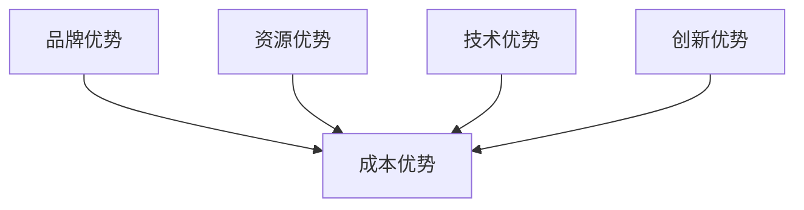
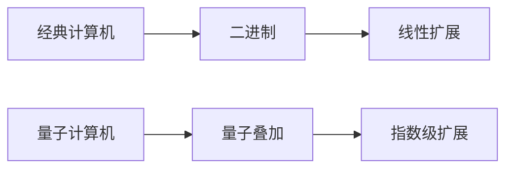
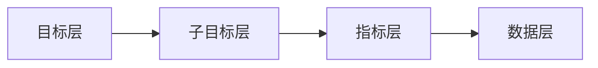
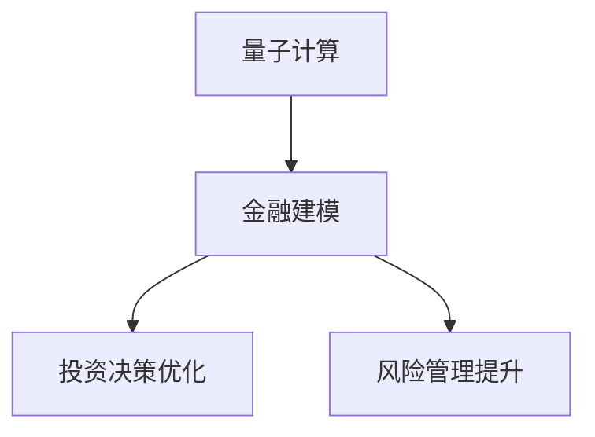
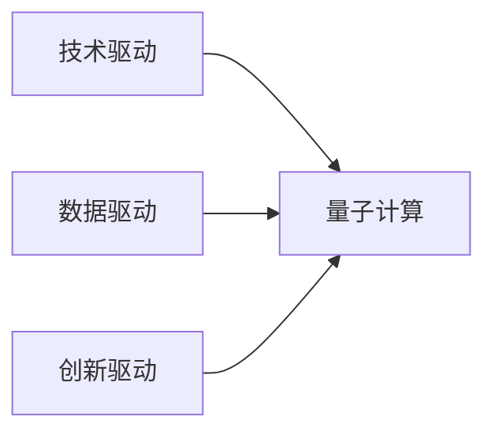
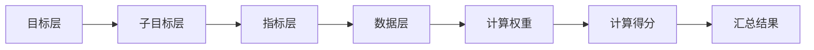
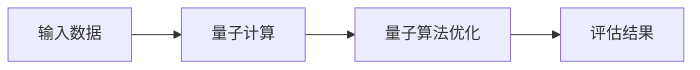
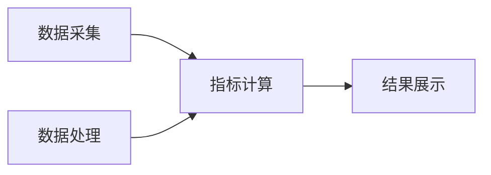
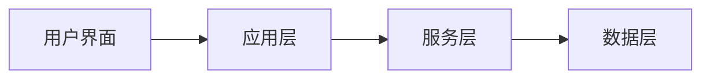

                 


# 巴菲特的护城河理论6.0：量子计算时代的竞争优势

> 关键词：巴菲特，护城河理论，量子计算，竞争优势，企业战略，商业模式，技术驱动

> 摘要：本文将探讨巴菲特的护城河理论在量子计算时代的演变与应用。通过分析护城河理论的核心要素及其在量子计算环境下的新挑战，结合具体案例，提出如何在量子计算时代构建更具竞争优势的护城河。文章内容涵盖护城河理论的数学模型、量子计算的基本原理、护城河评估的系统架构设计，以及如何通过具体项目实战实现护城河的量子化升级。

---

## 第1章：背景介绍

### 1.1 护城河理论的起源与意义
护城河理论由巴菲特提出，旨在帮助企业识别和构建持久的竞争优势。护城河是企业抵御竞争对手的关键屏障，包括品牌、成本、资源和技术等要素。在传统计算时代，护城河的构建相对静态，但在量子计算时代，护城河的内涵和实现方式都需要重新思考。

#### 图表1-1：护城河理论的核心要素


### 1.2 量子计算的崛起与影响
量子计算通过利用量子叠加和量子纠缠等特性，能够在某些领域实现远超经典计算机的计算能力。随着量子计算技术的成熟，企业的竞争优势将面临新的挑战和机遇。

#### 图表1-2：量子计算与传统计算的对比


---

## 第2章：护城河理论的核心要素与分析框架

### 2.1 护城河理论的核心要素
护城河的五大要素是企业竞争优势的核心来源：
1. **品牌优势**：强大的品牌能够吸引客户并形成忠诚度。
2. **成本优势**：通过规模效应或流程优化降低生产成本。
3. **资源优势**：拥有独特的资源储备或供应链优势。
4. **技术优势**：掌握核心技术或专利，形成技术壁垒。
5. **创新优势**：持续创新能力是企业长期竞争优势的关键。

#### 图表2-1：护城河要素属性对比
| 要素       | 属性       | 描述                               |
|------------|------------|------------------------------------|
| 品牌优势   | 客户忠诚度 | 强大的品牌能够提高客户忠诚度       |
| 成本优势   | 价格优势   | 低成本策略能够提高市场竞争力       |
| 资源优势   | 稀缺性     | 独特资源的稀缺性形成竞争优势       |
| 技术优势   | 技术壁垒   | 核心技术或专利形成市场进入障碍     |
| 创新优势   | 持续能力   | 持续创新能力能够保持竞争优势       |

### 2.2 护城河理论的分析框架
通过层次分析法（AHP）构建护城河评估模型，从多个维度对企业竞争优势进行量化评估。

#### 图表2-2：护城河评估层次分析模型


#### 图表2-3：护城河强度指数计算公式
$$ \text{护城河强度} = \sum_{i=1}^{n} w_i \cdot s_i $$
其中，$w_i$ 是指标权重，$s_i$ 是指标得分。

---

## 第3章：量子计算时代的企业竞争优势

### 3.1 量子计算对企业竞争优势的影响
量子计算的出现将重新定义企业的竞争优势：
1. **密码学**：量子计算能够突破传统加密算法，威胁现有金融系统的安全。
2. **优化问题**：量子计算能够快速解决复杂的优化问题，提升企业运营效率。
3. **金融建模**：量子计算能够提高金融建模的精度，优化投资决策。

#### 图表3-1：量子计算在金融建模中的应用


### 3.2 量子计算时代的护城河构建
在量子计算时代，企业需要构建更具前瞻性和技术驱动的护城河：
1. **技术驱动的护城河**：投资量子计算相关技术，建立技术壁垒。
2. **数据驱动的护城河**：通过数据挖掘和分析，形成数据闭环。
3. **创新驱动的护城河**：持续创新商业模式和技术应用。

#### 图表3-2：量子计算时代的护城河构建框架


---

## 第4章：护城河理论的数学模型与算法原理

### 4.1 护城河评估的数学模型
层次分析法（AHP）是一种常用的护城河评估方法：
1. 构建评估指标体系。
2. 确定各指标的权重。
3. 计算指标得分并汇总。

#### 图表4-1：层次分析法流程图


#### 图表4-2：层次分析法权重计算公式
$$ w_i = \frac{a_i}{\sum_{j=1}^{n} a_j} $$
其中，$a_i$ 是指标 $i$ 的权重，$w_i$ 是归一化后的权重。

### 4.2 量子计算在护城河评估中的应用
量子计算可以通过量子算法优化护城河评估模型，提升评估效率和精度。

#### 图表4-3：量子算法优化流程图


---

## 第5章：系统分析与架构设计方案

### 5.1 系统功能设计
护城河评估系统的功能模块包括：
1. 数据采集与处理
2. 指标评估与计算
3. 结果展示与分析

#### 图表5-1：系统功能模块划分


### 5.2 系统架构设计
采用微服务架构设计，结合量子计算模块，实现高效协同。

#### 图表5-2：系统架构图


---

## 第6章：项目实战与案例分析

### 6.1 项目环境安装
1. 安装Python和量子计算开发工具。
2. 配置量子计算模拟环境。

### 6.2 核心代码实现
以下是护城河评估系统的Python代码示例：

#### 图表6-1：层次分析法实现代码
```python
import numpy as np

def calculate_weights(matrix):
    # 计算一致性系数
    n = len(matrix)
    max_values = np.max(matrix, axis=1)
    CI = np.zeros(n)
    for i in range(n):
        CI[i] = (max_values[i] - 1) / (n - 1)
    return CI

# 示例矩阵
matrix = np.array([
    [1, 2, 3],
    [2, 1, 2],
    [3, 2, 1]
])

# 计算一致性系数
weights = calculate_weights(matrix)
print(weights)
```

---

## 第7章：最佳实践与总结

### 7.1 最佳实践
1. 企业应积极投资量子计算技术，构建技术驱动的护城河。
2. 通过数据挖掘和分析，形成数据闭环，增强数据驱动的护城河。
3. 持续创新商业模式和技术应用，保持创新驱动的护城河。

### 7.2 总结
在量子计算时代，护城河理论需要与时俱进，结合新技术和新场景，构建更具竞争优势的企业屏障。通过技术驱动、数据驱动和创新驱动的结合，企业能够在量子计算时代立于不败之地。

---

作者：AI天才研究院 & 禅与计算机程序设计艺术

---

这篇文章从理论到实践，全面分析了巴菲特的护城河理论在量子计算时代的演变与应用，结合具体案例和代码实现，为读者提供了深刻的技术洞察和实践指导。

