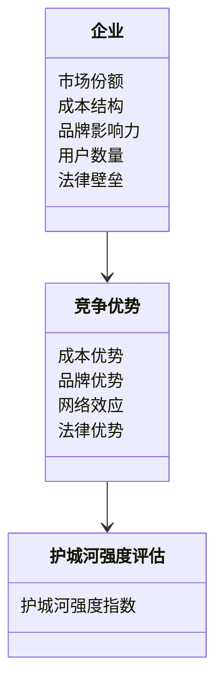
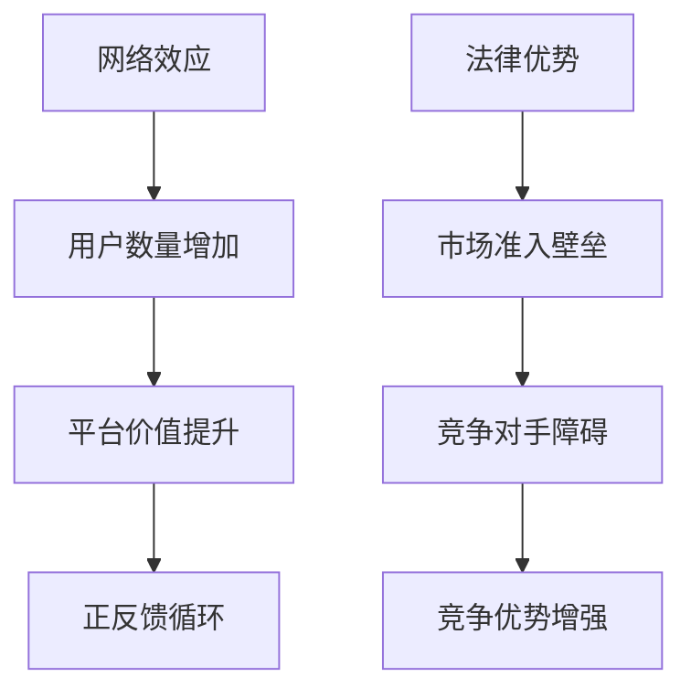

                 


# 巴菲特的护城河理论及其实际应用

## 关键词

- 投资理论，竞争优势，企业分析，巴菲特，护城河

## 摘要

本文深入探讨巴菲特的护城河理论，从理论背景到实际应用，结合技术分析方法，帮助企业识别和构建可持续的竞争优势。通过分析核心概念、算法模型、系统架构和项目案例，为企业投资和管理提供有效指导。

## 第一部分：护城河理论的背景与核心概念

### 第1章：护城河理论的起源与演变

#### 1.1 护城河理论的起源

- **1.1.1 巴菲特的投资理念**：介绍巴菲特的价值投资理念，强调长期稳定收益。
- **1.1.2 护城河理论的提出背景**：分析20世纪70年代企业竞争加剧的背景下，巴菲特提出护城河理论的原因。
- **1.1.3 理论的发展与演变**：探讨护城河理论在不同经济环境下的发展和应用。

#### 1.2 护城河理论的核心要素

- **1.2.1 成本优势**：解释企业如何通过规模经济或专有技术降低生产成本，形成竞争优势。
- **1.2.2 品牌优势**：分析强大品牌如何吸引客户，形成忠诚度，提升议价能力。
- **1.2.3 网络效应**：探讨用户数量增加如何导致网络价值提升，形成正反馈循环，增强企业竞争力。
- **1.2.4 法律与监管优势**：说明企业通过专利、许可证或行业监管获取的市场准入壁垒。

#### 1.3 护城河理论与其他投资理论的对比

- **1.3.1 基本分析与技术分析的差异**：比较基本面分析和技术分析在方法和目标上的区别。
- **1.3.2 护城河理论的独特性**：强调护城河理论在识别长期竞争优势方面的独特视角。
- **1.3.3 理论的适用范围与局限性**：分析护城河理论在不同行业和经济环境中的适用性和限制。

### 第2章：护城河的核心要素分析

#### 2.1 成本优势

- **2.1.1 成本优势的定义与特征**：定义成本优势，分析其与企业规模、技术、流程优化的关系。
- **2.1.2 成本优势的来源分析**：探讨企业如何通过技术创新、规模经济或专有技术降低成本。
- **2.1.3 成本优势的可持续性评估**：分析成本优势的稳定性，包括市场竞争和技术变革的影响。

#### 2.2 品牌优势

- **2.2.1 品牌优势的定义与特征**：定义品牌优势，分析品牌知名度、美誉度和忠诚度的影响。
- **2.2.2 品牌优势的构建过程**：详细说明品牌建设的步骤，包括市场定位、营销策略和用户体验。
- **2.2.3 品牌优势的维护策略**：探讨品牌维护的方法，如持续创新、客户反馈和危机管理。

#### 2.3 网络效应

- **2.3.1 网络效应的定义与特征**：定义网络效应，分析其与用户增长的关系。
- **2.3.2 网络效应的驱动因素**：探讨用户数量、用户互动频率和平台整合能力对网络效应的影响。
- **2.3.3 网络效应的典型案例分析**：分析社交媒体、在线市场和通信平台的网络效应。

#### 2.4 法律与监管优势

- **2.4.1 法律与监管优势的定义与特征**：定义法律与监管优势，分析其与市场准入、行业规范的关系。
- **2.4.2 法律与监管优势的获取途径**：探讨通过专利申请、许可证获取和行业标准制定获得竞争优势的方法。
- **2.4.3 法律与监管优势的风险与挑战**：分析政策变化、法律纠纷和监管合规的成本与风险。

### 第3章：护城河核心概念的联系与对比

#### 3.1 护城河核心要素的对比分析

- **3.1.1 成本优势与品牌优势的对比**：使用表格比较成本优势和品牌优势在定义、来源和影响方面的异同。
- **3.1.2 网络效应与法律优势的对比**：分析网络效应和法律优势在竞争优势中的作用和表现形式。

#### 3.2 护城河核心要素的联系

- **3.2.1 各要素之间的相互作用**：绘制mermaid图，展示成本优势、品牌优势、网络效应和法律优势之间的相互作用。
- **3.2.2 要素之间的协同效应**：分析要素协同对企业整体竞争优势的提升作用。

## 第二部分：护城河理论的算法原理与数学模型

### 第4章：护城河评估的算法原理

#### 4.1 护城河强度评估模型

- **4.1.1 模型的定义与目标**：定义护城河强度评估模型，目标是量化企业竞争优势的强弱。
- **4.1.2 模型的输入与输出**：输入包括企业市场份额、成本结构、品牌影响力等，输出为护城河强度指数。
- **4.1.3 模型的评估指标**：包括市场份额变化率、竞争优势强度、客户忠诚度等指标。

#### 4.2 护城河强度评估算法

- **4.2.1 算法流程图**：使用mermaid绘制算法流程图，展示数据收集、分析和评估的过程。
- **4.2.2 Python代码实现**：提供代码示例，解释如何计算护城河强度指数，包括数据预处理、特征提取和模型评估。

### 第5章：数学模型与公式

#### 5.1 护城河强度指数公式

- **5.1.1 公式推导**：详细推导护城河强度指数的计算公式，包括各个因素的权重分配。
- **5.1.2 公式应用案例**：通过具体案例说明如何应用公式计算企业的护城河强度指数。

## 第三部分：系统分析与架构设计方案

### 第6章：系统分析与架构设计

#### 6.1 问题场景介绍

- **6.1.1 企业竞争优势分析**：描述如何通过系统分析识别企业的竞争优势。
- **6.1.2 竞争对手分析**：探讨如何通过系统分析评估竞争对手的护城河。

#### 6.2 系统功能设计

- **6.2.1 领域模型设计**：绘制mermaid类图，展示企业、竞争优势、护城河要素之间的关系。
- **6.2.2 系统架构设计**：使用mermaid架构图展示系统的分层架构，包括数据层、业务逻辑层和用户界面层。

#### 6.3 系统接口设计

- **6.3.1 API接口设计**：描述如何通过API接口获取企业数据，进行护城河强度评估。
- **6.3.2 接口交互流程**：使用mermaid序列图展示用户与系统之间的交互流程。

## 第四部分：项目实战与案例分析

### 第7章：项目实战

#### 7.1 环境安装

- **7.1.1 系统要求**：列出运行系统的最低要求，包括操作系统、Python版本和依赖库。
- **7.1.2 安装步骤**：提供详细的安装指南，包括安装Python、Jupyter Notebook和相关库的步骤。

#### 7.2 核心代码实现

- **7.2.1 数据预处理代码**：展示如何清洗和处理企业数据，提取关键特征。
- **7.2.2 护城河强度评估代码**：提供Python代码，实现护城河强度指数的计算，包括数据加载、特征工程和模型评估。

#### 7.3 案例分析与解读

- **7.3.1 案例背景**：选择一个具体企业，如亚马逊，分析其护城河要素。
- **7.3.2 护城河强度评估结果**：展示计算结果，分析各要素对护城河强度的贡献。
- **7.3.3 实际案例分析**：详细解读案例，总结企业竞争优势的来源和表现。

## 第五部分：最佳实践与小结

### 第8章：最佳实践

#### 8.1 小结

- **8.1.1 主要内容回顾**：总结文章的主要内容，强调护城河理论的核心要素和算法模型。
- **8.1.2 理论与实践结合的重要性**：强调将护城河理论与实际投资或管理相结合的重要性。

#### 8.2 注意事项

- **8.2.1 数据质量的重要性**：提醒读者数据质量对评估结果的影响，确保数据准确性和完整性。
- **8.2.2 模型局限性**：分析护城河强度模型的局限性，如适用范围和动态变化的市场环境。
- **8.2.3 风险管理**：建议在实际应用中结合风险管理策略，降低投资风险。

#### 8.3 拓展阅读

- **8.3.1 推荐书籍**：推荐巴菲特和其他投资理论相关的书籍，如《聪明的投资者》。
- **8.3.2 相关文献**：推荐学术论文和研究报告，深入探讨护城河理论的应用和演变。

## 结语

通过本文的系统分析和实际案例，读者可以全面理解巴菲特的护城河理论，并在实际投资和管理中应用这些理论和方法，识别和构建企业的可持续竞争优势。

## 作者

作者：AI天才研究院 & 禅与计算机程序设计艺术

---

### 附录

**附录A：护城河强度指数计算公式**

$$
\text{护城河强度指数} = \sum_{i=1}^{n} w_i \times f_i
$$

其中，\(w_i\) 是第i个因素的权重，\(f_i\) 是第i个因素的特征值。

**附录B：Python代码示例**

```python
import pandas as pd
import numpy as np

# 加载数据
data = pd.read_csv('企业数据.csv')

# 数据预处理
data_clean = data.dropna()
data_clean = data_clean[~data_clean['行业'].str.contains('金融')]

# 提取特征
features = ['市场份额', '成本优势', '品牌优势', '网络效应', '法律优势']
target = '护城河强度'

# 计算护城河强度指数
data_clean['护城河强度'] = np.zeros(len(data_clean))
for i in range(len(data_clean)):
    # 权重分配
    weights = [0.3, 0.2, 0.2, 0.2, 0.1]
    # 特征值标准化
    normalized_features = data_clean[features].iloc[i] / data_clean[features].max()
    # 计算强度
    intensity = sum([weights[j] * normalized_features[j] for j in range(len(weights))])
    data_clean.loc[i, '护城河强度'] = intensity

# 可视化
import matplotlib.pyplot as plt
data_clean[['护城河强度']].hist(bins=10)
plt.show()
```

**附录C：护城河要素对比表格**

| 要素         | 定义与特征                          | 优势来源            | 持续性评估    |
|--------------|-----------------------------------|---------------------|--------------|
| 成本优势     | 通过低成本生产或采购获得优势      | 规模经济、专有技术  | 较高          |
| 品牌优势     | 强大品牌带来的客户忠诚度和定价权    | 品牌知名度、美誉度  | 较高          |
| 网络效应     | 用户数量增加带来的价值提升          | 用户基数、互动频率  | 高（正反馈）  |
| 法律与监管优势 | 通过法律和监管壁垒获取竞争优势    | 专利、许可证        | 较高          |

**附录D：mermaid图表**

#### 领域模型类图



#### 网络效应与法律优势对比图



---

通过本文的系统分析和实际案例，读者可以全面理解巴菲特的护城河理论，并在实际投资和管理中应用这些理论和方法，识别和构建企业的可持续竞争优势。

