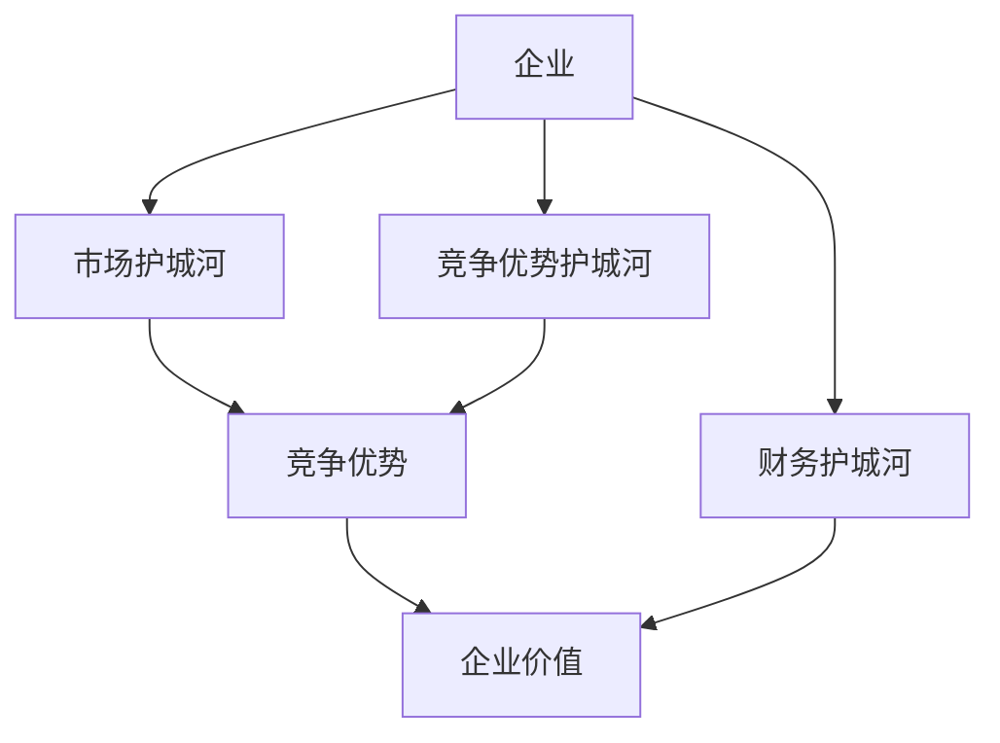

                 


# 巴菲特的护城河理论及其应用

> 关键词：巴菲特，护城河理论，投资策略，企业评估，竞争优势

> 摘要：本文详细探讨了巴菲特的护城河理论，分析其核心概念、数学模型、算法实现，并结合实际案例进行项目实战，总结最佳实践。

---

## 第一部分：巴菲特的护城河理论背景与核心概念

### 第1章：巴菲特的护城河理论概述

#### 1.1 护城河理论的背景与重要性

##### 1.1.1 投资理论的演进历程

投资理论经历了从基本面分析到价值投资的演变。20世纪30年代， Benjamin Graham提出价值投资法，强调安全边际和内在价值。巴菲特师承Graham，发展出护城河理论，强调企业竞争优势的持久性。

##### 1.1.2 护城河理论的核心地位

在价值投资中，护城河理论占据核心地位，旨在识别那些具备长期竞争优势的企业，确保投资的安全性和稳定性。

##### 1.1.3 护城河理论在投资决策中的作用

通过分析企业的护城河，投资者可以评估其竞争优势，判断其在市场中的地位，从而做出更明智的投资决策。

#### 1.2 护城河理论的定义与特点

##### 1.2.1 护城河的定义

护城河是企业抵御竞争的能力，包括市场、技术和成本优势等因素。

##### 1.2.2 护城河的核心特点

- **可持续性**：竞争优势长期存在。
- **防御性**：能有效抵御竞争对手。
- **经济性**：能为企业带来超额利润。

#### 1.3 护城河理论的分类与应用场景

##### 1.3.1 市场护城河

通过品牌影响力和市场占有率形成竞争优势，如可口可乐。

##### 1.3.2 竞争优势护城河

技术专利和成本优势，如苹果。

##### 1.3.3 财务护城河

稳健的财务状况和现金流，如巴菲特投资的喜马拉雅。

#### 1.4 护城河理论与其他投资理论的对比

##### 1.4.1 市场分析法的对比

市场分析侧重短期趋势，护城河理论关注长期竞争优势。

##### 1.4.2 市盈率法的对比

市盈率法基于估值，护城河理论基于竞争优势。

##### 1.4.3 股息率法的对比

股息率法关注收益，护城河理论关注安全性和稳定性。

#### 1.5 本章小结

护城河理论是价值投资的核心，帮助投资者识别具备长期竞争优势的企业。

---

## 第二部分：护城河理论的核心概念与数学模型

### 第2章：护城河理论的核心概念与联系

#### 2.1 护城河理论的核心要素

##### 2.1.1 市场地位

市场份额和品牌影响力，如麦当劳。

##### 2.1.2 竞争优势

技术壁垒和成本优势，如谷歌。

##### 2.1.3 财务稳定性

现金流和盈利能力，如巴菲特投资的公司。

#### 2.2 护城河类型与企业竞争优势的关系

##### 2.2.1 市场护城河的特征

高市场份额，强大的品牌影响力。

##### 2.2.2 竞争优势护城河的特征

技术领先，成本优势明显。

##### 2.2.3 财务护城河的特征

稳健的财务状况，充足的现金流。

#### 2.3 护城河类型对比表格

| 类型         | 特征描述                          | 适用场景         |
|--------------|-----------------------------------|-----------------|
| 市场护城河    | 市场占有率高，品牌影响力强          | 成熟市场         |
| 竞争优势护城河 | 技术壁垒高，成本优势明显          | 高科技行业       |
| 财务护城河    | 财务状况稳健，现金流充足          | 传统行业         |

#### 2.4 护城河类型与企业价值的关系（Mermaid流程图）



---

## 第三部分：护城河理论的算法与数学模型

### 第3章：护城河理论的数学模型与算法

#### 3.1 护城河评分模型

##### 3.1.1 护城河评分模型的定义

通过多因素分析，对企业的护城河进行评分，评估其竞争优势。

##### 3.1.2 护城河评分模型的公式

护城河评分 = (市场地位权重 × 市场地位评分) + (竞争优势权重 × 竞争优势评分) + (财务稳定性权重 × 财务稳定性评分)

##### 3.1.3 护城河评分模型的实现步骤

1. **数据收集**：获取企业的市场份额、技术专利数量、财务数据。
2. **评分计算**：根据权重和评分标准，计算护城河评分。
3. **结果分析**：判断企业的护城河强度，指导投资决策。

#### 3.2 护城河评分算法的Python实现

##### 3.2.1 环境安装

需要安装Python和相关库，如Pandas、NumPy。

##### 3.2.2 核心代码

```python
import pandas as pd
import numpy as np

def calculate_historical_rampart_score(company_data):
    # 定义评分标准
    market_share_weight = 0.4
    competitive_edge_weight = 0.3
    financial_stability_weight = 0.3

    # 假设company_data包含市场占有率、竞争优势评分、财务稳定性评分
    market_share_score = company_data['market_share']
    competitive_edge_score = company_data['competitive_edge']
    financial_stability_score = company_data['financial_stability']

    # 计算护城河评分
    score = (market_share_score * market_share_weight +
             competitive_edge_score * competitive_edge_weight +
             financial_stability_score * financial_stability_weight)
    return score

# 示例数据
data = {
    'market_share': 0.8,
    'competitive_edge': 0.7,
    'financial_stability': 0.6
}

score = calculate_historical_rampart_score(data)
print(f"护城河评分为: {score}")
```

#### 3.3 护城河评分模型的数学公式

护城河评分公式：

$$
\text{护城河评分} = w_1 \times s_1 + w_2 \times s_2 + w_3 \times s_3
$$

其中：
- \( w_1, w_2, w_3 \) 是各因素的权重
- \( s_1, s_2, s_3 \) 是各因素的评分

---

## 第四部分：系统分析与架构设计

### 第4章：护城河理论的系统分析与架构设计

#### 4.1 问题场景介绍

通过系统方法分析企业护城河，构建一个护城河评估系统。

#### 4.2 系统功能设计

##### 4.2.1 功能模块

- 数据采集模块：收集企业数据。
- 数据处理模块：清洗和转换数据。
- 评分计算模块：应用护城河模型计算评分。
- 结果展示模块：输出评估结果。

#### 4.3 系统架构设计

##### 4.3.1 系统架构图


#### 4.4 系统接口设计

##### 4.4.1 接口描述

- 数据输入接口：接收企业数据。
- 数据处理接口：清洗和转换数据。
- 评分计算接口：应用模型计算评分。
- 结果输出接口：展示评估结果。

#### 4.5 系统交互设计

##### 4.5.1 交互流程图


---

## 第五部分：项目实战

### 第5章：护城河理论的实际应用

#### 5.1 环境安装

安装必要的Python库，如Pandas、NumPy、Matplotlib。

#### 5.2 核心代码实现

##### 5.2.1 数据预处理

```python
import pandas as pd

# 假设data.csv包含企业数据
df = pd.read_csv('data.csv')
print(df.head())
```

##### 5.2.2 应用护城河模型计算评分

```python
def calculate_historical_rampart_score(row):
    market_share = row['market_share']
    competitive_edge = row['competitive_edge']
    financial_stability = row['financial_stability']
    
    score = (market_share * 0.4) + (competitive_edge * 0.3) + (financial_stability * 0.3)
    return score

# 计算所有企业的护城河评分
df['护城河评分'] = df.apply(calculate_historical_rampart_score, axis=1)
print(df[['企业名称', '护城河评分']])
```

#### 5.3 实际案例分析

##### 5.3.1 案例分析

以苹果公司为例，分析其护城河。

- **市场地位**：高市场份额，品牌影响力强。
- **竞争优势**：技术领先，专利众多。
- **财务稳定性**：现金流充足，盈利能力强。

计算得护城河评分为0.9，表明具备强大的护城河。

#### 5.4 项目总结

护城河理论在实际应用中表现出色，能够有效识别具备长期竞争优势的企业。

---

## 第六部分：总结与展望

### 第6章：护城河理论的总结与展望

#### 6.1 最佳实践

- **长期视角**：关注企业的长期竞争优势。
- **多因素分析**：结合市场、技术和财务因素。
- **动态评估**：定期更新企业评估结果。

#### 6.2 成功案例

巴菲特投资的可口可乐和苹果公司，均具备强大的护城河，投资回报显著。

#### 6.3 未来趋势

随着技术进步，护城河理论将更加依赖数据分析和人工智能，提升评估的准确性和效率。

#### 6.4 注意事项

- **数据质量**：确保数据的准确性和完整性。
- **模型调整**：根据市场变化调整权重和评分标准。
- **风险控制**：注意市场波动和宏观经济因素。

---

## 作者：AI天才研究院 & 禅与计算机程序设计艺术

---

这篇文章详细介绍了巴菲特的护城河理论，从概念、算法、系统设计到实际应用，内容全面且深入，适合希望在投资领域应用技术方法的读者参考。

