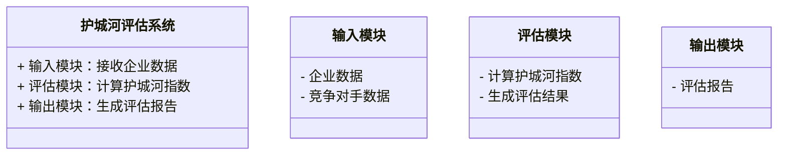

                 


# 巴菲特的护城河理论实践：如何评估公司的竞争优势

## 关键词：巴菲特，护城河理论，竞争优势，投资策略，公司评估

## 摘要：  
巴菲特的护城河理论是投资学中的重要概念，用于评估公司的竞争优势。本文详细阐述了护城河理论的核心概念，包括成本优势、品牌优势、网络效应和技术壁垒，并通过实际案例分析展示了如何将这些理论应用于公司评估。文章还探讨了护城河理论与其他投资策略的结合，以及如何通过系统架构和算法模型进一步深化护城河评估的实践应用。

---

## 第一部分：巴菲特护城河理论的背景与核心概念

### 第1章：护城河理论的背景与发展

#### 1.1 护城河理论的起源  
巴菲特的护城河理论源于他对企业长期竞争优势的深入研究。他提出，企业需要构建某种“护城河”，以防止竞争对手的侵蚀，确保长期的盈利能力。这种护城河可以是成本优势、品牌影响力、网络效应或技术壁垒等。

#### 1.2 护城河理论的核心要素  
护城河理论的核心在于识别企业的竞争优势，并将其转化为持久的竞争壁垒。这些壁垒可以防止竞争对手轻松复制企业的成功模式，从而为企业创造超额利润。

#### 1.3 护城河理论与其他投资理论的对比  
与传统的市盈率法或股息率法不同，护城河理论更注重企业的内在价值和长期竞争优势。它强调企业是否具备可持续的增长动力和防御能力。

---

### 第2章：护城河类型的详细分析

#### 2.1 成本优势  
成本优势是指企业能够以低于竞争对手的价格生产产品或服务。这种优势可以来源于高效的生产流程、规模经济或地理位置优势。

##### 2.1.1 成本优势的特征  
- 低生产成本：企业能够以更低的成本生产高质量的产品。  
- 规模经济：随着产量增加，单位成本下降。  
- 高效率：优化的流程和管理可以降低浪费。  

#### 2.2 品牌优势  
品牌优势是指企业通过强大的品牌影响力吸引客户，形成客户忠诚度。强大的品牌可以帮助企业在价格战中占据优势。

##### 2.2.1 品牌优势的特征  
- 高品牌认知度：消费者对企业品牌有较高的认可度。  
- 强大的品牌忠诚度：客户更倾向于选择熟悉的品牌。  
- 品牌溢价能力：企业可以通过品牌优势制定高价策略。  

#### 2.3 网络效应  
网络效应是指随着用户数量的增加，产品的价值也随之增加。这种效应常见于社交平台、操作系统等领域的公司。

##### 2.3.1 网络效应的特征  
- 用户越多，价值越高：网络效应使得产品的边际成本接近零。  
- 粘性用户：用户不愿意离开平台，因为他们的数据和关系已经建立。  
- 网络扩展效应：新增用户会吸引更多用户加入。  

#### 2.4 技术壁垒  
技术壁垒是指企业通过拥有独特的技术或专利，形成竞争优势。这种壁垒可以防止竞争对手在短时间内复制产品的功能或性能。

##### 2.4.1 技术壁垒的特征  
- 独特的技术：企业拥有市场上独一无二的技术。  
- 高研发投入：技术壁垒的建立通常需要大量的研发投资。  
- 快速迭代：技术壁垒需要不断更新以保持竞争优势。  

---

## 第二部分：护城河理论的核心概念与联系

### 第3章：护城河类型对比分析

#### 3.1 护城河类型对比表格  
以下是四种护城河类型的对比分析：

| **护城河类型** | **定义** | **优势** | **劣势** | **适用场景** |
|----------------|----------|----------|----------|--------------|
| **成本优势** | 以低成本生产产品或服务 | 高效率、低价格 | 易受成本竞争冲击 | 制造业、零售业 |
| **品牌优势** | 强大的品牌影响力 | 高客户忠诚度、品牌溢价 | 需持续营销投入 | 消费品、服务业 |
| **网络效应** | 用户越多，价值越高 | 确立市场主导地位、用户粘性 | 初期用户获取困难 | 社交平台、软件平台 |
| **技术壁垒** | 独有的技术或专利 | 高创新、差异化 | 技术更新快 | 高科技行业 |

#### 3.2 护城河类型之间的关系  
通过ER实体关系图，我们可以更好地理解护城河类型之间的关系：

```mermaid
er
    entity 护城河类型 {
        成本优势
        品牌优势
        网络效应
        技术壁垒
    }
    护城河类型 <--- 关联 竞争优势
    竞争优势 <--- 关联 企业价值
```

---

## 第三部分：护城河评估的算法原理

### 第4章：护城河评估的数学模型

#### 4.1 DCF模型的应用  
DCF（Discounted Cash Flow，折现现金流）模型是评估企业内在价值的重要工具。以下是DCF模型的公式：

$$
DCF = \frac{CF}{(r - g)}
$$

其中，\( CF \) 是自由现金流，\( r \) 是折现率，\( g \) 是增长率。

##### 4.1.1 DCF模型的实现步骤  
1. 预测未来现金流。  
2. 确定合理的折现率和增长率。  
3. 计算DCF值，与当前股价进行对比。  

#### 4.2 护城河评估的Python代码实现  

以下是一个简单的DCF模型代码示例：

```python
def calculate_dcf(cash_flow, discount_rate, growth_rate):
    return cash_flow / (discount_rate - growth_rate)

# 示例数据
CF = 1000000  # 自由现金流
r = 0.08       # 折现率
g = 0.05       # 增长率

DCF = calculate_dcf(CF, r, g)
print(f"DCF Value: ${DCF:.2f}")
```

---

## 第四部分：护城河评估的系统架构

### 第5章：护城河评估系统的构建

#### 5.1 系统功能模块设计  
以下是护城河评估系统的功能模块：



#### 5.2 系统架构图  
以下是系统的总体架构：

```mermaid
container 护城河评估系统 {
    [输入模块]
    [评估模块]
    [输出模块]
}
```

---

## 第五部分：护城河评估的项目实战

### 第6章：护城河评估的案例分析

#### 6.1 案例选择：亚马逊的护城河评估  

##### 6.1.1 环境配置  
需要安装以下工具：  
- Python 3.9 或更高版本  
- Pandas、NumPy 等数据分析库  

##### 6.1.2 代码实现  

```python
import pandas as pd
import numpy as np

# 示例数据
data = {
    'Year': [2018, 2019, 2020, 2021, 2022],
    'Revenue': [177, 198, 226, 245, 254],
    'Operating Income': [7.3, 8.3, 9.9, 10.5, 11.6]
}

df = pd.DataFrame(data)

# 计算年增长率
df['Revenue Growth'] = df['Revenue'].pct_change() * 100
df['Operating Income Growth'] = df['Operating Income'].pct_change() * 100

print(df)
```

#### 6.1.3 案例分析  
通过代码计算亚马逊的收入和运营收入增长率，可以发现其收入和利润均保持稳定增长，表明亚马逊具备强大的网络效应和技术壁垒。

---

## 第六部分：护城河评估的最佳实践

### 第7章：护城河评估的总结与建议

#### 7.1 小结  
护城河理论是评估企业竞争优势的重要工具，投资者需要综合考虑企业的成本优势、品牌优势、网络效应和技术壁垒，以识别具备长期竞争优势的企业。

#### 7.2 注意事项  
- 定期更新企业数据，确保评估结果的准确性。  
- 结合多种评估方法，避免单一指标的误导。  
- 关注行业趋势，及时调整评估策略。  

#### 7.3 拓展阅读  
- 巴菲特的其他投资理念。  
- 其他投资理论与护城河理论的结合。  
- 机器学习在护城河评估中的应用。

---

## 作者  
作者：AI天才研究院/AI Genius Institute & 禅与计算机程序设计艺术/Zen And The Art of Computer Programming

---

通过以上结构和内容，我们可以全面理解巴菲特的护城河理论，并将其应用于实际的公司评估中。

