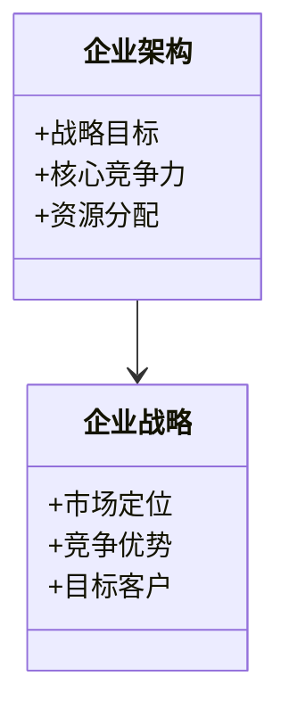
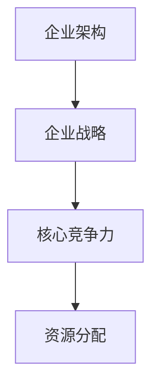

                 


# 巴菲特的护城河理论：寻找持久竞争优势

## 关键词：
- 投资哲学, 护城河理论, 经济竞争优势, 企业战略, 财务分析

## 摘要：
本文深入探讨巴菲特的护城河理论，分析企业如何建立持久的竞争优势。通过数学模型和系统架构设计，结合实际案例，详细阐述护城河的构建方法，帮助读者在投资和企业管理中找到持久的竞争优势。

---

# 第一部分: 巴菲特的护城河理论概述

## 第1章: 巴菲特投资理念与护城河理论的起源

### 1.1 巴菲特的投资哲学

#### 1.1.1 价值投资的定义与核心理念
- 价值投资：寻找市场低估的优质企业，长期持有。
- 核心理念：企业内在价值决定投资价值。

#### 1.1.2 护城河理论的提出背景
- 巴菲特通过分析企业竞争优势，提出护城河理论。
- 护城河：企业难以被竞争对手复制的核心优势。

#### 1.1.3 护城河理论的核心思想
- 企业应具备持久的竞争优势，确保长期盈利能力。

---

## 第2章: 护城河理论的核心概念与特征

### 2.1 护城河的定义与分类

#### 2.1.1 护城河的定义
- 护城河：企业抵御竞争的核心能力，确保长期竞争优势。

#### 2.1.2 护城河的主要类型
| 类型       | 描述                     |
|------------|--------------------------|
| 经济型     | 成本优势或价格优势       |
| 资源型     | 独特资源或专利           |
| 网络效应型  | 用户越多，价值越高       |
| 品牌型     | 强大品牌影响力             |

#### 2.1.3 护城河的动态性与可持续性
- 动态性：随市场变化而调整。
- 可持续性：长期保持竞争优势。

### 2.2 护城河的核心要素

#### 2.2.1 市场地位
- 市场占有率高，具备定价权。

#### 2.2.2 成本优势
- 通过规模经济或工艺优化降低生产成本。

#### 2.2.3 产品差异化
- 提供独特的产品或服务，满足特定市场需求。

#### 2.2.4 网络效应
- 用户数量增加，系统价值提升。

#### 2.2.5 规模经济
- 规模越大，单位成本越低。

---

## 第3章: 护城河的数学模型与分析

### 3.1 护城河的评估模型

#### 3.1.1 护城河深度的衡量
- 公式：$$H_{depth} = \frac{C}{M}$$
  - H_depth：护城河深度。
  - C：企业竞争优势。
  - M：市场竞争程度。

#### 3.1.2 护城河宽度的计算
- 公式：$$H_{width} = \frac{R}{S}$$
  - H_width：护城河宽度。
  - R：企业收入。
  - S：行业平均收入。

#### 3.1.3 护城河可持续性的预测
- 公式：$$H_{sustain} = \frac{GDP}{T}$$
  - H_sustain：护城河可持续性。
  - GDP：国内生产总值。
  - T：技术进步速度。

### 3.2 护城河的动态分析

#### 3.2.1 护城河深度的动态变化
- 公式：$$\Delta H_{depth} = H_{depth}(t+1) - H_{depth}(t)$$
  - ΔH_depth：护城河深度的变化量。

---

## 第4章: 经济型护城河的构建与分析

### 4.1 成本优势的构建

#### 4.1.1 规模经济的实现
- 提高生产效率，降低单位成本。

#### 4.1.2 工艺优化的实施
- 持续改进生产流程，减少浪费。

#### 4.1.3 供应链管理的优化
- 建立稳定的供应商关系，确保原材料供应。

### 4.2 价格优势的实现

#### 4.2.1 价格领导地位的建立
- 通过成本优势制定低于行业平均的价格。

#### 4.2.2 价格弹性分析
- 公式：$$E = \frac{\%ΔQ}{%ΔP}$$
  - E：价格弹性。
  - ΔQ：需求量变化。
  - ΔP：价格变化。

---

## 第5章: 资源型护城河的构建与分析

### 5.1 独特资源的获取与

---

# 第二部分: 护城河的构建与分析

## 第6章: 网络效应型护城河的构建与分析

### 6.1 网络效应的实现

#### 6.1.1 用户数量的增加
- 提高用户参与度，增强网络效应。

#### 6.1.2 服务的扩展
- 提供更多的功能和服务，吸引更多用户。

### 6.2 网络效应的分析

#### 6.2.1 网络效应的正反馈循环
- 用户越多，价值越高，吸引更多用户。

#### 6.2.2 网络效应的风险
- 过度依赖用户数量，可能导致市场饱和。

---

## 第7章: 品牌型护城河的构建与分析

### 7.1 强大品牌的建立

#### 7.1.1 品牌知名度的提升
- 通过广告和市场推广提升品牌知名度。

#### 7.1.2 品牌忠诚度的培养
- 提供优质产品和服务，增强用户忠诚度。

### 7.2 品牌的维护

#### 7.2.1 品牌形象管理
- 确保品牌形象与企业价值观一致。

#### 7.2.2 品牌危机管理
- 建立危机应对机制，减少品牌损失。

---

## 第8章: 护城河的系统架构设计

### 8.1 问题场景介绍

#### 8.1.1 企业战略规划
- 明确企业长期目标，制定发展战略。

#### 8.1.2 企业架构设计
- 设计企业架构，确保各部分协同工作。

### 8.2 系统功能设计

#### 8.2.1 领域模型设计
- 使用Mermaid绘制领域模型类图。



### 8.3 系统架构设计

#### 8.3.1 系统架构设计
- 使用Mermaid绘制系统架构图。



---

## 第9章: 项目实战

### 9.1 环境安装

#### 9.1.1 安装Python
- 使用Anaconda安装Python环境。

### 9.2 核心实现

#### 9.2.1 财务指标分析
- 使用Python编写代码，计算企业竞争优势。

```python
import pandas as pd
import numpy as np

# 示例数据
data = {'收入': [100, 200, 150, 250],
        '成本': [50, 100, 75, 125]}
df = pd.DataFrame(data)

# 计算竞争优势
df['竞争优势'] = df['收入'] - df['成本']

print(df)
```

---

## 第10章: 最佳实践与小结

### 10.1 最佳实践

#### 10.1.1 定期评估护城河
- 定期检查竞争优势的变化。

#### 10.1.2 持续优化
- 根据市场变化，不断优化护城河。

### 10.2 注意事项

#### 10.2.1 避免过度依赖单一优势
- 多方面构建竞争优势，降低风险。

#### 10.2.2 关注行业趋势
- 了解行业动态，及时调整战略。

### 10.3 拓展阅读

#### 10.3.1 推荐书籍
- 《巴菲特的护城河》
- 《竞争优势：企业战略管理》

---

# 结语

通过本文的详细分析，读者可以理解巴菲特的护城河理论，并将其应用于投资和企业管理中。从数学模型到系统架构设计，再到实际案例分析，本文为读者提供了全面的指导。

---

作者：AI天才研究院 & 禅与计算机程序设计艺术

