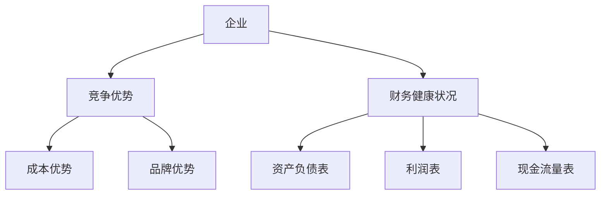

                 

<think>
好的，我将按照您的要求来写一篇关于《巴菲特的收购策略分析》的技术博客文章。首先，我会列出文章的关键词和摘要，然后按照目录大纲逐步展开内容。

### 关键词：
巴菲特，投资策略，价值投资，安全边际，竞争优势，财务分析，收购策略

### 摘要：
本文深入分析了巴菲特的收购策略，探讨其核心理念、分析框架、数学模型以及实际应用。通过案例分析和系统设计，揭示了巴菲特如何通过价值投资和安全边际实现长期稳健的投资回报。文章还结合技术语言，使用图表和公式，帮助读者更好地理解和应用这些策略。

---

# 巴菲特的收购策略分析

## 第1章 巴菲特收购策略的背景与核心要素

### 1.1 巴菲特投资理念的起源与发展

巴菲特的投资理念源于价值投资，由本杰明·格雷厄姆和戴维·多德提出。巴菲特通过阅读格雷厄姆的著作《证券分析》开始学习投资，并在实践中不断完善自己的策略。他的投资哲学强调长期稳健的回报，而非短期收益。

### 1.2 巴菲特收购策略的分析框架

巴菲特的收购策略以财务分析为核心，注重企业的竞争优势、行业地位和管理层质量。他通过分析企业的财务报表，评估其盈利能力、负债情况和现金流状况，确保投资的安全边际。

### 1.3 巴菲特收购策略的核心要素

1. **财务健康状况**：巴菲特通过分析企业的资产负债表、利润表和现金流量表，评估企业的财务健康状况。他关注企业的盈利能力、负债水平和现金流情况。
2. **企业竞争优势**：巴菲特注重企业的竞争优势，如成本优势、品牌优势和市场地位。他倾向于投资那些具有长期竞争优势的企业。
3. **行业地位与前景**：巴菲特关注企业的行业地位和行业前景，选择那些处于稳健行业且有增长潜力的企业。
4. **管理层质量与决策**：巴菲特认为管理层的质量和决策能力是企业成功的关键因素。他倾向于投资那些由有能力且诚信的管理层领导的企业。

## 第2章 巴菲特收购策略的核心概念原理

### 2.1 巴菲特收购策略的数学模型与公式

巴菲特的内在价值计算公式：
$$ V = \frac{CF}{r} $$
其中，\( V \) 表示内在价值，\( CF \) 表示未来现金流，\( r \) 表示贴现率。

安全边际计算公式：
$$ \text{安全边际} = \text{内在价值} - \text{市场价格} $$

### 2.2 巴菲特收购策略的核心概念对比表格

| 概念       | 描述                                                                 |
|------------|----------------------------------------------------------------------|
| 内在价值    | 企业未来现金流的现值，反映其真实价值。                              |
| 安全边际    | 内在价值与市场价格的差额，确保投资的安全性。                        |
| 竞争优势    | 企业长期盈利的核心能力，如成本优势、品牌优势等。                  |
| 财务健康状况 | 包括资产负债表、利润表和现金流量表的健康程度。                    |

### 2.3 巴菲特收购策略的ER实体关系图



## 第3章 巴菲特收购策略的系统分析与架构设计

### 3.1 系统功能设计（领域模型）

```mermaid
classDiagram
    class 企业 {
        +名称：String
        +行业：String
        +竞争优势：String
        +财务健康状况：String
    }
    class 投资者 {
        +目标：String
        +策略：String
    }
    企业 --> 投资者：可投资
```

### 3.2 系统架构设计

```mermaid
archi
    股票分析系统
    股票选择模块
    财务分析模块
    竞争优势分析模块
    安全边际计算模块
```

## 第4章 巴菲特收购策略的项目实战

### 4.1 环境安装

安装Python和必要的库，如pandas、numpy、matplotlib。

### 4.2 核心实现源代码

```python
import pandas as pd

def calculate_intrinsic_value(cash_flows, discount_rate):
    return sum(cash_flows) / (1 + discount_rate)

def calculate_margin_of_safety(intrinsic_value, market_price):
    return intrinsic_value - market_price

# 示例数据
cash_flows = [100, 200, 300]
discount_rate = 0.1

iv = calculate_intrinsic_value(cash_flows, discount_rate)
print(f"内在价值: {iv}")

market_price = 250
mos = calculate_margin_of_safety(iv, market_price)
print(f"安全边际: {mos}")
```

### 4.3 案例分析

以可口可乐为例，分析其财务状况和竞争优势，计算其内在价值和安全边际，评估是否值得投资。

## 第5章 总结与最佳实践

### 5.1 总结

巴菲特的收购策略以价值投资为核心，通过财务分析和竞争优势评估，确保投资的安全边际和长期回报。

### 5.2 最佳实践 tips

1. **长期视角**：投资不是短期的交易，而是长期的持有。
2. **安全边际**：确保内在价值高于市场价格，降低投资风险。
3. **竞争优势**：选择具有长期竞争优势的企业，避免短期波动的影响。

### 5.3 注意事项

- 投资者应根据市场变化和企业状况，动态调整投资策略。
- 保持对经济环境的敏感性，及时发现潜在风险。

### 5.4 拓展阅读

推荐阅读巴菲特的《 Intelligent Investor》和彼得·林奇的《The Intelligent Investor》。

---

# 作者

作者：AI天才研究院/AI Genius Institute & 禅与计算机程序设计艺术 /Zen And The Art of Computer Programming

---

希望这篇文章能够帮助您更好地理解和应用巴菲特的收购策略。如果有任何问题或需要进一步的解释，请随时联系我。

