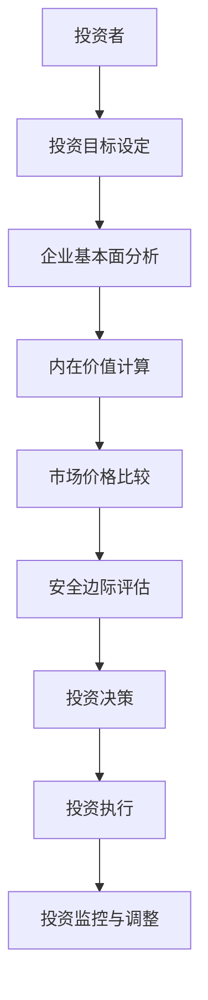
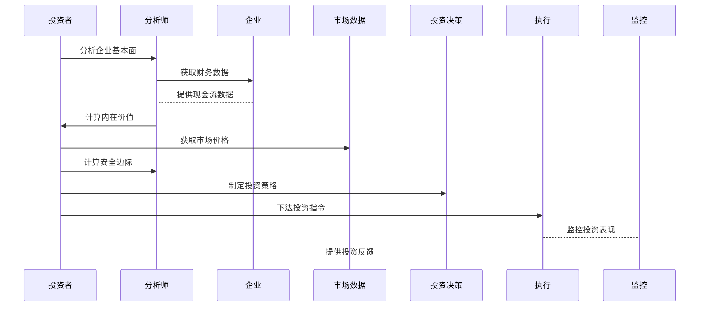

                 


# 巴菲特的时间框架：长期主义的投资优势

> 关键词：巴菲特，长期主义，投资优势，价值投资，安全边际，耐心等待，复利效应

> 摘要：本文将详细探讨巴菲特的长期主义投资理念，分析其核心要素，包括价值投资、安全边际和耐心等待，并结合数学模型和实际案例，揭示长期主义在投资中的优势。通过系统架构设计和项目实战，进一步阐述长期主义在实际投资中的应用。

---

## 第1章: 长期主义的起源与发展

### 1.1 长期主义的起源

#### 1.1.1 长期主义的定义与核心理念

长期主义（Long-termism）是一种投资哲学，强调以长期视角审视投资机会，关注企业的内在价值和可持续发展能力，而非短期市场波动。其核心理念在于通过深入分析企业的基本面，选择具备持续竞争优势和良好治理结构的企业进行投资，以实现长期稳定的收益。

长期主义的投资策略与传统的短期交易策略形成鲜明对比。它主张投资者应摒弃频繁交易和短期收益的诱惑，专注于寻找那些能够抵御短期市场波动并实现长期增长的企业。

#### 1.1.2 长期主义与巴菲特投资理念的联系

巴菲特（Warren Buffett）是长期主义的代表人物。他的投资理念深深植根于长期主义的土壤之中。巴菲特强调，成功的投资不在于预测市场的短期波动，而在于选择那些具备强大护城河（competitive moat）的企业，这些企业能够在长期的竞争中保持优势地位。

巴菲特的“价值投资”方法是长期主义的具体实践。他倡导以合理的价格买入具备优秀管理和良好财务状况的企业，并耐心持有这些投资，等待其内在价值的实现。

#### 1.1.3 长期主义在投资领域的历史演变

长期主义并非巴菲特首创，但他的实践和理论极大地推动了这一理念的发展。在20世纪70年代，巴菲特开始系统地阐述长期主义的投资哲学，强调企业内在价值的重要性。进入21世纪，随着全球化和科技的进步，长期主义的投资理念在复杂多变的市场环境中显得尤为重要。

---

### 1.2 巴菲特的长期主义投资理念

#### 1.2.1 巴菲特投资哲学的核心要素

巴菲特的投资哲学可以总结为以下几个核心要素：

1. **价值投资**：买入价格低于内在价值的股票。
2. **安全边际**：以低于内在价值的价格买入，以应对市场的不确定性。
3. **耐心等待**：长期持有优质资产，等待价值的实现。
4. **复利效应**：通过长期持有优质资产，实现财富的指数级增长。

#### 1.2.2 长期主义的特征与优势

长期主义的特征包括：

1. **长期视角**：关注企业的长期价值，而非短期市场波动。
2. **价值导向**：以企业的内在价值为投资决策的基础。
3. **风险管理**：通过安全边际降低投资风险。
4. **耐心持有**：避免频繁交易，减少交易成本和错误决策。

长期主义的优势在于其稳定性、可持续性和抗风险能力。通过长期持有优质资产，投资者能够抵御短期市场的波动，并从企业的长期增长中获益。

#### 1.2.3 长期主义与其他投资策略的对比

长期主义与短期投资策略相比，具有以下优势：

1. **稳定性**：长期投资能够减少短期波动对投资组合的冲击。
2. **可持续性**：通过关注企业的长期价值，投资者能够实现持续的收益。
3. **抗风险能力**：长期投资能够分散短期市场波动带来的风险。

---

## 第2章: 长期主义的核心概念与联系

### 2.1 长期主义的核心概念

#### 2.1.1 价值投资的定义与特点

价值投资是一种以低于市场价买入优质资产的投资策略。其核心在于寻找市场价格低于内在价值的企业。巴菲特强调，价值投资不仅仅是寻找便宜的股票，而是寻找那些具有强大竞争优势和良好治理结构的企业。

价值投资的特点包括：

1. **注重内在价值**：关注企业的基本面，如盈利能力、财务状况和竞争优势。
2. **安全边际**：买入价格低于内在价值，以降低投资风险。
3. **长期持有**：避免频繁交易，减少交易成本和错误决策。

#### 2.1.2 安全边际的概念与重要性

安全边际是指买入价格与内在价值之间的差距。通过留出安全边际，投资者能够降低投资风险，抵御市场的不确定性。

安全边际的重要性体现在以下几个方面：

1. **降低投资风险**：通过安全边际，投资者能够避免在市场高估时买入资产。
2. **应对市场波动**：安全边际为投资者提供了缓冲区，能够在市场下跌时减少损失。
3. **提高投资胜率**：安全边际高的投资更容易实现正收益。

#### 2.1.3 耐心等待的策略选择

耐心等待是长期主义的核心要素之一。巴菲特强调，投资不是掷骰子，而是通过深入研究和分析，选择那些具有长期竞争优势的企业，并耐心等待其内在价值的实现。

耐心等待的策略选择包括：

1. **避免短期干扰**：不因市场的短期波动而改变投资决策。
2. **专注长期目标**：专注于企业的长期增长，而非短期收益。
3. **减少交易成本**：通过长期持有，降低交易费用和税负。

---

### 2.2 长期主义的核心要素分析

#### 2.2.1 核心概念的属性对比

以下是长期主义核心要素的属性对比表：

| 比较维度       | 价值投资         | 安全边际         | 耐心等待         |
|----------------|------------------|------------------|------------------|
| 定义           | 寻找低于内在价值的资产 | 买入价格低于内在价值的差距 | 长期持有优质资产 |
| 目标           | 实现超额收益     | 降低投资风险     | 实现长期增长     |
| 实施条件       | 具备分析能力     | 价格低于内在价值 | 耐心和纪律性     |
| 优势           | 高收益潜力       | 高安全性         | 高稳定性         |

#### 2.2.2 核心概念的ER实体关系图

以下是长期主义核心概念的ER实体关系图：

```mermaid
erDiagram
    class 投资者 {
        投资者ID
        投资策略
        投资目标
    }
    class 企业 {
        企业ID
        内在价值
        竞争优势
    }
    class 市场 {
        市场ID
        市场价格
        市场波动
    }
    投资者 --> 企业 : 持有
    企业 --> 市场 : 价值实现
    投资者 --> 市场 : 价格比较
```

---

## 第3章: 长期主义的算法原理与数学模型

### 3.1 长期主义的数学模型

#### 3.1.1 内在价值计算模型

内在价值是长期主义的核心概念之一。以下是巴菲特使用的内在价值计算模型：

$$
\text{内在价值} = \sum_{t=1}^{\infty} \frac{\text{现金流}_t}{(1 + r)^t}
$$

其中，\( r \) 是折现率，\( \text{现金流}_t \) 是第 \( t \) 年的现金流。

#### 3.1.2 复利增长模型

复利效应是长期主义的另一个重要数学模型。以下是复利增长公式：

$$
\text{终值} = \text{本金} \times (1 + r)^n
$$

其中，\( r \) 是年化收益率，\( n \) 是投资期限。

#### 3.1.3 安全边际计算模型

安全边际是长期主义的风险管理工具。以下是安全边际的计算公式：

$$
\text{安全边际} = \text{内在价值} - \text{市场价格}
$$

---

## 第4章: 长期主义的系统架构与关系图

### 4.1 长期主义的系统架构

以下是长期主义投资决策系统的系统架构图：



### 4.2 长期主义的交互流程

以下是长期主义投资决策系统的交互流程图：



---

## 第5章: 长期主义的项目实战

### 5.1 项目背景

假设我们选择苹果公司（Apple Inc.）作为长期主义投资的案例。以下是苹果公司的基本面数据：

| 数据项       | 数值               |
|--------------|--------------------|
| 营收         | $3943.81亿美元     |
| 净利润       | $1004.02亿美元     |
| 股东权益     | $1178.97亿美元     |
| 折现率       | 8%                |
| 市场价格     | $150美元/股        |

---

### 5.2 投资策略实施

#### 5.2.1 环境搭建

1. **数据收集**：收集苹果公司的财务数据和市场数据。
2. **模型选择**：选择内在价值计算模型和安全边际计算模型。
3. **工具准备**：使用Excel或Python进行数据分析和计算。

#### 5.2.2 核心实现

以下是Python代码示例：

```python
import numpy as np
import pandas as pd

# 输入数据
revenue = 3943.81
net_profit = 1004.02
book_value = 1178.97
discount_rate = 0.08
market_price = 150

# 内在价值计算
def calculate_intrinsic_value(revenue, net_profit, book_value, discount_rate):
    # 假设现金流为净利润
    cash_flow = net_profit
    intrinsic_value = 0
    for year in range(1, 10):
        intrinsic_value += cash_flow / (1 + discount_rate) ** year
    return intrinsic_value

# 计算内在价值
intrinsic_value = calculate_intrinsic_value(revenue, net_profit, book_value, discount_rate)
print(f"内在价值: ${intrinsic_value:.2f}")

# 计算安全边际
safety_margin = intrinsic_value - market_price
print(f"安全边际: ${safety_margin:.2f}")
```

#### 5.2.3 代码应用解读

1. **内在价值计算**：使用净利润作为现金流，计算未来十年的现金流现值，得出苹果公司的内在价值。
2. **安全边际计算**：将内在价值与市场价格进行比较，得出安全边际。
3. **投资决策**：如果安全边际为正，则考虑买入；否则，避免投资。

---

## 第6章: 长期主义的最佳实践与总结

### 6.1 长期主义的实践小结

长期主义是一种以长期视角为核心的投资哲学，其成功依赖于对企业的深入研究和对市场的耐心等待。通过价值投资、安全边际和复利效应，长期主义能够在复杂的市场环境中实现稳定的收益。

### 6.2 长期主义的注意事项

1. **避免短期干扰**：投资者需要避免因短期市场波动而改变投资决策。
2. **注重风险管理**：通过安全边际降低投资风险。
3. **保持耐心与纪律**：长期投资需要耐心和纪律，避免频繁交易。

### 6.3 长期主义的拓展阅读

推荐书籍：
- 《巴菲特致股东的信》
- 《投资的艺术》
- 《证券分析》

---

## 作者信息

作者：AI天才研究院/AI Genius Institute & 禅与计算机程序设计艺术 /Zen And The Art of Computer Programming

---

以上是关于《巴菲特的时间框架：长期主义的投资优势》的完整目录大纲和文章内容。如需进一步调整或补充，请随时告知！

