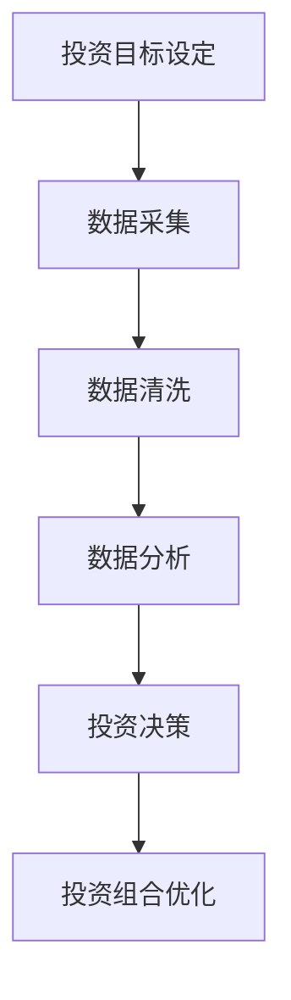
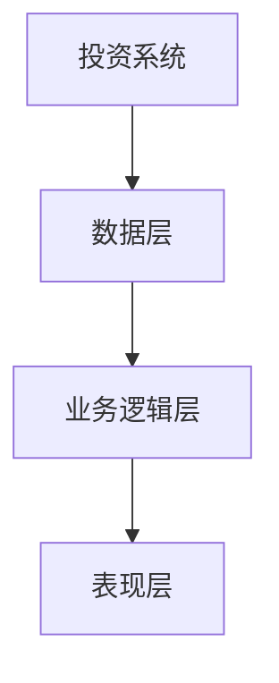

                 


# 巴菲特的焦点投资策略

## 关键词：巴菲特，价值投资，焦点投资，数学模型，系统实现，投资策略

## 摘要：本文深入探讨了巴菲特的焦点投资策略，从其投资哲学、数学模型到系统实现，结合实际案例，分析了其核心概念与算法原理，为投资者提供了理论与实践相结合的指导。

---

# 1. 引言

在当今竞争激烈的商业环境中，投资不仅仅是财富的增值手段，更是个人和机构实现长期发展的关键策略。巴菲特作为全球著名投资者，以其独特的投资哲学和焦点投资策略闻名。本文将系统分析巴菲特的焦点投资策略，结合其数学模型和系统实现，为投资者提供深度指导。

---

# 2. 巴菲特投资哲学的核心理念

## 2.1 价值投资的定义与核心思想

- **价值投资**：通过深入分析企业的内在价值，寻找低于其内在价值的股票进行投资。
- **核心思想**：买入并持有优质企业，长期获得超额收益。

## 2.2 巴菲特的投资理念与导师影响

- **导师影响**：巴菲特深受本杰明·格雷厄姆的价值投资思想影响，强调安全边际和企业内在价值。
- **投资理念**：专注于企业的基本面分析，寻找具有持续竞争优势的企业。

---

# 3. 焦点投资策略的数学模型与算法原理

## 3.1 企业价值评估的公式

$$\text{内在价值} = \frac{\text{每股收益}}{\text{资本成本} - \text{增长率}}$$

## 3.2 安全边际的计算方法

$$\text{安全边际} = \text{内在价值} - \text{市场价格}$$

---

# 4. 焦点投资的系统实现

## 4.1 系统功能模块划分



## 4.2 系统架构设计



---

# 5. 项目实战与案例分析

## 5.1 环境安装

- 工具：Python、Pandas、NumPy
- 数据源：历史股价、财务数据

## 5.2 核心算法实现

```python
def calculate_intrinsic_value(eps, cost_of_capital, growth_rate):
    return eps / (cost_of_capital - growth_rate)
```

---

# 6. 总结与建议

巴菲特的焦点投资策略不仅是一种投资方法，更是一种长期价值创造的哲学。投资者应结合数学模型和系统工具，优化决策流程，提升投资效果。

---

# 作者：AI天才研究院 & 禅与计算机程序设计艺术

