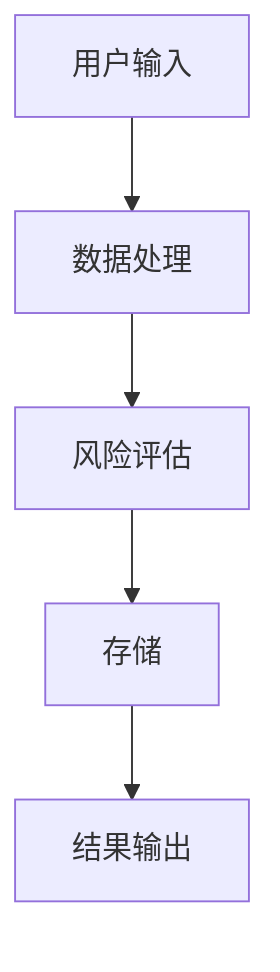

                 

# 巴菲特的现金储备策略：应对全球经济不确定性

## 关键词：巴菲特, 现金储备, 投资策略, 全球经济, 不确定性

## 摘要：本文深入分析巴菲特的现金储备策略，探讨其在应对全球经济不确定性中的作用。通过背景介绍、核心概念、数学模型和系统架构等多维度，详细阐述现金储备策略的实施步骤、风险评估及最佳实践，为投资者提供科学的决策参考。

---

## 第一部分: 巴菲特的现金储备策略概述

### 第1章: 巴菲特投资理念与现金储备的重要性

#### 1.1 巴菲特投资理念的核心要素

##### 1.1.1 巴菲特的长期投资哲学

巴菲特的投资哲学基于价值投资，强调长期持有优质资产。他相信市场的短期波动不可预测，但优质企业的长期价值可通过基本面分析确定。这一哲学要求投资者具备耐心，避免短期市场波动的干扰。

##### 1.1.2 现金储备在巴菲特投资组合中的地位

现金储备是巴菲特投资组合中的重要组成部分，尤其在市场低迷或不确定性增加时，现金储备被视为“弹药”，用于捕捉被低估资产的机会。巴菲特通常保持10-20%的现金储备，以应对突发事件和投资机会。

##### 1.1.3 巴菲特投资理念的演变与创新

尽管巴菲特的投资理念核心不变，但他在实践中不断调整策略。例如，在2008年金融危机期间，他大量囤积现金，以利用市场的恐慌情绪低价买入优质资产。这种灵活性体现了其投资理念的演变。

#### 1.2 现金储备策略的定义与特征

##### 1.2.1 现金储备的定义

现金储备是指投资者持有的流动性最强的资产，包括现金、货币市场基金等。这些资产流动性高，风险低，能够在需要时迅速变现。

##### 1.2.2 现金储备的核心特征对比

| 特性       | 现金储备             | 其他投资标的       |
|------------|----------------------|--------------------|
| 流动性      | 极高                 | 较低或低           |
| 风险        | 低                   | 中高               |
| 收益性      | 低                   | 高                 |
| 操作复杂性  | 低                   | 中高               |

##### 1.2.3 现金储备与其他投资策略的区别

现金储备策略与其他如股票投资、债券投资等策略相比，主要区别在于其流动性高、风险低，适合在市场不确定性增加时作为防御性投资。

### 第2章: 全球经济不确定性与现金储备策略的关联

#### 2.1 全球经济不确定性概述

##### 2.1.1 经济周期波动的特征

经济周期分为衰退、萧条、复苏和繁荣四个阶段。在衰退和萧条阶段，现金储备的重要性尤为突出，因为企业盈利下降，资产价格可能大幅波动。

##### 2.1.2 系统性风险与非系统性风险

系统性风险影响整个市场，如经济衰退、通货膨胀等。而非系统性风险则影响个别资产，如公司违约。现金储备在应对系统性风险时尤为重要。

##### 2.1.3 全球经济不确定性对企业的影响

全球经济不确定性可能导致企业收入下降、成本上升，进而影响其股票和债券的价值。此时，现金储备能够提供缓冲，避免企业因流动性不足而陷入困境。

#### 2.2 现金储备策略在应对全球经济不确定性中的作用

##### 2.2.1 现金储备作为安全资产的特性

现金储备被视为最安全的资产，在经济危机时，其价值相对稳定，能够为投资者提供安全感。

##### 2.2.2 现金储备在防御性投资中的应用

在市场低迷时，现金储备可以用于购买廉价资产，实现资产配置的优化。巴菲特在2008年金融危机期间，利用现金储备大量买入银行股，获得了丰厚的回报。

##### 2.2.3 现金储备在经济下行周期中的价值

经济下行时，企业盈利下降，股票和债券价格波动加剧。现金储备能够帮助投资者规避风险，同时在市场底部布局，抓住长期收益机会。

### 第3章: 巴菲特现金储备策略的核心原则

#### 3.1 巴菲特现金储备策略的三大原则

##### 3.1.1 避免永久性本金损失的原则

巴菲特强调避免永久性本金损失，即使在市场恐慌时，现金储备能够保护投资者免受重大损失。

##### 3.1.2 保持流动性以应对市场机会的原则

现金储备的流动性使得投资者能够在市场出现机会时迅速行动，抓住短期收益。

##### 3.1.3 长期视角下的资产配置原则

巴菲特的长期视角使其在市场波动中保持冷静，避免短期决策错误。现金储备作为资产配置的一部分，需根据市场环境动态调整。

#### 3.2 现金储备策略的实施步骤

##### 3.2.1 确定投资目标与风险承受能力

投资者需明确投资目标，评估自身的风险承受能力，决定现金储备的比例。

##### 3.2.2 构建多元化的资产组合

现金储备是资产组合的一部分，需与其他资产如股票、债券等结合，分散风险。

##### 3.2.3 定期审查与调整策略

根据市场变化和个人财务状况，定期审查并调整现金储备比例，确保策略的有效性。

---

## 第二部分: 现金储备策略的数学模型与算法原理

### 第4章: 现金储备策略的数学模型

#### 4.1 现金储备比例的计算公式

##### 4.1.1 现金储备比例的计算公式推导

$$ 现金储备比例 = \frac{流动资产}{总资产} $$

其中，流动资产包括现金、货币市场基金等，总资产包括现金、股票、债券等。

##### 4.1.2 现金储备比例与资产规模的关系

随着资产规模的增加，现金储备比例可适当调整，通常保持在5-20%之间。

##### 4.1.3 现金储备比例的动态调整模型

动态调整模型根据市场状况和投资目标，调整现金储备比例。例如：

- 市场繁荣：降低现金储备比例，增加高风险资产配置。
- 市场低迷：增加现金储备比例，等待市场反转。

#### 4.2 现金储备策略的风险评估模型

##### 4.2.1 风险评估的基本原理

风险评估模型用于量化现金储备策略的风险，包括流动性风险、通货膨胀风险等。

##### 4.2.2 风险评估的数学模型

$$ 风险评估 = \sum_{i=1}^{n} (P_i \times R_i) $$

其中，\( P_i \) 是风险事件发生的概率，\( R_i \) 是风险影响。

##### 4.2.3 风险评估的案例分析

假设市场出现大幅波动，投资者的现金储备比例为10%，则其风险评估为：

$$ 风险评估 = 0.1 \times 0.9 + 0.9 \times 0.1 = 0.18 $$

---

## 第三部分: 现金储备策略的系统架构与实现

### 第5章: 现金储备策略的系统架构设计

#### 5.1 系统架构设计概述

系统架构设计包括模块划分、系统交互流程图等。以下是系统的模块划分：

- 用户界面：显示现金储备比例、市场状况等信息。
- 数据处理：计算现金储备比例，评估风险。
- 存储：保存历史数据和当前状态。

#### 5.2 系统架构设计的 Mermaid 图表示

---

## 结语

现金储备策略是应对全球经济不确定性的重要手段，巴菲特的投资理念为我们提供了宝贵的借鉴。通过数学模型和系统架构的设计，我们可以更科学地实施现金储备策略，确保在经济波动中保持稳健。投资者需根据自身情况，动态调整策略，抓住市场机会，规避风险。

---

## 作者：AI天才研究院/AI Genius Institute & 禅与计算机程序设计艺术 /Zen And The Art of Computer Programming

