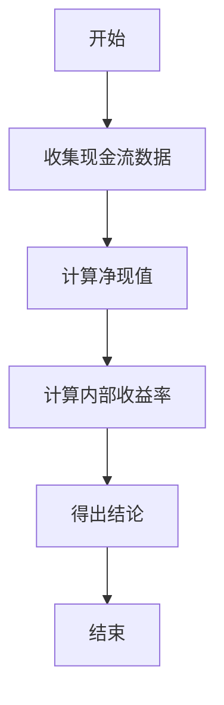

                 


# 巴菲特的现金流分析：公司健康状况的晴雨表

**关键词**：巴菲特、现金流分析、企业价值、投资策略、财务报表、现金流指标

**摘要**：现金流是企业健康的核心指标，巴菲特的现金流分析方法是评估企业价值的关键工具。本文将从现金流的基本概念、分类与计算方法入手，结合数学模型和实际案例，详细讲解巴菲特的现金流分析方法及其在投资决策中的应用。通过系统设计和实战分析，帮助读者掌握现金流分析的技巧，评估企业的财务健康状况。

---

## 第1章: 背景介绍与核心概念

### 1.1 现金流的基本概念

现金流是企业在一定时期内资金的流入和流出情况，反映了企业的经营状况和财务健康。现金流分为经营活动、投资活动和筹资活动三类，分别对应企业的日常运营、资本支出和融资活动。

#### 1.1.1 什么是现金流
现金流是企业在一定时间内所有现金和现金等价物的流入和流出。现金流入包括销售收入、投资收益等，现金流出包括采购支出、支付利息等。

#### 1.1.2 现金流的分类与特点
现金流分为三类：
1. **经营活动现金流**：企业日常运营中的现金流，包括销售商品、提供服务、支付员工工资等。
2. **投资活动现金流**：企业投资于长期资产或出售投资资产的现金流。
3. **筹资活动现金流**：企业通过发行股票、债券或偿还债务等方式筹集资金的现金流。

#### 1.1.3 现金流在企业中的重要性
现金流是企业生存和发展的基础，直接反映企业的盈利能力和偿债能力。健康的现金流能够支持企业的日常运营、偿还债务、投资扩张。

---

### 1.2 巴菲特的现金流分析方法

巴菲特的现金流分析方法以自由现金流（FCF）为核心，强调企业创造现金流的能力。

#### 1.2.1 巴菲特的投资理念
巴菲特认为，企业的价值取决于其未来现金流的现值。他通过分析企业的自由现金流和ROE（净资产收益率）来评估企业的投资价值。

#### 1.2.2 现金流分析在巴菲特投资中的地位
现金流分析是巴菲特评估企业价值的核心工具。他特别关注自由现金流，认为只有能够持续产生自由现金流的企业才有长期投资价值。

#### 1.2.3 巴菲特现金流分析的核心思想
巴菲特的现金流分析强调：
1. 企业必须能够产生稳定的自由现金流。
2. 现金流的质量比数量更重要。
3. 现金流的可持续性是企业价值的关键。

---

### 1.3 现金流与企业价值的关系

现金流与企业价值密切相关，是评估企业价值的重要指标。

#### 1.3.1 现金流对企业健康的影响
健康的现金流表明企业能够维持日常运营、偿还债务、投资扩张。现金流不足可能导致企业陷入财务困境。

#### 1.3.2 现金流与企业估值的关系
现金流是计算企业价值的重要依据。通过现金流分析，可以评估企业的内在价值，判断其是否被市场低估或高估。

#### 1.3.3 现金流分析的边界与外延
现金流分析需要结合企业的财务报表、行业环境和市场前景进行综合评估。现金流分析的边界在于企业内部管理效率和外部市场风险。

---

## 第2章: 现金流的核心要素与分类

### 2.1 现金流的核心要素
现金流的时间价值和风险收益是分析的核心要素。

#### 2.1.1 现金流的时间价值
现金流的时间价值是指资金随着时间的推移而产生的价值变化。净现值（NPV）和内部收益率（IRR）是衡量时间价值的两个重要指标。

#### 2.1.2 现金流的风险与收益
现金流的风险与收益是投资决策的关键因素。高风险的现金流可能带来高收益，但也可能引发重大损失。

#### 2.1.3 现金流的可预测性
现金流的可预测性取决于企业的经营模式和市场环境。稳定的现金流更容易预测，波动大的现金流预测难度较高。

---

### 2.2 现金流的分类与对比

现金流的分类和对比是分析的重要内容。

#### 2.2.1 自由现金流（FCF）与营业现金流
自由现金流是企业扣除资本支出后的剩余现金流，反映企业的真实盈利能力。营业现金流是企业日常经营活动中产生的现金流。

| 对比维度 | 自由现金流（FCF） | 营业现金流 |
|----------|-------------------|------------|
| 定义     | 净利润 - 非现金支出 + 折旧与摊销 | 经营活动现金流 |
| 用途     | 评估企业的真实盈利能力 | 评估企业日常运营能力 |

#### 2.2.2 经营活动现金流、投资活动现金流与筹资活动现金流
经营活动现金流是企业日常运营中的现金流，投资活动现金流是企业投资活动中的现金流，筹资活动现金流是企业融资活动中的现金流。

#### 2.2.3 现金流分类对比表格
下表对比了三种现金流的主要特点：

| 类别            | 主要来源         | 主要用途         | 是否影响企业价值 |
|-----------------|------------------|-----------------|-----------------|
| 经营活动现金流 | 销售商品、提供服务 | 支付工资、采购原材料 | 直接影响企业运营能力 |
| 投资活动现金流 | 出售资产、购买资产 | 资本支出         | 影响企业长期发展 |
| 筹资活动现金流 | 发行股票、债券    | 偿还债务         | 影响企业财务稳定性 |

---

### 2.3 现金流的实体关系图

现金流的实体关系图展示了现金流与企业财务报表的关系。

```mermaid
erd
  股东权益
  投资者
  负债
  收入
  支出
  现金流
    现金流
    股东权益
    负债
    收入
    支出
```

---

## 第3章: 现金流分析的数学模型

### 3.1 现金流分析的基本公式

现金流分析的核心是净现值（NPV）和内部收益率（IRR）。

#### 3.1.1 净现值（NPV）公式
$$ NPV = \sum_{t=1}^{n} \frac{CF_t}{(1+r)^t} $$
其中，$CF_t$是第$t$期的现金流，$r$是贴现率。

#### 3.1.2 内部收益率（IRR）公式
$$ IRR = r \text{ 使得 } NPV = 0 $$

---

### 3.2 巴菲特现金流分析的数学模型

巴菲特的现金流分析基于自由现金流（FCF）。

#### 3.2.1 自由现金流公式
$$ FCF = \text{净利润} - \text{非现金支出} + \text{折旧与摊销} $$

---

### 3.3 现金流分析的流程图



---

## 第4章: 现金流分析系统的架构设计

### 4.1 系统功能设计

现金流分析系统需要实现数据输入、计算和可视化功能。

#### 4.1.1 数据输入模块
用户输入企业的财务数据，包括收入、支出、资产和负债等。

#### 4.1.2 现金流计算模块
系统根据输入数据计算经营活动现金流、投资活动现金流和筹资活动现金流。

#### 4.1.3 数据可视化模块
系统将计算结果以图表形式展示，帮助用户直观理解现金流状况。

---

### 4.2 系统架构设计

现金流分析系统的架构包括数据输入、计算和展示三个模块。


---

## 第5章: 项目实战

### 5.1 环境安装

安装Python和必要的库，如pandas和matplotlib。

### 5.2 核心实现

编写代码计算自由现金流和净现值。

#### 代码实现
```python
import pandas as pd
import numpy as np

def calculate_fcf(revenue, expenses, depAmort):
    return revenue - expenses + depAmort

def calculate_npvs(cfs, discount_rate):
    return np.npv(discount_rate, cfs)

# 示例数据
revenue = 100000000
expenses = 80000000
depAmort = 20000000
cash_flows = [100000000, -50000000, 30000000]

# 计算自由现金流
fcf = calculate_fcf(revenue, expenses, depAmort)
print("自由现金流：", fcf)

# 计算净现值
discount_rate = 0.1
npv = calculate_npvs(cash_flows, discount_rate)
print("净现值：", npv)
```

### 5.3 案例分析

以苹果公司为例，分析其现金流状况。

#### 5.3.1 环境安装
安装Python和pandas库。

#### 5.3.2 代码实现
读取苹果公司的财务数据，计算自由现金流。

#### 5.3.3 案例分析
分析苹果公司的现金流状况，评估其投资价值。

#### 5.3.4 小结
总结苹果公司的现金流分析结果，提出投资建议。

---

## 第6章: 总结与展望

### 6.1 总结

现金流是企业健康的核心指标，巴菲特的现金流分析方法是评估企业价值的重要工具。

### 6.2 展望

随着人工智能和大数据技术的发展，现金流分析将更加精准和高效。未来，现金流分析将与更多技术结合，为企业价值评估提供更有力的支持。

---

**作者：AI天才研究院/AI Genius Institute & 禅与计算机程序设计艺术 /Zen And The Art of Computer Programming**

