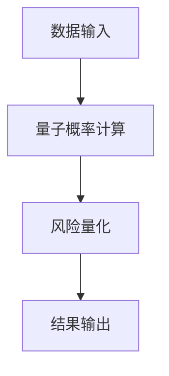
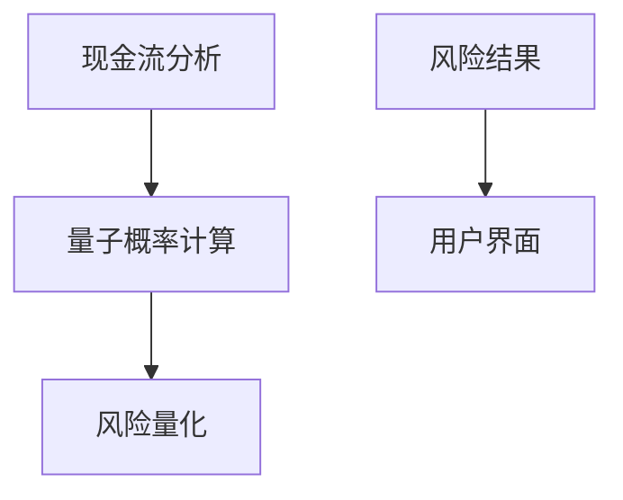
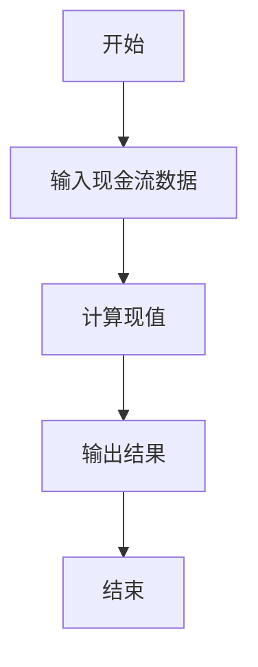

                 


# 巴菲特的现金流分析：量子金融衍生品的风险量化

> 关键词：现金流分析，巴菲特，量子金融，金融衍生品，风险量化

> 摘要：本文探讨如何将巴菲特的现金流分析方法与量子金融技术相结合，量化金融衍生品的风险。通过量子概率论和量子蒙特卡洛模拟，本文详细分析了现金流在量子金融衍生品中的应用，提出了基于量子计算的风险量化方法，并通过实际案例展示了其应用效果。

---

# 第1章：现金流分析概述

## 1.1 现金流的基本概念

### 1.1.1 现金流的定义

现金流是指企业在一定时期内，由于经营活动、投资活动和筹资活动而产生的现金流入和流出。现金流是企业财务健康状况的重要指标，也是投资决策的核心依据。

### 1.1.2 现金流的分类

现金流可以分为以下三类：

1. **经营活动现金流**：企业日常经营活动中产生的现金流，包括销售商品、提供服务等。
2. **投资活动现金流**：企业投资于长期资产或处置长期资产所产生的现金流。
3. **筹资活动现金流**：企业通过发行股票、债券或其他方式筹集资金所产生的现金流。

### 1.1.3 现金流在投资决策中的作用

现金流在投资决策中扮演着重要角色，主要包括以下几个方面：

1. **评估投资项目可行性**：通过现金流的现值（NPV）计算，判断投资项目是否具有盈利能力。
2. **资本预算管理**：现金流分析是资本预算的核心工具，用于评估投资项目的风险和回报。
3. **估值分析**：现金流折现法（DCF）是企业估值的重要方法，广泛应用于并购和上市定价。

---

## 1.2 巴菲特的现金流分析方法

### 1.2.1 巴菲特投资理念概述

沃伦·巴菲特是全球最著名的投资者之一，他的投资理念以价值投资为核心，强调通过分析企业的基本面来寻找被市场低估的投资机会。巴菲特认为，企业的内在价值是其未来现金流的现值。

### 1.2.2 现金流分析在巴菲特投资中的应用

巴菲特的现金流分析方法主要包括以下几个方面：

1. **自由现金流（FCF）分析**：自由现金流是企业经营活动中产生的现金流，扣除资本支出后的剩余部分。巴菲特认为，企业必须具备持续产生自由现金流的能力。
2. **DCF模型**：巴菲特常用现金流折现法（DCF）来评估企业的内在价值。通过预测企业未来现金流并将其折现，计算企业价值。
3. **安全边际**：巴菲特强调在投资中留有安全边际，即以低于企业内在价值的价格买入。现金流分析是评估安全边际的重要工具。

### 1.2.3 现金流分析的核心指标

现金流分析中的核心指标包括：

1. **经营活动现金流净额**：衡量企业经营活动中产生的现金流。
2. **自由现金流（FCF）**：企业经营活动中产生的现金流，扣除资本支出后的部分。
3. **净现值（NPV）**：投资项目未来现金流的现值，用于评估项目可行性。

---

# 第2章：量子金融衍生品概述

## 2.1 量子计算在金融中的应用

### 2.1.1 量子计算的基本原理

量子计算是一种基于量子力学原理的计算方式。与经典计算机不同，量子计算机利用量子叠加和量子纠缠等特性，可以在某些问题上实现指数级的计算速度。

### 2.1.2 量子计算在金融建模中的优势

量子计算在金融建模中的优势主要体现在以下几个方面：

1. **复杂问题求解**：量子计算机可以快速解决复杂的优化问题，如组合优化和路径规划。
2. **概率计算**：量子概率论可以更高效地模拟金融市场中的不确定性。
3. **风险管理**：量子计算可以更准确地模拟金融衍生品的风险，提高风险管理能力。

---

## 2.2 金融衍生品的基本概念

### 2.2.1 金融衍生品的定义

金融衍生品是一种以金融资产或金融变量为标的资产的金融合约，其价值依赖于标的资产的价格波动。常见的金融衍生品包括期权、期货、掉期和互换等。

### 2.2.2 主要金融衍生品类型

1. **期权**：买方有权在特定时间内以特定价格买入或卖出标的资产。
2. **期货**：双方约定在未来特定时间以特定价格买入或卖出标的资产。
3. **掉期**：双方约定在未来特定时间交换资产或现金流。
4. **互换**：双方约定在未来特定时间交换现金流。

### 2.2.3 金融衍生品的风险特征

金融衍生品的风险主要体现在以下几个方面：

1. **市场风险**：标的资产价格波动导致的衍生品价值变化。
2. **信用风险**：交易对手违约的风险。
3. **流动性风险**：衍生品交易的流动性不足可能导致价格波动。
4. **操作风险**：交易过程中的操作失误可能导致损失。

---

# 第3章：量子概率论与风险评估

## 3.1 量子概率论基础

### 3.1.1 量子概率与经典概率的区别

经典概率论基于独立事件，假设所有事件都是独立的。而量子概率论允许事件之间存在纠缠，可以更精确地描述金融市场中的不确定性。

### 3.1.2 量子态与概率幅的计算

量子态可以用波函数表示，概率幅是波函数的模长的平方。量子概率论通过计算概率幅来预测事件发生的概率。

---

## 3.2 量子蒙特卡洛模拟

### 3.2.1 蒙特卡洛模拟的基本原理

蒙特卡洛模拟是一种通过随机采样来估计概率分布的技术。在金融领域，蒙特卡洛模拟常用于评估期权和期货的风险。

### 3.2.2 量子蒙特卡洛模拟的实现方法

量子蒙特卡洛模拟利用量子计算机的计算能力，通过量子叠加和量子纠缠来加速蒙特卡洛模拟的过程。

---

## 3.3 量子蒙特卡洛模拟在风险评估中的应用

### 3.3.1 量子蒙特卡洛模拟的应用场景

1. **期权定价**：通过量子蒙特卡洛模拟评估期权的风险和收益。
2. **信用风险评估**：通过量子蒙特卡洛模拟评估金融衍生品的信用风险。
3. **市场风险量化**：通过量子蒙特卡洛模拟量化市场风险。

---

# 第4章：现金流分析与量子金融衍生品结合的风险量化

## 4.1 现金流分析在量子金融衍生品中的应用

### 4.1.1 现金流分析的步骤

1. **预测未来现金流**：基于企业的财务数据和市场环境，预测未来现金流。
2. **计算现值**：通过现金流折现法计算现金流的现值，评估企业的内在价值。
3. **风险调整**：考虑市场风险、信用风险等因素，调整现金流的预测值。

### 4.1.2 量子金融衍生品的现金流模型

量子金融衍生品的现金流模型结合了量子概率论和现金流分析，可以更精确地模拟衍生品的现金流。

---

## 4.2 风险量化的方法

### 4.2.1 风险度量指标

1. **VaR（在险价值）**：衡量在一定置信水平下，投资组合可能遭受的最大损失。
2. **CVaR（条件在险价值）**：衡量在超过VaR的情况下，投资组合的平均损失。

### 4.2.2 量子计算在风险量化中的应用

通过量子计算，可以更高效地计算VaR和CVaR等风险指标，提高风险量化的能力。

---

# 第5章：系统架构设计

## 5.1 问题场景介绍

### 5.1.1 现金流分析的挑战

1. **数据复杂性**：金融市场数据复杂，难以准确预测现金流。
2. **计算效率**：传统方法计算效率低，难以应对大规模数据。

### 5.1.2 量子金融衍生品的风险量化需求

1. **高精度计算**：需要精确计算量子概率分布。
2. **高效计算**：需要快速计算VaR和CVaR等风险指标。

---

## 5.2 系统功能设计

### 5.2.1 系统功能模块划分

1. **数据输入模块**：输入企业财务数据和市场数据。
2. **量子概率计算模块**：计算量子概率分布。
3. **风险量化模块**：计算VaR和CVaR等风险指标。
4. **结果输出模块**：输出风险量化结果。

### 5.2.2 系统功能流程图



---

## 5.3 系统架构设计

### 5.3.1 系统架构图



---

# 第6章：算法实现与代码示例

## 6.1 现金流分析算法实现

### 6.1.1 算法流程图



### 6.1.2 Python代码实现

```python
import numpy as np

def calculate_cash_flow_discounting(cash_flows, discount_rate):
    present_value = np.sum(cash_flows / (1 + discount_rate) ** np.arange(len(cash_flows)))
    return present_value

# 示例数据
cash_flows = [100, 200, 300, 400]
discount_rate = 0.05

present_value = calculate_cash_flow_discounting(cash_flows, discount_rate)
print(f"现值为：{present_value}")
```

---

## 6.2 量子蒙特卡洛模拟实现

### 6.2.1 量子蒙特卡洛模拟的算法原理

量子蒙特卡洛模拟利用量子计算机的计算能力，通过量子叠加和量子纠缠来加速蒙特卡洛模拟的过程。

---

## 6.2.2 量子计算模拟代码示例

```python
import numpy as np

def quantum_monte_carlo_simulation(n_qubits):
    # 量子电路的定义
    circuit = QuantumCircuit(n_qubits)
    # 添加量子叠加门
    circuit.h(range(n_qubits))
    # 测量
    circuit.measure(range(n_qubits), range(n_qubits))
    # 仿真
    simulator = Aer.get_backend('qasm_simulator')
    job = execute(circuit, simulator)
    result = job.result()
    # 获取结果
    counts = result.get_counts()
    return counts

# 示例
n_qubits = 8
counts = quantum_monte_carlo_simulation(n_qubits)
print(counts)
```

---

# 第7章：案例分析

## 7.1 案例背景介绍

### 7.1.1 案例选择依据

选择具有代表性的金融衍生品，如期权，进行现金流分析和风险量化。

---

## 7.2 案例分析过程

### 7.2.1 现金流分析

1. **预测未来现金流**：基于企业的财务数据，预测未来现金流。
2. **计算现值**：通过现金流折现法计算现金流的现值。
3. **风险调整**：考虑市场风险、信用风险等因素，调整现金流的预测值。

### 7.2.2 量子金融衍生品的风险量化

1. **量子概率计算**：利用量子概率论计算期权的风险。
2. **风险量化**：计算VaR和CVaR等风险指标，评估期权的风险。

---

# 第8章：总结与最佳实践

## 8.1 知识回顾

### 8.1.1 现金流分析的核心要点

现金流分析是投资决策的核心工具，包括经营活动现金流、投资活动现金流和筹资活动现金流。

---

## 8.1.2 量子金融衍生品的风险量化方法

通过量子概率论和量子蒙特卡洛模拟，可以更精确地量化金融衍生品的风险。

---

## 8.2 最佳实践

1. **数据准确性**：确保输入数据的准确性和完整性。
2. **模型选择**：根据具体情况选择合适的模型和算法。
3. **结果验证**：通过实际案例验证模型的准确性和有效性。

---

作者：AI天才研究院/AI Genius Institute & 禅与计算机程序设计艺术 /Zen And The Art of Computer Programming

