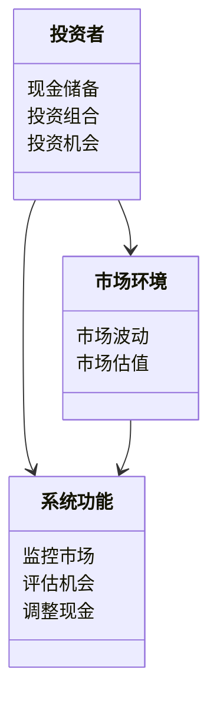
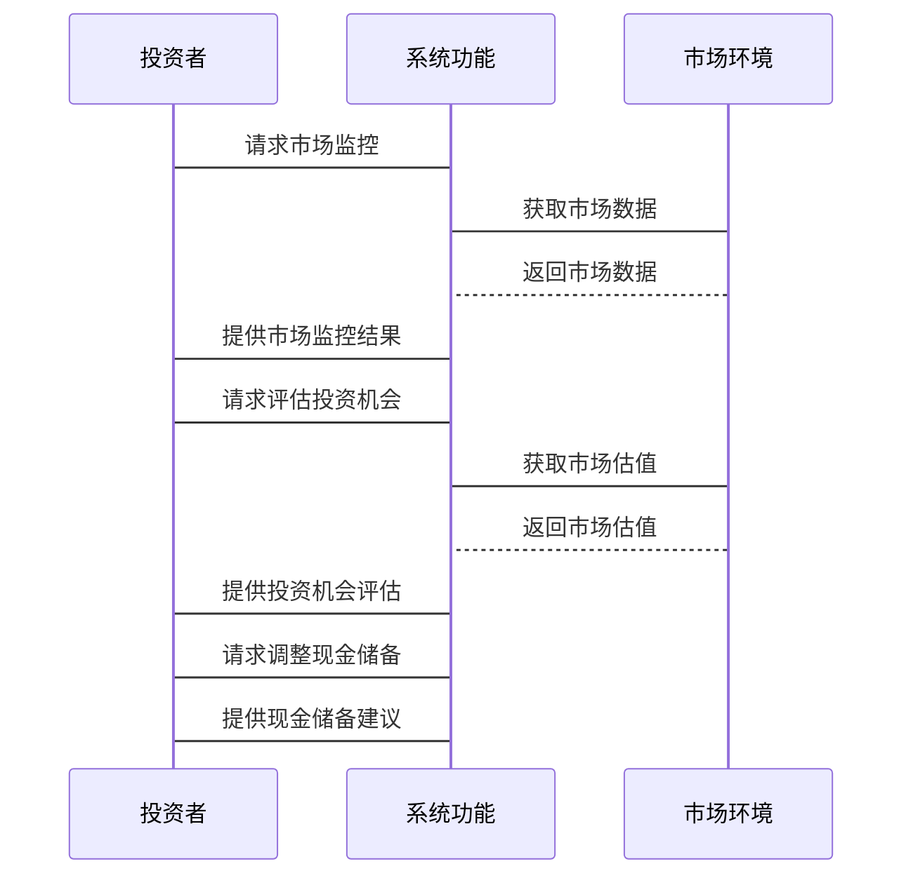

                 


# 巴菲特的现金管理哲学：保持流动性与把握机会的平衡

## 关键词：巴菲特，现金管理，流动性，投资机会，价值投资，风险管理

## 摘要：  
本文深入探讨了巴菲特的现金管理哲学，分析了他如何在保持流动性的同时把握投资机会。通过详细解析巴菲特的核心理念、数学模型、系统架构和实际案例，本文为读者提供了从理论到实践的全面指南。我们还将对比其他投资策略，总结最佳实践，并给出实际操作建议。

---

# 第一部分: 巴菲特的现金管理哲学概述

## 第1章: 巴菲特投资哲学的核心理念

### 1.1 巴菲特的生平与投资理念

#### 1.1.1 巴菲特的早年经历与投资起步
沃伦·巴菲特（Warren Buffett）于1934年8月30日出生于美国堪萨斯州的奥马哈。他从小就展现出了对数字和投资的天赋，12岁时就开始投资股票。巴菲特的父亲是律师，同时也是一位国会议员，这为巴菲特提供了良好的经济和教育背景。他大学期间主修经济学，并在哥伦比亚大学获得了硕士学位。

#### 1.1.2 巴菲特的价值投资理念
巴菲特的价值投资理念的核心是寻找那些具有持续竞争优势、良好管理和合理估值的公司。他认为市场波动不会影响公司的内在价值，真正的投资者应该关注公司的基本面，而不是市场的短期波动。

#### 1.1.3 巴菲特投资哲学的核心思想
巴菲特的投资哲学可以总结为“以合理的价格买入优秀的公司”。他强调长期投资、分散投资和价值投资，避免短期波动带来的风险。

### 1.2 现金管理在巴菲特投资中的重要性

#### 1.2.1 现金储备的定义与作用
现金储备是指投资者持有的现金或现金等价物，用于应对紧急情况、抓住投资机会或支付日常开支。在巴菲特的投资策略中，现金储备是投资组合的重要组成部分，因为它提供了灵活性。

#### 1.2.2 巴菲特对现金储备的看法
巴菲特认为，现金储备是“企业最后的防线”。在市场波动加剧或经济衰退时期，充足的现金储备能够帮助投资者避免被迫出售资产，从而保护投资组合的价值。

#### 1.2.3 现金储备在投资组合中的地位
在巴菲特的投资组合中，现金储备的比例通常在5%到20%之间。这个比例会根据市场环境的变化进行调整。在市场估值过高的时候，他会增加现金储备；在市场估值较低的时候，他会减少现金储备，增加对优质资产的投资。

### 1.3 巴菲特的流动性管理策略

#### 1.3.1 流动性管理的定义
流动性管理是指通过对现金和现金等价物的管理，确保在需要时能够迅速变现并用于支付或投资。

#### 1.3.2 巴菲特流动性管理的核心原则
巴菲特的流动性管理原则主要包括：
- 保持足够的流动性以应对突发事件。
- 确保在市场恐慌时能够抓住优质资产的投资机会。
- 避免过度依赖杠杆或高风险资产。

#### 1.3.3 流动性管理与投资机会的关系
流动性管理是巴菲特抓住投资机会的重要工具。当市场出现恐慌或低估时，巴菲特通常会增加现金储备，以便迅速行动，购买优质资产。

---

## 第2章: 巴菲特现金管理哲学的核心概念

### 2.1 现金储备的多维度分析

#### 2.1.1 现金储备的来源与用途
现金储备的来源包括：
- 投资收益
- 股息和利息收入
- 新增投资资金

现金储备的用途包括：
- 支付股息
- 抵押贷款偿还
- 抓住投资机会

#### 2.1.2 现金储备的规模与比例
巴菲特通常会将投资组合的5%到20%配置为现金或现金等价物。这个比例会根据市场环境的变化进行调整。

#### 2.1.3 现金储备的动态调整机制
巴菲特会定期评估市场估值和经济环境，动态调整现金储备的比例。例如，在市场估值过高时，他会增加现金储备；在市场估值较低时，他会减少现金储备。

### 2.2 投资机会的识别与把握

#### 2.2.1 投资机会的定义与分类
投资机会是指那些具有长期竞争优势、良好管理和合理估值的公司。巴菲特主要关注以下几类投资机会：
- 具有强大护城河的公司
- 具有稳定收益的公司
- 具有良好管理团队的公司

#### 2.2.2 巴菲特识别投资机会的三大标准
1. **护城河**：公司必须具有某种竞争优势，能够长期保持市场份额。
2. **管理团队**：公司管理层必须诚实、有能力，并以股东利益为重。
3. **估值合理**：公司的股价必须低于其内在价值。

#### 2.2.3 投资机会的评估与筛选
巴菲特会通过以下方法评估投资机会：
- 财务分析：分析公司的财务报表，评估其盈利能力、资产负债情况和现金流状况。
- 行业分析：研究公司的行业地位和竞争环境。
- 管理层访谈：与公司管理层进行深入交流，了解其战略和管理风格。

### 2.3 现金与投资机会的平衡机制

#### 2.3.1 现金储备与投资机会的动态平衡
巴菲特通过动态调整现金储备和投资组合的比例，实现现金储备与投资机会的动态平衡。

#### 2.3.2 不同市场环境下的现金管理策略
- **牛市**：减少现金储备，增加对优质资产的投资。
- **熊市**：增加现金储备，等待市场估值回归合理水平。

#### 2.3.3 巴菲特的“机会成本”概念
巴菲特认为，持有过多的现金储备会带来机会成本，因为资金没有被用于创造更大的价值。因此，他会在市场估值低时减少现金储备，增加投资。

---

## 第3章: 巴菲特现金管理哲学的数学模型与公式

### 3.1 现金储备的数学模型

#### 3.1.1 现金储备的计算公式
$$ \text{现金储备} = \text{投资组合价值} \times \text{流动性需求比例} $$

#### 3.1.2 现金储备的动态调整公式
$$ \text{调整后现金储备} = \text{当前现金储备} + \text{新增流动性需求} - \text{可释放流动性} $$

### 3.2 投资机会评估的数学模型

#### 3.2.1 投资机会的内在价值公式
$$ \text{内在价值} = \sum_{t=1}^{n} \frac{\text{现金流}}{(1 + r)^t} $$

#### 3.2.2 投资机会的风险调整回报公式
$$ \text{风险调整回报} = \text{预期回报} - \text{风险溢价} $$

### 3.3 现金与投资机会的平衡公式

#### 3.3.1 现金与投资机会的平衡点公式
$$ \text{平衡点} = \frac{\text{现金储备} \times \text{投资机会成本}}{\text{投资机会收益}} $$

---

## 第4章: 巴菲特现金管理哲学的系统分析与架构设计

### 4.1 问题场景介绍

#### 4.1.1 投资者面临的挑战
- 市场波动大，如何保持流动性？
- 如何在市场恐慌时抓住投资机会？
- 如何平衡现金储备与投资收益？

#### 4.1.2 投资者的核心需求
- 实时监控市场波动
- 评估投资机会
- 动态调整现金储备

### 4.2 系统功能设计

#### 4.2.1 领域模型（Mermaid 类图）


#### 4.2.2 系统架构（Mermaid 架构图）
```mermaid
container 投资者 {
    投资者决策
    现金管理
    投资机会
}
container 市场环境 {
    市场波动
    市场估值
}
container 系统功能 {
    监控市场
    评估机会
    调整现金
}
```

#### 4.2.3 系统接口设计
- 输入：市场波动数据、市场估值数据
- 输出：现金储备建议、投资机会评估

#### 4.2.4 系统交互（Mermaid 序列图）


---

## 第5章: 巴菲特现金管理哲学的项目实战

### 5.1 环境安装

#### 5.1.1 系统环境要求
- 操作系统：Windows 10 或更高版本，或 macOS 10.15 或更高版本
- 开发工具：Python 3.8 或更高版本，Jupyter Notebook
- 数据库：MySQL 或其他关系型数据库

#### 5.1.2 安装依赖包
```bash
pip install pandas numpy matplotlib
```

### 5.2 系统核心实现源代码

#### 5.2.1 计算内在价值的Python代码
```python
import numpy as np

def calculate_intrinsic_value(cash_flows, discount_rate):
    return np.npv(discount_rate, cash_flows)
```

#### 5.2.2 投资机会评估的Python代码
```python
import pandas as pd

def assess_investment_opportunity(company_data, market_valuation):
    company_data['intrinsic_value'] = company_data['cash_flows'].apply(lambda x: calculate_intrinsic_value(x, 0.1))
    company_data['undervaluation'] = company_data['intrinsic_value'] - company_data['market_value']
    return company_data[company_data['undervaluation'] > 0]
```

### 5.3 代码应用解读与分析

#### 5.3.1 现金流计算的案例分析
假设某公司未来5年的现金流分别为100万、120万、140万、160万和180万，折现率为10%。计算其内在价值：
$$ \text{内在价值} = \frac{100}{1.1} + \frac{120}{1.1^2} + \frac{140}{1.1^3} + \frac{160}{1.1^4} + \frac{180}{1.1^5} $$

#### 5.3.2 投资机会评估的案例分析
以苹果公司为例，计算其内在价值和市场估值，判断是否低估。

### 5.4 项目小结

#### 5.4.1 项目实现的关键点
- 现金流的准确计算
- 折现率的合理设定
- 市场估值的准确获取

#### 5.4.2 项目成果
- 提供了动态调整现金储备的工具
- 实现了投资机会的自动化评估

---

## 第6章: 巴菲特现金管理哲学的最佳实践

### 6.1 小结

#### 6.1.1 巴菲特现金管理哲学的核心要点
- 保持适度的现金储备
- 抓住市场低估的投资机会
- 动态调整现金储备比例

### 6.2 注意事项

#### 6.2.1 投资者需注意的风险
- 市场波动风险
- 资产贬值风险
- 资金流动性风险

#### 6.2.2 巴菲特哲学的适用场景
- 长期投资者
- 机构投资者
- 高净值个人投资者

### 6.3 拓展阅读

#### 6.3.1 推荐书籍
- 《巴菲特致股东的信》
- 《投资学原理》
- 《价值投资入门》

#### 6.3.2 推荐文章
- 巴菲特股东大会记录
- 价值投资论坛讨论
- 金融分析报告

---

## 作者：AI天才研究院/AI Genius Institute & 禅与计算机程序设计艺术 /Zen And The Art of Computer Programming

