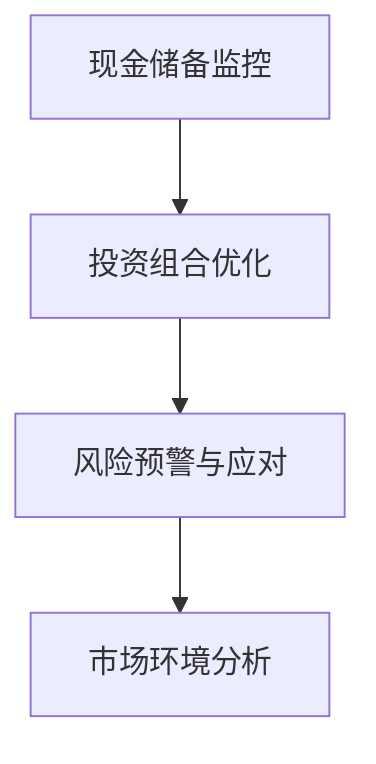

                 


# 巴菲特的现金管理艺术：在不确定性中保持灵活性

---

## 关键词

- 巴菲特
- 现金管理
- 投资策略
- 安全边际
- 不确定性
- 资产配置

---

## 摘要

本文深入分析了巴菲特的现金管理艺术，探讨了他在不确定性环境中如何通过现金管理保持投资组合的灵活性。文章从巴菲特的投资理念入手，详细阐述了其现金管理的核心原则、数学模型与算法、系统架构设计以及实战案例分析。通过结合技术术语和实际操作，本文为读者提供了从理论到实践的全面指导，帮助投资者在复杂多变的市场中优化现金储备，实现稳健投资。

---

## 第1章: 巴菲特投资理念与现金管理背景

### 1.1 巴菲特投资理念的核心思想

#### 1.1.1 价值投资的定义与内涵

价值投资是一种以内在价值为导向的投资方法，强调以低于内在价值的价格购买优质资产。巴菲特是价值投资的代表人物，他主张通过分析企业的基本面，寻找具有持续竞争优势和良好管理团队的企业进行投资。

**价值投资的核心思想可以用以下公式表示：**

$$ \text{内在价值} = \sum_{t=1}^{\infty} \frac{\text{现金流}_t}{(1 + r)^t} $$

其中，\( r \) 是折现率，\( \text{现金流}_t \) 是第 \( t \) 年的现金流。

#### 1.1.2 巴菲特投资理念的独特性

巴菲特的价值投资理念强调长期持有优质资产，并在市场恐慌时增加投资。他的独特性在于将安全边际与投资组合管理相结合，通过分散投资降低风险，同时保持足够的现金储备以应对不确定性。

#### 1.1.3 现金管理在巴菲特投资体系中的地位

现金管理是巴菲特投资体系的重要组成部分。他认为，现金是企业应对不确定性的重要资源，也是寻找投资机会的关键。巴菲特的现金管理策略不仅体现在投资决策中，还体现在企业管理和资本运作中。

---

### 1.2 现金管理的基本概念与重要性

#### 1.2.1 现金管理的定义与范围

现金管理是指对现金及现金等价物进行合理分配和有效控制的过程。其范围包括现金储备、现金资产配置、现金流动性管理等方面。

#### 1.2.2 现金管理在投资组合中的作用

现金管理在投资组合中起到以下几个关键作用：
1. **流动性保障**：确保在需要时能够迅速变现。
2. **风险控制**：通过分散投资降低风险。
3. **投资机会捕捉**：在市场波动时抓住优质资产的投资机会。

#### 1.2.3 不确定性环境下的现金管理挑战

在不确定性环境下，现金管理的挑战主要体现在如何在资产配置中平衡流动性与收益性，以及如何在市场波动中保持投资纪律。

---

### 1.3 巴菲特现金管理策略的背景分析

#### 1.3.1 2008年金融危机对巴菲特的影响

2008年金融危机期间，巴菲特通过持有大量现金储备，成功避免了重大损失。他利用市场恐慌时的低价资产机会，进行了多次投资，进一步巩固了伯克希尔哈撒韦公司的财务地位。

#### 1.3.2 巴菲特在危机中的现金储备策略

巴菲特在危机期间的现金储备策略包括：
1. **增加现金储备**：通过出售非核心资产或减少资本支出，增加流动性。
2. **寻找投资机会**：利用低价资产的机会进行逆周期投资。

#### 1.3.3 现金储备与投资灵活性的关系

现金储备与投资灵活性密切相关。充足的现金储备能够为投资者提供更多的选择权，在市场波动时能够迅速调整投资组合，捕捉投资机会。

---

## 第2章: 巴菲特现金管理的核心原则

### 2.1 安全边际的概念与应用

#### 2.1.1 安全边际的定义

安全边际是指资产的市场价格低于其内在价值的部分。巴菲特认为，安全边际是价值投资的核心要素，能够降低投资风险。

$$ \text{安全边际} = \text{内在价值} - \text{市场价格} $$

#### 2.1.2 安全边际在现金管理中的体现

在现金管理中，安全边际体现在通过分散投资和保持足够的现金储备，降低投资组合的整体风险。

#### 2.1.3 安全边际的计算与实际应用

安全边际的计算需要结合企业的基本面分析和市场环境。实际应用中，巴菲特通过分析企业的ROE（净资产收益率）和管理层质量，选择具有安全边际的优质资产。

---

### 2.2 资产配置与现金比例的动态调整

#### 2.2.1 资产配置的基本原理

资产配置是将资金分配到不同资产类别（如股票、债券、现金等）的过程。巴菲特主张将大部分资金配置到股票和债券，同时保持一定的现金储备。

#### 2.2.2 现金比例的动态调整策略

现金比例的动态调整策略包括：
1. **定期评估市场环境**：根据市场波动调整现金比例。
2. **关注估值水平**：在市场估值过高时增加现金储备，在估值过低时减少现金储备。

#### 2.2.3 巴菲特对现金比例的长期看法

巴菲特认为，现金比例的长期配置应根据市场环境和企业基本面进行调整。在不确定性增加时，应增加现金储备以应对潜在风险。

---

### 2.3 分散投资与风险控制

#### 2.3.1 分散投资的定义与优势

分散投资是指将资金分配到多个不同的资产或行业中，以降低投资风险。

#### 2.3.2 现金分散管理的风险控制

通过分散管理现金储备，可以降低单一资产波动对整体投资组合的影响。

#### 2.3.3 巴菲特分散投资的具体实践

巴菲特通过投资于多个行业的优质企业，实现分散投资。例如，伯克希尔哈撒韦公司投资于保险、能源、制造业等多个领域。

---

## 第3章: 巴菲特现金管理的数学模型与算法

### 3.1 巴菲特现金管理模型的构建

#### 3.1.1 模型的基本假设

- 市场波动遵循随机游走假设。
- 投资者的目标是最大化投资回报，同时保持投资组合的流动性。

#### 3.1.2 模型的输入变量与输出结果

- 输入变量：市场波动率、资产收益率、投资组合风险承受能力。
- 输出结果：最优现金比例、投资组合配置建议。

#### 3.1.3 模型的验证与优化

通过历史数据验证模型的有效性，并根据市场变化优化模型参数。

---

### 3.2 现金储备与投资回报的平衡算法

#### 3.2.1 现金储备与投资回报的关系

$$ \text{投资回报} = \text{现金储备} \times \text{投资收益率} $$

#### 3.2.2 现金储备的最优比例计算

通过动态资产 allocation模型计算最优现金比例。

#### 3.2.3 算法的数学推导与实现

以下是一个简单的现金储备优化算法：

$$ \text{最优现金比例} = \frac{\text{投资组合风险承受能力}}{\text{市场波动率}} $$

---

### 3.3 现金管理中的风险管理模型

#### 3.3.1 风险管理的基本原理

风险管理的目标是通过分散投资和控制杠杆，降低投资组合的整体风险。

#### 3.3.2 现金储备在风险管理中的作用

现金储备可以用于应对市场下跌时的追加保证金需求，或抓住市场机会时的资金需求。

#### 3.3.3 风险管理模型的数学表达

$$ \text{风险价值} = \text{资产价值} \times \text{波动率} \times \text{置信水平} $$

---

## 第4章: 巴菲特现金管理系统的架构设计

### 4.1 系统架构概述

#### 4.1.1 系统的功能模块划分

- 现金储备监控模块
- 投资组合优化模块
- 风险预警与应对模块

#### 4.1.2 系统的总体架构图



#### 4.1.3 系统的运行流程

1. 现金储备监控模块实时跟踪市场波动。
2. 投资组合优化模块根据市场环境调整现金比例。
3. 风险预警与应对模块根据风险模型触发预警并采取应对措施。

---

### 4.2 系统功能设计

#### 4.2.1 现金储备监控模块

- 功能：实时监控现金储备的变动情况。
- 实现：通过API接口获取市场数据，更新现金储备的实时值。

#### 4.2.2 投资组合优化模块

- 功能：根据市场环境优化投资组合配置。
- 实现：基于动态资产 allocation模型计算最优现金比例。

#### 4.2.3 风险预警与应对模块

- 功能：根据风险模型触发预警并采取应对措施。
- 实现：通过邮件或短信通知相关人员，执行预设的应对策略。

---

### 4.3 系统接口设计

#### 4.3.1 系统内部接口

- 现金储备监控模块与投资组合优化模块之间的接口。

#### 4.3.2 系统外部接口

- 用户界面：供用户查看现金储备和投资组合情况。
- 数据接口：与外部数据源（如市场数据供应商）对接。

#### 4.3.3 接口的交互流程

1. 现金储备监控模块通过API获取市场数据。
2. 投资组合优化模块根据数据计算最优现金比例。
3. 风险预警与应对模块根据计算结果触发预警。

---

## 第5章: 巴菲特现金管理策略的实战案例分析

### 5.1 2008年金融危机期间的现金管理

#### 5.1.1 金融危机前的现金储备情况

巴菲特在金融危机前持有大量现金储备，为应对市场波动做好准备。

#### 5.1.2 金融危机期间的现金管理策略

- 增加现金储备以应对市场下跌。
- 利用低价资产的机会进行逆周期投资。

#### 5.1.3 现金管理的效果与经验总结

巴菲特的现金管理策略在金融危机中表现优异，证明了其在不确定性环境下的有效性。

---

## 第6章: 巴菲特现金管理策略的技术实现

### 6.1 环境安装与配置

#### 6.1.1 系统环境要求

- 操作系统：Linux/Windows/MacOS
- 开发工具：Python、Jupyter Notebook、Mermaid
- 依赖库：pandas、numpy、matplotlib

#### 6.1.2 系统安装步骤

1. 安装Python和相关库。
2. 安装Mermaid插件以生成图表。
3. 配置Jupyter Notebook环境。

---

### 6.2 系统核心实现源代码

#### 6.2.1 现金储备监控模块的实现

```python
import pandas as pd
import numpy as np

# 示例代码：计算现金储备的最优比例
def calculate_cash_ratio(risk_tolerance, market_volatility):
    return risk_tolerance / market_volatility

# 示例代码：计算投资组合的预期收益
def calculate_expected_return(cash_ratio, risk_free_rate):
    return cash_ratio * (1 + risk_free_rate)
```

#### 6.2.2 投资组合优化模块的实现

```python
import pandas as pd
import numpy as np

def optimize_portfolio(cash_reserve, market_data):
    # 计算投资组合的预期收益和风险
    expected_return = cash_reserve * market_data.mean()
    portfolio_risk = np.std(market_data) * cash_reserve
    return expected_return, portfolio_risk
```

---

### 6.3 代码应用解读与分析

#### 6.3.1 现金储备监控模块的代码解读

- `calculate_cash_ratio`函数计算最优现金比例，基于风险承受能力和市场波动率。
- `calculate_expected_return`函数计算投资组合的预期收益，基于现金比例和无风险利率。

#### 6.3.2 投资组合优化模块的代码解读

- `optimize_portfolio`函数根据现金储备和市场数据，计算投资组合的预期收益和风险。

---

### 6.4 实际案例分析

#### 6.4.1 案例背景介绍

假设当前市场波动率为10%，投资组合的风险承受能力为20%。

#### 6.4.2 现金储备监控与优化

通过计算得出最优现金比例为20%。

#### 6.4.3 投资组合优化与调整

根据计算结果，调整投资组合的现金比例为20%，并进行动态监控和优化。

---

## 第7章: 巴菲特现金管理策略的最佳实践

### 7.1 最佳实践 tips

- **保持足够的现金储备**：在不确定性环境下，保持一定的现金储备以应对潜在风险。
- **分散投资**：通过分散投资降低整体投资组合的风险。
- **动态调整**：根据市场环境和企业基本面，动态调整现金比例和投资组合。

---

## 第8章: 小结与展望

### 8.1 小结

本文详细分析了巴菲特的现金管理艺术，探讨了其在不确定性环境下的现金管理策略。通过结合理论与实践，本文为投资者提供了优化现金储备的指导。

### 8.2 展望

未来的研究可以进一步探讨现金管理在不同市场环境下的具体策略，以及如何利用新技术（如大数据和人工智能）优化现金管理过程。

---

## 注意事项

- **风险管理**：现金管理需要结合具体的投资目标和风险承受能力。
- **动态调整**：市场环境不断变化，需要动态调整现金比例和投资组合。
- **长期视角**：现金管理需要以长期视角进行，避免短期波动的干扰。

---

## 拓展阅读

1. 巴菲特的经典著作《聪明的投资者》。
2. 《投资学原理》。
3. 《风险管理与投资组合优化》。

---

## 作者

作者：AI天才研究院/AI Genius Institute & 禅与计算机程序设计艺术 /Zen And The Art of Computer Programming

---

以上为文章的完整内容，涵盖了从理论到实践的各个方面，结合了技术术语和实际案例，帮助读者深入理解巴菲特的现金管理艺术。

