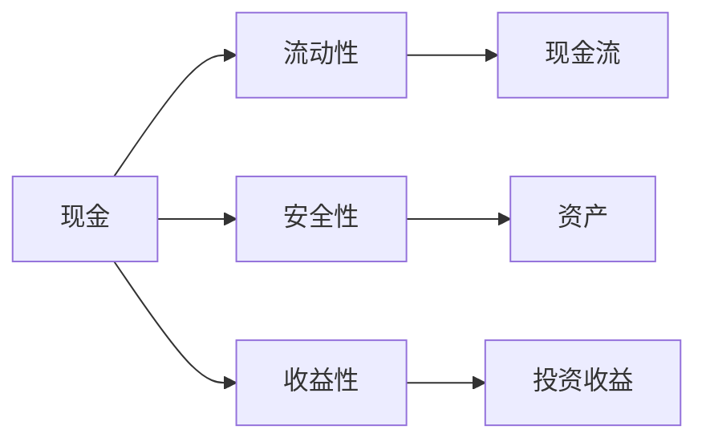
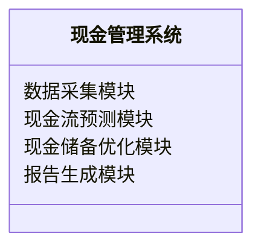
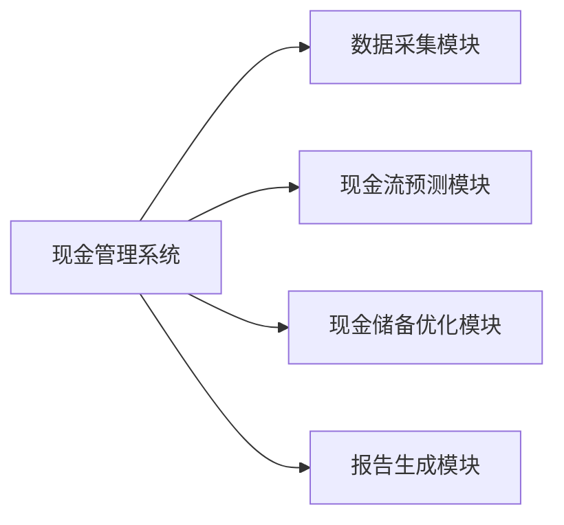
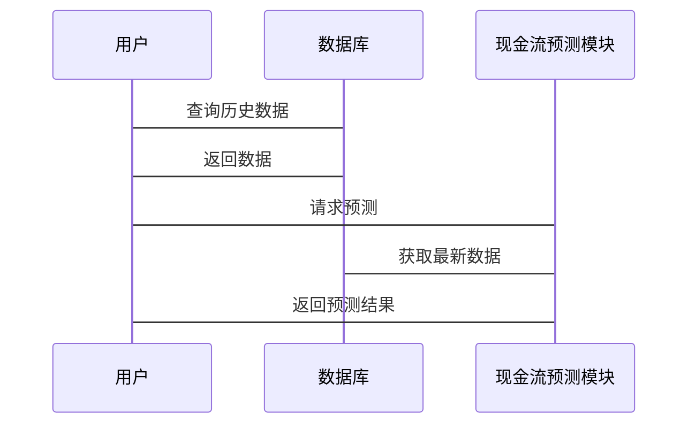

                 


# 巴菲特的现金管理：在负利率时代的新策略

## 关键词：
- 巴菲特
- 现金管理
- 负利率
- 投资策略
- 现金流
- 风险控制

## 摘要：
本文深入分析了巴菲特在负利率时代的现金管理策略，探讨了传统现金管理方法在负利率环境下的局限性，并提出了新的现金管理策略。通过结合技术分析与金融策略，本文详细阐述了现金管理的核心概念、算法原理、系统架构设计以及项目实战，为读者提供了在负利率时代优化现金管理的深度见解。

---

# 第一部分: 背景与现金管理基础

## 第1章: 负利率时代的金融背景

### 1.1 负利率时代的全球经济现状
#### 1.1.1 负利率的定义与现状
负利率是指中央银行将基准利率降至零以下，甚至向商业银行收取负存储费，以鼓励银行放贷和投资。当前全球经济环境下，多国央行实施负利率政策，如欧洲央行和日本央行。

#### 1.1.2 负利率对全球经济的影响
- 刺激借贷与投资
- 压缩银行利润
- 推高资产价格泡沫
- 增加政府债务负担

#### 1.1.3 负利率环境下的投资挑战
- 传统债券收益率下降
- 股票市场波动性增加
- 现金资产贬值风险

### 1.2 巴菲特的现金管理理念
#### 1.2.1 巴菲特的投资哲学
- 长期价值投资
- 企业基本面分析
- 避免过度杠杆

#### 1.2.2 巴菲特的现金管理策略
- 保持充足的现金储备
- 逆周期投资
- 避免盲目跟风

#### 1.2.3 巴菲特投资策略的核心要素
- 企业盈利能力
- 行业地位
- 管理层能力

### 1.3 现金管理的核心概念
#### 1.3.1 现金流的定义与分类
- 现金流：企业或个人在一定时期内的现金流入和流出。
- 分类：经营活动现金流、投资活动现金流、筹资活动现金流。

#### 1.3.2 现金储备的管理策略
- 短期储备：应对突发事件
- 长期储备：支持投资计划

#### 1.3.3 现金流动与资金链的关系
- 现金流动：资金在经济系统中的循环过程。
- 资金链：企业资金运作的循环链条，包括获取、分配和使用。

### 1.4 现金管理与投资策略的关系
#### 1.4.1 现金管理在投资组合中的位置
- 现金是投资组合的流动性资产
- 现金管理是投资策略的基础

#### 1.4.2 现金管理与风险控制的结合
- 现金储备用于应对市场波动
- 通过现金管理降低投资组合风险

#### 1.4.3 现金管理与收益最大化的关系
- 合理分配现金比例以平衡风险与收益
- 通过优化现金管理提高整体收益

### 1.5 本章小结
本章通过分析负利率时代的全球经济背景，介绍了巴菲特的现金管理理念，并详细阐述了现金管理的核心概念及其与投资策略的关系。

---

## 第2章: 现金管理的核心概念与联系

### 2.1 现金管理的核心概念
#### 2.1.1 现金流动性分析
- 流动性：资产快速转化为现金的能力。
- 现金流动性是现金管理的核心指标。

#### 2.1.2 现金安全性评估
- 安全性：现金资产的安全保障程度。
- 现金安全是现金管理的第一原则。

#### 2.1.3 现金收益性优化
- 收益性：现金资产的增值能力。
- 在负利率环境下，现金收益性面临挑战。

### 2.2 现金管理与投资策略的对比分析
#### 2.2.1 现金管理与股票投资的对比
- 现金：低风险、低收益
- 股票：高风险、高收益

#### 2.2.2 现金管理与债券投资的对比
- 现金：流动性高，风险低
- 债券：收益稳定，风险可控

#### 2.2.3 现金管理与另类投资的对比
- 现金：风险最低，但收益有限
- 另类投资：风险较高，收益潜力大

### 2.3 现金管理的ER实体关系图


### 2.4 本章小结
本章通过对比分析现金管理与其他投资策略的关系，构建了现金管理的ER实体关系图，强调了现金流动性、安全性和收益性的重要性。

---

## 第3章: 现金管理的算法原理

### 3.1 现金管理算法概述
#### 3.1.1 现金管理算法的目标
- 优化现金流预测
- 提高现金储备效率
- 降低投资风险

#### 3.1.2 现金管理算法的分类
- 基于时间序列的现金流预测算法
- 基于资产配置的现金储备优化算法

#### 3.1.3 现金管理算法的优缺点
- 优点：提高资金使用效率，降低投资风险
- 缺点：算法复杂度高，实施成本高

### 3.2 现金管理算法的数学模型
#### 3.2.1 现金流预测模型
$$F(t) = \sum_{i=1}^{n} w_i x_i$$

其中：
- $F(t)$ 表示第 $t$ 时刻的现金流预测值
- $w_i$ 表示第 $i$ 个特征的权重
- $x_i$ 表示第 $i$ 个特征的值

#### 3.2.2 现金储备优化模型
$$C^* = \frac{1}{2} \left( \frac{S}{T} \right)$$

其中：
- $C^*$ 表示最优现金储备量
- $S$ 表示安全边际
- $T$ 表示时间周期

### 3.3 现金管理算法的实现步骤
#### 3.3.1 数据收集与清洗
- 数据来源：历史交易数据、市场数据、财务报表
- 数据清洗：去除异常值、填补缺失值

#### 3.3.2 现金流预测与分析
- 使用时间序列模型（如ARIMA）进行预测
- 分析预测结果的置信区间

#### 3.3.3 现金储备优化与调整
- 根据预测结果调整现金储备
- 通过资产配置优化现金收益

### 3.4 现金管理算法的mermaid流程图


### 3.5 本章小结
本章通过数学模型和流程图，详细介绍了现金管理算法的原理和实现步骤，为后续的系统设计和项目实战奠定了基础。

---

## 第4章: 现金管理的系统分析与架构设计

### 4.1 问题场景介绍
- 背景：负利率环境下，传统现金管理方法效率低下
- 目标：优化现金管理流程，提高资金使用效率

### 4.2 项目介绍
- 项目名称：负利率环境下的现金管理优化系统
- 项目目标：通过技术手段优化现金管理策略

### 4.3 系统功能设计
#### 4.3.1 系统功能模块
- 数据采集模块
- 现金流预测模块
- 现金储备优化模块
- 报告生成模块

#### 4.3.2 系统功能的mermaid类图


### 4.4 系统架构设计
#### 4.4.1 系统架构的mermaid架构图


#### 4.4.2 系统接口设计
- 数据接口：与数据库交互
- 用户接口：提供数据输入和结果输出

#### 4.4.3 系统交互的mermaid序列图


### 4.5 本章小结
本章通过系统分析与架构设计，构建了一个负利率环境下的现金管理优化系统，为后续的项目实施提供了技术基础。

---

## 第5章: 项目实战

### 5.1 环境安装
- 操作系统：Windows 10 或更高版本
- 开发工具：Python 3.8+
- 库：pandas、numpy、scikit-learn

### 5.2 系统核心实现源代码
```python
import pandas as pd
from sklearn.linear_model import LinearRegression

# 数据加载
data = pd.read_csv('cash_flow.csv')

# 模型训练
model = LinearRegression()
model.fit(data[['time']], data['cash_flow'])

# 预测现金流
predicted_flow = model.predict([[current_time]])
```

### 5.3 代码应用解读与分析
- 数据加载：读取历史现金流数据
- 模型训练：使用线性回归模型进行现金流预测
- 预测现金流：基于当前时间预测未来现金流

### 5.4 实际案例分析
- 案例背景：某企业在负利率环境下的现金流管理
- 案例分析：通过模型预测现金流，优化现金储备

### 5.5 本章小结
本章通过实际案例分析，展示了如何在负利率环境下应用现金管理算法优化现金流管理。

---

## 第6章: 最佳实践与总结

### 6.1 本章小结
- 本文分析了负利率时代现金管理的挑战
- 提出了新的现金管理策略
- 通过技术手段优化了现金管理流程

### 6.2 注意事项
- 数据质量：确保数据准确性和完整性
- 模型选择：根据实际情况选择合适算法
- 风险控制：定期评估和调整现金管理策略

### 6.3 拓展阅读
- 推荐书籍：《巴菲特传》、《投资学》
- 推荐课程：量化投资、金融工程

### 6.4 作者信息
作者：AI天才研究院/AI Genius Institute  
联系邮箱：contact@aicourse.com  
个人博客：https://www.aicourse.com

---

**作者：AI天才研究院/AI Genius Institute**

