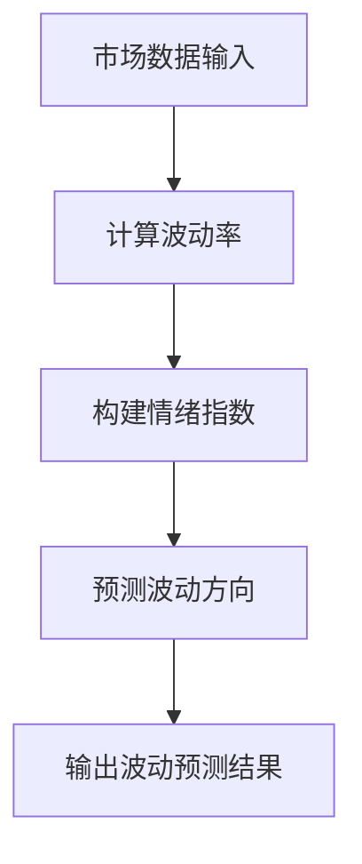
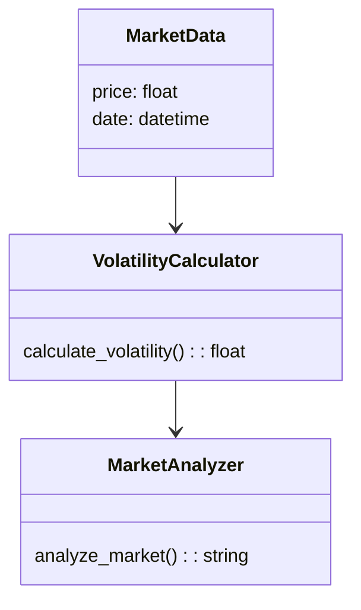
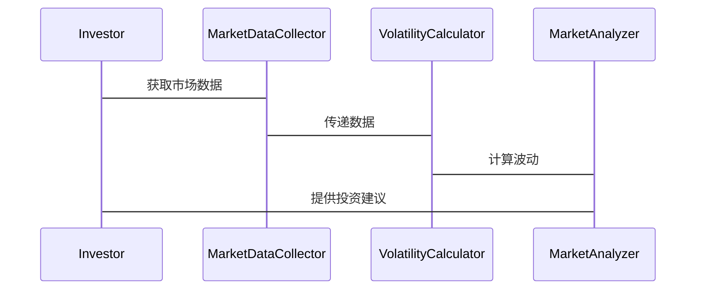

                 


# 巴菲特的看待市场波动的方式：短期投票机，长期称重机

## 关键词：巴菲特，市场波动，价值投资，短期投票机，长期称重机，投资策略

## 摘要：本文深入分析了巴菲特看待市场波动的独特视角，揭示了短期波动如投票机般反映投资者情绪，而长期波动则如称重机般衡量企业内在价值。通过理论阐述、算法解析和实际案例，本文为投资者提供了理解市场波动、制定投资策略的深度洞察。

---

# 第一部分: 巴菲特的市场波动理论基础

## 第1章: 巴菲特的市场波动理论概述

### 1.1 巴菲特的市场波动理论背景

#### 1.1.1 价值投资的核心理念

价值投资是一种长期投资策略，强调以低于内在价值的价格买入优质资产。巴菲特是这一理念的代表人物，他认为市场波动为投资者提供了以合理价格买入的机会。

#### 1.1.2 市场波动的定义与特征

市场波动指价格在短时间内偏离内在价值的现象，通常由投资者情绪和市场心理驱动，具有周期性和非理性特征。

#### 1.1.3 巴菲特投资体系的演变

巴菲特的投资体系结合了价值投资和市场分析，强调安全边际和企业基本面分析。他的体系在长期实践中不断完善，形成了独特的市场波动观。

### 1.2 巴菲特的短期投票机与长期称重机

#### 1.2.1 短期波动的投票机特性

短期波动反映市场参与者的投票行为，投资者情绪主导价格波动，如恐慌或乐观引发的价格涨跌。

#### 1.2.2 长期波动的称重机特性

长期波动反映企业的内在价值，优质企业通过时间的检验，价格最终回归其真实价值。

#### 1.2.3 投票机与称重机的对比分析

通过对比分析，短期波动由情绪驱动，长期波动由价值决定。投资者应关注长期价值，避免短期波动的干扰。

### 1.3 巴菲特市场波动理论的核心要素

#### 1.3.1 市场波动的周期性

市场波动呈现周期性，投资者需识别周期并利用波动获利。

#### 1.3.2 市场波动的非理性特征

市场参与者情绪波动导致价格偏离价值，提供投资机会。

#### 1.3.3 投资者情绪对波动的影响

情绪波动影响市场定价，投资者应保持理性，避免受情绪影响。

### 1.4 巴菲特理论的实际应用

#### 1.4.1 理论在投资决策中的作用

帮助投资者识别短期波动，抓住长期价值投资机会。

#### 1.4.2 理论对投资组合的影响

优化资产配置，降低短期波动风险，增强长期收益。

#### 1.4.3 理论的局限性与适用场景

适用于长期投资者，短期交易者需谨慎。

## 1.5 本章小结

总结巴菲特的市场波动理论，强调长期价值的重要性，指导投资者制定合理策略。

---

# 第二部分: 市场波动的核心概念与联系

## 第2章: 市场波动的核心概念分析

### 2.1 波动与价值的关系

#### 2.1.1 波动对价值的影响

短期波动反映情绪，长期波动反映真实价值。

#### 2.1.2 价值对波动的反作用

优质资产价格回归价值，波动最终反映真实价值。

#### 2.1.3 波动与价值的动态平衡

波动与价值相互作用，形成动态平衡。

### 2.2 投票机与称重机的实体关系图

#### 2.2.1 投票机的实体关系分析

短期波动由投资者情绪驱动，影响市场定价。

#### 2.2.2 称重机的实体关系分析

长期波动反映企业价值，价格回归内在价值。

#### 2.2.3 投票机与称重机的对比表格

| 特性      | 投票机（短期波动） | 称重机（长期波动） |
|-----------|--------------------|--------------------|
| 驱动力    | 投资者情绪          | 企业基本面          |
| 时间框架  | 短期               | 长期               |
| 影响因素  | 市场情绪、新闻       | 企业业绩、经济指标  |

---

# 第三部分: 市场波动的算法原理与数学模型

## 第3章: 波动预测的算法原理

### 3.1 波动预测的核心算法

#### 3.1.1 基于均值回归的波动预测

假设价格回归均值，预测未来波动。

#### 3.1.2 基于随机游走的波动预测

价格变化无规律，波动随机。

#### 3.1.3 基于机器学习的波动预测

使用历史数据训练模型，预测波动。

### 3.2 波动预测的数学模型

#### 3.2.1 波动率的计算公式

$$ \sigma = \sqrt{\frac{1}{n}\sum_{i=1}^{n}(x_i - \mu)^2} $$

其中，$\sigma$为波动率，$x_i$为价格，$\mu$为平均值。

#### 3.2.2 市场情绪指数的构建

使用投资者情绪数据，构建指数反映市场情绪。

#### 3.2.3 波动与收益的关系模型

$$ R = \alpha + \beta \times \sigma $$

其中，$R$为收益，$\alpha$为截距，$\beta$为波动率的系数。

### 3.3 波动预测的流程图



### 3.4 波动预测的Python实现

```python
import numpy as np
import pandas as pd

def calculate_volatility(prices):
    returns = prices.pct_change()
    volatility = np.std(returns)
    return volatility

# 示例数据
prices = pd.read_csv('market_data.csv')
volatility = calculate_volatility(prices['price'])
print("波动率:", volatility)
```

---

# 第四部分: 系统分析与架构设计

## 第4章: 投资决策系统的架构设计

### 4.1 问题场景介绍

投资者需在波动市场中做出决策，系统需帮助分析波动，优化投资策略。

### 4.2 系统功能设计

#### 4.2.1 领域模型mermaid类图



#### 4.2.2 系统架构设计mermaid架构图

```mermaid
container 投资决策系统 {
    MarketDataCollector
    VolatilityCalculator
    MarketAnalyzer
    InvestmentStrategy
}
MarketDataCollector --> VolatilityCalculator
VolatilityCalculator --> MarketAnalyzer
MarketAnalyzer --> InvestmentStrategy
```

### 4.3 系统接口设计

定义接口，如数据输入、波动计算和策略生成，确保系统模块化。

### 4.4 系统交互mermaid序列图



---

# 第五部分: 项目实战

## 第5章: 波动预测的实战分析

### 5.1 环境安装

安装Python、Pandas、NumPy和Matplotlib。

### 5.2 核心实现

实现波动计算和预测模型，使用历史数据训练。

### 5.3 案例分析

分析具体市场数据，验证模型预测效果。

### 5.4 总结

总结实战经验，优化模型，提高预测准确性。

---

# 第六部分: 最佳实践与小结

## 第6章: 最佳实践与注意事项

### 6.1 投资策略 tips

- 长期投资，避免短期波动干扰。
- 选择优质资产，分散投资降低风险。

### 6.2 小结

总结全文，强调巴菲特市场波动理论的重要性，指导投资决策。

### 6.3 注意事项

- 谨慎使用算法模型，结合基本面分析。
- 风险管理，控制仓位，避免过度波动影响。

### 6.4 拓展阅读

推荐相关书籍和资源，深入学习市场波动理论。

---

# 作者：AI天才研究院/AI Genius Institute & 禅与计算机程序设计艺术 /Zen And The Art of Computer Programming

---

通过系统的分析和实际案例，本文深入探讨了巴菲特的市场波动理论，为投资者提供了有价值的见解和策略。希望读者能从中获益，制定更明智的投资决策。

