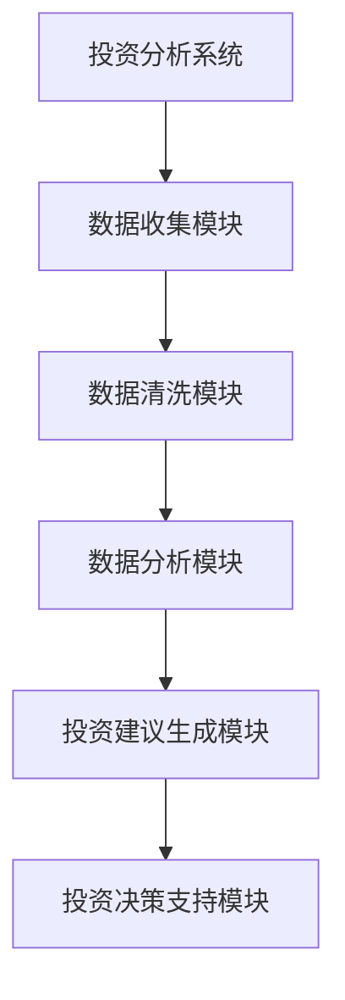

                 


# 巴菲特的石油行业投资逻辑：必需品的魅力

---

## 关键词

- 巴菲特投资逻辑  
- 石油行业  
- 必需品投资  
- 价值投资  
- 风险管理  

---

## 摘要

本文深入分析了巴菲特在石油行业的投资逻辑，探讨了石油作为必需品的投资魅力。通过分析石油行业的特点、巴菲特的核心投资理念、投资策略以及风险管理方法，结合实际案例和系统架构设计，为投资者提供了全面的视角和实用的指导。

---

## 第1章：背景介绍

### 1.1 石油行业的特点

石油作为全球最重要的能源之一，具有以下特点：

- **资源垄断性**：石油资源的分布不均衡，主要集中在少数国家和地区。
- **需求刚性**：石油是几乎所有经济活动的基础，需求相对稳定且刚性。
- **周期性波动**：受供需关系、地缘政治和经济周期影响，价格波动较大。
- **高资本密集度**：石油勘探、开采和 refining 需要巨额投资。

### 1.2 巴菲特的投资理念

巴菲特的价值投资理念强调以下几点：

- **长期视角**：关注企业的长期价值，而非短期市场波动。
- **企业基本面**：分析企业的财务状况、盈利能力、管理层质量等。
- **安全边际**：买入价格低于企业内在价值，以降低风险。

---

## 第2章：巴菲特投资逻辑的核心概念

### 2.1 石油行业的特点

石油行业的特点决定了其作为必需品的投资价值：

- **需求刚性**：无论经济好坏，石油需求相对稳定。
- **供给集中**：少数巨头控制全球大部分石油产量。
- **周期性波动**：价格波动为投资者提供了低位买入的机会。

### 2.2 巴菲特的选股标准

巴菲特选股的三大标准：

1. **财务健康**：企业具有稳定的现金流、低负债率、高利润率。
2. **管理层质量**：管理层诚实可靠，具有长期 vision。
3. **企业护城河**：企业具有竞争优势，能够长期保持盈利能力。

### 2.3 石油行业的投资逻辑

石油行业的投资逻辑可以总结为以下几点：

- **长期视角**：石油作为必需品，长期需求稳定。
- **供需分析**：关注全球石油供需平衡，预测价格走势。
- **企业基本面评估**：选择财务健康、管理优秀、具有竞争优势的企业。

---

## 第3章：巴菲特的石油投资策略

### 3.1 价值投资的基本原则

- **买入优质资产**：选择具有长期竞争优势的石油企业。
- **安全边际**：买入价格低于企业内在价值。
- **长期持有**：耐心持有优质资产，享受复利效应。

### 3.2 石油行业的分析方法

- **行业分析**：研究全球石油供需、价格走势、地缘政治风险。
- **企业分析**：分析企业的财务状况、管理层质量、竞争优势。
- **市场分析**：关注市场情绪、短期价格波动。

### 3.3 投资组合的构建

- **分散投资**：将资金分散投资于不同石油企业，降低风险。
- **长期持有**：避免频繁交易，降低交易成本。
- **动态调整**：根据市场变化和企业基本面，动态调整投资组合。

### 3.4 风险管理

- **行业风险**：关注石油行业的周期性波动，避免在周期高点投资。
- **企业风险**：选择财务健康、管理优秀的企业，降低企业风险。
- **市场风险**：关注市场情绪和短期价格波动，避免过度杠杆。

---

## 第4章：案例分析

### 4.1 典型案例：ExxonMobil

- **公司简介**：ExxonMobil是全球最大的石油公司之一，具有强大的财务实力和竞争优势。
- **财务分析**：公司财务健康，现金流稳定，利润率高。
- **投资价值**：公司具有长期竞争优势，是巴菲特的理想投资标的。

### 4.2 典型案例：BP

- **公司简介**：BP是英国最大的石油公司，具有全球化的业务布局。
- **财务分析**：公司财务状况良好，但曾因漏油事件影响形象。
- **投资价值**：公司具有强大的竞争优势，但需关注企业风险管理。

### 4.3 典型案例：Saudi Aramco

- **公司简介**：沙特阿美是全球最大的石油公司，掌握着全球最大的石油储备。
- **财务分析**：公司财务状况极其健康，现金流充裕。
- **投资价值**：公司具有强大的竞争优势，是巴菲特的理想投资标的。

---

## 第5章：系统架构

### 5.1 投资分析系统设计

- **数据收集模块**：收集全球石油价格、企业财务数据、行业新闻等。
- **分析模块**：对数据进行清洗、分析，生成投资建议。
- **决策支持模块**：根据分析结果，提供投资决策支持。

### 5.2 系统架构图



---

## 第6章：项目实战

### 6.1 环境安装

- **Python安装**：安装Python 3.8及以上版本。
- **数据收集工具**：安装requests库、BeautifulSoup库等。
- **数据分析工具**：安装pandas、numpy等。

### 6.2 核心代码实现

```python
import pandas as pd
import numpy as np
import requests
from bs4 import BeautifulSoup

# 下载数据
def download_data(url):
    response = requests.get(url)
    return response.text

# 数据清洗
def clean_data(html):
    soup = BeautifulSoup(html, 'html.parser')
    data = []
    for row in soup.find_all('tr'):
        cols = row.find_all('td')
        data.append([col.text for col in cols])
    return data

# 数据分析
def analyze_data(data):
    df = pd.DataFrame(data)
    df.columns = ['Date', 'Price', 'Volume']
    return df

# 投资建议生成
def generate_recommendation(df):
    # 简单的移动平均线策略
    df['SMA_20'] = df['Price'].rolling(20).mean()
    df['SMA_50'] = df['Price'].rolling(50).mean()
    df['Recommendation'] = np.where(df['SMA_20'] > df['SMA_50'], 'Buy', 'Sell')
    return df

# 主函数
def main():
    url = 'https://example.com/oil_prices'
    html = download_data(url)
    data = clean_data(html)
    df = analyze_data(data)
    recommendation = generate_recommendation(df)
    print(recommendation)

if __name__ == '__main__':
    main()
```

### 6.3 案例分析

以沙特阿美为例，分析其财务数据和市场表现：

1. **财务数据**：公司财务状况健康，现金流充裕。
2. **市场表现**：公司股价表现稳定，具有长期上涨潜力。
3. **投资建议**：建议长期持有，享受复利效应。

### 6.4 项目总结

- **项目成果**：构建了一个简单的石油行业投资分析系统，能够提供投资建议。
- **项目意义**：帮助投资者更好地理解石油行业的投资逻辑，做出更明智的投资决策。

---

## 第7章：总结与展望

### 7.1 总结

- 巴菲特的投资逻辑强调长期视角、企业基本面分析和风险管理。
- 石油作为必需品，具有稳定的市场需求和长期投资价值。
- 通过系统化的分析和风险管理，可以在石油行业中获得稳定的投资回报。

### 7.2 展望

- 随着全球能源结构的变化，石油行业的投资逻辑将面临新的挑战和机遇。
- 投资者需要不断学习和适应，抓住新的投资机会。

---

## 作者：AI天才研究院/AI Genius Institute & 禅与计算机程序设计艺术 /Zen And The Art of Computer Programming

