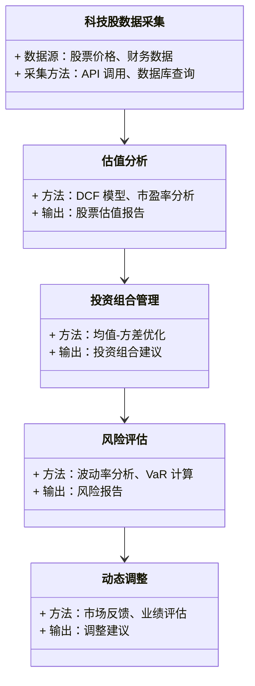

                 


# 巴菲特的科技股投资：从回避到拥抱

---

## 关键词：巴菲特，科技股，投资策略，价值投资，成长投资，风险管理

---

## 摘要：  
本文深入探讨了巴菲特从回避科技股到拥抱科技股的投资策略转变，分析了科技股的特点、投资逻辑以及巴菲特在科技股投资中的独特见解。文章结合了背景介绍、核心概念、算法原理、数学模型、系统分析、项目实战以及最佳实践，为读者提供了全面的视角，帮助理解巴菲特如何在科技股领域取得成功，并为未来的科技股投资提供了宝贵的启示。

---

## 正文

---

### 第一部分：背景介绍

#### 第1章：巴菲特的投资理念与科技股的碰撞

##### 1.1 价值投资的起源与核心理念  
价值投资是由本杰明·格雷厄姆提出的投资理念，强调以低于内在价值的价格购买优质的公司股票。巴菲特早期的投资策略深受格雷厄姆的影响，他将价值投资的理念应用到实践中，专注于寻找具有安全边际、盈利能力稳定且估值合理的公司。然而，科技股的高增长性和高波动性与价值投资的核心理念似乎存在冲突，导致巴菲特早期对科技股持回避态度。

**对比表格：价值投资与成长投资的核心区别**

| **价值投资**            | **成长投资**            |
|-------------------------|-------------------------|
| 核心理念               | 寻找被市场低估的股票    | 寻找具有高增长潜力的股票 |
| 估值方法               | 基于内在价值的折价      | 基于未来现金流的溢价    |
| 风险管理               | 侧重于安全边际          | 侧重于成长空间和护城河  |

##### 1.2 科技股的特点与投资逻辑  
科技股的最大特点是其高增长性和高波动性。科技行业的特点是创新周期短、技术迭代快，因此科技股的估值往往基于未来盈利的预期，而非过去的业绩。与传统行业相比，科技股的护城河通常体现在技术壁垒、网络效应和数据优势上。然而，这也意味着科技股的风险更高，尤其是当技术变革未能达到预期时，股价可能会大幅波动。

**ER实体关系图：科技股的核心要素**

```mermaid
erDiagram
    巴菲特->科技股: 投资
    科技股->行业: 归属
    科技股->公司: 由...构成
    公司->管理层: 管理
    公司->护城河: 具备
    公司->估值模型: 使用
```

---

#### 1.3 巴菲特对芒格的影响与芒格对巴菲特的影响  
巴菲特的投资理念在很大程度上受到芒格的影响。芒格的多元思维模型和对科技行业的深刻理解为巴菲特提供了新的视角。芒格认为，科技行业的长期趋势是不可忽视的，尤其是在互联网和人工智能时代，科技股的投资机会将更加丰富。同时，巴菲特也通过芒格的科技视角重新审视了自己的投资策略，逐渐意识到科技股在现代经济中的重要地位。

---

### 第二部分：核心概念与联系

#### 第2章：科技股的核心概念与投资逻辑  

##### 2.1 科技股的核心概念  
科技股的核心概念包括技术创新、市场领导地位、网络效应和数据优势。这些因素共同构成了科技股的长期竞争优势，也是巴菲特在投资科技股时重点关注的方面。

**对比表格：科技股与传统股的核心区别**

| **科技股**               | **传统股**             |
|--------------------------|------------------------|
| 核心竞争优势           | 技术创新               | 产品成本优势           |
| 市场拓展方式           | 网络效应和数据驱动     | 地理扩张和渠道优势     |
| 估值方法               | 基于未来现金流的折现   | 基于当前盈利能力的折价  |

##### 2.2 科技股的投资逻辑  
科技股的投资逻辑强调长期增长潜力和护城河的稳定性。巴菲特在投资科技股时，注重公司的管理层能力、技术创新能力和市场领导地位。他认为，科技股的投资需要结合成长投资和价值投资的理念，既要关注公司的未来增长潜力，也要确保其估值的合理性。

---

### 第三部分：算法与数学模型

#### 第3章：科技股投资的算法与数学模型  

##### 3.1 科技股的估值算法  
科技股的估值通常采用动态评估方法，尤其是基于未来现金流的折现模型。以下是科技股的估值公式：

$$ V = \sum_{t=1}^{n} \frac{FCF_t}{(1 + r)^t} $$

其中，$FCF_t$ 是第 $t$ 年的自由现金流，$r$ 是折现率，$n$ 是预测的年数。

##### 3.2 科技股投资组合的优化算法  
为了降低科技股投资的风险，巴菲特采用投资组合优化策略，将科技股与其他行业的股票进行合理搭配。以下是投资组合优化的步骤：

1. 确定投资目标和风险偏好。
2. 收集科技股和其他行业的股票数据。
3. 计算每种股票的预期收益和风险（波动率）。
4. 使用均值-方差优化模型确定最优投资组合。

以下是均值-方差优化模型的数学表达：

$$ \min \sigma^2 \quad \text{subject to} \quad \mu \cdot w = T \quad \text{和} \quad w \cdot \mathbf{1} = 1 $$

其中，$\sigma^2$ 是投资组合的波动率，$\mu$ 是收益向量，$w$ 是权重向量，$T$ 是目标收益。

##### 3.3 科技股投资的动态调整算法  
科技股的投资需要动态调整，尤其是在技术变革和市场波动较大的情况下。以下是动态调整的步骤：

1. 定期评估持仓股票的业绩和市场表现。
2. 根据市场变化调整持仓权重。
3. 重新评估公司的护城河和管理层能力。
4. 根据评估结果进行买卖决策。

---

### 第四部分：系统分析与架构设计

#### 第4章：科技股投资的系统分析与架构设计  

##### 4.1 系统功能设计  
科技股投资系统的功能包括数据采集、估值分析、投资组合管理、风险评估和动态调整。

**领域模型（mermaid 类图）**



##### 4.2 系统架构设计  
科技股投资系统的架构设计采用分层架构，包括数据层、业务逻辑层和用户界面层。

**系统架构（mermaid 架构图）**

```mermaid
archimate
database "科技股数据库"
application "科技股分析系统"
provider "数据源"
 
database --> application
application --> provider
```

---

### 第五部分：项目实战

#### 第5章：科技股投资的实战案例  

##### 5.1 苹果公司的投资案例  
巴菲特对苹果的投资是其拥抱科技股的典型例子。以下是投资决策的关键点：

1. **护城河分析**：苹果的生态系统和品牌忠诚度构成了强大的护城河。
2. **管理层能力**：蒂姆·库克的领导能力和战略眼光是巴菲特投资的重要原因。
3. **估值模型**：使用DCF模型评估苹果的未来现金流，确认其估值的合理性。

##### 5.2 投资组合的代码实现  
以下是使用Python实现的投资组合管理代码：

```python
import pandas as pd
import numpy as np

def portfolio_optimization(returns, risk aversion):
    # 计算协方差矩阵
    covariance_matrix = returns.cov()
    
    # 计算最优权重
    mu = returns.mean()
    sigma = np.sqrt(covariance_matrix.values)
    
    # 均值-方差优化
    from scipy.optimize import minimize
    n = len(mu)
    init_guess = np.array([0.2] * n)
    constraints = [{'type': 'eq', 'fun': lambda w: np.sum(w) - 1.0}]
    result = minimize(lambda w: (w.T @ covariance_matrix @ w), init_guess, 
                       method='SLSQP', constraints=constraints)
    
    return result.x

# 示例数据
returns = pd.DataFrame({
    '苹果': [0.1, 0.05, 0.15, 0.08],
    '微软': [0.08, 0.12, 0.05, 0.1],
    '亚马逊': [0.15, 0.1, 0.08, 0.05]
})

# 计算最优投资组合
weights = portfolio_optimization(returns, 0.05)
print("最优权重:", weights)
```

---

### 第六部分：最佳实践与小结

#### 第6章：科技股投资的最佳实践  

##### 6.1 最佳实践 tips  
1. **长期视角**：科技股的投资需要长期视角，关注公司的护城河和管理层能力。
2. **风险管理**：合理配置投资组合，降低科技股的高波动性风险。
3. **动态调整**：定期评估持仓，根据市场变化进行动态调整。

##### 6.2 小结  
巴菲特从回避科技股到拥抱科技股的投资策略转变，体现了他对市场变化的敏锐洞察和对投资理念的灵活调整。科技股的投资需要结合成长投资和价值投资的理念，注重长期增长潜力和估值的合理性。

---

## 附录  

##### 附录 A：参考文献  
1. 巴菲特股东大会 transcripts  
2. 格雷厄姆《证券分析》  
3. 芒格《Poor Charlie's Almanack》  

##### 附录 B：科技股投资工具推荐  
1. Python + Pandas：数据处理和分析工具。  
2. Matplotlib/Seaborn：数据可视化工具。  
3. Scipy：统计分析和优化工具。  

---

## 作者：AI天才研究院/AI Genius Institute & 禅与计算机程序设计艺术 /Zen And The Art of Computer Programming

---

**注**：本文为技术博客文章，旨在通过背景介绍、核心概念、算法原理、系统分析、项目实战和最佳实践，全面解析巴菲特的科技股投资策略，为读者提供有价值的深度见解。

