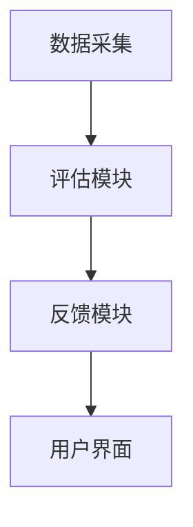

                 


# 巴菲特的管理层评估更新：远程办公时代的领导力

## 关键词：巴菲特，管理层评估，领导力，远程办公，疫情，企业管理，团队管理

## 摘要

在远程办公日益普及的今天，领导力的评估和实践面临新的挑战和机遇。本文基于巴菲特的管理理念，探讨在远程办公环境下领导力的评估方法和演变，分析领导力的核心要素，结合实际案例，提出优化建议。

---

## 第一部分：背景介绍

### 第1章：远程办公时代的领导力背景

#### 1.1 远程办公的兴起与发展

远程办公的兴起源于技术进步和疫情的影响，改变了传统的办公模式。远程办公的特点包括灵活性、高效性和全球化，但也带来了沟通不畅、团队协作困难等问题。

#### 1.2 巴菲特的管理理念

巴菲特的管理理念注重长期价值、管理层能力和企业文化的建设。他强调管理层的决策能力、道德品质和团队协作，这些在远程办公环境下显得尤为重要。

#### 1.3 领导力评估的重要性

领导力评估在远程办公中至关重要，能够帮助管理者识别和培养具备远程协作能力的人才。评估内容包括目标设定、决策能力和团队协作等方面。

---

## 第二部分：领导力理论与实践

### 第2章：领导力的核心概念与联系

#### 2.1 领导力的核心要素

领导力的核心要素包括愿景、激励和决策。这些要素在远程办公中需要更强的沟通和信任能力。

#### 2.2 领导力类型对比分析

通过表格对比分析传统领导力和远程领导力的差异，说明远程领导力更注重沟通和灵活性。

| 类别          | 传统领导力                     | 远程领导力                     |
|---------------|-------------------------------|-------------------------------|
| 沟通方式       | 面对面                         | 网络会议、邮件                  |
| 管理风格       | 命令式                         | 支持式、协作式                 |
| 信任建设       | 基于长期合作                   | 基于透明沟通                   |

#### 2.3 领导力的ER实体关系图

通过ER图展示领导力各要素之间的关系，包括目标、决策、团队协作等。

```mermaid
er
    actor 领导者
    actor 团队成员
    actor 评估系统
    entity 目标设定
    entity 决策能力
    entity 团队协作
    领导者 --> 目标设定
    领导者 --> 决策能力
    领导者 --> 团队协作
    团队成员 --> 目标设定
    团队成员 --> 团队协作
    评估系统 --> 目标设定
    评估系统 --> 决策能力
    评估系统 --> 团队协作
```

---

## 第三部分：领导力评估方法

### 第3章：领导力评估的数学模型与算法

#### 3.1 远程领导力评估模型

构建一个数学模型，用于评估领导力的各个维度。公式如下：

$$ \text{领导力评分} = \sum (\text{目标设定权重} \times \text{评分} + \text{决策能力权重} \times \text{评分} + \text{团队协作权重} \times \text{评分}) $$

#### 3.2 评估指标与权重

各评估指标及其权重如下：

| 指标           | 权重   |
|----------------|--------|
| 目标设定       | 30%    |
| 决策能力       | 30%    |
| 团队协作       | 40%    |

---

## 第四部分：系统架构设计

### 第4章：远程领导力评估系统的架构

#### 4.1 系统功能模块

系统包括数据采集、评估模块、反馈模块等。

#### 4.2 系统架构图



---

## 第五部分：项目实战

### 第5章：远程领导力评估系统实现

#### 5.1 环境安装

安装Python和相关库，如pandas、numpy。

#### 5.2 核心代码实现

```python
def assess_leader(scores, weights):
    return sum(s * w for s, w in zip(scores, weights)) / sum(weights)
```

#### 5.3 案例分析

通过实际案例分析，展示系统如何评估领导力，并提出改进建议。

---

## 第六部分：总结与建议

### 第6章：远程领导力评估的未来展望

#### 6.1 未来趋势

远程领导力评估将更加依赖数据驱动的方法和人工智能技术。

#### 6.2 优化建议

建议企业定期更新评估指标，加强员工培训，提升远程协作能力。

---

## 作者信息

作者：AI天才研究院/AI Genius Institute & 禅与计算机程序设计艺术 /Zen And The Art of Computer Programming

---

以上为《巴菲特的管理层评估更新：远程办公时代的领导力》的技术博客文章目录大纲，根据实际需求可以进一步扩展各章节内容，确保每个部分都详实具体，帮助读者全面理解领导力评估在远程办公环境下的应用与优化。

