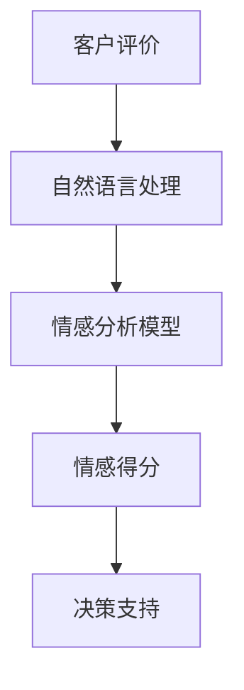
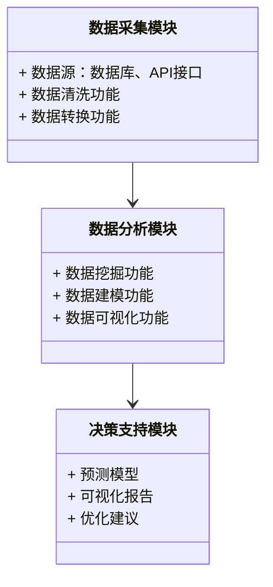
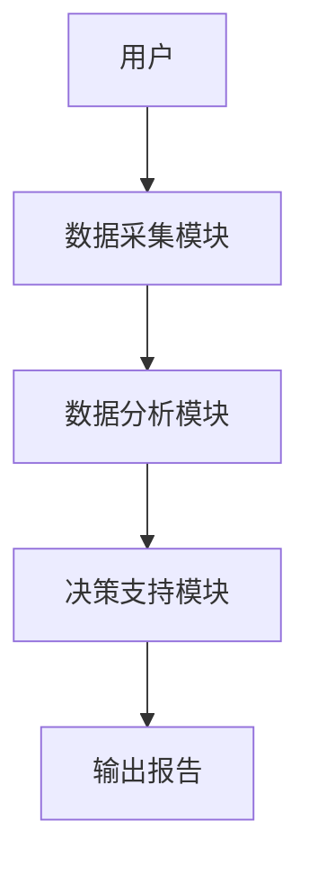
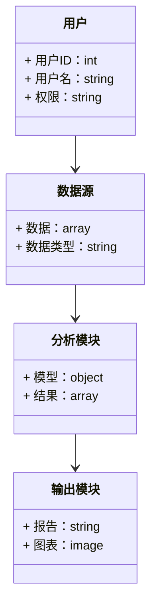
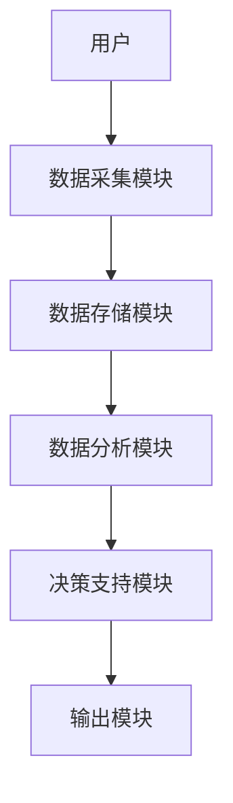
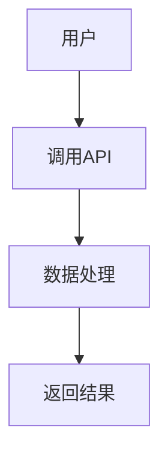

                 


# 巴菲特的管理层评估：人工智能辅助决策时代的领导力

## 关键词：领导力，人工智能，决策支持，巴菲特管理哲学，AI算法，系统架构

## 摘要：在人工智能辅助决策的时代，领导力的内涵和实践方式正在发生深刻的变化。本文从巴菲特的管理哲学出发，结合人工智能技术的核心算法和系统架构，详细探讨领导力在新时代的演变与挑战。通过分析领导力的核心要素、AI辅助决策的核心算法以及系统架构设计，本文提出了一种结合传统管理智慧与现代技术的新型领导力模型，并通过实际案例展示了其在现实中的应用。

---

# 第2章：领导力的核心要素与AI辅助决策的结合

## 2.1 领导力的核心要素分析

### 2.1.1 愿景与目标设定
愿景设定是领导力的首要任务。领导者需要明确组织的长期目标，并将其转化为可执行的短期目标。在传统管理中，愿景设定依赖于领导者的个人经验和直觉。然而，在AI辅助决策的时代，愿景设定可以通过数据分析和预测模型来优化。

#### 举例说明
假设一家公司希望进入新兴市场，传统的愿景设定可能依赖于市场调研和领导者的直觉。而借助AI，可以通过对市场趋势、竞争对手分析和消费者行为的预测，生成更科学的市场进入策略。

### 2.1.2 战略规划与执行
战略规划是将愿景转化为具体行动计划的关键步骤。AI可以通过数据挖掘和预测模型，帮助领导者识别潜在的风险和机会，从而优化战略执行。

#### 算法示例
我们可以使用线性回归模型来预测市场增长率，或者使用决策树算法来分析市场进入的最佳时机。以下是一个简单的线性回归模型：

$$ y = \beta_0 + \beta_1x + \epsilon $$

其中，$y$是市场增长率，$x$是时间变量，$\beta_0$和$\beta_1$是回归系数，$\epsilon$是误差项。

### 2.1.3 团队管理与激励
团队管理是领导力的核心要素之一。AI可以通过分析员工的行为数据和绩效数据，为领导者提供个性化的激励方案。

#### 实际应用
例如，通过分析员工的工作效率和情绪数据，AI可以推荐最佳的激励措施，如奖金、晋升机会或培训计划。

---

## 2.2 AI在领导力核心要素中的应用

### 2.2.1 数据驱动的决策支持
AI可以通过数据分析提供实时的决策支持。例如，自然语言处理（NLP）技术可以分析大量的文本数据，帮助领导者理解客户反馈和市场趋势。

#### 算法示例
我们可以使用情感分析模型来分析客户对产品的评价。以下是情感分析模型的简单流程：



### 2.2.2 智能化的团队管理
AI可以通过机器学习算法分析员工的行为数据，帮助领导者更好地管理团队。例如，使用聚类分析来识别高绩效员工的特征。

#### 算法示例
聚类分析是一种常用的机器学习算法，用于将数据分成若干组。以下是聚类分析的数学模型：

$$ \text{目标函数} = \sum_{i=1}^{n} \sum_{j=1}^{k} w_{ij}d_{ij} $$

其中，$w_{ij}$是样本$i$属于簇$j$的概率，$d_{ij}$是样本$i$与簇$j$中心的距离。

### 2.2.3 预测性战略规划
AI可以通过预测模型帮助领导者制定更具前瞻性的战略规划。例如，使用时间序列分析预测市场需求。

#### 算法示例
时间序列分析是一种常用的方法，以下是ARIMA模型的简单形式：

$$ ARIMA(p, d, q) $$

其中，$p$是自回归阶数，$d$是差分阶数，$q$是移动平均阶数。

---

## 2.3 领导力核心要素与AI的对比分析

### 2.3.1 传统领导力的特点
传统领导力依赖于个人经验和直觉，具有一定的主观性和不确定性。

### 2.3.2 AI辅助决策的特点
AI辅助决策基于数据和算法，具有客观性和可重复性。

### 2.3.3 两者的结合与互补
通过结合传统领导力的直觉和AI的客观性，领导者可以在决策过程中实现优势互补。

---

## 2.4 本章小结

本章通过分析领导力的核心要素，探讨了AI在这些要素中的应用。我们发现，AI可以通过数据驱动的决策支持、智能化的团队管理和预测性战略规划，帮助领导者提高决策效率和准确性。然而，传统领导力的直觉和经验仍然不可替代，两者需要有机结合。

---

# 第3章：AI辅助决策的核心算法与数学模型

## 3.1 数据驱动的决策支持算法

### 3.1.1 线性回归模型
线性回归是一种简单但强大的预测模型。以下是线性回归的数学公式：

$$ y = \beta_0 + \beta_1x + \epsilon $$

其中，$y$是目标变量，$x$是自变量，$\beta_0$和$\beta_1$是回归系数，$\epsilon$是误差项。

### 3.1.2 逻辑回归模型
逻辑回归常用于分类问题。以下是逻辑回归的公式：

$$ P(y=1|x) = \frac{e^{\beta_0 + \beta_1x}}{1 + e^{\beta_0 + \beta_1x}} $$

---

## 3.2 机器学习算法的实现

### 3.2.1 简单线性回归的Python实现

```python
import numpy as np
from sklearn.linear_model import LinearRegression

# 生成数据
X = np.array([1, 2, 3, 4, 5]).reshape(-1, 1)
y = np.array([2, 4, 5, 4, 5])

# 训练模型
model = LinearRegression()
model.fit(X, y)

# 预测
print(model.predict([[6]]))  # 输出：[[7.5]]
```

### 3.2.2 逻辑回归的Python实现

```python
from sklearn.linear_model import LogisticRegression
from sklearn.metrics import accuracy_score
from sklearn.datasets import make_classification

# 生成数据
X, y = make_classification(n_samples=100, n_features=2, n_classes=2)

# 训练模型
model = LogisticRegression()
model.fit(X, y)

# 预测
y_pred = model.predict(X)
print("准确率：", accuracy_score(y, y_pred))  # 输出准确率
```

---

## 3.3 系统架构与实现

### 3.3.1 系统功能设计
以下是系统功能设计的类图：



### 3.3.2 系统架构设计
以下是系统架构设计的架构图：



---

## 3.4 项目实战

### 3.4.1 环境安装
需要安装Python和相关的库，如scikit-learn、numpy和pandas。

### 3.4.2 核心代码实现

```python
import numpy as np
import pandas as pd
from sklearn.linear_model import LinearRegression
from sklearn.metrics import mean_squared_error

# 加载数据
data = pd.read_csv('data.csv')

# 数据预处理
X = data[['feature1', 'feature2']]
y = data['target']

# 训练模型
model = LinearRegression()
model.fit(X, y)

# 预测
y_pred = model.predict(X)

# 评估模型
print('均方误差：', mean_squared_error(y, y_pred))
```

---

## 3.5 小结

本章通过具体的算法实现和系统架构设计，展示了AI辅助决策的核心算法与数学模型。通过Python代码的实现，读者可以更好地理解这些算法的应用场景和实现方式。

---

# 第4章：系统分析与架构设计方案

## 4.1 问题场景介绍

假设我们有一个公司，希望通过AI辅助决策来优化其市场进入策略。我们需要设计一个系统，帮助公司领导层制定市场进入计划。

---

## 4.2 系统功能设计

以下是领域模型类图：



---

## 4.3 系统架构设计

以下是系统架构图：



---

## 4.4 系统接口设计

以下是系统接口设计的时序图：



---

## 4.5 本章小结

本章通过系统分析与架构设计，展示了AI辅助决策系统的核心组成部分和交互流程。通过类图和时序图，读者可以更好地理解系统的整体架构和功能模块。

---

# 第5章：项目实战

## 5.1 实际案例分析

### 5.1.1 案例背景
假设我们有一个零售公司，希望通过AI辅助决策来优化其库存管理。

### 5.1.2 数据收集与预处理
我们需要收集销售数据、库存数据和市场数据，并进行清洗和转换。

### 5.1.3 模型训练与评估
使用随机森林算法进行销售预测，并评估模型的准确率。

### 5.1.4 系统实现与优化
通过Python代码实现模型，并进行优化。

---

## 5.2 核心代码实现

```python
import pandas as pd
from sklearn.ensemble import RandomForestRegressor
from sklearn.metrics import r2_score

# 加载数据
data = pd.read_csv('inventory.csv')

# 数据预处理
X = data[['sales', 'price', 'cost']]
y = data['inventory']

# 训练模型
model = RandomForestRegressor()
model.fit(X, y)

# 预测
y_pred = model.predict(X)

# 评估
print('R²得分：', r2_score(y, y_pred))
```

---

## 5.3 小结

本章通过实际案例分析和系统实现，展示了AI辅助决策在库存管理中的应用。通过Python代码的实现，读者可以更好地理解AI技术在实际项目中的应用。

---

# 第6章：最佳实践与注意事项

## 6.1 最佳实践

### 6.1.1 数据质量管理
确保数据的准确性和完整性。

### 6.1.2 模型选择与优化
根据实际需求选择合适的模型，并进行调优。

### 6.1.3 团队协作
AI辅助决策需要跨学科团队的协作，包括数据科学家、工程师和业务专家。

---

## 6.2 注意事项

### 6.2.1 数据隐私与安全
确保数据的安全性和合规性。

### 6.2.2 模型解释性
选择具有较高解释性的模型，以便更好地理解决策过程。

### 6.2.3 业务与技术的结合
AI技术需要与业务需求相结合，才能真正发挥其价值。

---

## 6.3 小结

本章总结了AI辅助决策的最佳实践和注意事项，帮助读者在实际应用中更好地管理和优化系统。

---

# 第7章：结论与展望

## 7.1 结论

本文从巴菲特的管理哲学出发，结合AI技术的核心算法和系统架构，探讨了领导力在新时代的演变与挑战。通过系统的分析和实际案例的展示，我们提出了一个结合传统管理智慧与现代技术的新型领导力模型。

---

## 7.2 展望

未来，随着AI技术的不断发展，领导力的实践方式将更加智能化和数据化。我们需要进一步研究AI在领导力中的应用，探索更多创新的领导力模型，以应对日益复杂的商业环境。

---

# 作者

作者：AI天才研究院/AI Genius Institute & 禅与计算机程序设计艺术/Zen And The Art of Computer Programming

