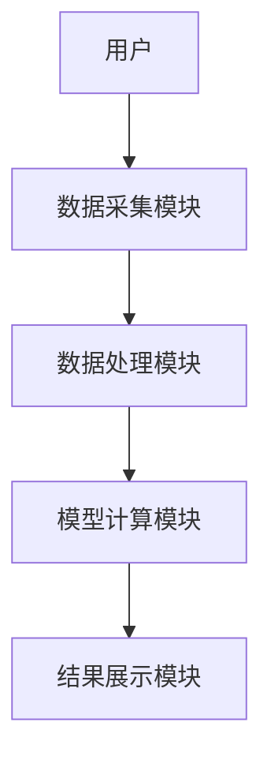

                 


# 巴菲特的管理层评估：远程办公时代的领导力新标准

## 关键词：远程办公，领导力，管理层评估，巴菲特，领导力新标准

## 摘要：本文探讨了在远程办公时代，领导力的新标准如何演变，结合巴菲特的管理层评估体系，分析了如何在远程环境中有效评估和提升领导力。文章从背景、核心概念、算法原理、系统设计、项目实战到最佳实践，全面解析领导力评估的新方法，为远程团队管理者提供实用的指导。

---

# 第一部分: 远程办公时代的领导力挑战与变革

## 第1章: 远程办公的兴起与领导力的转型

### 1.1 远程办公的兴起

#### 1.1.1 远程办公的定义与发展

远程办公是一种工作模式，允许员工在家中或其他地点通过互联网连接到公司系统，完成工作任务。随着技术的进步，尤其是互联网和协作工具的发展，远程办公在21世纪初开始迅速普及。新冠疫情的爆发进一步推动了远程办公的普及，使其成为企业运营的重要模式。

#### 1.1.2 远程办公对企业管理的影响

远程办公对传统的管理模式提出了挑战。企业需要适应新的管理方式，包括如何确保员工的工作效率、如何维护团队协作、如何进行有效的沟通与反馈等。这些变化促使企业管理者重新思考领导力的实践方式。

#### 1.1.3 远程办公与领导力的关联

领导力在远程办公环境中显得尤为重要。领导者需要具备更强的沟通能力、自我管理能力和团队协作能力，以应对远程工作中的挑战。领导者的作用从传统的“监督”转向更注重“赋能”和“支持”。

---

### 1.2 领导力在远程办公环境下的挑战

#### 1.2.1 远程团队管理的难点

远程团队管理面临的主要挑战包括：

- **沟通障碍**：缺乏面对面的交流可能导致信息传递不准确，团队成员之间的理解出现偏差。
- **信任问题**：远程环境下，领导者难以直接监督员工的工作，可能导致对员工的不信任。
- **协作效率**：远程团队的协作效率可能低于面对面团队，尤其是在需要快速决策和紧密合作的情况下。

#### 1.2.2 传统领导力在远程环境中的局限性

传统领导力模式依赖于面对面的互动和现场管理，这种模式在远程办公中显得力不从心。传统的命令-控制型领导方式难以适应远程团队的需求，团队成员需要更多的自主权和灵活性。

#### 1.2.3 远程环境下领导力的新需求

在远程办公环境下，领导力需要具备以下新能力：

- **数字化沟通能力**：能够有效使用视频会议、即时通讯工具等进行沟通。
- **远程协作能力**：能够利用协作工具（如项目管理软件、共享文档）管理团队任务。
- **心理支持能力**：能够关注团队成员的心理状态，提供情感支持和职业发展指导。

---

## 第2章: 巴菲特的管理层评估体系

### 2.1 巴菲特的管理理念

#### 2.1.1 巴菲特投资哲学的核心

巴菲特的投资哲学以“价值投资”为核心，强调长期持有优质资产，关注企业的内在价值和管理层的质量。他认为，优秀的管理层是企业成功的关键因素之一。

#### 2.1.2 巴菲特对管理层的评价标准

巴菲特对管理层的评价标准包括以下几个方面：

- **道德品质**：管理层必须诚实守信，具备良好的职业道德。
- **管理能力**：管理层需要具备优秀的决策能力和执行力。
- **长期导向**：管理层应该关注企业的长期发展，而不是短期利益。
- **创新能力**：在快速变化的市场环境中，管理层需要具备创新能力和适应能力。

#### 2.1.3 巴菲特管理哲学的演变

随着时代的发展，巴菲特的管理哲学也在不断演变。特别是在远程办公时代，他更加注重管理层的远程协作能力和数字化管理能力。

---

### 2.2 巴菲特管理层评估体系的框架

#### 2.2.1 评估体系的核心要素

巴菲特的管理层评估体系主要包括以下核心要素：

- **道德品质**：评估管理层的诚信和职业道德。
- **管理能力**：评估管理层的决策能力和执行能力。
- **创新能力**：评估管理层在变化环境中的适应能力和创新意识。
- **团队协作**：评估管理层在团队中的协作能力和领导能力。

#### 2.2.2 评估体系的实施方法

评估体系的实施方法包括：

- **定量评估**：通过具体的数据和指标（如团队绩效、项目完成情况）进行评估。
- **定性评估**：通过面谈、反馈和观察等方式进行评估。
- **综合评估**：将定量和定性评估结果结合起来，得出最终的评估结论。

#### 2.2.3 评估体系的优缺点分析

评估体系的优点在于能够全面、客观地评估管理层的能力，缺点在于实施起来较为复杂，需要投入大量的资源和时间。

---

## 第3章: 领导力新标准的核心要素

### 3.1 领导力新标准的定义

#### 3.1.1 新标准与传统标准的区别

领导力新标准与传统标准的主要区别在于：

- **目标导向**：新标准更注重目标导向和结果导向，而不是过程导向。
- **数字化能力**：新标准更强调领导者具备数字化管理和远程协作能力。
- **适应性**：新标准更注重领导者在变化环境中的适应能力和创新能力。

#### 3.1.2 领导力新标准的核心特征

领导力新标准的核心特征包括：

- **数字化能力**：能够熟练使用数字化工具进行远程管理和协作。
- **目标导向**：注重目标的实现，而非过程的控制。
- **适应性**：能够快速适应变化，具备创新能力和灵活性。

#### 3.1.3 新标准的适用范围

新标准适用于所有远程办公环境下的领导者，包括企业高管、项目经理、团队领导等。

---

### 3.2 领导力新标准的关键维度

#### 3.2.1 沟通能力

在远程办公环境下，沟通能力是领导力的核心要素之一。领导者需要具备良好的数字化沟通能力，能够通过视频会议、即时通讯等工具与团队成员进行有效沟通。

#### 3.2.2 自我管理能力

领导者需要具备强大的自我管理能力，能够在远程环境下保持高效的工作状态，同时管理好自己的情绪和时间。

#### 3.2.3 团队协作能力

领导者需要具备团队协作能力，能够协调团队成员的工作，促进团队协作，确保项目顺利推进。

---

## 第4章: 领导力新标准的评估模型

### 4.1 评估模型的构建

#### 4.1.1 模型的设计思路

评估模型的设计思路是基于巴菲特的管理层评估体系，结合远程办公环境下的领导力新标准，构建一个综合评估模型。该模型包括以下几个步骤：

1. **确定评估维度**：包括沟通能力、自我管理能力、团队协作能力等。
2. **设定评估指标**：为每个评估维度设定具体的指标和权重。
3. **收集评估数据**：通过问卷调查、面谈等方式收集数据。
4. **计算综合得分**：根据权重和数据计算出综合得分。
5. **分析结果**：根据综合得分进行分析，得出评估结论。

#### 4.1.2 模型的输入与输出

模型的输入包括：

- **评估维度**：沟通能力、自我管理能力、团队协作能力。
- **评估指标**：每个维度的具体指标和权重。
- **评估数据**：通过问卷调查、面谈等方式收集的数据。

模型的输出包括：

- **综合得分**：每个领导者的综合得分。
- **评估结论**：基于综合得分的评估结论。

#### 4.1.3 模型的适用场景

该模型适用于远程办公环境下的领导力评估，特别是对于需要评估管理层的组织和企业。

---

### 4.2 评估模型的算法实现

#### 4.2.1 算法原理

评估模型的算法基于层次分析法（AHP），通过构建评估指标的层次结构，确定各指标的权重，最后计算出综合得分。具体步骤如下：

1. **构建层次结构**：将评估维度作为中间层，评估指标作为底层。
2. **确定各层权重**：通过专家评分法确定各层指标的权重。
3. **计算综合得分**：根据权重和数据计算出综合得分。

#### 4.2.2 算法实现的代码示例

```python
import numpy as np

# 定义层次分析法函数
def ahp(matrix, weights):
    normalized_matrix = matrix / matrix.sum(axis=0)
    weighted_matrix = normalized_matrix * weights
    total_score = weighted_matrix.sum(axis=1)
    return total_score

# 示例数据
matrix = np.array([
    [2, 3, 1],
    [1, 2, 4],
    [3, 1, 2]
])
weights = np.array([0.4, 0.3, 0.3])

# 计算综合得分
score = ahp(matrix, weights)
print(score)
```

#### 4.2.3 算法原理的数学模型

层次分析法的数学模型如下：

1. **构建比较矩阵**：对于每个评估维度，构建比较矩阵，表示各个指标之间的相对重要性。
2. **计算权重向量**：通过计算比较矩阵的最大特征值及其对应的特征向量，得到权重向量。
3. **计算综合得分**：根据权重向量和数据矩阵，计算出综合得分。

---

## 第5章: 领导力新标准的系统分析与架构设计

### 5.1 系统分析

#### 5.1.1 问题场景介绍

在远程办公环境下，领导者需要具备数字化沟通能力、目标导向和适应性能力。为了评估这些能力，我们需要构建一个综合评估系统。

#### 5.1.2 系统功能设计

系统功能设计包括以下几个方面：

- **数据采集**：通过问卷调查、面谈等方式采集数据。
- **数据处理**：对采集的数据进行清洗和预处理。
- **模型计算**：利用层次分析法计算综合得分。
- **结果展示**：将评估结果以图表形式展示。

---

### 5.2 系统架构设计

#### 5.2.1 系统架构图



#### 5.2.2 系统接口设计

系统接口设计包括：

- **数据采集接口**：用于采集评估数据。
- **数据处理接口**：用于对数据进行清洗和预处理。
- **模型计算接口**：用于计算综合得分。
- **结果展示接口**：用于展示评估结果。

---

## 第6章: 领导力新标准的项目实战

### 6.1 项目环境安装

为了实现领导力评估系统，需要安装以下工具和库：

- **Python**：编程语言。
- **NumPy**：用于数值计算。
- **Matplotlib**：用于数据可视化。

安装命令：

```bash
pip install numpy matplotlib
```

---

### 6.2 核心代码实现

以下是领导力评估系统的核心代码：

```python
import numpy as np
import matplotlib.pyplot as plt

def ahp(matrix, weights):
    normalized_matrix = matrix / matrix.sum(axis=0)
    weighted_matrix = normalized_matrix * weights
    total_score = weighted_matrix.sum(axis=1)
    return total_score

# 示例数据
matrix = np.array([
    [2, 3, 1],
    [1, 2, 4],
    [3, 1, 2]
])
weights = np.array([0.4, 0.3, 0.3])

score = ahp(matrix, weights)
print(score)

# 绘制柱状图
plt.bar(range(len(score)), score)
plt.title('领导力评估得分')
plt.xlabel('评估对象')
plt.ylabel('得分')
plt.show()
```

---

### 6.3 案例分析与解读

通过上述代码，我们可以计算出领导者的综合得分，并以柱状图的形式展示评估结果。这种方法可以帮助我们直观地了解领导者的优缺点，从而为领导力提升提供依据。

---

## 第7章: 领导力新标准的最佳实践

### 7.1 最佳实践 tips

- **持续学习**：领导者需要不断学习新的技能，以适应远程办公环境的变化。
- **数字化工具**：熟练使用数字化工具，如视频会议软件、项目管理工具等。
- **团队协作**：注重团队协作，促进团队成员之间的沟通与合作。

### 7.2 小结

通过本文的分析，我们可以看到，领导力新标准在远程办公时代的重要性。领导者需要具备数字化能力、目标导向和适应性能力，才能在远程环境下取得成功。

### 7.3 注意事项

- **数据隐私**：在远程办公环境下，需要注意数据隐私和安全。
- **文化适应**：领导者需要具备跨文化管理能力，以适应不同背景的团队成员。

### 7.4 拓展阅读

- **《远程办公：未来的工作方式》**：探讨远程办公的未来发展趋势。
- **《领导力的数字化转型》**：分析领导力在数字化转型中的角色和作用。

---

## 作者

作者：AI天才研究院/AI Genius Institute & 禅与计算机程序设计艺术/Zen And The Art of Computer Programming

