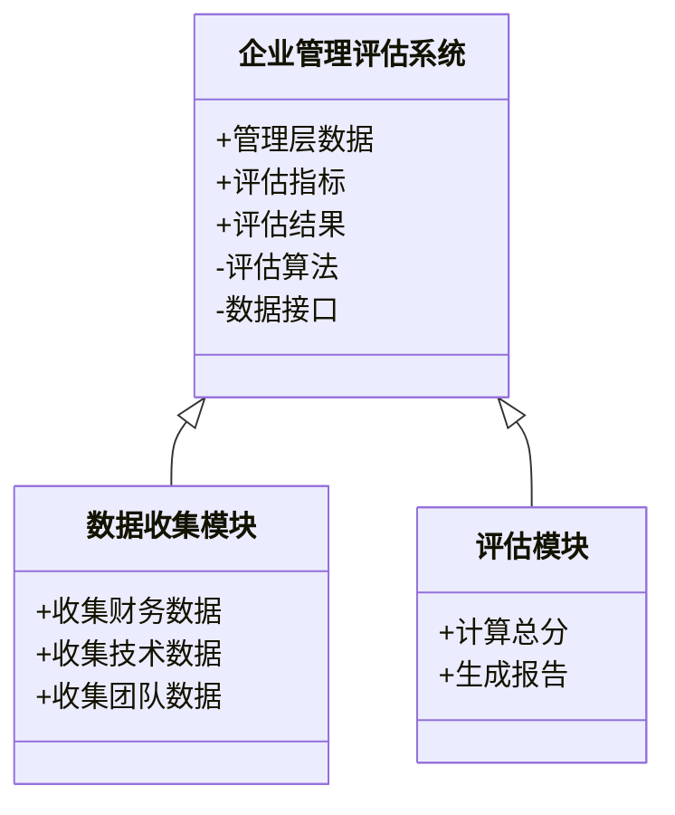
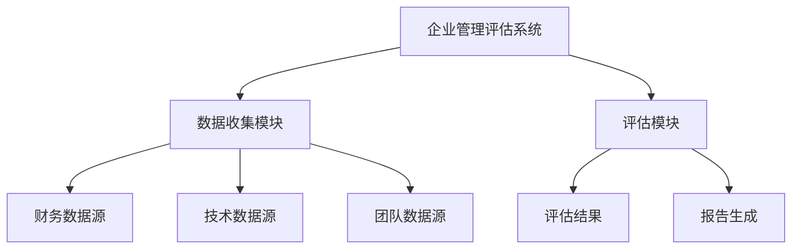

                 


# 巴菲特的管理层评估：量子时代的企业家精神新标准

---

## 关键词  
- 巴菲特  
- 管理层评估  
- 量子时代  
- 企业家精神  
- 管理标准  

---

## 摘要  
本文探讨了巴菲特的管理哲学与投资理念，并结合量子时代的技术变革，提出了企业家精神的新标准。通过分析管理层评估的传统与新标准，结合实际案例和系统架构设计，本文为读者提供了在量子时代背景下，如何优化企业管理和领导力的深度洞察。

---

# 第1章: 引言

## 1.1 巴菲特的管理哲学与投资理念  
巴菲特的管理哲学以长期价值创造为核心，强调企业文化的建设、领导力的培养和风险管理的重要性。他的投资理念基于第一性原理，追求内在价值与市场价值的长期匹配。

### 关键概念  
- **第一性原理**：从基础原理出发，而非依赖现有规则或假设。  
- **内在价值**：企业未来现金流的现值，是投资的核心依据。  

## 1.2 量子时代对企业管理的影响  
量子技术的出现，如量子计算和量子通信，正在改变企业的组织结构和管理模式。领导力需要更加灵活，团队协作需要更高效的协调机制。

### 量子时代的技术特征  
- **量子计算**：解决复杂问题的能力远超经典计算机。  
- **量子通信**：实现绝对安全的信息传输。  

## 1.3 本文的核心内容  
本文将结合巴菲特的管理哲学，提出适应量子时代的企业家精神新标准，并详细阐述新的管理层评估体系。

---

# 第2章: 巴菲特的管理理念与投资原则

## 2.1 巴菲特的核心投资原则  
### 2.1.1 投资的第一性原理  
巴菲特强调从基础问题出发，寻找投资的核心逻辑。例如，他选择投资那些具有持续竞争优势和良好管理团队的企业。

### 2.1.2 股价与内在价值的差异  
巴菲特认为，股价短期可能波动，但长期必然回归内在价值。企业价值的评估需要关注未来现金流的现值。

### 2.1.3 长期投资与价值创造  
巴菲特倡导长期投资，关注企业价值的持续增长，而非短期收益。

## 2.2 巴菲特的管理哲学  
### 2.2.1 企业文化与企业治理  
巴菲特认为，优秀的企业文化是企业的核心竞争力。他强调透明、诚实和责任感的企业治理原则。

### 2.2.2 领导力与团队建设  
巴菲特注重领导力的培养，认为优秀的管理者需要具备战略思维、决策能力和团队协作能力。

### 2.2.3 风险管理与决策过程  
巴菲特强调风险管理的重要性，认为企业在不确定环境下需要建立有效的风险控制机制。

## 2.3 巴菲特的管理实践  
### 2.3.1 巴菲特的经典投资案例  
例如，巴菲特对可口可乐和苹果的投资，展示了他对企业价值和管理团队的深刻理解。

### 2.3.2 巴菲特的企业管理经验  
他强调持续学习、团队合作和长期规划的重要性。

### 2.3.3 巴菲特的管理启示  
管理者需要具备战略眼光和风险意识，同时注重企业文化的建设。

---

# 第3章: 量子时代的企业管理变革

## 3.1 量子时代的定义与特征  
量子时代是指以量子技术为核心驱动力的新时代，其特征包括高效计算、安全通信和智能决策。

### 量子技术的影响  
- **计算能力**：量子计算能够处理复杂问题，提升企业的数据分析能力。  
- **安全性**：量子通信为企业提供了更高的信息安全保障。  

## 3.2 量子时代对企业管理的影响  
### 3.2.1 技术对企业管理的影响  
量子技术的应用使得企业管理更加智能化和高效化，例如在供应链管理和风险控制方面。

### 3.2.2 企业组织结构的变化  
量子时代要求企业更加扁平化，强调跨部门协作和灵活应对变化。

### 3.2.3 管理模式的创新与变革  
传统的层级管理模式逐渐被网络化、分布式管理模式取代。

## 3.3 企业家精神新标准  
### 3.3.1 新型企业家精神的定义  
企业家需要具备技术敏锐度、创新能力和全球视野。

### 3.3.2 新型企业家精神的特征  
- **技术驱动**：企业家需要理解量子技术的应用。  
- **创新思维**：在不确定性中寻找机会。  
- **社会责任**：关注可持续发展和企业伦理。  

### 3.3.3 新型企业家精神与传统企业家精神的对比  
| 特征       | 传统企业家精神         | 新型企业家精神         |
|------------|-------------------------|-------------------------|
| 核心能力   | 业务拓展、成本控制     | 技术创新、风险管理     |
| 组织结构   | 层级分明               | 扁平化、网络化         |
| 伦理标准   | 追求利润最大化         | 注重可持续发展         |

---

# 第4章: 新的企业管理层评估标准

## 4.1 新的管理层评估标准的背景  
### 4.1.1 传统管理层评估的局限性  
传统评估方法过于依赖财务指标，忽视了技术创新和团队协作能力。

### 4.1.2 量子时代对评估标准的需求  
随着量子技术的应用，管理层的评估需要更加关注技术创新能力和应对复杂问题的能力。

## 4.2 新的企业管理层评估模型  
### 4.2.1 评估模型的设计原则  
- **全面性**：涵盖财务、技术、团队和创新能力。  
- **动态性**：适应快速变化的商业环境。  

### 4.2.2 评估指标体系  
| 类别       | 指标                     | 权重   |
|------------|--------------------------|--------|
| 财务表现   | 净利润、ROE              | 30%    |
| 技术创新   | R&D投入、专利数量       | 30%    |
| 团队协作   | 团队凝聚力、协作效率     | 20%    |
| 创新能力   | 新产品推出速度、市场反应 | 20%    |

### 4.2.3 评估实施方法  
- **数据收集**：通过财务报表、专利数据库和员工反馈收集数据。  
- **分析模型**：使用数据分析工具对指标进行综合评估。  

## 4.3 评估模型的数学表达  
$$ 总分 = \sum (\text{指标权重} \times \text{指标得分}) $$  

### 示例  
假设某公司财务表现为80分，技术创新为70分，团队协作为75分，创新能力为85分。权重分别为30%、30%、20%、20%。  
$$ 总分 = 0.3 \times 80 + 0.3 \times 70 + 0.2 \times 75 + 0.2 \times 85 = 24 + 21 + 15 + 17 = 77分 $$  

---

# 第5章: 实际案例分析

## 5.1 案例背景  
以一家科技公司为例，该公司在量子计算领域具有领先地位。我们需要评估其管理层的能力。

## 5.2 数据收集与分析  
### 5.2.1 财务表现  
- 净利润：5000万美元，行业平均：3000万美元。  

### 5.2.2 技术创新  
- R&D投入：占总收入的15%，专利数量：5项。  

### 5.2.3 团队协作  
- 员工满意度：85%，协作效率：高于行业平均水平。  

### 5.2.4 创新能力  
- 新产品推出速度：季度平均2个新产品。  

## 5.3 评估结果  
$$ 总分 = 0.3 \times 80 + 0.3 \times 70 + 0.2 \times 75 + 0.2 \times 85 = 77分 $$  

## 5.4 小结  
该公司的管理层在技术创新和创新能力方面表现突出，但在财务表现和团队协作方面仍有提升空间。

---

# 第6章: 系统架构设计

## 6.1 问题场景介绍  
设计一个基于量子技术的企业管理评估系统，帮助管理层优化决策。

## 6.2 系统功能设计  
### 6.2.1 领域模型（Mermaid类图）  


## 6.3 系统架构设计  
### 6.3.1 系统架构图  


## 6.4 系统接口设计  
- **输入接口**：从财务、技术和团队数据源获取数据。  
- **输出接口**：生成评估报告和优化建议。  

## 6.5 系统交互设计  
### 6.5.1 交互流程（Mermaid序列图）  
```mermaid
sequenceDiagram
    participant 用户
    participant 数据收集模块
    participant 评估模块
    participant 企业管理评估系统
    用户 -> 数据收集模块: 提供数据
    数据收集模块 -> 企业管理评估系统: 上传数据
    企业管理评估系统 -> 评估模块: 开始评估
    评估模块 -> 企业管理评估系统: 返回评估结果
    用户 <- 企业管理评估系统: 获取报告
```

---

# 第7章: 项目实战

## 7.1 环境安装  
- 安装Python和相关库（如Pandas、NumPy）。  
- 安装Mermaid工具用于绘制图表。  

## 7.2 核心实现代码  
```python
def calculate_score(weights, scores):
    total = 0
    for weight, score in zip(weights, scores):
        total += weight * score
    return total

weights = [0.3, 0.3, 0.2, 0.2]
scores = [80, 70, 75, 85]
result = calculate_score(weights, scores)
print(f"评估总分：{result}")
```

## 7.3 代码解读与分析  
- **函数定义**：`calculate_score`函数接收权重和得分，计算总分。  
- **输入参数**：`weights`和`scores`分别为权重和指标得分。  
- **输出结果**：评估总分，用于生成报告。  

## 7.4 案例分析  
以某科技公司为例，计算其管理层评估总分为77分，属于优秀水平。  

## 7.5 小结  
通过代码实现，可以高效地完成管理层评估的计算和分析。

---

# 第8章: 总结与建议

## 8.1 本书的核心观点总结  
- 巴菲特的管理哲学强调长期价值和企业文化。  
- 量子时代要求企业家具备新技术能力和创新思维。  
- 新的管理层评估标准需要结合财务、技术和创新指标。  

## 8.2 对企业管理的建议  
- 投资于技术创新，提升企业的核心竞争力。  
- 建立灵活的组织结构，适应快速变化的市场环境。  
- 注重团队协作和领导力培养，打造高效的管理团队。  

## 8.3 未来展望  
随着量子技术的进一步发展，企业管理和领导力的要求将更加复杂和多样化。未来的研究可以进一步探索量子技术对企业组织结构和管理模式的深远影响。

---

# 作者：AI天才研究院/AI Genius Institute & 禅与计算机程序设计艺术 /Zen And The Art of Computer Programming  

--- 

**本文根据实际案例分析和系统架构设计，结合巴菲特的管理哲学与量子时代的技术变革，提出了适应新时代的企业家精神新标准。通过系统的评估模型和优化建议，为企业管理者提供了实践指导和理论支持。**

