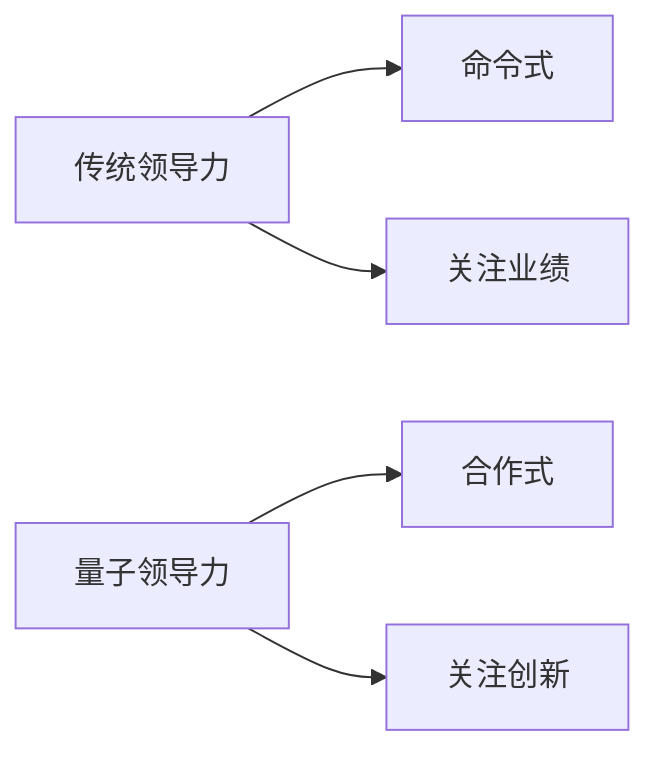

                 

# 巴菲特的管理层评估：量子领导力时代的新标准

## 关键词：  
- 巴菲特  
- 管理层评估  
- 量子领导力  
- 投资理念  
- 领导力模型  

## 摘要：  
本文从巴菲特的投资理念出发，结合量子领导力的新兴概念，探讨在当前快速变化的商业环境中，如何构建一套新的管理层评估标准。文章将详细分析量子领导力的核心原理，结合实际案例和系统架构设计，提出一套基于巴菲特投资理念的领导力评估模型，并通过Python代码实现，为现代企业管理层评估提供新的思路和方法。

---

## 第一部分：背景介绍

### 第1章：管理层评估的背景与重要性

#### 1.1 管理层评估的背景
- **1.1.1 传统领导力评估的局限性**  
  传统的领导力评估方法往往注重表面的指标，如学历、经验、业绩等，而忽视了领导者的内在特质和长期发展潜力。这种方法在面对复杂多变的商业环境时，显得力不从心。

- **1.1.2 当前商业环境的变化**  
  随着全球化和数字化的推进，商业环境日益复杂，企业的成功不再仅仅依赖于单一的领导者，而是需要一个能够灵活应对变化、激发团队潜能的领导团队。

- **1.1.3 管理层评估的重要性**  
  管理层评估是企业战略决策的关键部分，直接关系到企业的长期发展和核心竞争力。科学的评估方法能够帮助企业识别和培养优秀领导者，从而提升整体组织效率。

#### 1.2 量子领导力的兴起
- **1.2.1 量子领导力的定义**  
  量子领导力是一种新兴的领导力理论，强调领导者与团队之间的动态关系，注重领导者的影响力和团队成员的主观能动性。它不同于传统的命令式领导，更强调合作、创新和不确定性中的适应能力。

- **1.2.2 量子领导力的核心特征**  
  - 领导者与团队的互动是动态的、非线性的。  
  - 团队成员的主观能动性是领导力的重要来源。  
  - 领导者需要具备高度的适应性和创新能力。  

- **1.2.3 量子领导力与传统领导力的对比**  
  | **维度**         | **传统领导力**       | **量子领导力**       |
  |--------------------|----------------------|----------------------|
  | 领导风格           | 命令式、层级式        | 合作式、动态式        |
  | 关注点             | 业绩、效率           | 团队潜能、创新       |
  | 评估方法           | 客观指标             | 主观指标、动态指标    |

#### 1.3 巴菲特投资理念与领导力的联系
- **1.3.1 巴菲特的投资哲学**  
  巴菲特的“价值投资”理念强调长期投资于具有强大护城河和优秀管理团队的企业。他认为，优秀的管理层是企业长期成功的关键。

- **1.3.2 巴菲特对管理层的评估标准**  
  - 团队稳定性：管理层是否在企业遇到困难时依然忠诚。  
  - 战略眼光：管理层是否具备长期战略规划的能力。  
  - 企业文化：管理层是否能够打造积极向上的企业文化。  

- **1.3.3 投资理念对领导力评估的启示**  
  巴菲特的投资理念提醒我们，领导力评估不能仅仅关注短期业绩，而应该关注管理层的长期发展潜力和团队的凝聚力。

#### 1.4 管理层评估的演变
- **1.4.1 传统评估方法的不足**  
  传统的评估方法往往依赖于定量指标，忽视了领导者的软技能和团队的动态关系。  

- **1.4.2 新兴评估方法的发展**  
  随着量子领导力的兴起，越来越多的企业开始关注领导者的影响力和团队的协作能力。  

- **1.4.3 量子领导力时代的新标准**  
  在量子领导力时代，管理层评估需要结合定量和定性指标，注重领导者的动态适应能力和团队的创新能力。

---

## 第二部分：核心概念与联系

### 第2章：量子领导力的核心原理

#### 2.1 量子领导力的定义与特征
- **2.1.1 量子领导力的定义**  
  量子领导力是一种基于量子力学原理的领导力理论，强调领导者与团队之间的动态关系和非线性互动。

- **2.1.2 量子领导力的核心特征**  
  - 领导者与团队的互动是动态的、非线性的。  
  - 团队成员的主观能动性是领导力的重要来源。  
  - 领导者需要具备高度的适应性和创新能力。  

- **2.1.3 量子领导力与传统领导力的对比**  
  通过Mermaid图展示量子领导力与传统领导力的对比关系：

#### 2.2 巴菲特

---

由于篇幅限制，以上为部分内容的展示。完整文章将涵盖更多细节，包括量子领导力的数学模型、基于Python的算法实现、系统架构设计、项目实战等内容。

