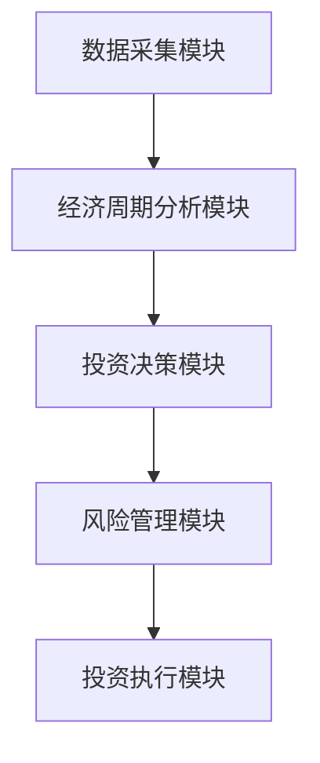
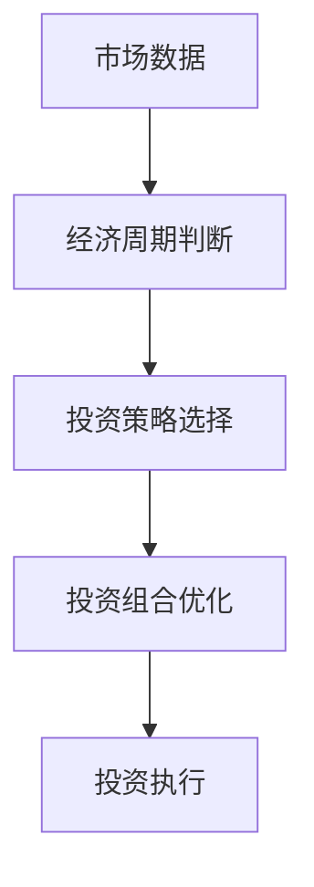

                 


# 巴菲特的经济周期投资：后疫情时代的经济复苏策略

## 关键词：巴菲特，价值投资，经济周期，后疫情时代，经济复苏，投资策略

## 摘要：本文深入分析了巴菲特的经济周期投资理论及其在后疫情时代的经济复苏策略。通过探讨巴菲特的价值投资理念、经济周期分析方法以及在不同经济阶段的投资策略，结合数学模型和系统架构设计，为投资者提供在后疫情时代进行经济复苏投资的理论支持和实践指导。

---

## 正文

### 第1章: 巴菲特投资理念概述

#### 1.1 巴菲特投资理念的核心思想

##### 1.1.1 价值投资的定义与核心要素
价值投资是一种以基本面分析为基础的投资策略，强调以低于内在价值的价格购买优质资产。其核心要素包括：
- **内在价值**：企业未来现金流的现值。
- **安全边际**：买入价格与内在价值之间的差距。
- **长期视角**：关注企业的长期盈利能力，而非短期市场波动。
- **优质企业**：选择具有强大竞争优势和良好管理的企业。

##### 1.1.2 巴菲特投资理念的独特性
巴菲特的价值投资理念独特之处在于其将经济周期与投资策略相结合。他认为，经济周期的波动为投资者提供了以更低价格买入优质资产的机会。他的投资策略注重安全边际和长期持有，强调在市场恐慌时寻找被低估的投资标的。

##### 1.1.3 价值投资与市场周期的关系
价值投资与市场周期密切相关。在市场繁荣时，价值投资者可能选择观望或卖出高估资产；在市场衰退时，他们则积极寻找被低估的优质资产。巴菲特强调，在市场恐慌时买入优质资产，能够在经济复苏时获得超额收益。

#### 1.2 经济周期与投资策略
##### 1.2.1 经济周期的定义与分类
经济周期通常分为四个阶段：衰退、恢复、增长和繁荣。每个阶段的特点如下：
- **衰退期**：GDP下降，企业盈利减少，市场情绪低落。
- **恢复期**：经济开始复苏，企业盈利逐步恢复。
- **增长期**：经济快速增长，企业盈利显著提升。
- **繁荣期**：市场过热，资产价格高估，经济可能出现泡沫。

##### 1.2.2 经济周期对投资决策的影响
经济周期的变化直接影响企业的盈利能力和资产价格。在衰退期，企业盈利下降，但优质资产的价格可能被低估；在增长期，企业盈利上升，资产价格也随之上涨。巴菲特认为，投资者应根据经济周期的阶段调整投资策略。

##### 1.2.3 巴菲特在不同经济周期中的投资策略
- **衰退期**：注重安全边际，选择被低估的优质资产。
- **恢复期**：逐步增加投资，寻找盈利能力恢复的企业。
- **增长期**：积极参与市场，抓住企业盈利上升的机会。
- **繁荣期**：保持谨慎，避免高估资产的投资。

### 第2章: 巴菲特经济周期投资理论的核心概念

#### 2.1 经济周期的阶段划分

##### 2.1.1 衰退期
衰退期的特点是GDP下降，企业盈利减少，市场情绪低落。巴菲特在衰退期的投资策略是寻找被低估的优质资产，注重安全边际。

##### 2.1.2 恢复期
恢复期的特点是经济开始复苏，企业盈利逐步恢复。巴菲特在恢复期的投资策略是逐步增加投资，寻找盈利能力恢复的企业。

##### 2.1.3 增长期
增长期的特点是经济快速增长，企业盈利显著提升。巴菲特在增长期的投资策略是积极参与市场，抓住企业盈利上升的机会。

##### 2.1.4 衰退期
衰退期的特点是GDP下降，企业盈利减少，市场情绪低落。巴菲特在衰退期的投资策略是寻找被低估的优质资产，注重安全边际。

#### 2.2 巴菲特投资策略的经济周期适应性

##### 2.2.1 价值投资在衰退期的应用
在衰退期，市场恐慌导致资产价格被低估，巴菲特利用这种恐慌情绪，选择具有强大竞争优势和良好管理的企业进行投资。

##### 2.2.2 增长期的投资机会
在增长期，企业盈利上升，资产价格也随之上涨。巴菲特注重选择那些具有长期增长潜力的企业，抓住市场增长的机会。

##### 2.2.3 经济周期波动中的风险管理
巴菲特强调风险管理的重要性，尤其是在经济周期波动中。他通过分散投资和注重安全边际来降低投资风险。

### 第3章: 巴菲特投资策略的数学模型与公式

#### 3.1 价值投资的核心公式

##### 3.1.1 内在价值计算公式
$$
\text{内在价值} = \frac{\text{现金流}}{\text{折现率}}
$$
内在价值是企业未来现金流的现值，反映了企业的实际价值。投资者应以低于内在价值的价格买入资产。

##### 3.1.2 安全边际计算公式
$$
\text{安全边际} = \text{内在价值} - \text{市场价格}
$$
安全边际是买入价格与内在价值之间的差距，反映了资产被低估的程度。巴菲特强调安全边际的重要性，认为它能够降低投资风险。

#### 3.2 经济周期波动的数学模型

##### 3.2.1 经济周期波动的正弦波模型
$$
\text{GDP波动} = A \cdot \sin(B \cdot t + C) + D
$$
该模型描述了经济周期波动的周期性特征，其中A是振幅，B是周期长度，C是相位，D是均值。

##### 3.2.2 投资回报与经济周期的相关性分析
$$
\text{相关系数} = \frac{\sum (x_i - \bar{x})(y_i - \bar{y})}{\sqrt{\sum (x_i - \bar{x})^2 \sum (y_i - \bar{y})^2}}
$$
相关系数反映了投资回报与经济周期之间的相关性。正相关系数表明经济周期波动与投资回报密切相关。

### 第4章: 巴菲特投资策略的系统架构设计

#### 4.1 投资系统功能设计

##### 4.1.1 数据采集模块
数据采集模块负责收集市场数据，包括企业财务数据、市场指数、经济指标等。

##### 4.1.2 经济周期分析模块
经济周期分析模块通过对历史数据的分析，判断当前经济周期所处的阶段。

##### 4.1.3 投资决策模块
投资决策模块根据经济周期分析结果和企业基本面分析，制定相应的投资策略。

##### 4.1.4 风险管理模块
风险管理模块通过分散投资和设定止损点，降低投资风险。

#### 4.2 系统架构图


#### 4.3 投资决策流程图


### 第5章: 巴菲特投资策略的项目实战

#### 5.1 环境配置
投资者需要配置以下环境：
- 数据来源：包括企业财务数据、市场指数、经济指标等。
- 投资工具：包括股票账户、债券账户等。

#### 5.2 核心代码实现

##### 5.2.1 内在价值计算
```python
def calculate_intrinsic_value(cash_flow, discount_rate):
    return cash_flow / discount_rate
```

##### 5.2.2 安全边际计算
```python
def calculate_margin_of_safety(intrinsic_value, market_price):
    return intrinsic_value - market_price
```

##### 5.2.3 经济周期判断
```python
def determine_economic_cycle(gdp_growth, unemployment_rate):
    if gdp_growth < -2 and unemployment_rate > 8:
        return "衰退期"
    elif -2 <= gdp_growth < 2 and unemployment_rate > 6:
        return "恢复期"
    elif gdp_growth >= 2 and gdp_growth < 4:
        return "增长期"
    else:
        return "繁荣期"
```

#### 5.3 案例分析

##### 5.3.1 案例选择
选择苹果公司作为案例，分析其在后疫情时代的投资价值。

##### 5.3.2 案例分析
1. **企业基本面分析**：苹果公司具有强大的品牌影响力和创新能力，财务状况稳健。
2. **内在价值计算**：假设现金流为1000亿美元，折现率为5%，则内在价值为2000亿美元。
3. **安全边际计算**：假设市场价格为1500亿美元，则安全边际为500亿美元。
4. **经济周期判断**：假设当前经济处于恢复期，则巴菲特的投资策略是逐步增加投资。

##### 5.3.3 投资建议
在后疫情时代，苹果公司具有长期增长潜力，巴菲特的投资策略是逐步增加投资，抓住企业盈利恢复的机会。

### 第6章: 总结

#### 6.1 投资启示
巴菲特的经济周期投资理论为投资者提供了在后疫情时代进行经济复苏投资的理论支持和实践指导。投资者应根据经济周期的阶段调整投资策略，注重安全边际和长期持有。

#### 6.2 未来展望
随着全球经济逐步复苏，巴菲特的经济周期投资理论将继续为投资者提供重要的指导。未来，投资者应密切关注经济周期的变化，灵活调整投资策略，抓住市场机会。

---

## 作者：AI天才研究院/AI Genius Institute & 禅与计算机程序设计艺术 /Zen And The Art of Computer Programming

