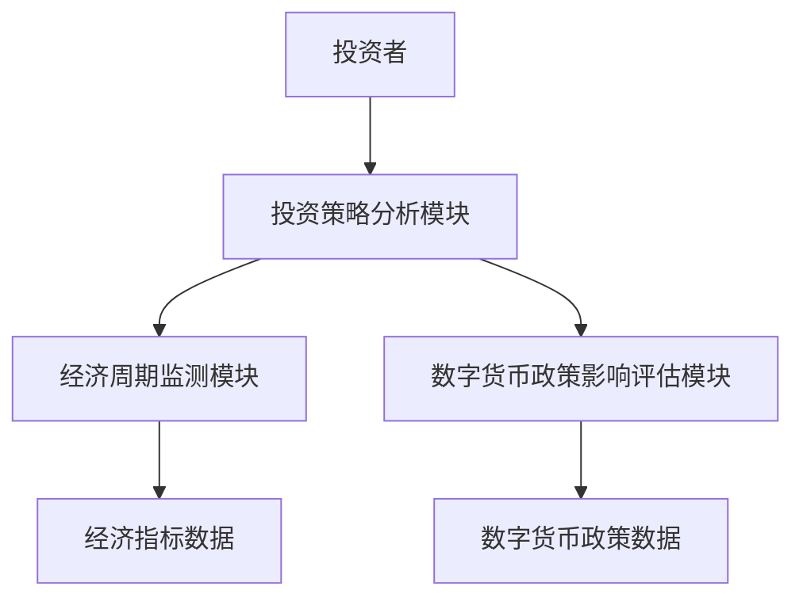
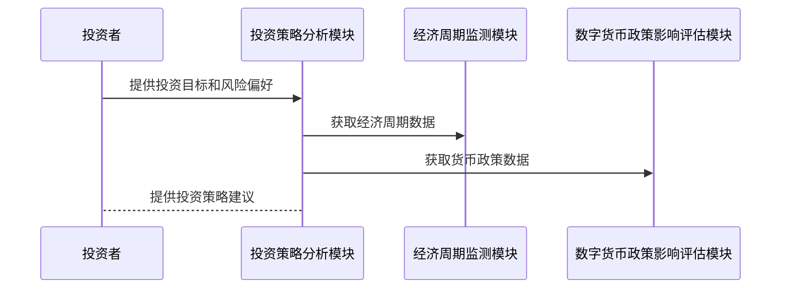

                 


# 巴菲特的经济周期投资：数字货币政策影响下的策略调整

> **关键词**：巴菲特、经济周期、投资策略、数字货币政策、价值投资、风险管理  
> **摘要**：本文深入分析了巴菲特的经济周期投资策略，特别是在数字货币政策变化下的调整。文章首先介绍了巴菲特的价值投资理念及其与经济周期的关系，随后探讨了数字货币政策的定义、特点及其对经济周期的影响。接着，详细分析了巴菲特在不同经济周期下的投资策略，包括防御性投资和进攻性投资，并结合数字货币政策，提出了策略调整的建议。最后，通过实际案例和系统架构设计，总结了投资策略的优化方法和风险管理的重要性。

---

# 第一部分：巴菲特投资理念与经济周期

## 第1章：巴菲特投资理念的核心要素

### 1.1 价值投资的定义与特点

#### 1.1.1 价值投资的定义
价值投资是一种投资策略，强调以低于市场价值的价格买入具有内在价值的资产。巴菲特是这一理念的代表人物，他强调长期投资、安全边际和企业基本面分析。

#### 1.1.2 价值投资的特点
- **长期视角**：价值投资不追求短期收益，而是关注企业的长期价值。
- **安全边际**：买入价格低于内在价值，以降低投资风险。
- **企业基本面分析**：关注企业的盈利能力、财务状况和竞争优势。

#### 1.1.3 价值投资与经济周期的关系
经济周期的波动会影响企业的盈利能力和资产价值，因此价值投资者需要根据经济周期调整投资策略。例如，在经济衰退期，巴菲特倾向于寻找具有强大竞争优势和稳定现金流的企业进行投资。

### 1.2 经济周期的基本概念

#### 1.2.1 经济周期的定义与阶段划分
经济周期是指经济活动的波动，通常分为四个阶段：衰退、萧条、复苏和繁荣。

#### 1.2.2 经济周期对投资的影响
- **衰退期**：企业盈利下降，资产价格可能被低估，适合防御性投资。
- **萧条期**：经济活动低靡，投资者应保持谨慎，寻找价值洼地。
- **复苏期**：经济开始恢复，企业盈利逐步回升，适合进攻性投资。
- **繁荣期**：资产价格可能被高估，投资者需警惕风险。

#### 1.2.3 巴菲特对经济周期的独到见解
巴菲特认为，经济周期是投资机会的来源，而不是投资的障碍。他强调在衰退期寻找优质资产，而在繁荣期保持警惕。

---

## 第2章：数字货币政策与经济周期

### 2.1 数字货币政策的定义与特征

#### 2.1.1 数字货币的兴起与发展趋势
数字货币是指以数字形式存在的货币，包括加密货币（如比特币）和央行数字货币（如中国人民银行的数字人民币）。数字货币的兴起得益于区块链技术和去中心化理念。

#### 2.1.2 数字货币政策的实施机制
数字货币政策是指政府或央行通过调节数字货币的供应量、利率和流动性来影响经济活动的政策。例如，央行可以通过发行数字货币来控制货币供应量，从而调节市场流动性。

#### 2.1.3 数字货币政策与传统货币政策的对比
- **传统货币政策**：通过调整法定货币的供应量和利率来影响经济。
- **数字货币政策**：通过调整数字货币的供应量和智能合约来实现更精准的调控。

### 2.2 数字货币政策对经济周期的影响

#### 2.2.1 数字货币政策对投资环境的影响
数字货币政策可以通过调节市场流动性影响资产价格。例如，央行可以通过增加货币供应量来降低利率，从而刺激投资和消费。

#### 2.2.2 数字货币政策对市场流动性的调节作用
数字货币政策可以更快速地响应经济变化，通过智能合约实现自动化的流动性调节。

#### 2.2.3 数字货币政策对资产价格波动的潜在影响
数字货币政策的灵活性可能加剧资产价格的波动，尤其是在数字货币市场中。

---

## 第3章：巴菲特投资策略的经济周期调整

### 3.1 经济周期中的防御性投资策略

#### 3.1.1 防御性投资的定义与特点
防御性投资是指在经济衰退期或市场低迷期，通过投资具有稳定收益和低风险的资产来规避风险。

#### 3.1.2 巴菲特在经济衰退期的投资策略
- **寻找具有强大竞争优势的企业**：巴菲特倾向于投资那些即使在经济衰退期也能保持稳定盈利的企业。
- **关注安全边际**：在资产价格被低估时买入，以降低投资风险。

#### 3.1.3 防御性投资的典型案例分析
例如，在2008年金融危机期间，巴菲特投资了高盛和通用电气等公司，这些公司在经济衰退期依然保持了较强的盈利能力。

### 3.2 经济周期中的进攻性投资策略

#### 3.2.1 进攻性投资的定义与特点
进攻性投资是指在经济复苏期或市场繁荣期，通过投资高增长企业或新兴行业来获取超额收益。

#### 3.2.2 巴菲特在经济复苏期的投资策略
- **寻找具有高增长潜力的企业**：巴菲特倾向于投资那些在经济复苏期能够快速扩张的企业。
- **关注企业的竞争优势**：投资那些具有独特竞争优势和强大管理团队的企业。

#### 3.2.3 进攻性投资的典型案例分析
例如，在互联网泡沫破裂后，巴菲特投资了亚马逊和谷歌母公司 Alphabet，这些企业在经济复苏期实现了快速增长。

---

## 第4章：数字货币政策下的投资策略调整

### 4.1 数字货币政策对投资策略的影响

#### 4.1.1 数字货币政策对资产配置的影响
数字货币政策的灵活性可能导致资产价格的波动，投资者需要根据政策变化调整资产配置。

#### 4.1.2 数字货币政策对风险偏好调整的作用
在数字货币政策宽松的环境下，投资者可能倾向于承担更高的风险以追求更高的收益。

#### 4.1.3 数字货币政策对投资组合管理的影响
投资者需要根据数字货币政策的变化，动态调整投资组合的构成，以应对潜在的市场波动。

### 4.2 巴菲特投资策略在数字货币政策下的调整

#### 4.2.1 数字货币政策下的防御性投资策略调整
- **关注具有抗通胀能力的资产**：在数字货币政策宽松的环境下，通胀压力可能增加，投资者需要寻找具有抗通胀能力的资产。
- **增加现金储备**：在经济衰退期，巴菲特倾向于增加现金储备以应对不确定性。

#### 4.2.2 数字货币政策下的进攻性投资策略调整
- **投资于新兴技术领域**：在经济复苏期，巴菲特可能倾向于投资于人工智能、区块链等新兴技术领域的公司。
- **关注政策支持的行业**：在数字货币政策支持的行业，如科技和金融，寻找投资机会。

#### 4.2.3 数字货币政策下的资产配置优化
- **分散投资**：在数字货币政策变化频繁的环境下，投资者需要分散投资以降低风险。
- **动态调整**：根据数字货币政策的变化，动态调整资产配置。

---

## 第5章：系统分析与架构设计方案

### 5.1 问题场景介绍

#### 5.1.1 经济周期波动对投资策略的影响
经济周期的波动可能导致资产价格的剧烈波动，投资者需要根据经济周期调整投资策略。

#### 5.1.2 数字货币政策对经济周期的调节作用
数字货币政策可以通过调节市场流动性影响经济周期，投资者需要关注政策变化。

#### 5.1.3 投资者如何在数字货币政策变化中调整策略
投资者需要根据数字货币政策的变化，调整投资策略，以应对市场波动。

### 5.2 系统功能设计

#### 5.2.1 投资策略分析模块
- **功能描述**：分析不同经济周期下的投资策略。
- **实现方式**：通过历史数据分析和机器学习模型，预测经济周期的变化，制定相应的投资策略。

#### 5.2.2 经济周期监测模块
- **功能描述**：实时监测经济周期的变化。
- **实现方式**：通过经济指标数据和新闻 sentiment 分析，实时监测经济周期的变化。

#### 5.2.3 数字货币政策影响评估模块
- **功能描述**：评估数字货币政策对投资策略的影响。
- **实现方式**：通过经济模型和模拟实验，评估数字货币政策对资产价格和市场流动性的影响。

### 5.3 系统架构设计

#### 5.3.1 系统架构图


#### 5.3.2 系统接口设计
- **输入接口**：经济指标数据和数字货币政策数据。
- **输出接口**：投资策略建议和风险提示。

#### 5.3.3 系统交互流程


---

## 第6章：项目实战与小结

### 6.1 环境安装与配置

#### 6.1.1 系统环境
- 操作系统：Linux 或 macOS
- 开发工具：Python、Jupyter Notebook、Git
- 数据库：MySQL 或 MongoDB
- 依赖库：Pandas、NumPy、Matplotlib、Scikit-learn

#### 6.1.2 网络环境
- 数据来源：经济指标数据和数字货币政策数据
- 数据接口：API 接口调用

### 6.2 核心实现源代码

#### 6.2.1 经济周期监测模块
```python
import pandas as pd
import numpy as np

def detect_economic_cycle(data):
    # 计算经济指标的平均值
    avg_growth = np.mean(data['GDP Growth'])
    # 判断经济周期阶段
    if avg_growth < -2:
        return '衰退期'
    elif avg_growth < 1:
        return '萧条期'
    elif avg_growth < 3:
        return '复苏期'
    else:
        return '繁荣期'

# 示例数据
data = {'GDP Growth': [2, 1, -1, -3, 0]}
print(detect_economic_cycle(data))
```

#### 6.2.2 数字货币政策影响评估模块
```python
import requests
import json

def get_policy_effect(policy_type):
    # 调用 API 获取政策影响
    response = requests.get(f'https://api.policyeffect.com/{policy_type}')
    return json.loads(response.text)

# 示例调用
effect = get_policy_effect('deflation')
print(effect)
```

### 6.3 实际案例分析

#### 6.3.1 经济衰退期的投资策略
- **案例背景**：2008年金融危机期间，巴菲特投资了高盛和通用电气。
- **策略分析**：在衰退期，巴菲特倾向于投资具有强大竞争优势和稳定现金流的企业。

#### 6.3.2 经济复苏期的投资策略
- **案例背景**：2010年经济复苏期间，巴菲特投资了亚马逊和谷歌母公司 Alphabet。
- **策略分析**：在复苏期，巴菲特倾向于投资具有高增长潜力的科技公司。

### 6.4 项目小结

#### 6.4.1 投资策略优化
- **动态调整**：根据经济周期和数字货币政策的变化，动态调整投资策略。
- **风险管理**：通过分散投资和风险对冲，降低投资风险。

#### 6.4.2 最佳实践 tips
- **持续学习**：关注经济政策变化和市场动态，保持对投资策略的更新。
- **关注政策**：密切关注数字货币政策的变化，及时调整投资策略。
- **风险管理**：在数字货币政策变化频繁的环境下，投资者需要更加注重风险管理。

---

# 结语

数字货币政策的兴起对投资策略提出了新的挑战和机遇。巴菲特的经济周期投资理念为我们提供了宝贵的借鉴，但我们需要根据数字货币政策的变化，灵活调整投资策略。通过系统化的分析和优化，投资者可以在复杂的经济环境中找到适合自己的投资策略，实现长期稳定的收益。

作者：AI天才研究院/AI Genius Institute & 禅与计算机程序设计艺术/Zen And The Art of Computer Programming

