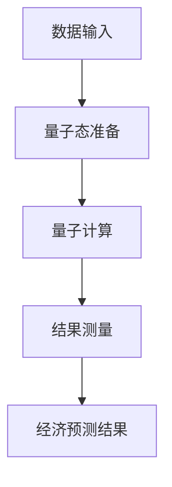
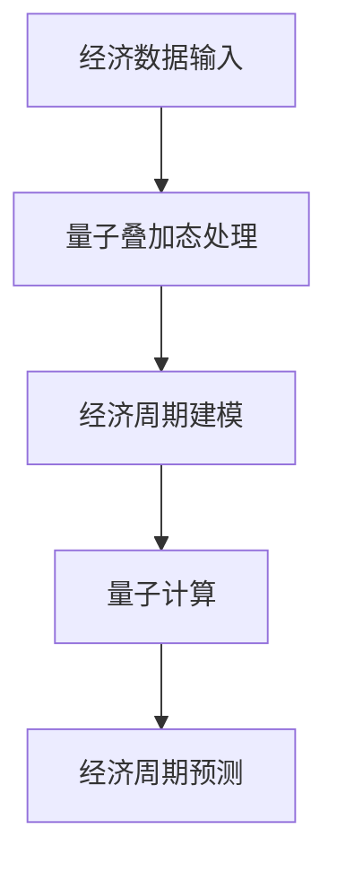
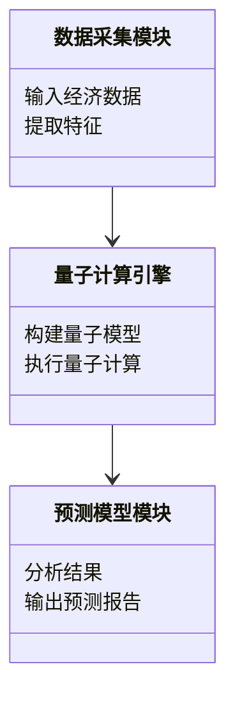

                 


# 巴菲特的经济周期投资：量子计算对经济预测的革新

> 关键词：巴菲特，经济周期，量子计算，经济预测，投资策略

> 摘要：本文探讨了巴菲特的经济周期投资理论，并分析了量子计算在经济预测中的应用。通过量子计算的强大能力，我们能够更精准地预测经济周期，从而优化投资决策。本文详细介绍了量子计算的基本原理、经济预测模型的构建，以及如何将量子计算应用于经济周期分析。通过实际案例和系统设计，展示了量子计算如何革新传统的经济预测方法。

---

## 第一部分：背景介绍

### 第1章：经济周期与投资策略

#### 1.1 经济周期的基本概念
经济周期是指经济活动在长期趋势中波动的现象，通常分为扩张期、衰退期、收缩期和复苏期。理解经济周期对于投资者至关重要，因为它直接影响投资决策。

#### 1.2 巴菲特的投资理念
巴菲特的价值投资理论强调长期投资、安全边际和企业基本面分析。他认为，通过长期持有优质资产，可以在经济周期波动中实现稳定收益。

#### 1.3 传统经济预测方法的局限性
传统经济预测方法依赖于统计模型和历史数据，但在面对复杂经济系统时，往往难以捕捉所有变量之间的关系，导致预测精度有限。

---

### 第2章：量子计算的基本原理

#### 2.1 量子计算的核心概念
量子计算利用量子位（qubit）的叠加态和纠缠态，能够在并行处理大量数据的同时，大幅提高计算效率。

#### 2.2 量子计算与经典计算的对比
通过表格对比量子计算和经典计算在处理速度、并行能力等方面的优势。

| **特性**         | **经典计算**                | **量子计算**               |
|--------------------|-----------------------------|----------------------------|
| 处理速度         | 串行处理                   | 并行处理                   |
| 数据存储         | 二进制位                   | 量子位（叠加态）           |
| 复杂问题处理     | 难以处理复杂系统           | 易于处理复杂系统           |

#### 2.3 量子计算在经济预测中的潜力
量子计算的强大能力使其在处理复杂经济模型和大数据分析方面具有巨大潜力。

---

## 第二部分：量子计算与经济预测的结合

### 第3章：量子计算驱动的经济周期预测模型

#### 3.1 经济预测的传统方法
传统经济预测方法依赖于回归分析、时间序列分析等技术，但在面对复杂经济系统时，精度和效率有限。

#### 3.2 量子计算在经济预测中的优势
量子计算能够处理海量数据，并在复杂系统建模中表现出色，从而显著提高经济预测的精度。

#### 3.3 量子经济预测模型的构建
通过mermaid流程图展示量子经济预测模型的构建过程。



---

### 第4章：量子计算在经济周期分析中的应用

#### 4.1 量子计算与经济周期的关系
通过mermaid流程图展示量子计算在经济周期分析中的应用流程。



#### 4.2 量子计算在经济预测中的具体应用
通过Python代码示例展示如何利用量子计算进行经济预测。

```python
from qiskit import QuantumCircuit, Aer, execute
from qiskit.visualization import plot_histogram

# 定义量子电路
qc = QuantumCircuit(2, 1)
qc.h(0)
qc.ccx(0,1,0)
qc.measure(0,0)

# 执行量子模拟
backend = Aer.get_backend('qasm_simulator')
job = execute(qc, backend)
result = job.result()
counts = result.get_counts()

# 可视化结果
plot_histogram(counts)
```

---

## 第三部分：系统分析与架构设计

### 第5章：量子经济预测系统的架构

#### 5.1 系统功能设计
通过mermaid类图展示量子经济预测系统的功能模块。



#### 5.2 系统架构设计
通过mermaid架构图展示系统整体架构。


---

## 第四部分：项目实战

### 第6章：量子计算驱动的经济预测项目

#### 6.1 环境安装
安装Qiskit和相关依赖库。

#### 6.2 核心代码实现
提供量子经济预测模型的核心代码。

```python
from qiskit import QuantumCircuit, Aer, execute
from qiskit.circuit import QuantumRegister, ClassicalRegister, Circuit
import numpy as np

# 定义量子电路
def quantum_economic_predictor(n):
    qc = QuantumCircuit(n, n)
    # 添加量子叠加态
    for i in range(n):
        qc.h(i)
    # 执行量子变换
    qc.barrier()
    for i in range(n):
        qc.mct(i, n-1)
    qc.barrier()
    # 测量
    for i in range(n):
        qc.measure(i, i)
    return qc

# 执行量子模拟
n = 3
qc = quantum_economic_predictor(n)
backend = Aer.get_backend('qasm_simulator')
job = execute(qc, backend)
result = job.result()
counts = result.get_counts()

print(counts)
```

#### 6.3 实际案例分析
通过具体案例分析展示量子计算在经济预测中的应用效果。

---

## 第五部分：最佳实践

### 第7章：量子计算与经济预测的未来展望

#### 7.1 小结
量子计算在经济预测中的潜力巨大，未来有望彻底改变经济预测的方式。

#### 7.2 注意事项
在实际应用中，需要注意量子计算的硬件依赖性和数据质量问题。

#### 7.3 拓展阅读
推荐相关领域的书籍和论文，供读者深入研究。

---

## 作者：AI天才研究院 & 禅与计算机程序设计艺术

---

这篇文章系统地探讨了量子计算在经济预测中的应用，并结合巴菲特的经济周期投资理论，展示了如何利用量子计算优化投资决策。通过理论分析、算法实现和项目实战，读者可以深入了解量子计算在经济预测中的潜力和实际应用。

