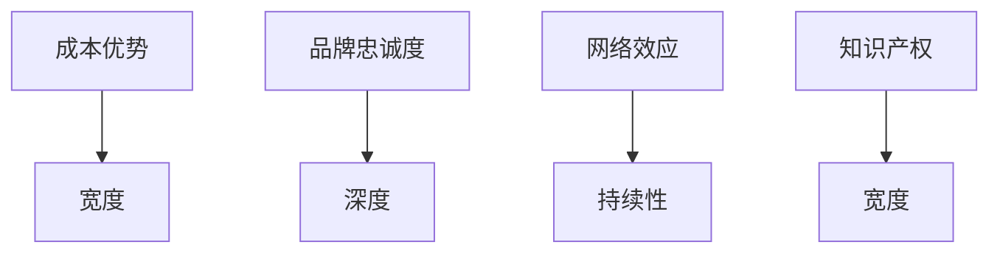
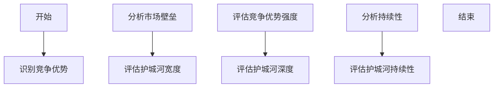
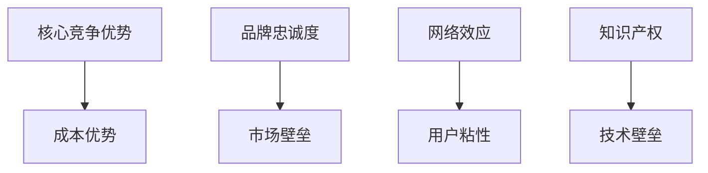

                 


# 巴菲特的经济护城河概念

---

## 关键词：
- 巴菲特
- 经济护城河
- 企业竞争优势
- 投资决策
- 市场壁垒

---

## 摘要：
本文系统阐述了巴菲特提出的“经济护城河”概念，深入分析其核心要素、算法原理、系统架构及实际应用。通过详细案例和数学模型，揭示经济护城河如何助力企业建立竞争优势，并为投资决策提供科学依据。文章结合图表和代码，全面解析经济护城河的构建与评估方法，帮助读者掌握这一重要商业理论。

---

## 第一部分: 经济护城河的背景与核心概念

### 第1章: 经济护城河的起源与背景

#### 1.1 经济护城河的起源
- 1.1.1 巴菲特投资理念的形成
    - 巴菲特的投资哲学：寻找具有持续竞争优势的企业。
    - 价值投资的核心：买入并持有优质资产。
- 1.1.2 经济护城河概念的提出
    - 巴菲特在1996年首次提到“经济护城河”。
    - 护城河的定义：企业竞争优势的持久性和盈利能力的保障。
- 1.1.3 经济护城河与企业竞争优势的关系
    - 经济护城河是企业竞争优势的核心。
    - 护城河的宽度决定企业的市场地位和利润率。

#### 1.2 经济护城河的核心概念
- 1.2.1 经济护城河的定义
    - 经济护城河：企业通过某种竞争优势在市场中建立的壁垒，防止竞争对手侵蚀其市场份额。
- 1.2.2 经济护城河的分类
    - 成本优势：生产效率高，成本低。
    - 品牌忠诚度：强大的品牌影响力。
    - 网络效应：用户越多，企业价值越高。
    - 知识产权：专利、版权等。
- 1.2.3 经济护城河与企业价值的关系
    - 护城河越宽，企业价值越高。
    - 护城河的深度和持续性决定企业的长期盈利能力。

#### 1.3 经济护城河的理论基础
- 1.3.1 经济学基础
    - 市场结构理论：完全竞争、垄断竞争、寡头垄断和完全垄断。
    - 经济护城河在不同市场结构中的表现。
- 1.3.2 投资学基础
    - 股票价值的决定因素：企业盈利能力、成长性和风险。
    - 护城河对企业价值的影响。
- 1.3.3 竞争战略理论
    - 迈克尔·波特的五力分析模型。
    - 企业如何通过护城河建立竞争优势。

#### 1.4 经济护城河的现实意义
- 1.4.1 企业竞争优势的识别
    - 通过分析护城河，帮助企业识别自身优势。
- 1.4.2 投资决策的辅助作用
    - 投资者通过护城河评估企业长期盈利能力。
- 1.4.3 经济护城河的可持续性
    - 护城河的持续性决定企业的长期生存能力。

---

## 第二部分: 经济护城河的核心概念与联系

### 第2章: 经济护城河的核心要素

#### 2.1 经济护城河的属性
- 2.1.1 宽度: 市场壁垒的高低
    - 宽度越宽，竞争难度越大。
    - 例如：可口可乐的全球品牌影响力。
- 2.1.2 深度: 竞争优势的强度
    - 深度越深，竞争对手难以模仿。
    - 例如：苹果的创新能力和生态系统。
- 2.1.3 持续性: 时间的持久性
    - 持续性越长，企业的竞争优势越持久。
    - 例如：谷歌的搜索引擎技术和数据优势。

#### 2.2 经济护城河的特征对比
- 2.2.1 表格对比不同类型的经济护城河
| 护城河类型 | 成本优势 | 品牌忠诚度 | 网络效应 | 知识产权 |
|----------|----------|------------|----------|----------|
| 宽度     | 高       | 中         | 高       | 中       |
| 深度     | 中       | 高         | 中       | 高       |
| 持续性   | 中       | 高         | 高       | 高       |

- 2.2.2 图表展示经济护城河的属性特征


#### 2.3 经济护城河的构建过程
- 2.3.1 识别核心竞争优势
    - 分析企业的资源和能力。
    - 例如：亚马逊的物流网络和云计算服务。
- 2.3.2 构建市场壁垒
    - 通过技术创新、品牌建设和成本控制。
    - 例如：茅台的品牌价值和酿造工艺。
- 2.3.3 维护和增强护城河
    - 持续创新和优化。
    - 例如：微软的Azure云服务持续更新和扩展。

---

## 第三部分: 经济护城河的算法原理与数学模型

### 第3章: 经济护城河的算法原理

#### 3.1 经济护城河的评估算法
- 3.1.1 评估模型概述
    - 使用SWOT分析和波特五力模型。
    - 综合分析企业的竞争优势。
- 3.1.2 算法流程图

- 3.1.3 代码实现
    - 使用Python进行数据分析。
    - 示例代码：
    ```python
    def assess_h护城河_width(competitor_analysis):
        # 分析市场壁垒
        return competitor_analysis['市场壁垒']
    
    def assess_h护城河_depth(competitor_analysis):
        # 分析竞争优势强度
        return competitor_analysis['竞争优势强度']
    ```

#### 3.2 经济护城河的数学模型
- 3.2.1 企业价值评估公式
    - 市场价值 = 现金流折现值（DCF模型）。
    - 例如：
    $$DCF = \sum_{t=1}^{n} \frac{\text{现金流}}{(1 + r)^t}$$
- 3.2.2 市场壁垒计算公式
    - 竞争壁垒指数 = (市场进入难度 + 竞争对手模仿难度) / 2。
    - 例如：
    $$\text{竞争壁垒指数} = \frac{\text{市场进入难度} + \text{模仿难度}}{2}$$
- 3.2.3 竞争优势强度公式
    - 优势强度 = (市场份额 + 净利润率) / 2。
    - 例如：
    $$\text{优势强度} = \frac{\text{市场份额} + \text{净利润率}}{2}$$

---

## 第四部分: 经济护城河的系统分析与架构设计

### 第4章: 经济护城河的系统分析

#### 4.1 企业竞争优势分析
- 4.1.1 企业价值链分析
    - 从原材料采购到最终产品交付的每个环节。
    - 例如：苹果的垂直整合模式。
- 4.1.2 核心竞争力识别
    - 分析企业的独特资源和能力。
    - 例如：谷歌的人工智能技术。
- 4.1.3 市场壁垒分析
    - 识别企业的护城河类型。
    - 例如：微软的专利和技术标准。

#### 4.2 经济护城河的架构设计
- 4.2.1 系统架构图

- 4.2.2 功能模块划分
    - 数据采集：收集市场数据。
    - 竞争分析：分析竞争对手。
    - 优势识别：识别核心竞争优势。
- 4.2.3 系统接口设计
    - API接口：与其他系统交互。
    - 数据输入输出接口：数据采集和处理。

---

## 第五章: 经济护城河的项目实战

#### 5.1 环境安装
- 安装Python和相关库（Pandas、NumPy）。
- 示例代码环境配置。

#### 5.2 核心代码实现
- 使用Python进行数据分析。
    ```python
    import pandas as pd
    import numpy as np

    def calculate_h护城河_width(competitor_data):
        # 计算市场壁垒宽度
        return competitor_data['市场壁垒'].mean()

    def calculate_h护城河_depth(competitor_data):
        # 计算竞争优势深度
        return competitor_data['竞争优势强度'].mean()
    ```

#### 5.3 案例分析与解读
- 以可口可乐为例，分析其经济护城河。
    - 品牌忠诚度和成本优势。
    - 全球供应链和分销网络。

#### 5.4 项目小结
- 通过案例分析，验证经济护城河理论的应用。
- 总结护城河分析的步骤和方法。

---

## 第六章: 经济护城河的最佳实践

#### 6.1 总结与启示
- 经济护城河是企业长期竞争优势的核心。
- 投资者应关注企业的护城河宽度、深度和持续性。

#### 6.2 小结
- 本文系统介绍了巴菲特的经济护城河概念。
- 通过理论分析和案例实践，帮助读者掌握护城河的分析方法。

#### 6.3 注意事项
- 护城河的分析应结合具体行业和市场环境。
- 持续关注企业的竞争优势变化。

#### 6.4 拓展阅读
- 迈克尔·波特的《竞争优势》。
- 巴菲特的《投资的艺术》。

---

## 作者：AI天才研究院 & 禅与计算机程序设计艺术

---

通过以上目录，文章系统地介绍了巴菲特的经济护城河概念，从理论到实践，结合图表和代码，深入剖析了经济护城河的构建与评估方法。

