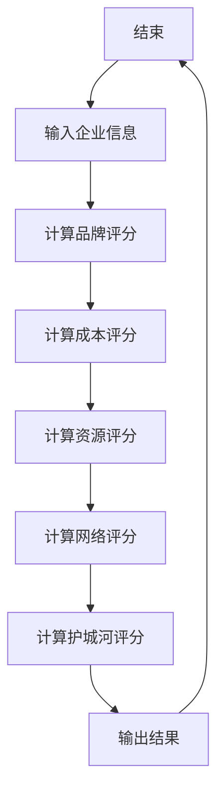
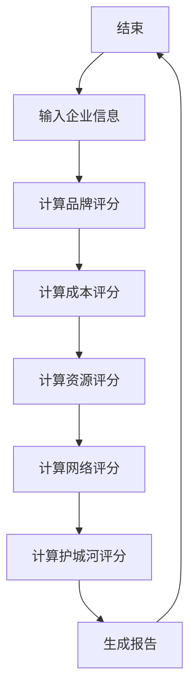

                 


# 巴菲特的经济护城河概念详解

> 关键词：经济护城河，巴菲特，投资策略，竞争优势，品牌优势，成本优势，资源壁垒

> 摘要：本文深入分析巴菲特的经济护城河概念，探讨其核心要素、算法原理、系统架构及实际应用。通过案例分析和代码实现，帮助读者理解如何构建和评估企业经济护城河。

---

# 第一部分: 巴菲特的经济护城河概念背景

## 第1章: 经济护城河的起源与背景

### 1.1 经济护城河的起源
#### 1.1.1 巴菲特投资理念的形成
沃伦·巴菲特是价值投资的倡导者，他强调长期投资和企业基本面分析。经济护城河概念源于他的投资哲学，旨在识别那些具备持久竞争优势的企业。

#### 1.1.2 经济护城河概念的提出
在《巴菲特的护城河》一书中，作者详细阐述了经济护城河的定义和构成。经济护城河是指企业通过某种独特优势（如品牌、成本、资源或网络效应）建立的难以被竞争对手复制的屏障。

#### 1.1.3 经济护城河在投资中的重要性
在投资决策中，经济护城河是评估企业长期盈利能力的关键指标。具备强大经济护城河的企业能够在市场中长期保持竞争优势，为投资者带来稳定回报。

### 1.2 经济护城河的发展历程
#### 1.2.1 巴菲特早期投资案例
巴菲特早期投资于可口可乐和吉列等企业，这些企业凭借强大的品牌优势和分销网络，构建了稳固的经济护城河。

#### 1.2.2 经济护城河理论的演变
随着商业环境的变化，经济护城河理论不断丰富。从最初的单一竞争优势到多维度综合评估，经济护城河的内涵逐渐扩展。

#### 1.2.3 当代经济护城河研究现状
当前，学术界和实务界对经济护城河的研究主要集中在如何量化护城河、护城河的动态演变以及护城河对企业价值的影响等方面。

### 1.3 经济护城河的核心要素
#### 1.3.1 品牌优势
品牌优势是企业经济护城河的重要组成部分。强大的品牌能够为企业带来客户忠诚度和定价权。

#### 1.3.2 成本优势
成本优势是指企业能够以低于竞争对手的价格提供相同或更好的产品。低成本结构是企业长期盈利能力的重要保障。

#### 1.3.3 资源优势
资源优势包括独特的原材料供应、专利技术等，这些资源使得竞争对手难以复制企业的商业模式。

#### 1.3.4 网络效应
网络效应是指产品或服务的价值随着用户数量的增加而增加。这种效应能够形成强大的市场壁垒。

---

## 第2章: 经济护城河的定义与特征

### 2.1 经济护城河的定义
#### 2.1.1 经济护城河的内涵
经济护城河是指企业在特定市场中，通过某种独特优势（如品牌、成本、资源或网络效应）形成的难以被竞争对手复制的竞争优势。

#### 2.1.2 经济护城河的外延
经济护城河不仅包括企业的内部资源，还包括外部市场环境、客户关系等因素。这些因素共同构成了企业的竞争优势。

#### 2.1.3 经济护城河与竞争优势的区别
竞争优势是指企业在市场上相对于竞争对手的有利条件，而经济护城河则强调这些优势的持久性和难以复制性。

### 2.2 经济护城河的特征
#### 2.2.1 持久性
经济护城河的核心特征是其持久性。具备强大护城河的企业能够在长期内保持竞争优势。

#### 2.2.2 可扩展性
护城河的可扩展性是指企业能够将护城河扩展到新的市场或产品领域。例如，强大的品牌优势可以支持企业进入国际市场。

#### 2.2.3 难以模仿性
护城河的难以模仿性是指竞争对手难以复制企业的独特优势。例如，专利技术或独特的商业模式具有较高的模仿难度。

#### 2.2.4 价值性
护城河的最终目标是为企业的长期价值创造贡献。具备价值性的护城河能够为股东创造超额收益。

### 2.3 经济护城河的边界与外延
#### 2.3.1 经济护城河的边界
经济护城河的边界包括企业的核心竞争力、市场环境、客户群体等因素。理解这些边界有助于明确护城河的范围。

#### 2.3.2 经济护城河的外延
经济护城河的外延包括企业生态系统、合作伙伴关系等。这些外延因素能够增强企业的护城河效应。

#### 2.3.3 经济护城河与其他概念的联系
经济护城河与企业核心竞争力、竞争优势等概念密切相关。理解这些概念的联系有助于全面评估企业的竞争优势。

---

## 第3章: 经济护城河的核心概念与联系

### 3.1 经济护城河的核心概念
#### 3.1.1 品牌优势
品牌优势是企业经济护城河的重要组成部分。强大的品牌能够为企业带来客户忠诚度和定价权。

#### 3.1.2 成本优势
成本优势是指企业能够以低于竞争对手的价格提供相同或更好的产品。低成本结构是企业长期盈利能力的重要保障。

#### 3.1.3 资源优势
资源优势包括独特的原材料供应、专利技术等，这些资源使得竞争对手难以复制企业的商业模式。

#### 3.1.4 网络效应
网络效应是指产品或服务的价值随着用户数量的增加而增加。这种效应能够形成强大的市场壁垒。

### 3.2 经济护城河的核心概念对比
#### 3.2.1 品牌优势与成本优势的对比
品牌优势关注客户忠诚度和市场影响力，而成本优势关注生产效率和成本控制。两者相辅相成，共同构成企业的竞争优势。

#### 3.2.2 成本优势与资源优势的对比
成本优势关注短期盈利能力，而资源优势关注长期竞争优势。两者结合能够增强企业的市场地位。

#### 3.2.3 资源优势与网络效应的对比
资源优势关注企业内部资源的控制，而网络效应关注外部用户的增长。两者结合能够形成强大的市场影响力。

### 3.3 经济护城河的ER实体关系图

```mermaid
er
  actor: 投资者
  entity: 经济护城河
  entity: 品牌优势
  entity: 成本优势
  entity: 资源优势
  entity: 网络效应
  en

  投资者 --> 经济护城河: 评估
  经济护城河 --> 品牌优势
  经济护城河 --> 成本优势
  经济护城河 --> 资源优势
  经济护城河 --> 网络效应
```

---

## 第4章: 经济护城河的算法原理

### 4.1 经济护城河的量化方法
#### 4.1.1 护城河评分系统
护城河评分系统是一种常用的量化方法。通过对企业核心竞争力的评分，投资者可以快速评估企业的护城河强度。

#### 4.1.2 护城河评分系统的数学模型
护城河评分系统可以通过以下公式进行计算：

$$
\text{护城河评分} = \frac{\text{品牌评分} + \text{成本评分} + \text{资源评分} + \text{网络评分}}{4}
$$

其中，品牌评分、成本评分、资源评分和网络评分的取值范围为1到10分。

### 4.2 经济护城河的算法实现
#### 4.2.1 算法流程图



#### 4.2.2 Python代码实现

```python
def calculate_h护城河评分(brand_score, cost_score, resource_score, network_score):
    return (brand_score + cost_score + resource_score + network_score) / 4

# 示例
brand_score = 9
cost_score = 8
resource_score = 7
network_score = 6

护城河评分 = calculate_h护城河评分(brand_score, cost_score, resource_score, network_score)
print(护城河评分)
```

---

## 第5章: 经济护城河的系统架构设计

### 5.1 系统功能设计
#### 5.1.1 系统功能模块
经济护城河评估系统主要包括以下功能模块：
- 数据输入与处理
- 护城河评分计算
- 结果可视化
- 报告生成

#### 5.1.2 系统功能流程图



### 5.2 系统架构设计
#### 5.2.1 系统架构图


#### 5.2.2 系统接口设计
- 用户界面：提供企业信息输入和结果查看功能。
- 数据处理模块：负责企业信息的预处理和分析。
- 护城河评分计算模块：根据输入数据计算护城河评分。
- 数据库：存储企业信息和评分结果。

#### 5.2.3 系统交互设计

```mermaid
sequence
    投资者 --> 用户界面: 输入企业信息
    用户界面 --> 数据处理模块: 提交请求
    数据处理模块 --> 护城河评分计算模块: 调用评分函数
    护城河评分计算模块 --> 数据库: 存储评分结果
    数据库 --> 报告生成模块: 提供评分数据
    报告生成模块 --> 用户界面: 输出报告
    用户界面 --> 投资者: 展示报告
```

---

## 第6章: 经济护城河的项目实战

### 6.1 项目环境安装
#### 6.1.1 安装Python
```bash
python --version
pip install --upgrade pip
```

#### 6.1.2 安装依赖库
```bash
pip install numpy pandas matplotlib
```

### 6.2 项目核心实现

#### 6.2.1 企业信息输入
```python
import pandas as pd

# 输入企业信息
enterprise_info = {
    '品牌评分': [9],
    '成本评分': [8],
    '资源评分': [7],
    '网络评分': [6]
}
df = pd.DataFrame(enterprise_info)
```

#### 6.2.2 护城河评分计算
```python
import numpy as np

def calculate_hur_city_河评分(df):
    brand_score = df['品牌评分'].values[0]
    cost_score = df['成本评分'].values[0]
    resource_score = df['资源评分'].values[0]
    network_score = df['网络评分'].values[0]
    return (brand_score + cost_score + resource_score + network_score) / 4

护城河评分 = calculate_hur_city_河评分(df)
print(护城河评分)
```

#### 6.2.3 结果可视化
```python
import matplotlib.pyplot as plt

labels = ['品牌评分', '成本评分', '资源评分', '网络评分']
scores = [9, 8, 7, 6]

plt.bar(labels, scores)
plt.title('护城河评分结果')
plt.xlabel('评分维度')
plt.ylabel('评分值')
plt.show()
```

### 6.3 项目小结
通过实际案例分析，我们可以看到经济护城河评分系统在实际应用中的有效性。企业可以根据评分结果优化自身竞争优势，投资者也可以通过护城河评分选择具备长期投资价值的企业。

---

## 第7章: 经济护城河的最佳实践

### 7.1 小结
经济护城河是评估企业长期竞争优势的重要指标。通过构建经济护城河，企业可以在激烈的市场竞争中保持领先地位。

### 7.2 注意事项
- 护城河评分需要结合企业实际情况进行调整。
- 护城河的动态变化需要持续关注和评估。
- 组合使用多种评估方法可以提高护城河评估的准确性。

### 7.3 拓展阅读
- 巴菲特的其他投资理念。
- 竞争对手分析方法。
- 行业分析与投资策略。

---

## 附录: 经济护城河相关术语表

- **经济护城河**：企业通过某种独特优势形成的竞争优势。
- **品牌评分**：衡量品牌影响力的关键指标。
- **成本评分**：评估企业成本控制能力的指标。
- **资源评分**：反映企业资源壁垒的指标。
- **网络评分**：衡量企业网络效应的指标。

---

# 作者：AI天才研究院/AI Genius Institute & 禅与计算机程序设计艺术 /Zen And The Art of Computer Programming

