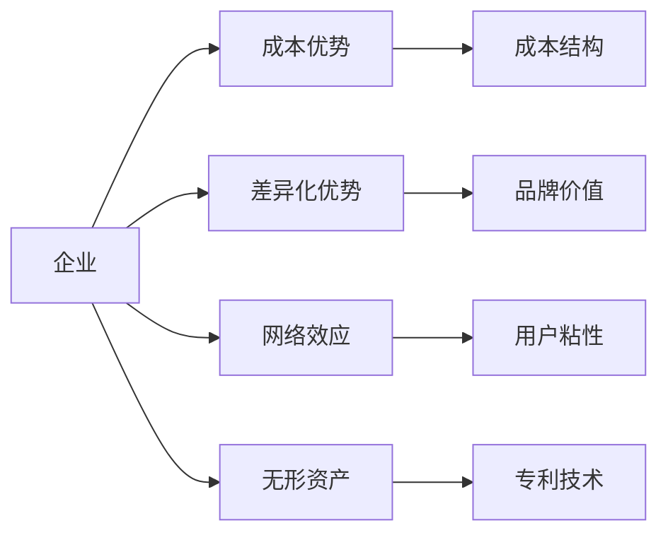
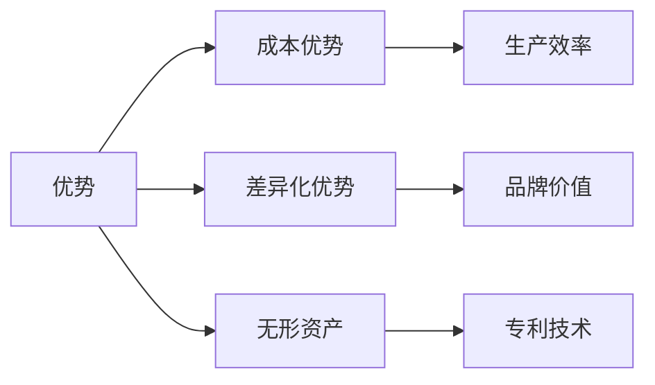
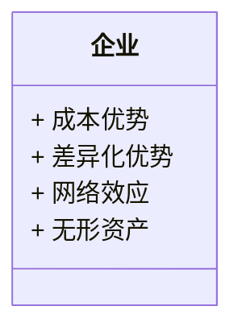
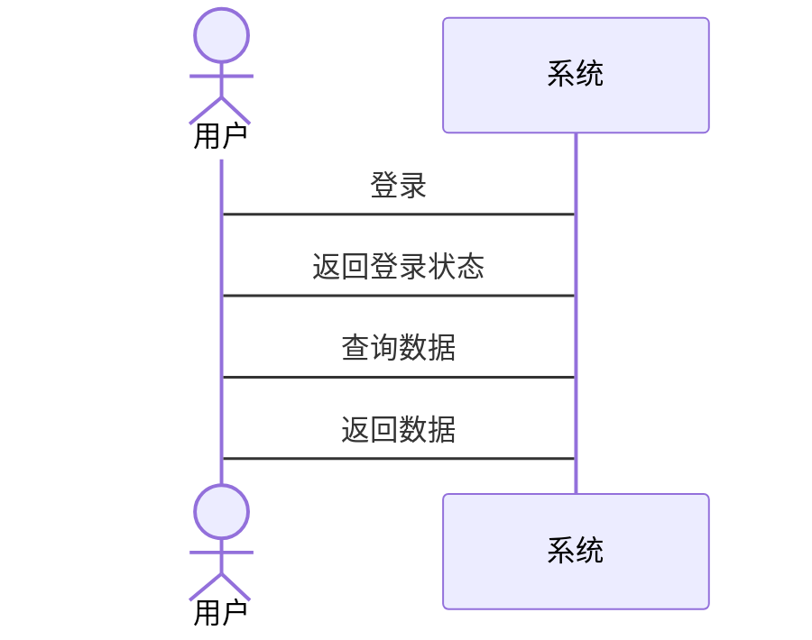

                 


# 巴菲特的经济护城河理论：持久竞争优势的来源

> 关键词：经济护城河，巴菲特投资理念，企业竞争优势，成本优势，差异化优势，网络效应，无形资产

> 摘要：本文深入探讨了巴菲特的经济护城河理论，分析了其在企业竞争优势中的核心作用。通过详细阐述经济护城河的分类、特点、数学模型以及实际案例分析，本文揭示了企业如何通过构建经济护城河实现持久竞争优势。文章内容涵盖经济护城河的背景介绍、核心概念、算法原理、系统分析、项目实战以及最佳实践，旨在为读者提供全面而深入的理论与实践指导。

---

## 第1章: 经济护城河理论的背景与核心概念

### 1.1 经济护城河的基本概念

经济护城河（Economic Moat）是巴菲特投资理论中的核心概念，指的是企业在行业中建立的长期竞争优势，使其能够抵御竞争对手的侵蚀。这种竞争优势可以是成本优势、差异化优势、网络效应或无形资产等，能够在长期内为企业创造超额利润。

#### 1.1.1 什么是经济护城河
经济护城河是指企业在竞争中形成的独特优势，使其能够在长期内保持领先地位。这种优势可以是结构性的，也可以是资源性的，目的是阻止竞争对手进入市场或削弱其竞争力。

#### 1.1.2 经济护城河的核心要素
经济护城河的核心要素包括：
1. 成本优势：企业通过规模经济或独特的生产方式降低成本，使竞争对手难以在价格上与其竞争。
2. 差异化优势：企业通过技术创新、品牌建设或优质服务形成独特的市场定位，吸引客户。
3. 网络效应：随着用户数量的增加，企业的产品或服务的价值也增加，形成正反馈循环。
4. 无形资产：包括专利、商标、品牌价值等，这些资产难以被竞争对手复制。

#### 1.1.3 经济护城河与企业竞争优势的关系
经济护城河是企业竞争优势的核心来源。通过构建经济护城河，企业能够长期保持市场领先地位，实现持续的超额收益。

### 1.2 巴菲特投资理念中的经济护城河

#### 1.2.1 巴菲特的长期投资策略
巴菲特的投资策略以长期价值为导向，他倾向于投资那些具有强大竞争优势的企业。他认为，只有那些能够持续创造超额收益的企业才是值得投资的目标。

#### 1.2.2 经济护城河在巴菲特投资中的重要性
在巴菲特看来，经济护城河是企业抵御竞争的核心能力。他更倾向于投资那些具有宽宽的护城河的企业，因为这些企业能够在长期内保持竞争优势。

#### 1.2.3 巴菲特如何识别具有经济护城河的企业
巴菲特通过分析企业的商业模式、行业地位、财务状况和管理层素质等多方面因素，识别具有强大经济护城河的企业。他特别关注那些能够通过创新或规模效应形成成本优势或差异化优势的企业。

### 1.3 经济护城河的分类与特点

#### 1.3.1 成本优势型护城河
成本优势型护城河是指企业通过优化生产流程、规模化生产或技术创新降低成本，使竞争对手难以在价格上与其竞争。例如，亚马逊通过其高效的物流体系和规模化采购形成了强大的成本优势。

#### 1.3.2 差异化优势型护城河
差异化优势型护城河是指企业通过技术创新、品牌建设或优质服务形成独特的市场定位。例如，苹果公司通过其创新的产品设计和强大的品牌忠诚度形成了强大的差异化优势。

#### 1.3.3 网络效应型护城河
网络效应型护城河是指随着用户数量的增加，企业的产品或服务的价值也增加。例如，社交媒体平台如Facebook，随着用户数量的增加，其价值也显著提升，形成了强大的网络效应。

#### 1.3.4 无形资产型护城河
无形资产型护城河是指企业通过拥有专利、商标、品牌价值等无形资产形成的竞争优势。例如，可口可乐公司通过其强大的品牌价值和商标权形成了强大的护城河。

### 1.4 经济护城河的边界与外延

#### 1.4.1 经济护城河的边界
经济护城河的边界是指企业在竞争中能够有效防御竞争对手的范围。过宽的护城河可能会导致企业资源浪费，而过窄的护城河则无法有效抵御竞争。

#### 1.4.2 经济护城河的外延
经济护城河的外延是指护城河的延伸部分，包括企业如何通过技术创新、市场扩展或业务多元化进一步扩大竞争优势。

#### 1.4.3 经济护城河与其他商业理论的关系
经济护城河与波特的五力分析模型、SWOT分析等商业理论密切相关。通过结合这些理论，可以更全面地分析企业的竞争优势。

### 1.5 本章小结

本章详细介绍了经济护城河的基本概念、分类与特点，以及巴菲特投资理念中的经济护城河。通过分析不同类型的经济护城河，我们可以更好地理解企业竞争优势的来源。

---

## 第2章: 经济护城河的核心概念与联系

### 2.1 经济护城河的核心原理

#### 2.1.1 经济护城河的形成机制
经济护城河的形成机制包括成本优势、差异化优势、网络效应和无形资产等多方面的因素。企业需要通过不断创新和优化来巩固其竞争优势。

#### 2.1.2 经济护城河的可持续性
经济护城河的可持续性取决于企业能否持续创新和优化其竞争优势。只有那些能够不断适应市场变化的企业，才能保持其护城河的长期有效性。

#### 2.1.3 经济护城河的动态变化
经济护城河并非一成不变，随着市场的变化和技术的进步，企业需要不断调整其竞争优势，以应对新的挑战。

### 2.2 经济护城河的核心要素对比

#### 2.2.1 成本优势与差异化优势的对比
成本优势注重的是生产效率和成本控制，而差异化优势注重的是技术创新和市场定位。两者在企业竞争优势中各有侧重，但又相互关联。

#### 2.2.2 网络效应与无形资产的对比
网络效应强调用户数量的增加带来的价值提升，而无形资产强调专利、品牌等资产的长期价值。两者在企业竞争优势中的作用不同，但都是经济护城河的重要组成部分。

#### 2.2.3 经济护城河要素的综合分析
经济护城河的综合分析需要考虑多个因素的相互作用。例如，企业可以通过成本优势和差异化优势的结合，形成更强的综合竞争优势。

### 2.3 经济护城河的ER实体关系图



### 2.4 本章小结

本章通过对比分析经济护城河的核心要素，揭示了不同要素之间的相互作用。通过ER实体关系图，我们可以更清晰地理解企业竞争优势的构成。

---

## 第3章: 经济护城河的数学模型与算法原理

### 3.1 经济护城河的评估模型

#### 3.1.1 经济护城河的SWOT分析

SWOT分析是一种常用的商业分析工具，通过分析企业的优势（Strengths）、劣势（Weaknesses）、机会（Opportunities）和威胁（Threats），帮助企业识别其竞争优势。



#### 3.1.2 经济护城河的波特五力模型

波特五力模型是一种分析行业竞争环境的工具，包括新进入者的威胁、替代品的威胁、供应商的议价能力、买家的议价能力和现有竞争者之间的竞争程度。

$$ \text{波特五力模型} = \{ \text{新进入者威胁}, \text{替代品威胁}, \text{供应商议价能力}, \text{买家议价能力}, \text{竞争程度} \} $$

---

## 第4章: 经济护城河的系统分析与架构设计

### 4.1 经济护城河的系统分析

#### 4.1.1 问题场景介绍
企业需要通过构建经济护城河来抵御竞争对手的侵蚀，实现长期竞争优势。本文将通过分析具体案例，揭示如何通过系统设计实现这一目标。

#### 4.1.2 系统功能设计
经济护城河的系统功能设计包括成本控制、差异化创新、网络效应和无形资产管理四大模块。



### 4.2 经济护城河的系统架构设计

#### 4.2.1 系统架构设计
经济护城河的系统架构设计包括前端用户界面、后端业务逻辑和数据存储三大部分。


#### 4.2.2 系统接口设计
系统接口设计包括API接口和数据库接口，确保各个模块之间的高效协作。

#### 4.2.3 系统交互设计
系统交互设计包括用户登录、数据查询和业务操作等交互流程。



---

## 第5章: 经济护城河的项目实战

### 5.1 环境安装与配置

#### 5.1.1 系统环境
建议使用Linux操作系统，安装Python 3.8以上版本。

#### 5.1.2 依赖管理
安装必要的Python库，如numpy、pandas、matplotlib等。

### 5.2 核心实现

#### 5.2.1 成本优势型护城河的实现
```python
def calculate_cost_advantage(price, cost):
    return price - cost
```

#### 5.2.2 差异化优势型护城河的实现
```python
def calculate_differentiation_advantage(value, cost):
    return value - cost
```

#### 5.2.3 网络效应型护城河的实现
```python
def calculate_network_effect(user_count, value_per_user):
    return user_count * value_per_user
```

#### 5.2.4 无形资产型护城河的实现
```python
def calculate_intangible_assets(value, cost):
    return value - cost
```

### 5.3 实际案例分析

#### 5.3.1 亚马逊的成本优势
亚马逊通过其高效的物流体系和规模化采购，形成了强大的成本优势。

#### 5.3.2 苹果的差异化优势
苹果通过其创新的产品设计和强大的品牌忠诚度，形成了强大的差异化优势。

#### 5.3.3 Facebook的网络效应
Facebook通过其庞大的用户基数和社交网络效应，形成了强大的网络效应型护城河。

#### 5.3.4 可口可乐的无形资产
可口可乐通过其强大的品牌价值和商标权，形成了强大的无形资产型护城河。

### 5.4 项目小结

本章通过实际案例分析，揭示了经济护城河在现实中的具体应用。通过系统设计和项目实战，我们可以更好地理解经济护城河的构建方法。

---

## 第6章: 经济护城河的最佳实践

### 6.1 小结

经济护城河是企业竞争优势的核心来源。通过构建经济护城河，企业可以在长期内保持市场领先地位，实现持续的超额收益。

### 6.2 注意事项

企业在构建经济护城河时，需要注意以下几点：
1. 确保护城河的有效性
2. 保持护城河的动态调整
3. 防范护城河的潜在风险

### 6.3 拓展阅读

推荐阅读以下书籍和文章，以进一步深入理解经济护城河理论：
- 巴菲特的《巴菲特致股东的信》
- 《竞争优势：企业如何建立持久的市场地位》
- 《经济护城河：企业竞争优势的来源》

---

## 作者信息

作者：AI天才研究院/AI Genius Institute & 禅与计算机程序设计艺术 /Zen And The Art of Computer Programming

---

本文通过详细阐述经济护城河的理论与实践，为读者提供了全面而深入的指导。通过系统分析和项目实战，我们可以更好地理解经济护城河的构建方法，并将其应用于实际商业环境中。

