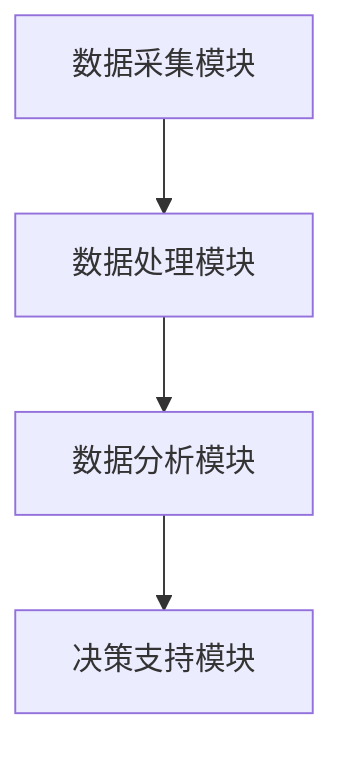

                 


# 巴菲特的经济护城河理论：数据经济时代的竞争优势

## 关键词：巴菲特、经济护城河、数据经济、企业竞争优势、数据驱动、商业模式创新

## 摘要：在数据经济时代，企业竞争优势的核心正在发生深刻变化。本文通过分析巴菲特的经济护城河理论，探讨在数据驱动的背景下，企业如何构建和强化自身的竞争优势。文章从护城河理论的基本概念出发，结合数据经济的特点，详细阐述了护城河在数据资源、技术驱动、生态系统和网络效应等方面的表现，并通过实际案例分析了护城河的构建策略和评估方法。最后，文章提出了在数据经济时代下，企业如何通过技术创新和生态构建来巩固和扩大竞争优势的建议。

---

# 第一部分: 巴菲特的经济护城河理论基础

## 第1章: 巴菲特经济护城河理论概述

### 1.1 经济护城河的定义与核心要素

#### 1.1.1 经济护城河的定义

经济护城河是巴菲特投资理论中的核心概念，指企业在市场竞争中所拥有的独特优势，这些优势使得竞争对手难以复制或超越。护城河的本质是企业与其竞争对手之间的竞争壁垒，这种壁垒可以是成本优势、品牌影响力、技术优势、网络效应或资源控制等多种形式。

#### 1.1.2 护城河的核心要素

1. **成本优势**：企业能够以低于竞争对手的成本提供产品或服务。
2. **品牌影响力**：强大的品牌可以吸引更多的客户，并形成客户忠诚度。
3. **技术优势**：企业掌握独特的技术或专利，使得竞争对手难以模仿。
4. **网络效应**：产品或服务的价值随着用户数量的增加而增加，形成正反馈循环。

#### 1.1.3 护城河的分类与特征

护城河可以分为以下几种类型：
1. **宽护城河**：竞争对手难以复制，企业具有长期竞争优势。
2. **窄护城河**：竞争对手可以通过模仿或创新逐步缩小差距。
3. **动态护城河**：通过持续创新和技术升级维持竞争优势。

---

### 1.2 巴菲特投资理念与护城河理论

#### 1.2.1 巴菲特的投资哲学

巴菲特的投资哲学强调长期价值，他寻找那些具有持续竞争优势的企业，这些企业能够在较长的时间内保持稳定的收益和增长。他认为，投资的本质是寻找那些能够抵御市场波动、经济周期和竞争压力的企业。

#### 1.2.2 护城河理论在巴菲特投资中的地位

护城河理论是巴菲特判断企业投资价值的核心标准之一。他认为，只有那些具有宽护城河的企业，才能在长期的竞争中保持优势，并为股东创造持续的价值。

#### 1.2.3 护城河理论的经典案例分析

以可口可乐为例，其强大的品牌影响力、广泛的分销网络和独特的配方构成了宽护城河。这些因素使得竞争对手难以在短时间内复制其成功。

---

### 1.3 数据经济时代与护城河理论的演变

#### 1.3.1 数据经济时代的定义与特征

数据经济时代是指以数据为关键生产要素的经济形态。数据的采集、存储、处理和分析能力成为企业竞争力的核心。数据经济时代的特征包括数据驱动决策、人工智能广泛应用、数字化转型加速等。

#### 1.3.2 数据经济时代下护城河理论的新变化

在数据经济时代，护城河的内涵发生了变化。传统的成本优势和技术优势仍然重要，但数据资源的获取能力、数据分析能力以及数据驱动的创新模式成为新的竞争优势。

#### 1.3.3 数据驱动型企业竞争优势的重构

数据驱动型企业通过收集和分析大量数据，优化产品和服务，提高决策效率，降低成本。这种竞争优势使得企业能够快速响应市场变化，并持续创新。

---

## 第2章: 数据经济时代的企业竞争优势

### 2.1 数据经济时代的核心特征

#### 2.1.1 数据作为生产要素的重要性

数据是数据经济时代的生产要素之一，其价值在于能够为企业提供洞察和决策支持。数据的规模、质量和处理能力决定了企业的竞争优势。

#### 2.1.2 数字化转型对企业竞争优势的影响

数字化转型使得企业能够通过技术创新和数据驱动的方式优化业务流程，提高效率，降低成本，并创造新的商业模式。

#### 2.1.3 数据驱动的商业模式创新

数据驱动的商业模式以数据为核心，通过数据分析和挖掘，为企业创造新的价值点。例如，精准营销、个性化推荐和数据变现等。

---

### 2.2 数据经济时代下的护城河特征

#### 2.2.1 数据资源的稀缺性

数据资源的稀缺性是指企业能够获取高质量、高价值的数据的能力。拥有独特数据资源的企业能够通过数据驱动的创新获得竞争优势。

#### 2.2.2 技术驱动的门槛

在数据经济时代，技术创新是护城河的重要组成部分。企业需要通过持续的技术创新，保持对竞争对手的技术优势。

#### 2.2.3 生态系统的可扩展性

生态系统是指企业与合作伙伴、客户、供应商等形成的生态网络。具有强大生态系统的企业能够通过协同创新和资源共享，快速扩展竞争优势。

#### 2.2.4 网络效应的放大作用

网络效应是指随着用户数量的增加，产品或服务的价值也随之增加。在数据经济时代，网络效应能够快速放大企业的竞争优势。

---

## 第3章: 护城河的构建与评估策略

### 3.1 护城河构建的核心要素

#### 3.1.1 数据资源的获取与整合

企业需要通过合法、合规的方式获取数据资源，并通过数据清洗、整合和分析，提取有价值的信息。

#### 3.1.2 技术创新与研发投入

技术创新是护城河的重要组成部分。企业需要投入资源，研发新技术，保持技术领先。

#### 3.1.3 生态系统的建设与维护

企业需要与合作伙伴、客户、供应商等建立紧密的合作关系，构建强大的生态系统。

#### 3.1.4 品牌影响力与客户忠诚度

强大的品牌影响力和客户忠诚度能够为企业提供长期的竞争优势。

---

### 3.2 护城河的评估方法

#### 3.2.1 护城河宽度的评估指标

护城河宽度可以通过以下指标进行评估：
- 竞争对手模仿成本
- 市场进入障碍
- 市场占有率

#### 3.2.2 护城河深度的分析框架

护城河深度可以通过以下框架进行分析：
- 数据资源的独特性
- 技术创新的领先性
- 生态系统的完善性
- 网络效应的强弱

#### 3.2.3 护城河可持续性的评估维度

护城河的可持续性可以通过以下维度进行评估：
- 数据资源的持续获取能力
- 技术创新的持续投入
- 生态系统的持续扩展
- 市场需求的变化趋势

---

## 第4章: 护城河的数学模型与算法原理

### 4.1 护城河评估的数学模型

#### 4.1.1 护城河宽度的计算公式

护城河宽度可以通过以下公式计算：
$$ \text{护城河宽度} = \frac{\text{竞争对手模仿成本}}{\text{企业成本优势}} $$

---

## 第5章: 护城河的系统架构与设计方案

### 5.1 问题场景介绍

在数据经济时代，企业需要构建一个高效的数据处理和分析系统，以支持护城河的构建和维护。

### 5.2 系统功能设计

#### 5.2.1 数据采集模块

负责采集企业内外部数据，包括结构化数据和非结构化数据。

#### 5.2.2 数据处理模块

对采集到的数据进行清洗、转换和存储，确保数据的准确性和可用性。

#### 5.2.3 数据分析模块

通过对数据的分析和挖掘，提取有价值的信息，支持企业决策。

---

### 5.3 系统架构设计

#### 5.3.1 系统架构图



---

### 5.4 系统接口设计

#### 5.4.1 数据采集接口

```python
def collect_data():
    # 采集数据
    pass
```

---

## 第6章: 项目实战

### 6.1 环境安装

安装必要的软件和工具，包括Python、Jupyter Notebook、数据库等。

### 6.2 系统核心实现源代码

```python
def main():
    # 数据采集
    data = collect_data()
    # 数据处理
    processed_data = process_data(data)
    # 数据分析
    insights = analyze_data(processed_data)
    # 输出结果
    print(insights)

if __name__ == "__main__":
    main()
```

---

## 第7章: 总结与展望

### 7.1 总结

在数据经济时代，护城河理论的应用需要结合数据资源、技术创新和生态系统构建。企业需要通过持续的创新和优化，保持竞争优势。

### 7.2 小结

护城河的构建是一个长期的过程，需要企业投入资源，并持续优化。

### 7.3 注意事项

企业需要注意数据隐私和安全问题，确保合规性。

### 7.4 拓展阅读

推荐阅读《巴菲特的护城河》、《数据驱动的商业模式创新》等书籍。

---

# 作者：AI天才研究院/AI Genius Institute & 禅与计算机程序设计艺术 /Zen And The Art of Computer Programming

