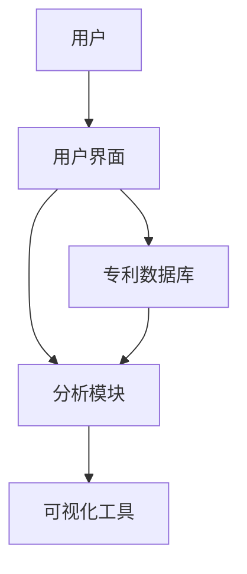

                 


# 巴菲特的经济护城河理论：量子技术专利池的竞争优势

> 关键词：巴菲特经济护城河，量子技术，专利池，竞争优势，投资策略，技术壁垒

> 摘要：本文将探讨巴菲特的经济护城河理论在量子技术专利池中的应用。通过分析量子技术的核心原理、专利池的竞争优势以及它们如何结合形成企业竞争优势，本文将揭示量子技术专利池如何成为企业的经济护城河。结合数学模型、算法原理和系统设计，本文深入剖析量子技术专利池在投资策略中的重要性，并提供实际案例分析。

---

## 第一部分: 经济护城河理论的背景与核心概念

### 第1章: 经济护城河理论的背景与核心概念

#### 1.1 经济护城河理论的定义与核心要素

##### 1.1.1 经济护城河的定义
经济护城河是指企业通过某种竞争优势或资源壁垒，使其在市场中能够长期保持领先地位，抵御竞争对手的侵蚀。巴菲特认为，拥有强大护城河的企业能够在长期竞争中获得超额收益。

##### 1.1.2 护城河的核心要素
- **成本优势**：企业通过规模经济或技术优势降低生产成本，使竞争对手难以复制。
- **网络效应**：产品或服务的使用价值随着用户数量的增加而增加，形成正反馈循环。
- **品牌忠诚度**：强大的品牌影响力能够吸引并留住客户，形成客户粘性。

##### 1.1.3 护城河的边界与外延
护城河并非一成不变，它受到技术进步、市场变化和政策环境的影响。企业需要不断创新和调整，以维持护城河的有效性。

---

### 第2章: 巴菲特投资理念中的护城河策略

#### 2.1 巴菲特的长期投资策略
巴菲特的投资哲学强调寻找具有持续竞争优势的企业，这些企业能够在长期中保持稳定的收益和增长。护城河是识别这类企业的重要标准。

#### 2.2 护城河在企业竞争优势中的作用
护城河能够有效抵御竞争对手的进攻，降低企业的市场风险，并为企业创造超额利润。例如，可口可乐的品牌忠诚度和全球分销网络就是其强大的护城河。

#### 2.3 护城河的可持续性与企业价值
护城河的强弱直接影响企业的估值。具有强大护城河的企业通常能够获得更高的市盈率和市场份额。

---

## 第二部分: 量子技术专利池的竞争优势

### 第3章: 量子技术的核心原理

#### 3.1 量子计算的基本原理
量子计算利用量子叠加和量子纠缠的特性，能够在某些情况下比经典计算机更快地解决问题。例如，Shor算法可以高效分解大整数，对密码学产生重大影响。

#### 3.2 量子叠加与量子纠缠的数学表达
- 量子叠加：$|\psi\rangle = \alpha|0\rangle + \beta|1\rangle$
- 量子纠缠：两个量子系统之间形成强关联，例如Bell态$|\psi\rangle = \frac{1}{\sqrt{2}}(|0\rangle|1\rangle - |1\rangle|0\rangle)$

#### 3.3 量子算法的优越性
量子算法在特定领域（如密码破解、优化问题）具有指数级的计算优势，这使得量子技术在未来的科技竞争中具有战略意义。

---

### 第4章: 量子技术专利池的构建与管理

#### 4.1 专利池的定义与特点
专利池是指一组相关专利的集合，通常由同一企业或联盟持有。量子技术专利池的核心在于其技术领先性和防御性。

#### 4.2 量子技术专利池的构建策略
- 技术研发：投入大量资源开发量子算法和硬件。
- 专利布局：在全球范围内申请和收购相关专利，形成多层次的保护网。
- 联盟合作：与其他企业和研究机构合作，共享资源和知识。

#### 4.3 专利池的管理和运营
有效的专利池管理需要专业的团队和管理系统，包括专利检索、分析、维护和许可管理。

---

## 第三部分: 量子技术专利池与经济护城河的结合

### 第5章: 量子技术专利池的竞争优势分析

#### 5.1 专利池的技术壁垒
量子技术专利池通过技术垄断形成市场进入壁垒，阻止竞争对手轻易进入市场。

#### 5.2 专利池的市场垄断效应
拥有大量量子技术专利的企业可以通过许可使用费和市场控制，获得稳定的收入来源。

#### 5.3 专利池的长期盈利能力
量子技术的广泛应用前景使其专利池具有长期的商业价值，企业可以持续从专利授权中获益。

---

### 第6章: 量子技术专利池对护城河的增强作用

#### 6.1 专利池的技术领先性
量子技术专利池的持有者通常在技术上处于领先地位，能够引领行业发展方向。

#### 6.2 专利池的市场控制力
通过专利池，企业可以控制关键的技术节点，影响整个市场的竞争格局。

#### 6.3 专利池的防御与进攻策略
专利池不仅能够防御竞争对手的侵权行为，还可以主动发起专利战，扩大市场份额。

---

## 第四部分: 量子技术专利池的数学模型与算法分析

### 第7章: 量子算法的核心原理

#### 7.1 Shor算法的数学模型
Shor算法用于大整数分解，其数学模型如下：
$$
f(n) = x^2 \equiv 1 \pmod{n}
$$

#### 7.2 Grover算法的数学模型
Grover算法用于无序数据库的搜索，其概率幅值为：
$$
|\psi\rangle = \frac{1}{\sqrt{N}}\sum_{x=0}^{N-1}|x\rangle
$$

#### 7.3 量子傅里叶变换的数学模型
量子傅里叶变换的基函数为：
$$
F_k(x) = \sum_{y=0}^{N-1} e^{2\pi i k y / N} |y\rangle
$$

---

### 第8章: 量子计算的数学基础

#### 8.1 量子叠加的数学表达
$$
|\psi\rangle = \alpha|0\rangle + \beta|1\rangle
$$

#### 8.2 量子纠缠的数学表达
Bell态：
$$
|\psi\rangle = \frac{1}{\sqrt{2}}(|0\rangle|1\rangle - |1\rangle|0\rangle)
$$

#### 8.3 量子测量的数学模型
测量操作符：
$$
M = \{M_0, M_1\}, \quad M_k = |k\rangle\langle k|
$$

---

## 第五部分: 量子技术专利池的系统架构与设计

### 第9章: 量子技术专利池的系统功能设计

#### 9.1 专利池的分类与管理功能
- 分类：按技术领域、法律状态等分类。
- 管理：专利检索、分析、维护。

#### 9.2 专利池的检索与分析功能
- 检索：基于关键词或技术领域检索相关专利。
- 分析：评估专利的法律状态、技术价值和市场潜力。

#### 9.3 专利池的监控与预警功能
- 监控：实时跟踪竞争对手的专利动态。
- 预警：识别潜在的侵权风险。

---

### 第10章: 量子技术专利池的系统架构设计

#### 10.1 系统功能模块
- 用户界面：供用户查询和管理专利。
- 数据库：存储专利信息和相关技术文档。
- 分析模块：提供专利分析和可视化工具。

#### 10.2 系统架构图


---

## 第六部分: 项目实战与案例分析

### 第11章: 量子技术专利池的项目实战

#### 11.1 环境安装
- 操作系统：Ubuntu 22.04 LTS
- 开发工具：Qiskit（量子计算工具包）
- 依赖安装：`pip install qiskit`

#### 11.2 核心实现源代码
```python
from qiskit import QuantumCircuit, Aer, execute
from qiskit.visualization import plot_bloch_vector

# 创建量子电路
qc = QuantumCircuit(1,1)
qc.h(0)
qc.measure(0,0)

# 执行电路
backend = Aer.get_backend('simulator')
job = execute(qc, backend)
result = job.result()

# 可视化
plot_bloch_vector(result.get_statevector(qc).tolist()[::-1])
```

#### 11.3 实际案例分析
以某量子计算公司为例，分析其专利池的构建过程和竞争优势。

---

## 第七部分: 总结与展望

### 第12章: 总结与展望

#### 12.1 小结
量子技术专利池作为企业的经济护城河，具有强大的技术壁垒和市场控制力，能够为企业创造长期价值。

#### 12.2 最佳实践 tips
- 注重技术研发和专利布局。
- 加强国际合作与技术交流。
- 建立专业的专利管理和运营团队。

#### 12.3 注意事项
- 专利池的构建需要长期投入和战略规划。
- 需要应对全球化的法律和市场竞争。

#### 12.4 拓展阅读
推荐阅读《量子计算入门》和《专利战略与企业竞争》等书籍。

---

## 作者：AI天才研究院/AI Genius Institute & 禅与计算机程序设计艺术 /Zen And The Art of Computer Programming

