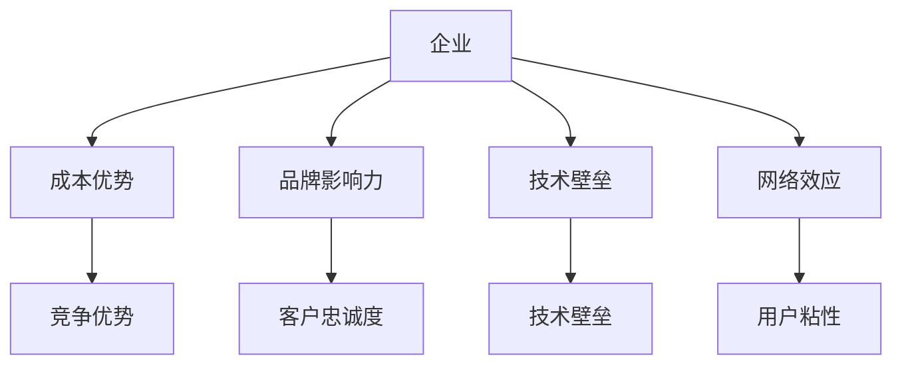

                 


# 巴菲特的经济护城河：持久竞争优势的重要性

> 关键词：巴菲特，经济护城河，竞争优势，企业战略，投资策略，系统设计

> 摘要：本文深入探讨了巴菲特提出的“经济护城河”概念，分析其在企业竞争优势中的重要性。通过技术视角，结合系统设计方法，阐述了经济护城河的构建、评估及实际应用，为IT领域的企业提供了一套基于护城河的系统化解决方案。

---

## 第一部分: 经济护城河的背景与核心概念

### 第1章: 经济护城河的起源与定义

#### 1.1 经济护城河的起源
- **1.1.1 巴菲特投资理念的起源**  
  巴菲特的投资哲学以“价值投资”为核心，强调企业长期的盈利能力。他提出“经济护城河”概念，认为企业应具备某种竞争优势，使其在长期竞争中占据优势地位。

- **1.1.2 护城河概念的提出与演变**  
  护城河最早源自军事术语，指围绕城堡的壕沟和城墙，防止敌人进攻。在商业领域，护城河指企业在竞争中的优势，防止竞争对手入侵市场。

- **1.1.3 护城河在投资策略中的地位**  
  巴菲特认为，具备强大护城河的企业能够长期抵御竞争压力，确保股东价值的增长。护城河是企业长期竞争优势的核心来源。

#### 1.2 护城河的核心要素
- **定义**：护城河是指企业通过某种竞争优势，使其能够在市场中长期占据主导地位，防止竞争对手侵蚀其市场份额。
- **分类**：护城河可分为成本优势、网络效应、品牌影响力、技术壁垒等多种类型。
- **特征**：护城河具有动态性、可持续性和防御性，能够在不同市场环境下为企业提供保护。

### 第2章: 经济护城河的核心要素

#### 2.1 护城河的类型与特征

| 护城河类型 | 特征描述 | 优缺点 | 实例 |
|------------|----------|--------|------|
| 成本优势 | 企业通过规模效应或流程优化降低生产成本 | 防御性强，易于实现 | 亚马逊的物流体系 |
| 网络效应 | 用户数量的增加会增强平台价值 | 用户粘性高，但初期投入大 | Facebook的社交网络 |
| 品牌影响力 | 强大的品牌认知度吸引客户 | 品牌忠诚度高，市场拓展能力强 | 苹果公司的品牌效应 |
| 技术壁垒 | 通过专利或技术领先防止竞争 | 技术迭代快，需持续投入 | 微软的Windows操作系统 |

#### 2.2 护城河的实体关系图


### 第3章: 护城河的构建与评估

#### 3.1 护城河的构建策略
- **成本优势**：通过规模化生产、流程优化降低成本，提高价格竞争力。
- **网络效应**：构建平台，吸引用户，通过用户增长形成正反馈循环。
- **品牌影响力**：通过营销、产品质量提升品牌知名度，增强客户忠诚度。
- **技术壁垒**：投资研发，获取专利，形成技术领先优势。

#### 3.2 护城河的评估方法
- **护城河指数的计算**  
  护城河指数反映了企业的竞争优势强度，公式如下：  
  $$\text{护城河指数} = \text{市场份额} + \text{利润率} + \text{客户忠诚度}$$  
  其中，市场份额和利润率可通过财务数据获取，客户忠诚度可通过 surveys或数据分析得出。

- **动态变化**：护城河并非静态，需定期评估其有效性。例如，技术壁垒可能因技术进步而削弱。

- **工具与方法**：使用 SWOT 分析、波特五力模型等工具评估企业的护城河。

---

## 第二部分: 护城河的系统分析与架构设计

### 第4章: 系统分析与架构设计方案

#### 4.1 问题场景介绍
- **目标**：设计一个基于护城河的企业竞争优势系统。
- **需求**：识别企业核心竞争优势，构建护城河，确保长期盈利能力。
- **边界**：仅关注企业内部竞争优势，不涉及外部市场波动。

#### 4.2 系统功能设计
- **领域模型设计**  
  ```mermaid
  classDiagram
  class 企业 {
    成本优势
    品牌影响力
    技术壁垒
    网络效应
  }
  class 竞争优势 {
    市场份额
    利润率
    用户粘性
  }
  企业 --> 竞争优势
  ```

- **系统架构设计**  
  ```mermaid
  graph TD
  A[企业] --> B[成本优势模块]
  A --> C[品牌影响力模块]
  A --> D[技术壁垒模块]
  A --> E[网络效应模块]
  B --> F[竞争优势计算]
  C --> G[客户忠诚度评估]
  D --> H[技术壁垒强度]
  E --> I[用户增长预测]
  ```

- **系统接口设计**  
  - 输入接口：市场数据、成本数据、用户数据。
  - 输出接口：竞争优势报告、护城河指数、建议策略。

- **系统交互设计**  
  ```mermaid
  sequenceDiagram
  participant 企业
  participant 成本优势模块
  participant 品牌影响力模块
  企业 -> 成本优势模块: 提供成本数据
  企业 -> 品牌影响力模块: 提供品牌数据
  成本优势模块 -> 企业: 返回成本优势报告
  品牌影响力模块 -> 企业: 返回品牌影响力报告
  ```

---

## 第三部分: 项目实战与案例分析

### 第5章: 项目实战

#### 5.1 环境安装与数据准备
- **环境**：Python 3.8+，Jupyter Notebook，pandas，numpy。
- **数据准备**：收集目标企业的市场份额、利润率、客户忠诚度等数据。

#### 5.2 核心代码实现
```python
import pandas as pd
import numpy as np

# 定义护城河指数计算函数
def calculate_h Competitive_Index(share, profit, loyalty):
    return share + profit + loyalty

# 示例数据
data = {
    '企业': ['A', 'B', 'C'],
    '市场份额': [0.3, 0.2, 0.5],
    '利润率': [0.2, 0.3, 0.1],
    '客户忠诚度': [0.7, 0.6, 0.8]
}

df = pd.DataFrame(data)

# 计算护城河指数
df['护城河指数'] = df.apply(lambda x: calculate_h Competitive_Index(x['市场份额'], x['利润率'], x['客户忠诚度']), axis=1)

print(df)
```

#### 5.3 案例分析
- **案例选择**：以亚马逊为例，分析其护城河。
- **分析步骤**：
  1. 评估亚马逊的成本优势（物流网络）。
  2. 分析其网络效应（Prime会员）。
  3. 评估品牌影响力。
  4. 计算护城河指数。

---

## 第四部分: 最佳实践与小结

### 第6章: 最佳实践

#### 6.1 小结
- 经济护城河是企业长期竞争优势的核心。
- 通过系统设计和项目实战，可以有效识别和构建护城河。

#### 6.2 注意事项
- 护城河需动态评估，定期优化。
- 注重多维度竞争优势的结合，避免单一依赖某一种护城河。

#### 6.3 拓展阅读
- 巴菲特的《投资之道》。
- 《竞争优势：企业战略的核心》。

---

## 作者：AI天才研究院/AI Genius Institute & 禅与计算机程序设计艺术 /Zen And The Art of Computer Programming

---

**总结**：通过本文的分析，我们从理论到实践，全面探讨了巴菲特的经济护城河概念，并通过系统设计和项目实战，展示了如何在IT领域构建和评估护城河。希望本文能为企业提供有价值的参考和指导。

