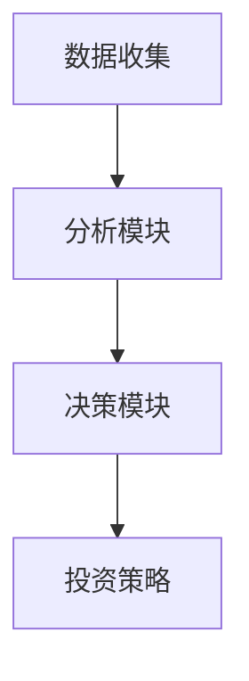
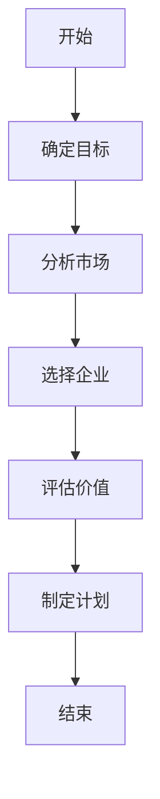

                 

# 巴菲特的股东信：投资智慧的年度总结

> 关键词：巴菲特，股东信，价值投资，投资策略，风险管理，投资系统

> 摘要：本文通过对巴菲特股东信的深入分析，揭示其投资智慧的核心理念、策略和方法，结合技术分析的方法，构建一个基于巴菲特投资哲学的系统化投资框架，帮助读者理解并应用这些智慧进行投资决策。

---

## 第一部分：引言

### 1.1 巴菲特的投资哲学

#### 1.1.1 巴菲特的投资理念概述
巴菲特的投资哲学以价值投资为核心，强调寻找具有持续竞争优势的企业，并在合理价格下进行长期投资。他注重企业的内在价值，而非市场的短期波动。

#### 1.1.2 股东信的历史背景与重要性
巴菲特通过股东信向投资者传达他的投资理念和策略，这些信件不仅是投资指南，更是他对企业和市场的深刻见解。股东信的结构清晰，语言简洁，每年发布，成为投资者的重要参考资料。

#### 1.1.3 股东信的核心价值与读者群体
股东信的价值在于其内容的深度和实用性，适合个人投资者、机构投资者以及金融专业人士阅读。它不仅提供投资策略，还传递了巴菲特的哲学和价值观。

---

## 第二部分：价值投资的核心概念与策略

### 2.1 价值投资的定义与核心要素

#### 2.1.1 价值投资的定义
价值投资是一种投资策略，强调以低于内在价值的价格购买优质企业。其核心是寻找市场低估的企业，并长期持有。

#### 2.1.2 核心概念与联系
| 概念 | 定义 | 特点 |
|------|------|------|
| 内在价值 | 企业未来现金流的现值 | 基于企业未来盈利能力计算 |
| 安全边际 | 投资价格低于内在价值的部分 | 降低投资风险，确保收益 |

#### 2.1.3 价值投资与其他投资策略的对比
| 投策 | 短期交易 | 价值投资 |
|------|----------|----------|
| 核心 | 抓住市场波动 | 寻找低估企业 |
| 风险 | 高 | 低 |

### 2.2 安全边际的概念与应用

#### 2.2.1 安全边际的定义
安全边际是投资价格与内在价值之间的差距，确保即使企业表现不佳，投资者仍能获得收益。

#### 2.2.2 安全边际在投资中的作用
通过安全边际，投资者可以降低市场波动带来的风险，确保投资的稳定性。

#### 2.2.3 安全边际的计算与应用
$$ 安全边际 = 投资价格 - 内在价值 $$

### 2.3 企业竞争优势的分析方法

#### 2.3.1 企业竞争优势的定义
竞争优势是企业在市场上独特的优势，使其能够在竞争中脱颖而出。

#### 2.3.2 竞争优势的分类
| 类型 | 特点 | 示例 |
|------|------|------|
| 成本优势 | 低成本生产 | 制造业企业 |
| 品牌优势 | 强大品牌 | 快消品企业 |
| 技术优势 | 独特技术 | 科技企业 |

#### 2.3.3 竞争优势的评估方法
通过分析企业的财务状况、市场地位和创新能力，评估其竞争优势。

---

## 第三部分：投资策略与风险管理

### 3.1 投资策略的制定

#### 3.1.1 投资策略的制定步骤
1. 确定投资目标
2. 分析市场环境
3. 选择优质企业
4. 评估安全边际
5. 制定投资计划

#### 3.1.2 投资策略的优化
通过动态调整投资组合，优化风险与收益的平衡。

### 3.2 风险管理的重要性

#### 3.2.1 风险管理的定义
风险管理是通过识别和控制风险，降低投资损失的策略。

#### 3.2.2 风险管理的步骤
1. 识别潜在风险
2. 分析风险影响
3. 制定应对措施
4. 监控风险变化

#### 3.2.3 风险管理的工具
- 投资组合分散化
- 期权和保险工具

---

## 第四部分：长期视角与社会责任

### 4.1 长期投资的重要性

#### 4.1.1 长期投资的核心理念
长期投资强调耐心和纪律，避免短期市场的波动干扰。

#### 4.1.2 长期投资的实际效果
通过长期持有优质企业，投资者能够分享企业的成长收益。

### 4.2 社会责任投资

#### 4.2.1 社会责任投资的定义
社会责任投资是指在投资决策中考虑企业的社会责任，选择具有积极社会影响的企业。

#### 4.2.2 社会责任投资的意义
通过投资具有社会责任感的企业，推动社会进步和可持续发展。

---

## 第五部分：系统分析与项目实战

### 5.1 投资系统的构建

#### 5.1.1 系统架构设计
- 数据收集模块：收集企业财务数据和市场信息。
- 分析模块：评估企业的内在价值和竞争优势。
- 决策模块：制定投资策略和风险管理计划。

#### 5.1.2 系统实现
使用Python进行数据处理和分析，构建投资模型。

#### 5.1.3 实战案例
分析某企业，评估其内在价值和竞争优势，制定投资策略。

---

## 第六部分：结论与展望

### 6.1 巴菲特投资智慧的总结

#### 6.1.1 核心理念
价值投资、长期持有、风险管理。

#### 6.1.2 实际应用
将巴菲特的投资理念与技术分析相结合，构建系统化投资框架。

### 6.2 未来展望

#### 6.2.1 投资领域的技术发展
人工智能和大数据技术在投资中的应用前景广阔。

#### 6.2.2 投资者的未来挑战
面对复杂市场环境，投资者需要不断学习和适应。

---

## 附录

### 附录A：数学模型与公式

#### 1. 内在价值计算公式
$$ 内在价值 = \sum_{t=1}^{n} \frac{CF_t}{(1 + r)^t} $$
其中，CF_t为第t年的现金流，r为折现率。

#### 2. 安全边际计算公式
$$ 安全边际 = 投资价格 - 内在价值 $$

### 附录B：系统架构图

### 附录C：投资策略流程图

---

## 作者信息

作者：AI天才研究院/AI Genius Institute & 禅与计算机程序设计艺术 /Zen And The Art of Computer Programming

---

本文通过系统的分析和详细的案例，将巴菲特的投资智慧与技术分析相结合，构建了一个完整的投资框架。希望读者能够通过本文，深入理解巴菲特的投资理念，并将其应用于实际投资中。

